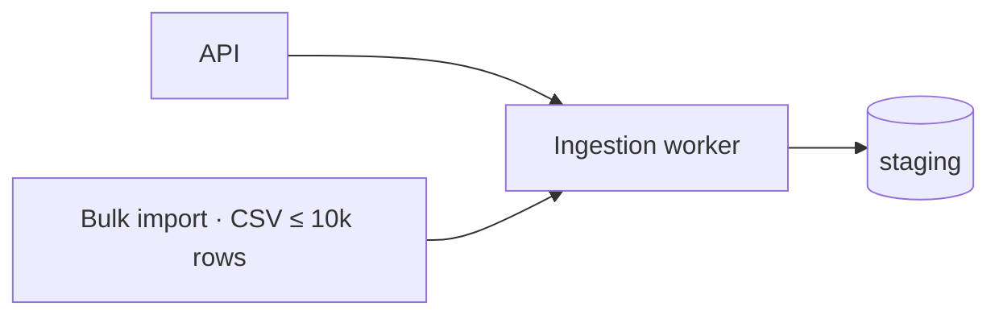

# Merge a planned item into the mental model

A planned item is a draft chapter, written before the code existed. Once the work is built, it has to become part of the as-built story: the files in `mental_model/` outside `planned_items/`, which describe the product as it is today. This skill does that merge.

**The merge is a rewrite, not a drop-in.** If chapters are simply appended, the as-built files turn into a pile of feature write-ups in shipping order. That is a changelog, and it stops describing how the system works. Leave every file you touch reading as if it had been written in one go by someone who knows the whole product as it now stands.

Run this in the PR that completes the work, as the last step before it is marked ready, so the code and the story land together and the reviewer reads the story diff next to the code. If review changes the code, run it again for the parts that changed.

## 1. Load the context

- Read `mental_model/CLAUDE.md` for this repo's layout, index, cast and writing rules. Repos organise their models differently; where that file disagrees with this skill, the file wins.
- Read the planned item.
- Read every file on its `Touches:` line, plus any file they link to that the change affects. Read each one whole, diagrams included: you can only weave a change into a story you have read.
- If the work crosses repos, its planned item lives in the home repo. Read it from there, on the default branch, as "This repo in the product" in `mental_model/CLAUDE.md` describes, and follow [Work that crosses repos](#work-that-crosses-repos) below.

## 2. Establish what was actually built

The as-built story describes the code as it is, not as it was planned. Read everything that was built for this planned item: this PR's diff against its base branch (`git diff main...HEAD`, or whichever branch it targets), plus the diffs of any earlier PRs that implemented part of it. Ask the developer if you can't tell which those are. Read the PR descriptions too. Compare all of it with the plan and sort what you find:

- **Built as planned.** Merge as written.
- **Built differently.** Write what was built. If the reason for the difference matters to the story, it has to come from a person: their own words in review discussion, or their answer when you ask. PR descriptions and commit messages are often agent-drafted, so confirm any reason taken from them with the developer. Don't write a reason you inferred.
- **Built but not in the plan.** Include it if it changes how the product works or how its characters relate.
- **Planned but not built.** Leave it out. If it was deferred rather than dropped, ask the developer whether to keep the rest as a smaller planned item.

If a divergence looks accidental rather than deliberate, raise it with the developer before writing it in. It may be a bug to fix, not a fact to record.

## 3. Decide where each part belongs

Go through the planned item and place each piece, following the layout in this repo's `mental_model/CLAUDE.md`:

- **A new character** (concept, subsystem, piece of infrastructure) gets its own file, unless it is small enough to be part of an existing character.
- **A change to an existing character's behaviour, contracts or relationships** goes into that character's file.
- **A new or changed user-facing flow** goes into the folder this repo uses for features. If the flow crosses repos, it belongs in the home repo; see [Work that crosses repos](#work-that-crosses-repos).
- **A contract this repo provides to other repos** is described here, with the cross-repo contract callout. How the other repos use it is not; that lives in their models.
- **A new or changed dependency on another repo's contract** goes into the consuming character's Depends on section: what it uses and what it assumes, linking to the provider's model on its default branch. A dependency inside this repo shows in "Where it sits", and gets a Depends on entry only when it carries an assumption worth stating.
- **A decision** goes next to the step, field or boundary it explains, as a `> **Why …:**` callout, with the reason as the planned item or the developer gave it. Every other character it constrains gets a one-line pointer linking back to it.
- **Material that only mattered during planning**, such as before/after diagrams, rollout steps, task breakdowns, resolved open questions and alternatives considered, is dropped. Keep an alternative only if it explains why the built version looks the way it does.

If a piece fits no existing folder, ask the developer rather than inventing a new one.

## 4. Rewrite the touched files

For each file:

- **Work the change into the sections it affects.** Don't add "Update", "New in" or dated sections, and don't tack anything onto the end.
- **Update diagrams, schemas and tables, not just text.** Add the new node, edge, state or field where it belongs. A diagram that contradicts the code is worse than none.
- **Rewrite what the change supersedes.** Keep history only where it explains the present ("Used to do X; moved to Y after Z"). Otherwise let it go; git keeps it.
- **Check the summary.** If the character's gist changed, the summary changes with it.
- **Move from plan to fact.** The plan said "will"; the story says "does". Remove every reference to the planned item, phases, tickets and PR numbers.
- **Use the cast's terms** for product-specific concepts. Standard technical terms need no explanation.
- **Follow the repo's formats.** Pick each format by the shape of the information, as `mental_model/CLAUDE.md` describes, and keep whys to the callouts it allows.
- **Leave unrelated sections alone**, even ones you would write differently. The diff should show the chapter and nothing else, so the reviewer can read it quickly.

If a file has grown past what someone can scan in a few minutes, split it along the line where it has become two characters, and tell the developer you did.

### Appended versus woven

Appended, which turns the file into a changelog:

````markdown
## Update: bulk import
- Added a bulk import endpoint
- CSVs of up to 10,000 rows will be queued to the ingestion worker
````

Woven into the existing ingestion file. The summary and diagram change, and nothing else needs to:

````markdown
# Ingestion

Loads source rows, from the API or from bulk CSV imports, into the live tables.
Nothing reaches a live table until its whole batch has passed validation.


````

Woven in, bulk import sits where it belongs: it is a second way into the same flow. The reader can see at once that it inherits the all-or-nothing promotion, which the appended version never says.

## 5. Update the index and the cast

In `mental_model/CLAUDE.md`, add, rename or remove index entries for files you created, renamed, split or deleted. Update a file's one-line description if its gist changed. Add new product-specific terms to the cast, and update terms whose meaning shifted. If you renamed, split or deleted a file that other repos link to, search their models for links to it, in their local checkouts or with `gh search code`. List each one to fix as a follow-up.

## 6. Remove the planned item and check for overlaps

Delete the planned item. For cross-repo work, follow [Work that crosses repos](#work-that-crosses-repos) instead. Then check the other planned items: any whose `Touches:` line names a file you just changed was drafted against the old story. Don't rewrite them. List them for the developer, so their authors can re-read their drafts against the updated story.

## 7. Read it back

Read each touched file as someone new to the codebase would, and check that:

- the summary gives the gist of the character as it is now;
- the file describes one current system, without seams like "now also", "additionally" or "the new X";
- every diagram, schema and table matches the code, and each Mermaid block is valid syntax;
- nothing refers to the plan, and nothing that has shipped is in the future tense (intended direction belongs only in why callouts);
- each decision sits next to what it explains, and each character it constrains carries a pointer;
- every why you added traces to a reason a person gave, in the planned item, the PR or an answer to your question;
- every relative link resolves to a file that exists, and every link to another repo is a GitHub URL on its default branch, pointing to a file that exists there;
- the claims you added match the diff.

## 8. Report

Tell the developer, in a few lines, what changed in the story: which characters changed and how, which files you rewrote, created or split, which divergences from the plan are now part of the story, and which planned items overlap. Also list any cross-repo follow-ups. Write it as a chapter, in the cast's terms. It can go straight into the PR description as the mental-model part.

## Work that crosses repos

Cross-repo work is planned in the home repo, in one planned item that covers every repo's part. A large part may have its own planned item in its repo, linked from the home one; merge that like any single-repo item. Weave only this repo's part into this repo's story, and never edit another repo's model from here. A part has shipped when its code is merged to its repo's default branch.

- **In a repo other than the home repo,** weave this repo's part and leave the home repo's planned item alone. If this was the last part to ship, tell the developer that the home repo's planned item is ready to merge in a small home-repo PR.
- **In the home repo,** ask the developer which parts have shipped, and check any PRs the planned item links to with `gh`. Don't infer it from what exists on other branches.
  - If some parts are still open, weave the home repo's own part, if it has one. Trim the planned item down to what is still waiting: the open parts, the end-to-end flow, and any product-map change.
  - If every part has shipped or been dropped, weave the end-to-end flow into `features/`, linking each step to the file in the repo that implements it. Apply any product-map change to `product/map.md`, then delete the planned item. Leave dropped parts out.
- **Follow-ups in other repos** are small PRs there, opened by the developer whose change caused them. List each one in your report with the exact change it needs.

## Without a planned item

Some changes are too small for a planned item but still change the story: a bug fix that changes behaviour, a renamed concept, a swapped dependency. Follow the same steps, using the diff in place of the plan, and skip the steps about the planned item.

If the story shifts substantially, for example a new character or a changed relationship between subsystems, say so in your report. That change probably should have been a planned item, and the reviewer should know they are seeing it for the first time.
