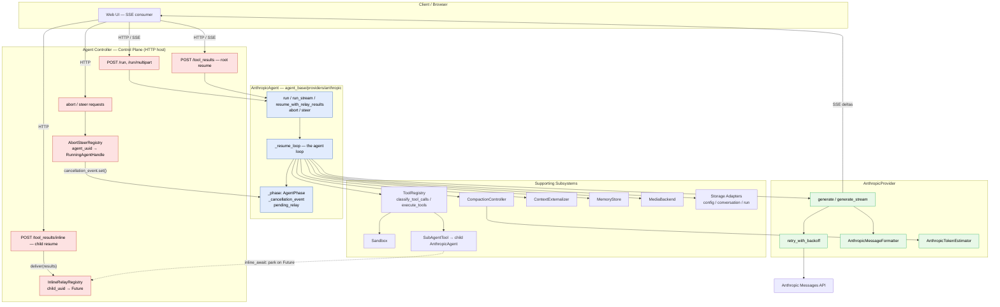
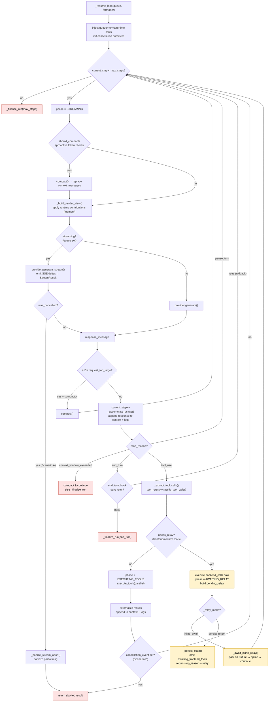
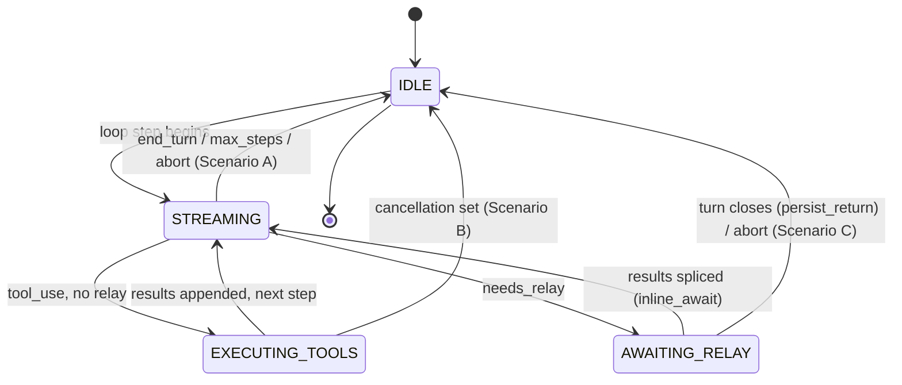
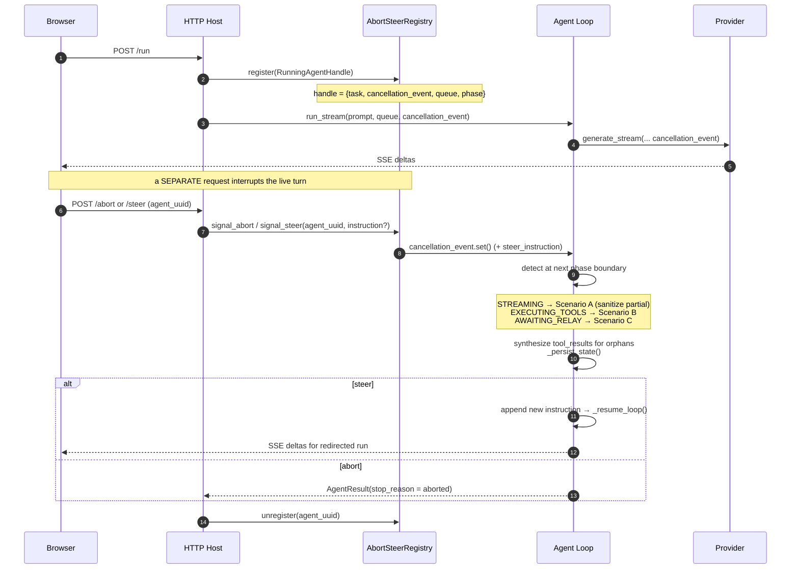
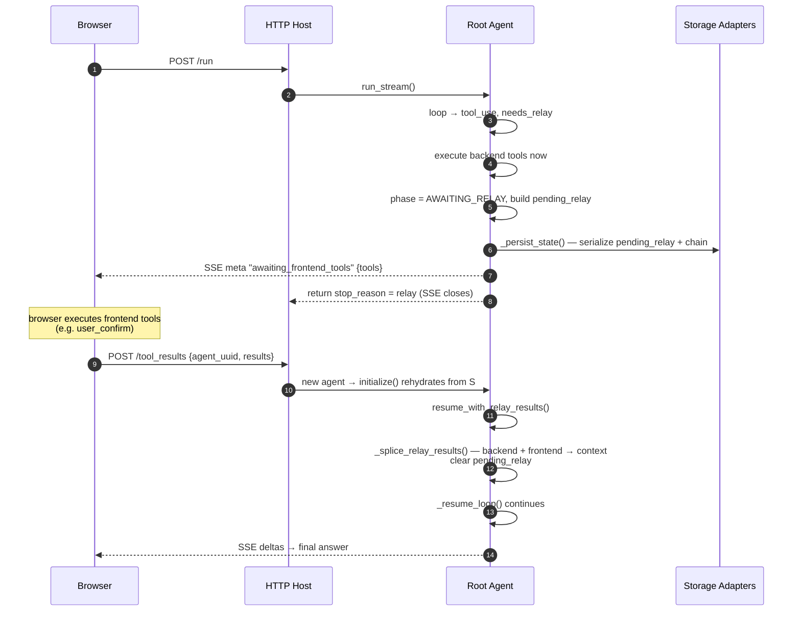
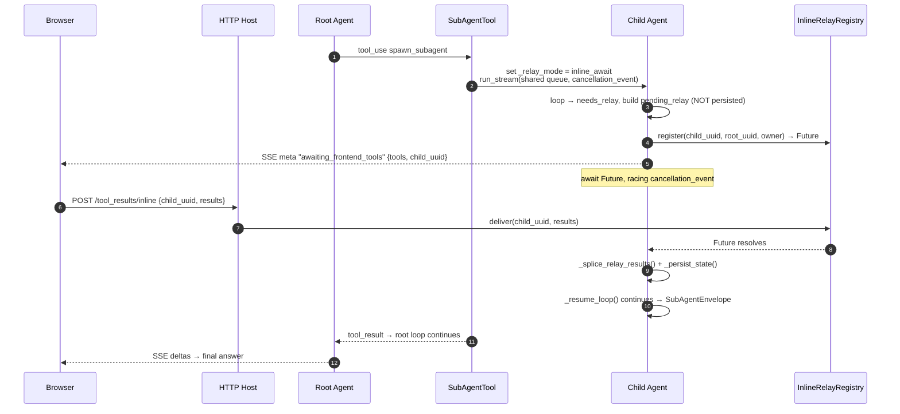
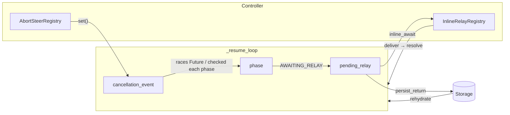

# Agent Architecture — Loop, Controller & Relay

A comprehensive map of how the Anthropic agent runtime works in `agent_base`, covering three
interlocking subsystems:

1. **The Agent Loop** — `AnthropicAgent._resume_loop()` in
   [`agent_base/providers/anthropic/anthropic_agent.py`](agent_base/providers/anthropic/anthropic_agent.py).
   The step-by-step engine that calls the model, runs tools, compacts context, and finalizes a run.
2. **The Agent Controller** — the cross-request *control plane*: the HTTP host plus the
   [`AbortSteerRegistry`](agent_base/abort_steer/base.py) that maps `agent_uuid → RunningAgentHandle`
   so a *separate* request can abort or steer a *live* run via its cooperative cancellation event.
3. **The Relay Mechanism** — how the agent pauses for **frontend / confirmation tools** and resumes.
   Two paths: root agents **persist-and-return** (close the SSE turn, resume on a new request),
   while inline subagents **park on an `asyncio.Future`** via the
   [`InlineRelayRegistry`](agent_base/relay/registry.py).

> All three share two primitives: the **`asyncio.Queue`** (SSE delta transport) and the
> **`asyncio.Event` cancellation token** that flows from the controller into the loop.

---

## 1. System Overview (layered components)

**Reading it:** the controller owns *lifecycle* (start, abort, steer, relay-resume) and the two
registries; the `AnthropicAgent` owns the *loop*; the provider owns the *wire* (API call, retry,
formatting, token estimation); subsystems are composed in and invoked from the loop.

---

## 2. The Agent Loop — `_resume_loop()`

The same loop drives every entry point — `run()`, `run_stream()`,
`resume_with_relay_results()`, and `steer()` — so all of them share one control-flow,
compaction, abort, and finalization story.

**Key behaviors**

- **Compaction is checked twice**: proactively (token estimate vs. threshold) *before* each call,
  and reactively on `413` / `request_too_large` and `model_context_window_exceeded`.
- **Server tools** (`web_search`, `web_fetch`, code execution) are executed by the API and never
  routed through the local registry — `_extract_tool_calls()` only picks up client `tool_use` blocks.
- **Two context variants** are kept per message: a full *history* variant for logs and a possibly
  *externalized* (file-backed) variant for the context window, via `ContextExternalizer`.
- The `finally` block always resets `phase = IDLE` and clears streaming context from tools.

---

## 3. The Agent Controller (abort / steer control plane)

The controller is the layer that can reach **into a running turn** from a different request. It is
built from the [`AbortSteerRegistry`](agent_base/abort_steer/base.py) +
[`RunningAgentHandle`](agent_base/core/abort_types.py) primitives, which a host (the FastAPI server,
or a production `AgentControlSession`) wires to HTTP endpoints.

### 3.1 Phase state machine (`AgentPhase`)

`abort()` reads `_phase` to choose the correct cleanup path. The loop advances it on every step.

### 3.2 Abort / steer sequence

**Cooperative cancellation, three scenarios** (all produce a *valid* tool_use/tool_result chain so the
next API request is not rejected):

| Scenario | Phase when signal arrives | Handler |
|----------|---------------------------|---------|
| **A** | `STREAMING` | `_handle_stream_abort()` — sanitize the partial assistant message, synthesize results for orphaned `tool_use` blocks |
| **B** | `EXECUTING_TOOLS` | loop checks `cancellation_event` after `execute_tools()`, persists, returns aborted |
| **C** | `AWAITING_RELAY` | `_abort_awaiting_relay()` — synthesize results for pending frontend/confirm calls, clear `pending_relay` |

`steer()` = `abort()` (clean chain) → append the new user instruction → re-enter `_resume_loop()`.

---

## 4. The Relay Mechanism

When the model calls a **frontend** or **confirmation** tool (executed by the browser, not the
server), the loop cannot proceed until the client returns results. `classify_tool_calls()` flags this
as `needs_relay`; backend tools in the same turn are executed immediately, then the agent pauses.
`_relay_mode` selects between two strategies.

### 4.1 Root agent — `persist_return`

The root serializes `pending_relay`, closes the SSE turn, and resumes on a **new** HTTP request that
rehydrates from storage. Robust across worker restarts.

### 4.2 Inline subagent — `inline_await`

A child spawned by `SubAgentTool` is an in-flight coroutine inside the parent's
`asyncio.gather` (under `execute_tools`) — it **cannot** serialize and return upward without being
stranded. Instead it parks on an `asyncio.Future` in the process-local `InlineRelayRegistry`, keyed
by its own `agent_uuid`, and resumes in place when the future resolves.

**Why two paths?** (from the source comments)

- The root's last DB checkpoint predates the spawn `tool_use`, so resuming a child from DB would give
  wrong state → children must **not** persist `pending_relay`; they hold their coroutine alive instead.
- The `Future` wait **races `cancellation_event`** so a parent abort/steer wakes every blocked child;
  `InlineRelayRegistry.drop_tree(root_uuid)` cancels all descendants on client disconnect / turn teardown.
- Inline children forward usage/cost upward (`_parent_usage_forward`) so credits deducted from the
  root `AgentResult.cost` reflect the whole subtree.
- The registry is in-memory / single-process (single-worker enforced upstream); the small API surface
  (`register` / `deliver` / `pop` / `drop_tree`) is designed to be swappable for Redis pub/sub later.

---

## 5. How the three subsystems interlock

- The **controller** writes the **loop's** `cancellation_event` (abort/steer) and resolves the
  **relay's** `Future` (inline) or re-invokes the loop after rehydration (root).
- The **loop** publishes `phase` so the controller's `abort()` picks the correct cleanup, and builds
  `pending_relay`, which the **relay** consumes via either storage or the in-memory registry.

---

## 6. Source cross-reference

| Concern | Location |
|---|---|
| Agent loop | [`anthropic_agent.py` · `_resume_loop`](agent_base/providers/anthropic/anthropic_agent.py:830) |
| Entry points | `run` / `run_stream` / `resume_with_relay_results` / `steer` / `abort` in the same file |
| Inline-await pause | [`anthropic_agent.py` · `_await_inline_relay`](agent_base/providers/anthropic/anthropic_agent.py:729) |
| Relay splice | [`anthropic_agent.py` · `_splice_relay_results`](agent_base/providers/anthropic/anthropic_agent.py:677) |
| Abort cleanup | `_handle_stream_abort` / `_abort_awaiting_relay` in the same file |
| Provider (wire) | [`provider.py` · `AnthropicProvider`](agent_base/providers/anthropic/provider.py:172) |
| Phase + handle | [`core/abort_types.py`](agent_base/core/abort_types.py) |
| Control plane | [`abort_steer/base.py`](agent_base/abort_steer/base.py) · [`adapters/memory.py`](agent_base/abort_steer/adapters/memory.py) |
| Inline relay registry | [`relay/registry.py`](agent_base/relay/registry.py) |
| Subagent inline spawn | [`common_tools/sub_agent_tool.py`](agent_base/common_tools/sub_agent_tool.py:294) |
| HTTP host (demo) | [`demos/fastapi_server/agent_router.py`](demos/fastapi_server/agent_router.py) |

> Diagrams render natively on GitHub and in VS Code's Markdown preview (Mermaid). No build step needed.
