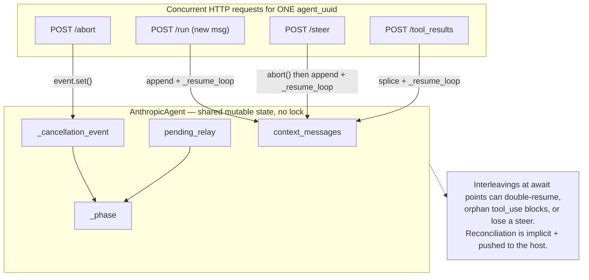
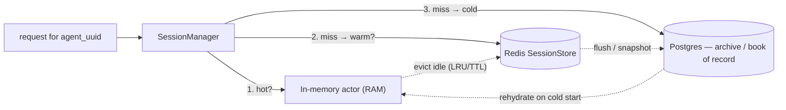
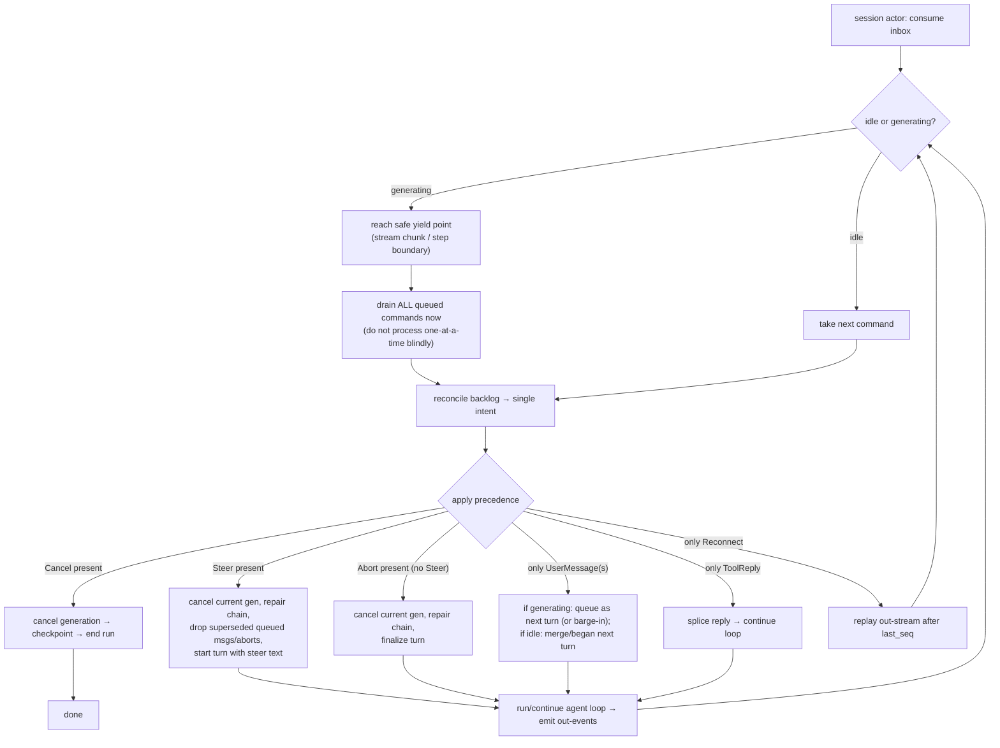
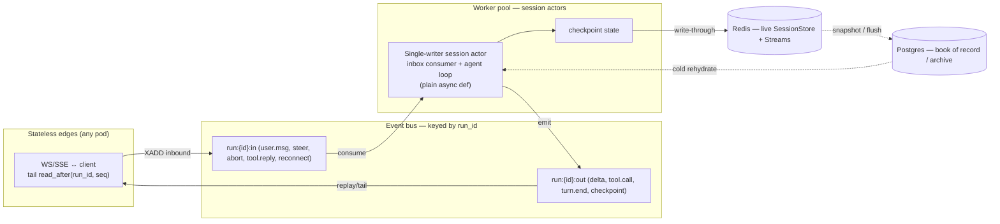
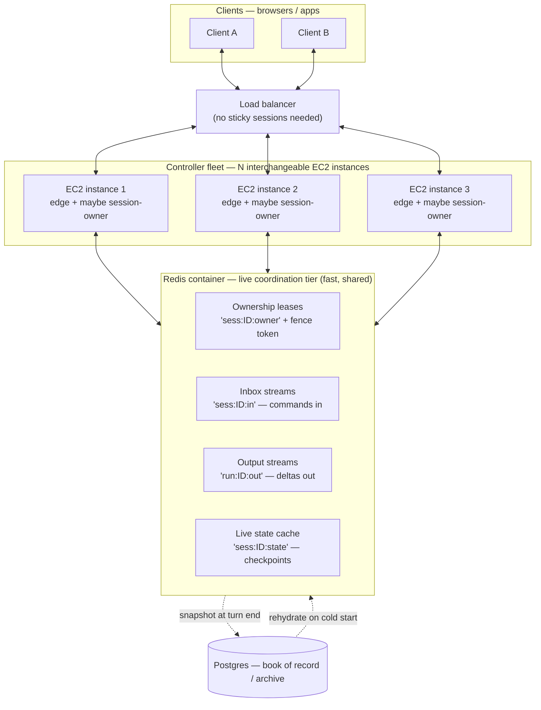
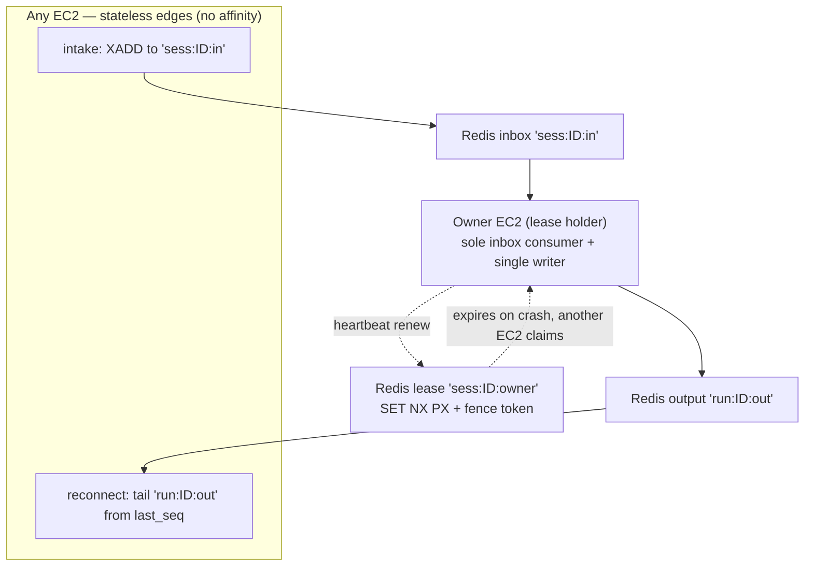

# Architecture Evaluation — Cache Backend & Event-Driven Controller

**Question posed:** can we simplify the agent loop + relay + abort/steer, keeping functionality the same, by
(1) adding a **cache backend** for live session state (DB only for archival), and (2) moving from a
**loop-with-hooks** to an **event-driven controller** that reconciles concurrent user actions?

**Context that shapes the answer** (from clarifying Q&A): deployment is **single-process today, scaling out
soon**; all four pains are in play — **resume latency, concurrent-action correctness, code complexity, many
live sessions**.

> **Headline verdict.** Both ideas are sound, and — importantly — **you have already drafted the destination
> yourselves.** The design diary [`async-communication.html`](agent_base/agent_base_design_diary/async-communication.html)
> proposes a fourth **`EventLogAdapter`** ("Correlation-ID Inbox on a Durable Log"), and
> [`abort-steer-diary.html`](agent_base/developer-diaries/abort-steer-diary.html) already states the guiding
> principle *"cancellation_event is an injected dependency — the framework provides the mechanism, the
> deployment provides the signal."* These two proposals are not a leap into the unknown; they are **"finish
> climbing the ladder you already designed,"** plus one piece the diary under-specifies: the **reconciliation
> engine** for racing control actions — which is exactly your most important question.
>
> The honest nuance: **idea #2 simplifies the *control plane* and *relocates* (does not delete) the hard
> parts** (chain-repair on interrupt, idempotency). The trap to avoid is over-reaching into full **event
> sourcing / CQRS** or a **Temporal-style workflow DSL** on day one — that *adds* complexity. Stay at
> "single-writer actor + command inbox + checkpoints."

---

## 0. Verdict matrix

| Proposal | Simplifies? | Breaks functionality? | Recommendation |
|---|---|---|---|
| **#1 Cache backend for live state** | ✅ Hot path (kills resume latency, supports many live sessions) | ❌ No, if write-through + DB-as-archive | **Adopt**, but reframe as **SessionManager (live in-memory actor) + write-through cache (Redis) + DB archive**. Use **Redis, not Kafka**, for live state. |
| **#2 Event-driven controller** | ✅ Control plane (unifies relay + abort/steer + sub-agents + reconnect + reconciliation) | ⚠️ Risk only if mis-scoped as full event-sourcing/Temporal | **Adopt the lightweight form**: single-writer **command inbox** per session + the planned `EventLogAdapter` + checkpoints. **Do not** event-source the conversation or adopt a workflow engine yet. |
| **#2a Action reconciliation** (your key ask) | ✅✅ The biggest single win | ❌ No — it *removes* a class of races | **Design it explicitly** (typed commands + bounded inbox + precedence rules). This is the part the diary doesn't yet specify. |
| **Anti-pattern: full Event Sourcing / CQRS of the conversation** | ❌ Adds read-cost, versioning, eventual-consistency pain | — | **Avoid.** Checkpoint full state to cache; append a *compact* event log for reconnect/audit only. |
| **Anti-pattern: Temporal/Restate on day one** | ❌ Operational step-change | — | **Defer.** Preserve the *option* via `EventLogAdapter`; adopt only if scale demands. |

---

## 1. What "cluttered" actually means today (evidence)

Before changing anything, name the real coupling. From the current code:

### 1.1 The control plane is a set of *racing method calls*, not a model

`abort()`, `steer()`, `run_stream()`, and `resume_with_relay_results()` are independent coroutines that all
mutate the **same** shared state — `agent_config.context_messages`, `_phase`, `_cancellation_event`,
`pending_relay` — with **no per-session mutual exclusion** (verified: the only locks in `agent_base` are the
relay registry's index lock, the todo tool, and per-file media dedupe; `execute_tools` uses a `Semaphore` for
bounded parallelism, not control serialization).



Today the single event loop + the `cancellation_event`/`_abort_completion` handshake prevent *true* parallelism,
and the host is *expected* not to run two turns at once. But interleavings at `await` boundaries are still
possible, and the **policy** for "what should happen when abort + steer + new message arrive together" lives
nowhere — it is emergent. That is the clutter: **control logic is spread across abort scenarios A/B/C,
`pending_relay` bookkeeping, two relay modes, and host conventions, with no single authority.**

### 1.2 Persistence is whole-object and on the critical path

`_persist_state()` calls `config_adapter.save(self.agent_config)` — and `AgentConfig` carries the **entire**
`context_messages` + `conversation_log`. So every pause/abort/finalize **re-serializes the whole conversation**
([`anthropic_agent.py:2266`](agent_base/providers/anthropic/anthropic_agent.py:2266)). On resume,
`initialize()` does `config_adapter.load(uuid)` — a **full deserialize** — plus `load_by_run_id()` if a relay is
pending ([`anthropic_agent.py:346`](agent_base/providers/anthropic/anthropic_agent.py:346)). For long sessions
this is O(n) per turn on both read and write, against the durable store. **That is your resume-latency pain,
precisely located.**

### 1.3 Two relay modes exist *because* there is no shared rendezvous

Root agents `persist_return` (serialize → close SSE → resume on a new request); inline subagents `inline_await`
(park on an in-process `asyncio.Future` in `InlineRelayRegistry`). Two code paths, two abort scenarios, a
single-worker assumption baked in. The diary's own conclusion:
> *"The 'relay' concept disappears because nesting is just another partition key … user interrupts are free —
> just another inbound event."* — [`async-communication.html`](agent_base/agent_base_design_diary/async-communication.html)

---

## 2. Idea #1 — Cache backend for live session state

### 2.1 The right framing: it's two things, not one

"Cache the live state" conflates two distinct mechanisms. Separate them:

1. **Session affinity / live actor (the big win).** Keep the **live agent object in memory** on a worker, one
   activation per `agent_uuid`, and route that session's requests to it. While a session is hot, reads/writes
   hit RAM — **zero deserialize, zero DB round-trip.** This is the **virtual-actor** model: Microsoft Orleans
   ("grains are single-threaded; activation/placement/persistence managed by the runtime") and Cloudflare
   Durable Objects ("each instance is a single-writer actor … persistent state survives restarts … costs
   nothing while idle"). It directly serves *resume latency* **and** *many live sessions* (via eviction /
   hibernation).
2. **A cache tier for state (the failover/scale-out enabler).** When affinity can't be guaranteed (stateless
   edges, failover, rebalancing), snapshot state to a **fast shared store** and fall back to the DB only for
   cold/archived sessions. This is a **read-through / write-through cache** in front of your existing adapters.

### 2.2 Redis yes, Kafka no (for live state)

Your prompt lists "Redis or Kafka." They are **not interchangeable here**:

- **Redis** (or in-process memory) = low-latency **random access by key** → correct for *"give me agent X's
  current state."* This is the live-state cache.
- **Kafka / Redis Streams / NATS** = an append-only **log / bus** → correct for the *event stream* in idea #2
  (inbound/outbound events, reconnect replay), **not** for point lookups of current state.

So: **Redis for the live-state cache (idea #1); a log/bus for the event stream (idea #2).** Don't put live
session state in Kafka.

### 2.3 Proposed shape — mirror the existing adapter discipline

Add a peer to the three-adapter pattern (and let it compose, not replace):

```python
class SessionStore(ABC):                 # live, hot, fast — Redis or memory
    async def get(self, agent_uuid: str) -> AgentConfig | None: ...
    async def put(self, config: AgentConfig, *, ttl: float | None = None) -> None: ...
    async def evict(self, agent_uuid: str) -> None: ...

# SessionManager owns live actors + a read-through/write-through cache:
#   load order:  in-memory actor  →  SessionStore (Redis)  →  AgentConfigAdapter (DB archive)
#   save order:  write-through to Redis at turn boundaries; async flush to DB; DB = book of record
```



**Bonus simplification:** pair this with §3's checkpoints to stop whole-object writes on the hot path —
checkpoint full state to **Redis** at turn boundaries (fast), append a *compact* event log for reconnect, and
**snapshot to Postgres periodically / at run end**. The DB stops being on the per-turn critical path.

### 2.4 Verdict on #1

**Adopt, reframed.** It simplifies the hot path and squarely addresses *resume latency* + *many live sessions*.
It does **not** break functionality if you keep **write-through + DB-as-book-of-record** (so a cache eviction or
Redis outage degrades to a DB load, never to data loss). The new burdens are standard and bounded: cache
invalidation (solved by single-writer + write-through), eviction policy (LRU/TTL → hibernate to Redis/DB), and
a consistency rule (DB is authoritative; cache is derived).

---

## 3. Idea #2 — Event-driven controller (the critical one)

### 3.1 Reframe: "event-driven" should mean **single-writer actor + command inbox**, not "event sourcing"

The phrase "event-based system" spans a huge range. The version that **simplifies** is the **actor mailbox**:
> *"An actor reads messages from its mailbox strictly one at a time … the state of an actor can only be changed
> by the actor itself."* — the single-writer principle.

The version that **adds** complexity is **event sourcing / CQRS** of the domain:
> *"Retrieving current state must aggregate all events … read requests significantly less efficient than writes
> … eventual consistency … versioning pain … unsuitable for most applications."*

**Recommendation: take the mailbox, leave the event-sourcing.** Concretely:

- Each session is a **single-writer actor**: exactly one consumer coroutine mutates its state.
- All inputs — user message, steer, abort, tool reply (relay), reconnect, cancel, timeout — become **typed
  commands on one ordered, bounded inbox**.
- The agent loop stays a plain `async def`. It does not become a workflow DSL. It simply **reads its next
  control input from the inbox** at safe yield points instead of being driven by racing external method calls.
- State durability is **checkpoint-based** (snapshot current state), with a **compact event log** appended for
  reconnect/replay/audit — *not* a reconstruct-from-events read model.

This is exactly the diary's "Correlation-ID Inbox on a Durable Log," with the inbox generalized from
*tool replies* to *all control inputs*.

### 3.2 What this genuinely unifies (the simplification)

| Today | Under the inbox model |
|---|---|
| `persist_return` vs `inline_await` (two relay modes) | One thing: a tool call emits `ToolCallRequested`; the matching `ToolReply` is an inbound command. Nesting = partition key. |
| Abort scenarios A/B/C + `_abort_completion` handshake | `Abort` is a command; the consumer handles it at the next yield point with one repair routine. |
| `steer()` = abort+append+resume (a bespoke method) | `Steer` is a command; reconciliation decides how it supersedes pending work. |
| Sub-agent relay via in-process `Future` registry (single-worker only) | Sub-agent reply is just another inbound event on the log → any worker can deliver → multi-worker for free. |
| Reconnect = not supported (SSE closes) | Edge tails `read_after(run_id, last_seq)` → reconnect/replay for free, no sticky sessions. |
| "Don't send two requests at once" (host convention) | Concurrency is **modeled**: the inbox serializes; reconciliation is explicit. |

External precedent that this is the proven shape at scale: **Cloudflare Durable Objects / Agents SDK** ("a
single-writer actor, so its state can't be corrupted by concurrent requests"), **Orleans** grains, and the
**actor model** generally.

### 3.3 Be honest: what it *relocates* (does not delete)

A redesign is only worth it if you go in clear-eyed:

- **Chain repair on mid-stream interrupt stays.** Today `_handle_stream_abort()` sanitizes a partial assistant
  message and synthesizes `tool_result` blocks for orphaned `tool_use`s so the next API call is valid. That
  requirement is intrinsic to the Anthropic wire protocol — the inbox makes *delivery* of the interrupt uniform,
  but the **repair handler still has to exist.** Net: cleaner location, same essential logic.
- **Idempotency becomes a real constraint.** A durable log gives **at-least-once** delivery (the diary says so
  explicitly; LangGraph warns the interrupted node *re-executes from the start* on resume). Tool handlers and
  side effects must be **idempotent / keyed**. This is new discipline you must document and enforce.
- **Ordering / dedupe** needs a monotonic per-run `seq` and idempotency keys. Cheap, but non-zero.
- **Backpressure**: a bounded inbox needs a drop/block policy for pathological floods.

These are the reasons to **not** also adopt event-sourcing or Temporal now — they would pile *more* new
constraints (determinism, replay-safety, read-model rebuilds, versioned events) on top.

### 3.4 The reconciliation engine — the part your diary doesn't specify

This is your most important question: *"a user may send abort, new message, steer in rapid succession — can the
controller reconcile the queue and drive the loop better?"* **Yes — and an inbox is the only clean way to do
it.** With racing method calls it is nearly impossible; with one consumer draining one queue it is
straightforward. Design it explicitly:

**Command taxonomy**

```python
UserMessage(text, attachments)   # new turn input
Steer(text)                      # redirect: stop current, do this instead
Abort()                          # stop current, end turn cleanly
ToolReply(cid, result)           # relay result (frontend/confirmation/sub-agent)
Reconnect(last_seq)              # client re-attached; replay tail
Cancel()                         # tear down the whole run (disconnect)
```

**Consumer loop with reconciliation at safe yield points**



**Precedence rules (make these explicit and testable)**

| Backlog contains | Reconciled intent |
|---|---|
| `Cancel` | Wins over everything — tear down the run. |
| `Steer` (± older `Abort`/`UserMessage`) | `Steer` supersedes: cancel current generation, **drop** the superseded `Abort` and any queued `UserMessage`s older than the steer, start a turn with the steer text. (A steer *is* an abort+redirect, so a separate queued abort is redundant.) **This is the only `interrupt-and-deliver` path.** |
| Multiple `Abort`s | **Coalesce** to one. |
| `Abort` then later `UserMessage` | Abort current turn cleanly, then begin the new message as the next turn. |
| Several `UserMessage`s while generating | **Queue** them in order as subsequent turns — this is the **firm default**. Interrupt-and-deliver is **not** a `UserMessage` behavior; a user who wants to redirect the live turn sends a `Steer`. (Resolves §7 Q1.) |
| `ToolReply` for a `cid` no longer awaited | Drop (late/duplicate) — idempotency key handles it. |

The crucial property: **commands are reconciled in *batches at yield points*, not consumed blindly one at a
time.** That is what lets "abort + steer + message in 200 ms" collapse into one correct action instead of three
half-applied ones.

**Context-retention policy on abort/steer (your rule #1).** An aborted turn should leave history in one of two
clean states, chosen by whether the assistant actually produced content:

- **Assistant produced ≥1 *complete* content block** → **keep** the user message and the **sanitized** assistant
  message (incomplete trailing blocks removed; orphaned `tool_use`s answered with synthetic error
  `tool_result`s). The turn remains in context.
- **Assistant produced nothing complete** → **roll the whole turn back**: drop *both* the partial assistant
  message **and** its triggering user message — as if the turn never happened.

This matches your stated intent, but note the **current code differs slightly**: when no block completed,
`plan_stream_abort` ([message_sanitizer.py:120](agent_base/providers/anthropic/message_sanitizer.py:120)) keeps
the user message and inserts a synthetic `"[stopped]"` assistant *placeholder* rather than rolling the turn back.
Adopting the drop-both rule is a small, well-contained change to that one function (plus the empty-case branch of
`_handle_stream_abort`), and the reconciliation engine is the right place to own this policy explicitly and
testably.

### 3.5 Verdict on #2

**Adopt the lightweight form.** It is a real simplification of the *control plane* and the *only* clean answer
to action reconciliation, with strong internal and industry precedent. It will **relocate** (not remove)
chain-repair and **add** an idempotency requirement — accept those consciously. **Reject** the heavyweight forms
(full event sourcing of the conversation; Temporal/Restate day-one) — your own non-commitments chapter already
says so, and the external evidence backs it.

---

## 4. The synthesis — the two ideas are one architecture

They are the same picture from two sides:

- The **live in-memory session** of idea #1 **is** the single-writer **actor/consumer** of idea #2.
- The **cache / checkpoint** of idea #1 **is** how that actor survives **eviction and failover**.
- The **event log/bus** of idea #2 **is** how stateless **edges reconnect** and how **any worker** picks up any
  run (removing the single-worker assumption that blocks scale-out).



This is precisely the diary's "Stream Bus keyed by `run_id`" with the live-state cache (idea #1) made explicit
and the inbox generalized to all control commands with a reconciliation policy (your ask).

---

## 5. Migration ladder (extends the diary's 4 steps; each rung independently shippable)

| Rung | Change | Unlocks | Risk |
|---|---|---|---|
| **0. Today** | In-process `Future` relay; racing control methods; whole-object DB persistence. | — | — |
| **1. Command inbox + SessionManager (in-process only)** | Replace racing `abort/steer/run/resume` calls with a **per-session `asyncio.Queue` + single consumer** and the **reconciliation policy** (§3.4). Add **`SessionManager`** keeping live agents in memory. | **Kills the concurrency-race bug class** and **warm-resume latency** immediately. Pure refactor, **single process, same behavior.** Highest value / lowest risk. | Low — internal refactor; cover with the existing abort/steer/relay tests. |
| **2. `EventLogAdapter` + `SessionStore` (Redis), checkpoints** | Introduce the planned `EventLogAdapter` (memory+Postgres) and a **write-through Redis cache**; checkpoint at turn boundaries; abort/steer/tool-reply become **events** any worker can deliver. | **Multi-worker becomes possible**; DB leaves the hot path; relay modes unify. | Medium — introduces at-least-once + **idempotency** requirement on tool handlers. |
| **3. Reconnect-safe stateless edges** | Edges tail `read_after(run_id, last_seq)`; clients reconnect to any pod; Redis Streams/NATS for the bus. | **No sticky sessions; rolling deploys & reconnect for free.** | Medium — ops surface (Redis/Streams). |
| **4. (Optional) durable-workflow engine** | Only if scale demands: promote the loop onto Temporal/Restate behind the same `EventLogAdapter`. | Crash-exact replay, scheduling. | High — operational step-change & determinism constraints. **Defer until it pays for itself.** |

**Do Rung 1 first and standalone.** It delivers most of the "simplify + correct concurrency + faster warm
resume" benefit with single-process risk, and it forces you to *write down* the reconciliation policy — which is
the highest-leverage artifact of this whole effort.

---

## 6. What to keep, change, and avoid

**Keep**
- The **adapter discipline** (ABC + memory/filesystem/postgres) — extend it with `SessionStore` and
  `EventLogAdapter`; don't invent a new pattern.
- The **"injected dependency"** principle — generalize from `cancellation_event` to an **injected inbound-event
  source**. The loop reads control input; the deployment decides whether that's an `asyncio.Queue`, Redis
  Streams, or a workflow signal.
- The agent loop as a **plain `async def`**. Resist turning it into a framework.
- **Postgres as book of record.** Cache and log are derived/fast tiers, never the source of truth.

**Change**
- Replace racing control methods with **one inbox + one consumer + explicit reconciliation**.
- Replace whole-object hot-path DB writes with **turn-boundary checkpoints to cache** + periodic DB snapshot.
- Collapse `persist_return` / `inline_await` into **one event-mediated relay** (a tool reply is an inbound
  event; nesting is a partition key).

**Avoid**
- **Kafka for live state** (it's a log, not a cache) — use Redis for state, a log/bus for events.
- **Full event sourcing / CQRS** of the conversation (read-cost, eventual consistency, versioning).
- **Temporal/Restate on day one** (operational step-change) — keep the option, don't take it yet.
- **A CRDT layer** — wrong domain (the diary already rejects this).

---

## 7. Open questions to settle before Rung 2

1. **Barge-in semantics — RESOLVED:** a mid-generation `UserMessage` is **queued** as the next turn (firm
   default); **interrupt-and-deliver belongs to `Steer` only** (§3.4, §9). No per-message barge-in.
2. **Checkpoint granularity:** per turn (cheap, coarse) vs per step (finer recovery, more writes). Start per-turn.
3. **Idempotency keys:** what is the canonical key for a tool reply / user message (`cid` + `seq`)? Define before
   any at-least-once delivery exists.
4. **Inbox bounds & shedding:** bounded queue size and policy (reject vs collapse) under flood.
5. **Sub-agent token/cost forwarding** currently rides `_parent_usage_forward` (in-process). Under a bus, define
   how child usage folds into the root's `AgentResult.cost` across workers.
6. **Affinity vs. stateless:** do you want sticky-by-`agent_uuid` routing (simplest, keeps actors hot) *and* the
   bus as failover, or fully stateless edges from the start? Sticky-first is the gentler path.

> **Note — §8 below supersedes Q5 and Q6** with concrete decisions, now that three additional constraints
> (parallel sub-agents, generalized tool relay, multi-instance deployment + external Redis) are on the table.

---

## 8. Refining the architecture for parallel sub-agents, generalized relay, and horizontal scale

The synthesis in §4 drew a single "session actor." Three constraints you've now raised pin down *what that
actor actually owns, how wide it may fan out, and how it survives a fleet of EC2 instances behind an external
Redis*:

1. any agent or sub-agent can spawn **many sub-agents in parallel**;
2. **ordinary tools** (not only the sub-agent tool) may need the relay round-trip — and some must **keep
   computing on the backend *after* the frontend answers**;
3. the deployment is **many EC2 instances + Redis in its own container** — real horizontal scale.

### 8.0 The one decision these three force: the unit of ownership is the *root-session tree*, not the agent

The current code already answers this implicitly. A fresh sub-agent:

- runs as a coroutine inside the parent's `asyncio.gather` under `execute_tools` — so siblings are in-flight and
  **not independently serializable**, which is *exactly why* a fresh child must use `inline_await` rather than
  `persist_return` ([anthropic_agent.py:1008](agent_base/providers/anthropic/anthropic_agent.py:1008));
- shares the parent's **output `queue`** and the parent's **`cancellation_event`**
  ([sub_agent_tool.py:324](agent_base/common_tools/sub_agent_tool.py:324)) — so one abort *already* cascades to
  the whole subtree;
- forwards usage up to the root via `_parent_usage_forward`
  ([sub_agent_tool.py:314](agent_base/common_tools/sub_agent_tool.py:314)).

So the natural **single-writer unit is the entire tree rooted at the root session**, addressed by
`root_session_id`: **one lease, one inbox, one output stream, one checkpoint — per *root session*, not per
agent.** Children are **parallel worker tasks supervised by the root**, never peers racing to write shared state.

> **This dissolves the apparent paradox of "single-writer *and* parallel sub-agents."** Single-writer governs
> the **control plane and root state** — one consumer reconciles commands and splices results. It does **not**
> forbid parallel *work*: children and tools fan out concurrently and hand results back to that one writer.
> This is exactly the Orleans/Akka stance — *"a grain processes one request at a time"* for **state**, while it
> may spawn as much parallel work as it likes.

### 8.1 The architecture at a glance (the easy-to-understand picture)



**How to read it**

- **Edges are interchangeable.** Any EC2 can terminate any client connection and accept any action — no sticky
  load balancing required *(resolves §7 Q6)*.
- **Exactly one EC2 *owns* a given session at a time** — the lease holder. It is the single writer for that
  session's state and the sole consumer of its inbox.
- **Redis (its own container) is the live coordination tier**, holding four things per session: an **ownership
  lease (+ fence token)**, an **inbox stream** (commands in), an **output stream** (deltas out), and a **state
  checkpoint** (warm resume / failover).
- **Postgres is the book of record / archive** — off the hot path; written at turn boundaries, read only on
  cold start.

### 8.2 Concern 1 — many parallel sub-agents: a supervised, *co-located* tree

```mermaid
flowchart TB
    INBOX["Redis inbox 'sess:ID:in'"]
    OUTBOX["Redis output 'run:ID:out'"]

    subgraph Owner["ONE EC2 owner process — one root-session tree (single-writer control plane)"]
        CTRL["Control consumer + reconciler<br/>(the ONLY writer of root state)"]
        ROOT["Root agent loop"]
        subgraph Tree["Parallel work under the current turn"]
            K1["sub-agent 1"]
            K2["sub-agent 2"]
            K3["sub-agent N"]
        end
        CID["Correlation-ID await table<br/>(sub-agents · frontend tools · two-phase tools)"]
    end

    INBOX -->|"commands"| CTRL
    CTRL -->|"drive turn"| ROOT
    ROOT -->|"spawn in parallel (asyncio.gather)"| K1
    ROOT --> K2
    ROOT --> K3
    ROOT -. "needs external input" .-> CID
    K1 -. "needs external input" .-> CID
    K2 -. "needs external input" .-> CID
    CTRL -->|"route ToolReply(cid)"| CID
    CID -. "resume" .-> K1
    ROOT -->|"deltas"| OUTBOX
    K1 --> OUTBOX
    K2 --> OUTBOX
```



What **stays** vs. today, and what **changes**:

- **Stays:** parallel spawn via `gather`; the shared `cancellation_event` (so abort/steer cascade to the whole
  subtree in-process and instantly); usage forwarding; concurrency bounded by `max_parallel_tool_calls`.
- **Changes:** the in-process `InlineRelayRegistry` becomes the owner's **correlation-ID await table** (§8.3),
  now *fed by the distributed inbox* instead of a direct `POST /tool_results/inline`. A reply that lands on *any*
  edge is `XADD`-ed to the session inbox; the owner routes it to the parked child by `cid`. The single-worker
  assumption disappears; observable behavior is identical.
- **Recovery unit = the root turn boundary.** Mid-turn, with N children in flight, there is **no consistent
  cross-instance checkpoint** — the code says exactly this: a child must *not* persist mid-`gather`, because the
  root's last checkpoint predates the spawn ([anthropic_agent.py:1008](agent_base/providers/anthropic/anthropic_agent.py:1008)).
  So on owner death you **replay from the last completed root turn**, not from mid-fan-out. That is the price of
  co-location — and it is the *right* price: it keeps the fast path lock-free and in-RAM. It also makes
  **idempotency** (§8.3) mandatory rather than optional.
- **Escape hatch (defer):** if one tree must out-scale a single box (hundreds of heavy children), promote
  children to independently-placed actors with their own leases/inboxes — a "flat actor space." Don't build this
  until a single owner is genuinely the bottleneck; co-location is simpler and matches the "many sessions across
  many instances" goal.

### 8.3 Concern 2 — generalize relay into one *suspend-and-resume* primitive

Relay today already covers arbitrary `frontend_calls` + `confirmation_calls`, not just sub-agents
([classify_tool_calls](agent_base/providers/anthropic/anthropic_agent.py:969)). But it has a ceiling: **the
frontend's reply *is* the final `tool_result`.** Your new case — *fetch context from the client, then do more
backend work, then report* — has nowhere to live.

Lift relay from "the client returns the result" to **"any computation may suspend on a correlation-ID and later
resume":**

```python
# ONE primitive, THREE users
cid = new_correlation_id()
payload = await ctx.await_external(cid, request=...)   # suspend; emit relay_request(cid) on the output stream
# ...execution resumes here when ToolReply(cid, payload) arrives on the inbox...
```

- **Frontend tool** (today): suspend → client computes → the reply *is* the result.
- **Two-phase backend tool** (your new case): phase-1 backend work → suspend for client context → **phase-2
  backend work** → emit its own `tool_result`.
- **Sub-agent**: identical shape — the child's completion is just a reply on a `cid`. (*"The 'relay' concept
  disappears because nesting is just another partition key"* — your diary, now concrete.)

```mermaid
sequenceDiagram
    participant Loop as Root / sub-agent loop
    participant Tool as Two-phase tool
    participant CID as Correlation-ID table
    participant Inbox as Redis inbox
    participant Out as Redis output
    participant Cli as Client

    Loop->>Tool: invoke (tool_use)
    Tool->>Tool: phase 1 — backend prep
    Tool->>CID: await_external(cid)
    Note over Tool,CID: tool suspends (does NOT return yet)
    CID->>Out: emit relay_request(cid, prompt)
    Out-->>Cli: "we need your input"
    Cli-->>Inbox: ToolReply(cid, payload)
    Inbox->>CID: route reply by cid
    CID-->>Tool: resume(payload)
    Tool->>Tool: phase 2 — more backend processing
    Tool-->>Loop: final tool_result
```

The two relay *modes* (`persist_return` vs `inline_await`) collapse into **one in-owner suspension** plus **two
durability tiers**:

- **In-owner await (primary, fast):** while the owner is alive, every suspension — root, child, or two-phase
  tool — parks in the correlation-ID table. No SSE close, no DB write. This is what makes relay cheap.
- **Durable re-arm (failover only):** a *long-lived* pending frontend await (the user may take minutes) is also
  recorded in the session checkpoint, so a failover owner can re-arm the same `cid`. A **two-phase tool's
  mid-continuation is *not* separately durable** (same as a mid-`gather` child) — on failover it **replays from
  the last turn boundary**, which is precisely why its backend work must be **idempotent / keyed**.

### 8.4 Concern 3 — many EC2 + external Redis: single-writer *across the fleet*

The in-memory registries (`InlineRelayRegistry`, `AbortSteerRegistry`) are single-process; a multi-EC2
deployment must enforce the same guarantees through Redis. **Four Redis structures per session**, each mapping to
exactly one need:

| Need | Redis structure | Why this one |
|---|---|---|
| **At most one writer per session** | **Ownership lease** `sess:ID:owner` via `SET NX PX` + heartbeat, plus a monotonic **fence token** (`INCR`) | Virtual-actor runtimes guarantee single activation only *eventually* under failures — during membership flux **two owners can briefly coexist**, so every write must carry a **fence token** and stale writers are rejected. |
| **Deliver commands to that writer (from any edge)** | **Inbox stream** `sess:ID:in` (Redis Stream); one consumer = the lease holder | `1 stream → 1 consumer` preserves **order**, decouples producers (any edge) from the single consumer, and is durable + redeliverable. |
| **Stream output to whichever edge holds the client** | **Output stream** `run:ID:out`; edges **tail from `last_seq`** | Reconnect / replay with **no sticky LB** — the resumable-stream pattern. |
| **Warm resume + failover** | **State checkpoint** `sess:ID:state`, write-through at turn boundary | RAM-speed rehydrate; Postgres touched only on a cold miss. |

**Why this keeps your reconciliation (§3.4) intact at fleet scale:** every action — from any edge, any client —
funnels into the *one* inbox consumed by the *one* owner. Reconciliation stays a **local, single-threaded**
decision over a drained backlog. The fleet adds *delivery* and *failover*; it does **not** reintroduce the
racing-method-calls problem of §1.1. That is the entire point of routing through Redis rather than calling the
owner directly.

```mermaid
sequenceDiagram
    participant Cli as Client
    participant Edge as EC2 edge (any instance)
    participant Redis as Redis (lease · inbox · output · state)
    participant Own as EC2 owner (holds lease + fence token)
    participant DB as Postgres

    Cli->>Edge: action (message / steer / abort / tool-reply)
    Edge->>Redis: XADD sess:ID:in (typed command + idempotency key)
    Note over Redis,Own: exactly one owner consumes the inbox (lease-guaranteed)
    Own->>Redis: read + reconcile drained backlog
    Own->>Own: single-writer consumer drives the agent tree
    Own->>Redis: XADD run:ID:out (deltas) ; checkpoint state (with fence token)
    Redis-->>Edge: tail run:ID:out from last_seq
    Edge-->>Cli: stream frames
    Own->>Redis: renew lease (heartbeat)
    Note over Redis,DB: turn boundary - write-through Redis, async snapshot to Postgres
    Note over Redis,Own: owner dies - lease expires - another EC2 claims, rehydrates, resumes
```

**Failover, concretely:** owner crashes → lease TTL lapses → another EC2 wins `SET NX`, obtains a **higher fence
token**, rehydrates `sess:ID:state` (or Postgres on a cold miss), and resumes consuming `sess:ID:in` from the
last acknowledged id. Delivery is **at-least-once** (Redis Streams redeliver un-acked entries), so every command
carries an **idempotency key** and the consumer dedupes — the same discipline §3.3 flagged, now load-bearing.

**Two honest caveats this topology introduces:**

- **Output write-amplification.** `XADD`-ing every token delta to Redis is costly. Mitigate by **batching
  deltas** (flush every N ms / M tokens), or use Redis **pub/sub for the live tail + a coarser checkpoint for
  replay** (hybrid). Don't stream raw per-token into a Stream you also persist.
- **A single hot tree is bounded by one box** (the co-location trade from §8.2). Acceptable while you scale by
  spreading *sessions* across instances; revisit only if one session saturates an instance.

### 8.5 What this adds to the plan

- **The migration ladder (§5) keeps its order; these structures simply land where you'd expect.** Rung 1
  (in-process inbox + reconciliation + `SessionManager`) **should already adopt the root-session-tree ownership
  unit** — key by `root_session_id`, and let the **correlation-ID table** replace `InlineRelayRegistry`
  in-process. The **lease + fence**, **inbox/output Streams**, and **state checkpoint** are Rungs 2–3, exactly
  when you go multi-EC2. No new rung is needed — these constraints *specialize* the ladder, they don't extend it.
- **Resolves §7 open questions.** **Q5** (sub-agent usage/cost): children are co-located under the owner, so
  `_parent_usage_forward` stays in-process and folds into the root checkpoint — **no** cross-instance forwarding
  is required, because trees never span instances. **Q6** (affinity vs stateless): **stateless edges +
  lease-based ownership keyed by `root_session_id`**; sticky routing degrades to an *optional* cold-start
  latency optimization, never a correctness requirement.
- **New decisions to ratify:** (a) co-location vs flat-actor placement — **recommend co-location now**; (b) the
  fence-token enforcement point — **every Redis state write and every DB snapshot**; (c) the delta-batching
  policy for the output stream; (d) lease TTL + heartbeat interval (e.g. ~10 s TTL / ~3 s heartbeat) and whether
  to publish a "wake" on a control channel to claim a new owner vs. lazy-claim on the next inbound command.

---

## 9. Ingestion latency, resumable output, placement/routing, and write-amplification

This section answers the operational questions the topology raises: keep **input ingestion fast**, make the
**output stream resumable**, pin down **where requests land and how exactly one owner is guaranteed**, and treat
**output write-amplification** rigorously.

### 9.1 Fast input ingestion — *acknowledge ≠ process*

The single most important move for fast inputs: **separate intake from processing.** An intake endpoint should
do only O(1) work and return immediately:

1. authenticate;
2. validate + stamp `(seq, idempotency_key)`;
3. `XADD` the typed command to `sess:ID:in` (in Rung 1, `queue.put_nowait`);
4. return `202 Accepted` with the assigned `seq`.

Reconciliation and generation happen **asynchronously on the owner**. This decouples **ack latency** (one Redis
write, sub-millisecond) from **processing latency** (model generation, seconds). The user can fire
abort → message → steer as fast as they like; each is acknowledged at enqueue speed and reconciled *in order* by
the owner (§3.4).

Today the FastAPI host **couples** the two — `POST /run` *is* the generation request that streams the turn. The
change is to split transport into **a thin command-intake endpoint (pure enqueue)** + **a separate output-stream
endpoint** the client subscribes to. (CQRS at the transport layer, not in the domain model.)

```mermaid
sequenceDiagram
    participant Cli as Client
    participant Edge as Intake endpoint (any EC2)
    participant In as Redis inbox 'sess:ID:in'
    participant Own as Owner (single consumer)

    Cli->>Edge: POST abort / message / steer / tool-reply
    Edge->>Edge: auth + stamp (seq, idempotency key)
    Edge->>In: XADD command
    Edge-->>Cli: 202 Accepted (seq) — sub-millisecond
    Note over Cli,Edge: the ack does NOT wait for generation
    In-->>Own: consume + reconcile (async)
    Note over Own: Abort/Steer/Cancel applied per-chunk; UserMessage/ToolReply at step boundary
```

**Felt latency of abort/steer.** Enqueue is instant, but the *effect* (generation visibly stops) only lands when
the owner observes the command. So the owner's streaming loop must check for **high-priority control commands on
every chunk boundary**, not only at step boundaries:

- `Abort` / `Steer` / `Cancel` → polled per-chunk (a cheap local peek of the drained inbox, or a dedicated
  control signal) and applied immediately by setting the local `cancellation_event` — the mechanism that already
  exists today ([anthropic_agent.py:1084](agent_base/providers/anthropic/anthropic_agent.py:1084)).
- `UserMessage` / `ToolReply` → handled at the next step/turn boundary; there is no reason to tear a stream for
  them (and by §3.4 a `UserMessage` is queued anyway).

**Backpressure / flood.** The inbox is bounded per session. Under a pathological flood: coalesce duplicates
(many `Abort`s → one), collapse superseded commands during reconciliation, and shed only as a last resort with an
explicit error frame — never silently.

### 9.2 Resumable output stream

Make every output frame **addressable and replayable**:

- Each frame carries a monotonic **per-run `seq`**.
- The client tracks the **highest `seq` it has rendered**.
- On disconnect, the client reconnects and sends `Reconnect(last_seq)`; the serving edge **replays frames
  `> last_seq` from the durable buffer**, then continues live. No tokens lost; duplicates are dropped by `seq`.
- The durable buffer retains a **bounded tail** (by count via `XADD … MAXLEN ~ N`, or by time). If `last_seq` is
  older than the retained tail (a very long disconnect), fall back to **"resync from the last turn checkpoint"** —
  send the assistant text assembled so far, then resume live.

This is the Vercel/Upstash *resumable-stream* pattern: Redis buffers the stream **independently of the SSE
connection**, so the connection itself is disposable.

```mermaid
sequenceDiagram
    participant Cli as Client
    participant Edge as Any EC2 edge
    participant Out as Redis output 'run:ID:out'
    participant Own as Owner

    Note over Cli: connection drops; client kept last_seq
    Cli->>Edge: reconnect(last_seq)
    Edge->>Out: read frames after last_seq
    Out-->>Edge: replay the gap
    Edge-->>Cli: re-send missed frames (client dedupes by seq)
    Own->>Out: live frames keep arriving (XADD / publish)
    Out-->>Edge: tail live
    Edge-->>Cli: resume live stream
    Note over Cli,Out: if last_seq is older than retained tail, resync from last checkpoint then go live
```

### 9.3 Where do requests land, and how is *one* owner guaranteed? (your scaling question)

Three sub-questions, three precise answers.

**(a) "Client actions can hit any server."** They can — and that's fine, because **inbound commands need no
routing.** Any edge that receives an action just `XADD`s it to `sess:ID:in` and returns. The edge does **not**
need to know which instance owns the session. The inbox decouples *producers* (any edge) from the *single
consumer* (the owner). This is exactly what makes "post to any server" trivial — the contrast is calling the
owner's process directly, which *would* require routing.

**(b) "If the SSE stream drops, where does the reconnect hit?"** Also **any edge.** Output lives in the shared
buffer (`run:ID:out`), not only in the owner's process. The reconnecting edge (1) reads `run:ID:out` from
`last_seq`, (2) replays the gap, (3) continues tailing live frames (blocking `XREAD`, or a pub/sub
subscription). The reconnecting edge need **not** be the owner — client connection and owner are decoupled by the
output buffer, just as intake is decoupled by the inbox.

**(c) "How is exactly one EC2 the lease-holder?"** Three Redis mechanisms compose:

- **Activation lease** — `SET sess:ID:owner = instance_id NX PX <ttl>`. `NX` ⇒ only the first writer wins;
  everyone else sees it's owned and does **not** start an actor. The owner **renews** it (heartbeat `PEXPIRE`)
  while alive; if it dies, the key **expires** and the session becomes claimable again (automatic failover).
- **Single consumer** — the inbox is read by a consumer group whose **only** active consumer is the owner, so
  even a momentary double-claim can't double-process (the second reads nothing new).
- **Fencing token** — `INCR sess:ID:fence` at claim time; every state write and DB snapshot carries the token,
  and the store **rejects** a stale token. This closes the brief window where membership flux allows two owners
  (virtual-actor single-activation is only *eventual* under failure).

**Placement lifecycle (how an owner comes to exist):**

- **Claim-on-write (recommended start):** the edge handling the first command for an idle session attempts the
  lease; wins ⇒ it hosts the actor; loses ⇒ the existing owner is already consuming. Simple, no router.
- **Consistent-hash placement (optimization):** map `root_session_id → instance` so a session reliably
  reactivates on the same node (warm cache, fewer cold starts); the lease stays the correctness backstop during
  rebalances. Add this only when cold-start churn is measurable.



**In one line:** *inbound = enqueue anywhere; outbound = tail anywhere; ownership = lease + single consumer +
fence.* None of the three requires the client to reach a specific instance.

### 9.4 Output write-amplification — a deeper treatment

**The principle that dissolves the problem:** an output frame has two *independent* jobs with very different
requirements — don't serve both from one expensive mechanism.

| Job | Volume | Latency need | Durability need |
|---|---|---|---|
| **Live delivery** (smooth token stream to a connected client) | High — every delta | ~30–80 ms | **None** — if the client is connected, a missed frame is recovered by reconnect |
| **Replay buffer** (cover a reconnect gap) | Can be **coarse** | Seconds, only on reconnect | Bounded tail only |

Write-amplification only bites on what you **persist**. So **persist coarsely; deliver live cheaply.**

**Techniques (stackable, roughly cheapest-impact first):**

1. **Delta batching / coalescing.** Accumulate tokens and flush every ~50 ms (or N tokens, or at content-block
   boundaries). Cuts frame/write count **10–50×**. Invisible to users: smooth streaming needs ~20–30 fps (a frame
   every 30–50 ms), so a 50 ms flush is below perception.
2. **Split channels — pub/sub live + stream replay.** Push live frames on Redis **Pub/Sub** (fire-and-forget,
   *not* stored) for the connected edge to forward; separately append a **coarse checkpoint** (every ~250–500 ms,
   or per content block) to a trimmed Stream for reconnect. Persisted writes drop **~50–100×**. ⚠️ Redis Pub/Sub
   is **at-most-once** — a live frame can be lost — which is *acceptable only because* the durable buffer +
   reconnect (§9.2) covers any gap. Never rely on pub/sub alone for correctness.
3. **Bounded retention (`XADD … MAXLEN ~ N`).** Keep only the reconnect window (e.g. last 30–60 s). Approximate
   trimming (`~`) is cheap and caps memory.
4. **Semantic-boundary durability.** Persist *low-volume meaningful events* durably (content-block start/stop,
   `tool_use`, `tool_result`, `turn_end`) but send *high-volume text deltas* only on the ephemeral channel. The
   durable log stays small and structurally useful — it doubles as the event log for audit/reconnect.
5. **Co-location shortcut.** When the client's connection is on the **owner** itself, deliver in-process (zero
   Redis on the live path); still write the coarse replay buffer so a *different* edge can serve a reconnect.
   Best happy-path cost, slightly more logic.
6. **Pipelining.** Batch several `XADD`s in one Redis pipeline/`MULTI` to cut round-trips (a throughput win,
   independent of count reduction).
7. **Scale the bus.** Put streams on a Redis instance/cluster **separate from state**, sharded by `run_id`, so
   output throughput scales horizontally and never contends with state reads.

**Recommended default:** **batched live delivery (1) + a coarse, trimmed replay buffer (2–4)** — the live channel
flushes every ~50 ms; the durable channel persists per-content-block (or every ~300 ms) with `MAXLEN ~`. Smooth
perceived streaming, a small persisted footprint, correct reconnect — with the co-location shortcut (5) as an
optional happy-path optimization.

**Worked numbers** (200 tokens/s output, 100 concurrent streaming sessions):

| Strategy | Persisted writes/s | vs. naive | Reconnect gap |
|---|---|---|---|
| Naive — 1 persisted `XADD` per token | 200 × 100 = **20 000** | 1× | 0 |
| Batched @ 50 ms | ≤20 × 100 = **2 000** | **10× fewer** | ≤50 ms |
| Pub/sub live + 300 ms checkpoint | ≈3 × 100 = **~300** | **~65× fewer** | ≤300 ms |

**Perceived-performance guarantees:**

- Happy-path smoothness is governed by the **live** channel cadence (≤80 ms), **never** by the durable cadence.
- Reconnect resume target < 500 ms: serve the last checkpoint instantly, then live frames — the user sees text
  reappear immediately, not a full regeneration.
- Slow/mobile clients benefit twice: batching also reduces the *client-side* frame count.

---

## Sources

**Internal design (already in this repo)**
- [`async-communication.html`](agent_base/agent_base_design_diary/async-communication.html) — "Six Ways to Cross the Boundary," the proposed **`EventLogAdapter`**, the Stream Bus, "why this solves sub-agents," the 4-step migration ladder, and explicit non-commitments (no Temporal/CRDT day one).
- [`abort-steer-diary.html`](agent_base/developer-diaries/abort-steer-diary.html) — multi-worker breakage table (sticky / Redis pub-sub / DB polling) and the **"cancellation_event as injected dependency"** principle.
- [`planned-systems.html`](agent_base/agent_base_design_diary/planned-systems.html) — `storage/EventLogAdapter` listed as the planned fourth adapter.
- Current code anchors: [`_resume_loop`](agent_base/providers/anthropic/anthropic_agent.py:830), [`_persist_state`](agent_base/providers/anthropic/anthropic_agent.py:2266), [`initialize`](agent_base/providers/anthropic/anthropic_agent.py:346), [`relay/registry.py`](agent_base/relay/registry.py), [`abort_steer/base.py`](agent_base/abort_steer/base.py), [`storage/base.py`](agent_base/storage/base.py).

**External — actor / single-writer session model**
- [Microsoft Orleans — Grains (virtual actors, single-threaded, pluggable persistence)](https://learn.microsoft.com/en-us/dotnet/orleans/resources/best-practices)
- [Building Stateful AI Agents at Scale with Microsoft Orleans](https://dev.to/sreeni5018/building-stateful-ai-agents-at-scale-with-microsoft-orleans-4n14)
- [Why a Cloudflare AI Agent Is Literally a Durable Object (single-writer actor, idle-free, persistent)](https://truvisory.com/agents-mcp/agents-sdk-durable-objects/)
- [Cloudflare Durable Objects — WebSocket Hibernation](https://developers.cloudflare.com/durable-objects/examples/websocket-hibernation-server/)
- [Actor model — mailbox, single-writer, backpressure (Akka for agentic AI)](https://pradeepl.com/blog/agentic-ai/akka-actor-model-agentic-ai/)

**External — durable execution & checkpointed agents (the heavyweight option, deferred)**
- [Temporal — durable execution for AI agents (event history + replay)](https://temporal.io/solutions/ai)
- [Durable Execution Patterns for AI Agents](https://zylos.ai/research/2026-02-17-durable-execution-ai-agents)
- [LangGraph — interrupts, checkpointers, resume (and the re-execution/idempotency caveat)](https://docs.langchain.com/oss/python/langgraph/interrupts)

**External — stream resumption / reconnect (Redis, not Kafka, for live state)**
- [Vercel AI SDK — Chatbot Resume Streams](https://ai-sdk.dev/docs/ai-sdk-ui/chatbot-resume-streams)
- [vercel/resumable-stream (Redis pub/sub, no sticky LB)](https://github.com/vercel/resumable-stream)
- [Upstash — Build LLM streams that survive reconnects (Redis buffers stream independently of SSE)](https://upstash.com/blog/resumable-llm-streams)

**External — why NOT to over-reach into event sourcing / CQRS**
- [CQRS & Event Sourcing: is it worth it?](https://medium.com/@dorinbaba/cqrs-event-sourcing-sounds-cool-but-is-it-worth-it-e97bd5bfb7c1)
- [What they don't tell you about event sourcing](https://medium.com/@hugo.oliveira.rocha/what-they-dont-tell-you-about-event-sourcing-6afc23c69e9a)
- [Azure Architecture Center — CQRS pattern (when to use / avoid)](https://learn.microsoft.com/en-us/azure/architecture/patterns/cqrs)

**External — horizontal scale: single-activation, leases/fencing, ordered delivery (§8)**
- [Microsoft Orleans — Grain placement (single activation is guaranteed only *eventually* under failures; two activations can briefly coexist during membership flux)](https://learn.microsoft.com/en-us/dotnet/orleans/grains/grain-placement)
- [Martin Kleppmann — How to do distributed locking (why leases are unsafe without **fencing tokens**)](https://martin.kleppmann.com/2016/02/08/how-to-do-distributed-locking.html)
- [Redis Streams — data type & consumer groups (`1 stream → 1 consumer` preserves order; at-least-once redelivery)](https://redis.io/docs/latest/develop/data-types/streams/)
- [Redis `XREADGROUP` — reading a stream via a consumer group](https://redis.io/docs/latest/commands/xreadgroup/)
- [Redis Streams consumer-group patterns (antirez)](https://redis.antirez.com/fundamental/streams-consumer-patterns.html)
- [Redis Pub/Sub — fire-and-forget fan-out, **at-most-once** delivery (live channel only; pair with a durable replay buffer)](https://redis.io/docs/latest/develop/pubsub/)
