# Consolidated Agent Architecture — Today, and the Single-Writer Redesign

> **What this document is.** One place that explains (a) **how the `agent_base` agent runtime works today**, and
> (b) **the architecture we are moving toward** — a *single-writer session actor* with a *command inbox* and a
> *Redis coordination tier*. It supersedes and merges the two earlier documents:
> - `AGENT_ARCHITECTURE.md` — the "as-is" map (loop / controller / relay).
> - `AGENT_ARCHITECTURE_EVALUATION.md` — the "to-be" evaluation (§0–§9, verdicts, migration ladder).
>
> Read **Part I** for the whole picture in ten minutes. Read **Part II** when you need the detail of one
> subsystem — each section shows **how it works today**, **what hurts**, **how it changes**, and **how the code
> call-sites look before and after**. **Part III** is reference material (open decisions, verified code anchors,
> sources).

---

## How to read the diagrams (legend)

All diagrams are Mermaid (render natively on GitHub and in VS Code's preview — no build step). Two visual
conventions are used throughout:

- 🟦 **Today** boxes/sequences describe code that exists now in `agent_base`.
- 🟩 **Proposed** boxes/sequences describe the target design.

A quick word on **what is real today vs. designed-but-unwired**, because it matters for honesty:

| Mechanism | Library code exists | Wired in the reference FastAPI demo |
|---|---|---|
| Agent loop, tool exec, relay (`persist_return`) | ✅ | ✅ |
| Inline sub-agent relay (`inline_await`, `InlineRelayRegistry`) | ✅ | ❌ — only exercised by tests; demo `/tool_results` uses the root `persist_return` path |
| Abort / steer (`AbortSteerRegistry`, `cancellation_event`) | ✅ | ❌ — demo calls `run_stream` **without** a `cancellation_event` and registers no handle |
| `assert_single_worker_configuration` | ❌ — named in a docstring only | ❌ |
| `SessionManager` / live in-memory session registry | ❌ | ❌ — every request rebuilds the agent and cold-loads from storage |

So "today" has a **complete library control-plane** that the **reference host does not yet use**. The redesign is
as much about *finishing the wiring* as it is about changing the model.

---

# PART I — THE HIGH-LEVEL PICTURE

## 1. Executive summary

Today, one async method — `AnthropicAgent._resume_loop()` — *is* the turn. It streams a model response, branches
on `stop_reason`, runs tools (possibly many sub-agents in parallel), pauses for frontend tools, repairs the
message chain on interrupt, and persists whole-object snapshots at a few checkpoints. Control actions (abort,
steer, tool-result, new message) arrive as **racing method calls / events that mutate shared state with no
per-session lock**, and live run-state exists only on a per-request agent object that is **rebuilt from storage
every turn**.

The redesign keeps the loop a plain `async def` but changes *who is allowed to touch the session and how inputs
arrive*:

> **One idea, stated once:** make each **root-session tree** a **single-writer actor**. Exactly one consumer
> mutates that session's state. Every input — user message, steer, abort, tool reply, reconnect — becomes a
> **typed command on one ordered inbox**, reconciled in batches at safe yield points. Live state lives in RAM
> (with a **write-through Redis checkpoint** for warm resume/failover); **Postgres is the archive**. Output
> frames are **sequence-numbered and replayable**, so a dropped connection reconnects and resumes. At fleet
> scale, a **Redis lease + fence token** guarantees one owner per session while any edge can accept any action.

This **simplifies the control plane** (one reconciliation authority instead of three abort scenarios + two relay
modes + host conventions), **kills the warm-resume cost** (no per-turn full deserialize), and **unlocks
horizontal scale** (no single-worker assumption). It **relocates — does not delete** — chain-repair on
interrupt, and it **adds one real constraint**: at-least-once delivery means tool side-effects must be
idempotent. We explicitly **avoid** full event-sourcing/CQRS of the conversation and a day-one workflow engine.

## 2. The system **today** — at a glance

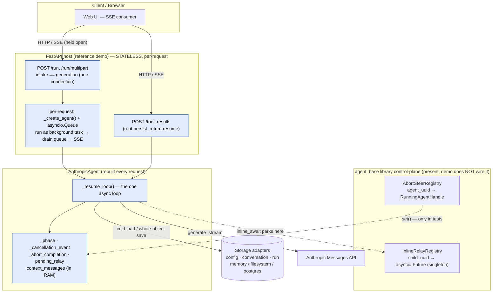

**Read it as:** the host holds one connection open per generation; each request builds a fresh agent and
cold-loads state by `agent_uuid`; the loop owns control inline; the library's abort/steer and inline-relay
machinery exists but is **not** connected in the reference host. Concurrency between two requests for the same
session is **unmanaged**.

## 3. The system **proposed** — at a glance

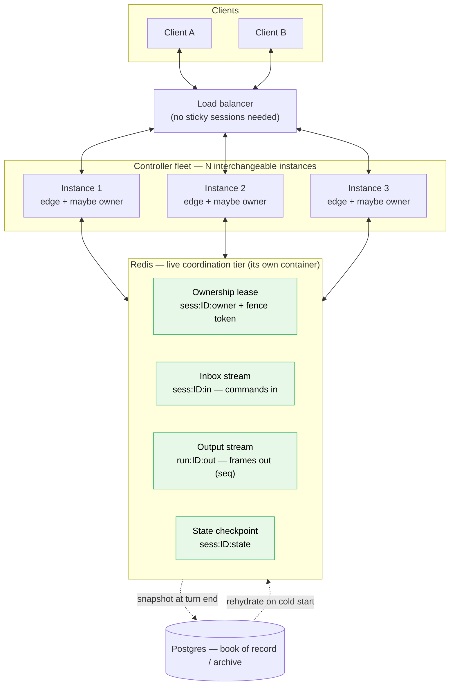

**Read it as:** any instance can accept any action (it just appends to the session's inbox) and serve any
reconnect (it just tails the output stream). Exactly **one** instance *owns* a session at a time — the lease
holder — and is the single writer + sole inbox consumer. Redis holds four small per-session structures; Postgres
sits off the hot path.

## 4. Side-by-side — what changes, what stays

| Concern | Today | Proposed | Net |
|---|---|---|---|
| **Who mutates session state** | Any racing coroutine (`run`/`abort`/`steer`/`resume`), no per-session lock | **One** consumer per root-session tree | Race class removed |
| **How inputs arrive** | Method calls + `cancellation_event.set()` + side-channel `steer_instruction` | **Typed commands** on one ordered inbox | Concurrency *modeled*, not emergent |
| **When inputs are applied** | Polled at scattered checkpoints | **Reconciled in batches** at yield points (precedence rules) | "abort+steer+msg in 200 ms" → one correct action |
| **Relay (frontend / sub-agent / two-phase)** | Two modes: `persist_return` vs `inline_await` | **One** `await_external(cid)` suspend/resume | One code path, two durability tiers |
| **Sub-agents** | Co-located `asyncio.gather`, shared queue + cancel event, in-memory `Future` registry | Same co-location, but **owned by the root actor**; correlation table in Redis | Multi-worker delivery, durable |
| **Live state** | Rebuilt from storage every request | **Resident in RAM** (SessionManager) + write-through Redis | Warm-resume latency gone |
| **Persistence** | Whole-object save at a few checkpoints | Write-through checkpoint per yield point; Postgres = archive | Less data loss on crash; DB off hot path |
| **Output stream** | Ephemeral `asyncio.Queue`; disconnect loses it | **Seq-numbered, replayable** Redis buffer | Reconnect/resume for free |
| **Intake** | `POST /run` *is* the generation (coupled) | Thin intake (auth, stamp, enqueue, `202`) decoupled from generation | Fast ack under rapid-fire input |
| **Scale** | Single-process / single-worker (asserted in prose) | **Lease + fence + single consumer** across a fleet | Horizontal scale, no sticky LB |
| **Chain repair on interrupt** | `_handle_stream_abort` / `_abort_awaiting_relay` + sanitizer | **Same logic**, now owned by the actor's Abort handler | Relocated, not removed |
| **Idempotency** | Not required (in-process) | **Required** (at-least-once delivery) | New discipline |

**Functionality is preserved.** Everything the agent does today it still does; what changes is *who is allowed to
write*, *how control reaches the writer*, and *where live state lives*.

## 5. The five decisions that define the redesign

1. **Single-writer actor.** Each session has exactly one consumer coroutine that mutates its state. The loop stays
   a plain `async def`; it just reads its next control input from an inbox at safe yield points instead of being
   driven by racing external calls. *(Detail: §9.)*
2. **Ownership unit = the root-session tree, keyed by `root_session_id` — not the individual agent.** Sub-agents
   already run co-located under the parent (shared queue + cancellation event); so one lease, one inbox, one
   output stream, one checkpoint govern the **whole tree**. Children are supervised parallel workers, never peers
   racing to write. *(Detail: §10.)*
3. **One generalized relay primitive: `await_external(cid)`.** Frontend tools, sub-agents, and *two-phase backend
   tools* (get client context → do more backend work → return) are all "suspend on a correlation-id, resume when
   a reply arrives." This collapses `persist_return` + `inline_await`. *(Detail: §8.)*
4. **Four Redis structures per session.** Ownership **lease** (`SET NX PX` + heartbeat) with a **fence token**
   (`INCR`); **inbox stream** (one stream → one consumer); **output stream** (tail from `last_seq`); **state
   checkpoint** (write-through). Postgres is the archive. *(Detail: §12, §13.)*
5. **Acknowledge ≠ process, and output is resumable.** Intake does O(1) work and returns `202` immediately;
   generation runs async on the owner. Every output frame carries a per-run `seq` and is replayable on reconnect.
   *(Detail: §11.)*

## 6. Migration ladder (each rung independently shippable)

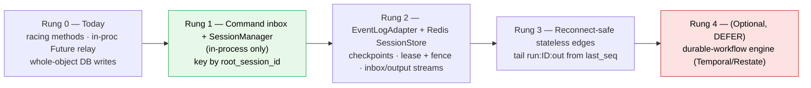

| Rung | Change | Unlocks | Risk |
|---|---|---|---|
| **0 — Today** | In-process `Future` relay; racing control methods; whole-object persistence. | — | — |
| **1 — Command inbox + SessionManager (in-process)** | Replace racing `abort/steer/run/resume` with a **per-session `asyncio.Queue` + single consumer** + the reconciliation policy (§9). Keep live agents resident. **Adopt root-session-tree ownership now** (key by `root_session_id`); let an in-process correlation-ID table replace `InlineRelayRegistry`. | Kills the concurrency-race class **and** warm-resume latency. Pure single-process refactor, same behavior. **Highest value / lowest risk.** | Low |
| **2 — EventLogAdapter + Redis SessionStore + checkpoints** | Add the planned `EventLogAdapter` (memory+Postgres) + write-through Redis; checkpoint at yield points; abort/steer/tool-reply become events any worker can deliver. Lease+fence and inbox/output streams land here. | Multi-worker becomes possible; DB leaves the hot path; relay modes unify. | Medium (introduces at-least-once + **idempotency**). |
| **3 — Reconnect-safe stateless edges** | Edges tail `run:ID:out` from `last_seq`; clients reconnect to any instance. | No sticky sessions; rolling deploys + reconnect for free. | Medium (ops surface). |
| **4 — (Optional) durable-workflow engine** | Only if scale demands: promote the loop onto Temporal/Restate behind the same `EventLogAdapter`. | Crash-exact replay, scheduling. | High — **defer until it pays for itself.** |

> **Do Rung 1 first and standalone.** It delivers most of the benefit at single-process risk and forces us to
> *write down* the reconciliation policy — the highest-leverage artifact of this whole effort.

---

# PART II — SUBSYSTEM DEEP-DIVES

Each section follows the same shape: **Today → Pain → Proposed → Call-sites (before / after).** Line numbers were
re-verified against the source on 2026-06-05; prefer the function-name anchors, which are stable.

## 7. The Agent Loop & Turn Lifecycle

### 7.1 Today

One turn = one invocation of `_resume_loop()` (`anthropic_agent.py`: def 830, while-loop 846-1104, `finally` 1105-1108), which contains the sole `while`
loop. Every entry point converges here — `run` / `run_stream` (fresh prompt) and `resume_with_relay_results` /
`steer` (continuation). Each iteration is a **step**:

1. set `_phase = STREAMING`;
2. proactive compaction check;
3. `provider.generate_stream(...)` (or `generate`) — emit SSE deltas;
4. if the stream was cancelled → `_handle_stream_abort` (Scenario A);
5. `current_step += 1`, accumulate usage, append the assistant message to `context_messages` + run log;
6. **dispatch on `stop_reason`**: `model_context_window_exceeded` → compact/continue; `pause_turn` → continue;
   `tool_use` → classify & run/relay; `end_turn` → run the end-turn hook, then finalize or loop.

Control decisions are interleaved *inline*; `_phase` is a plain mutable attribute whose only guaranteed reset is
the `try/finally` at the loop's tail. Persistence is **uneven**: plain `tool_use` iterations persist *nothing*;
`_persist_state()` is called only at relay pause, tool-exec cancellation, end-turn rollback, abort, and finalize.

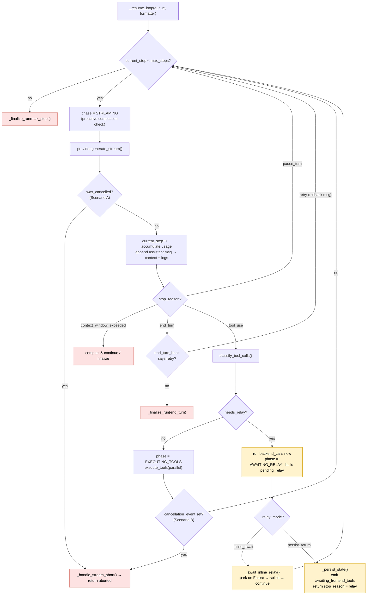

### 7.2 Pain

- The whole lifecycle is one ~265-line loop with an inline `stop_reason` ladder; control concerns (compaction,
  cancellation, relay-vs-execute, hook-retry, finalize) are tangled together.
- Cross-task coordination via raw primitives: `_cancellation_event`, `_abort_completion`, and per-child Futures.
  `abort()` runs in a *different* task and must read mutable `_phase` to pick a cleanup path — a shared-mutable
  race surface.
- Resume durability is uneven: a crash during plain `tool_use` steps loses progress since the last checkpoint.

### 7.3 Proposed

The loop becomes the **actor's run body**. All out-of-band mutation goes through the inbox. The natural yield
points already exist: between the stream and `stop_reason` dispatch, after tool execution, and at the relay pause.
At each, the actor **drains and reconciles** its inbox (§9) instead of polling a bare event. `_phase` becomes the
actor's explicit state; per-step state (`current_step`, usage, `context_messages`, runtime contributions) is
written to the Redis-backed checkpoint at each yield point — fixing both the lost-on-crash steps and the
lost-on-cold-load `_runtime_contributions`.

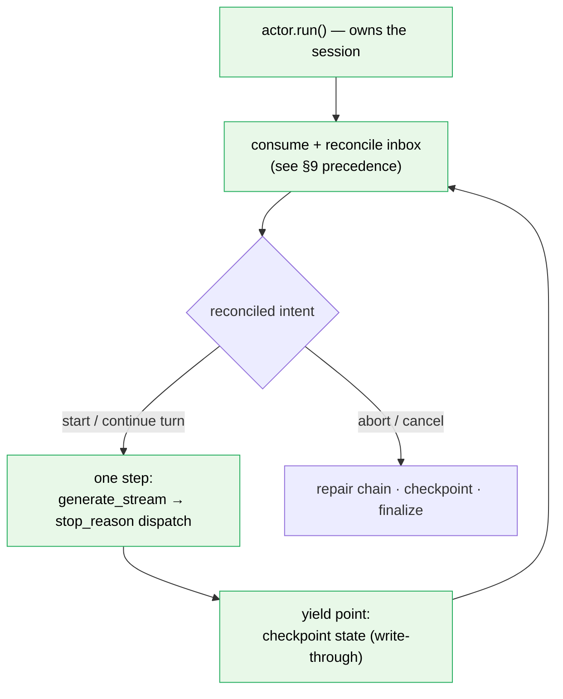

### 7.4 Call-sites — before / after

**Today** — out-of-band abort reads mutable phase (`anthropic_agent.py:1122-1142`):

```python
# abort() runs in a DIFFERENT task than the loop
self._cancellation_event.set()
phase = self._phase
if phase == AgentPhase.IDLE:
    return self._build_aborted_result()
if phase in (AgentPhase.STREAMING, AgentPhase.EXECUTING_TOOLS):
    await self._abort_completion.wait()      # loop self-cleans; cross-task handshake
elif phase == AgentPhase.AWAITING_RELAY:
    await self._abort_awaiting_relay()       # loop not running; clean chain here
```

**After** — there is no second task; the actor reconciles between steps:

```python
# Edge (any instance) just enqueues; returns immediately
await session.inbox.put(Abort(seq=..., idempotency_key=...))

# Inside the single-writer actor loop, at each yield point:
intent = self.inbox.reconcile(self.drain())          # batch → single intent (§9)
if intent.abort:
    await self.repair_chain(intent)                  # same sanitizer logic, one place
    await self.checkpoint()                           # write-through Redis
    return self.build_aborted_result()
```

The `_abort_completion` handshake and the three-way phase dispatch in `abort()` **disappear** — the owner is the
only writer, so it simply observes the command at the next boundary.

---

## 8. Tool Classification & the Relay Mechanism

### 8.1 Today

After a `tool_use` turn, `ToolRegistry.classify_tool_calls()` (`tools/registry.py:334-349`) buckets calls into
**backend** (executed in-process), **frontend** (`executor == "frontend"`), and **confirmation**
(`needs_confirmation`). `classification.needs_relay` (`tools/registry.py:42-52`) is true if *any* frontend or
confirmation call exists.

When a relay is needed, backend calls run **first**, their results are stashed in
`PendingToolRelay.completed_results` (`core/config.py:104-108`), `_phase = AWAITING_RELAY`, and then the loop
**forks on `self._relay_mode`**:

- **`persist_return` (default — roots, and resumed sub-agents):** persist state, emit a final
  `awaiting_frontend_tools` MetaDelta (closing the SSE), and **return** `AgentResult(stop_reason="relay")`. A
  later `POST /tool_results` rehydrates a fresh agent from storage and calls `resume_with_relay_results`
  (`anthropic_agent.py:643-675`).
- **`inline_await` (fresh sub-agents only):** park on an `asyncio.Future` from the process-global
  `InlineRelayRegistry`, racing the cancellation event; on delivery, splice + `continue` the loop. The child
  **never returns upward** — that would strand it inside the parent's `asyncio.gather`.

```mermaid
sequenceDiagram
    autonumber
    participant Loop as Agent loop
    participant Cls as classify_tool_calls
    participant Reg as InlineRelayRegistry / Storage
    participant Cli as Client

    Loop->>Cls: tool_use → classify
    Cls-->>Loop: backend / frontend / confirmation
    Loop->>Loop: run backend_calls now → completed_results
    Loop->>Loop: phase = AWAITING_RELAY · build PendingToolRelay
    alt persist_return (root)
        Loop->>Reg: _persist_state() (to Storage)
        Loop-->>Cli: MetaDelta awaiting_frontend_tools (SSE closes)
        Loop-->>Loop: return stop_reason = relay
        Cli->>Loop: POST /tool_results → rehydrate + resume_with_relay_results
    else inline_await (fresh sub-agent)
        Loop->>Reg: register(child_uuid) → asyncio.Future
        Loop-->>Cli: MetaDelta awaiting_frontend_tools {child_uuid}
        Note over Cli,Reg: in the reference demo no handler calls deliver();<br/>only tests exercise this path
        Cli->>Reg: deliver(child_uuid, results)
        Reg-->>Loop: Future resolves → splice → continue
    end
```

### 8.2 Pain

- **Two structurally different mechanisms for the same event** (a relay pause): an in-memory Future vs. a
  serialize→return→cold-rehydrate cycle. They share `PendingToolRelay` + `_splice_relay_results` but diverge in
  lifecycle, durability, and failure modes.
- **Mode selection is implicit and scattered** (default in `__init__`; overridden in `SubAgentTool` only for
  fresh children). The same class behaves differently as root vs. fresh-child vs. resumed-child.
- **`inline_await` is process-bound and not durable**, and relies on a **singleton** registry keyed by
  `child_agent_uuid` → blocks horizontal scale. The litellm provider implements only `persist_return`, so relay
  semantics differ by provider.
- **No nowhere-to-live for two-phase tools:** today the frontend's reply *is* the final `tool_result`. A tool
  that needs *client context, then more backend work, then a result* has no home.

### 8.3 Proposed — one `await_external(cid)` primitive

Lift relay from "the client returns the result" to **"any computation may suspend on a correlation-id and later
resume."** One primitive, three users:

```python
cid = new_correlation_id()
payload = await ctx.await_external(cid, request=...)   # suspend; emit relay_request(cid) on the output stream
# ...resumes here when ToolReply(cid, payload) arrives on the inbox...
```

- **Frontend tool:** suspend → client computes → the reply *is* the result.
- **Two-phase backend tool (the new case):** phase-1 backend work → suspend for client context → **phase-2
  backend work** → emit its own `tool_result`.
- **Sub-agent:** identical shape — the child's completion is just a reply on a `cid`.

The two modes collapse into **one in-owner suspension + two durability tiers**: the **in-owner await** (fast: park
in the correlation-ID table while the owner is alive — no SSE close, no DB write) and a **durable re-arm**
(failover only: a long-lived pending await is also recorded in the checkpoint so a new owner can re-arm the same
`cid`). A two-phase tool's mid-continuation is **not** separately durable — on failover it **replays from the
last turn boundary**, which is exactly why its backend work must be **idempotent / keyed**.

```mermaid
sequenceDiagram
    autonumber
    participant Loop as Root / sub-agent loop
    participant Tool as Two-phase tool
    participant CID as Correlation-ID table (owner)
    participant In as Redis inbox
    participant Out as Redis output
    participant Cli as Client

    Loop->>Tool: invoke (tool_use)
    Tool->>Tool: phase 1 — backend prep
    Tool->>CID: await_external(cid)
    Note over Tool,CID: suspends (does NOT return yet)
    CID->>Out: emit relay_request(cid, prompt)
    Out-->>Cli: "we need your input"
    Note over Cli,In: the reply may land on ANY edge
    Cli-->>In: ToolReply(cid, payload)
    In->>CID: route reply by cid (owner consumes)
    CID-->>Tool: resume(payload)
    Tool->>Tool: phase 2 — more backend processing
    Tool-->>Loop: final tool_result
```

### 8.4 Call-sites — before / after

**Today** — the fork on `_relay_mode` (`anthropic_agent.py:1008-1049`):

```python
if self._relay_mode == "inline_await":
    relay_result = await self._await_inline_relay(...)   # park on asyncio.Future
    if relay_result is not None:
        return relay_result                              # cancelled
    continue                                             # spliced; keep looping
# else persist_return (root):
await self._persist_state()
await fmt.format_delta(MetaDelta(type="awaiting_frontend_tools", ...), queue)
return self._build_agent_result(response_message, "relay")
```

**After** — one suspension, no mode branch:

```python
# Same two-phase nature: run backend calls now, then suspend on the pending ids.
payload = await self.await_external(
    cid=pending_tool_ids,                # correlation id(s)
    request=awaiting_frontend_tools(pending_tools),   # projected to the client as one event
)
# Resumes here regardless of root vs. sub-agent, same process or another worker,
# because a ToolReply(cid) command on the inbox is the universal wakeup.
self.splice_relay_results(payload)
```

`PendingToolRelay` becomes the actor's durable suspended state; the process-global `InlineRelayRegistry` and the
per-provider divergence both **disappear**.

---

## 9. Abort, Steer & the Reconciliation Engine

### 9.1 Today

There is exactly **one** cancellation primitive per turn: `self._cancellation_event`, an `asyncio.Event` injected
at `run_stream` / `resume_with_relay_results` / `steer` (falling back to a fresh Event in
`_reset_cancellation_state`, `anthropic_agent.py:439-445`). An out-of-band caller reaches a live run through the
`AbortSteerRegistry`, which maps `agent_uuid → RunningAgentHandle` (`core/abort_types.py:33-47`) holding the task,
the same event, the queue, the phase, and a one-shot `steer_instruction`.

`signal_abort` sets the event; `signal_steer` writes the instruction **then sets the same event**
(`abort_steer/adapters/memory.py:40-59`). So **abort and steer are the identical wakeup signal**, distinguished
only by a side-channel field. Detection happens at three points of uneven granularity:

- **STREAMING** — the only true per-chunk poll: `_process_stream_events` checks `is_set()` before each SSE event
  (`retry.py:247-250`); `was_cancelled` + `completed_blocks` flow up so the sanitizer can keep finished blocks.
- **EXECUTING_TOOLS** — checked **once** after the whole batch (`anthropic_agent.py:1083-1088`), unless a tool
  opts into `set_cancellation_event` (`anthropic_agent.py:1834-1836`).
- **AWAITING_RELAY** — an inline child races the relay Future against `cancel_event.wait()`
  (`anthropic_agent.py:785-800`); a root has already returned, so its abort is handled by `_abort_awaiting_relay`.

Each path produces a **valid Anthropic chain** via `message_sanitizer.py`: Scenario A `_handle_stream_abort`
(`anthropic_agent.py:1183-1219`), Scenario B inline, Scenario C `_abort_awaiting_relay`
(`anthropic_agent.py:1221-1251`). `steer()` = `abort()` + append `Message.user(new_instruction)` +
`_reset_cancellation_state` + re-enter the loop (`anthropic_agent.py:1144-1181`).

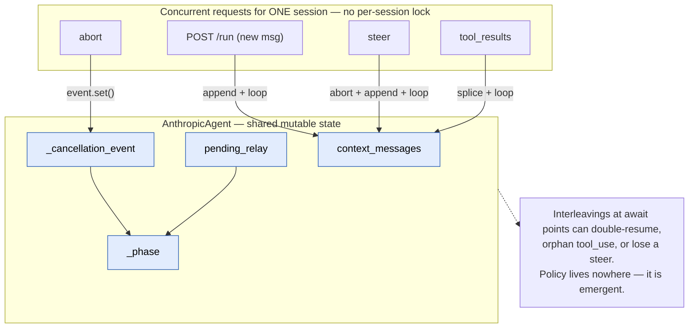

### 9.2 Pain

- Abort and steer **collapse into one undifferentiated signal**; the command type rides a side-channel
  (`steer_instruction`) that, in production, **has no consumer** (only tests read it; `agent.steer()` takes the
  text as an argument). There is **no ordering / queueing** of concurrent commands.
- **Injection coupling is fragile:** `signal_abort` sets `handle.cancellation_event`, but the loop honors only the
  event it was constructed with; nothing enforces they are the same object.
- **Single-process only** (`MemoryAbortSteerRegistry` is a plain dict holding live tasks/events) and — in the
  reference host — **not wired at all**.

### 9.3 Proposed — the reconciliation engine

Replace the single Event + side-channel with a **typed command inbox** the actor drains **in batches at yield
points**, reconciling the backlog into a **single intent** before acting. This is the part the design diaries
never specified, and it is the only clean way to make "abort + steer + message in 200 ms" collapse into one
correct action.

```python
UserMessage(text, attachments)   # new turn input
Steer(text)                      # redirect: stop current, do this instead
Abort()                          # stop current, end turn cleanly
ToolReply(cid, result)           # relay result (frontend / confirmation / sub-agent)
Reconnect(last_seq)              # client re-attached; replay tail
Cancel()                         # tear down the whole run (disconnect)
```

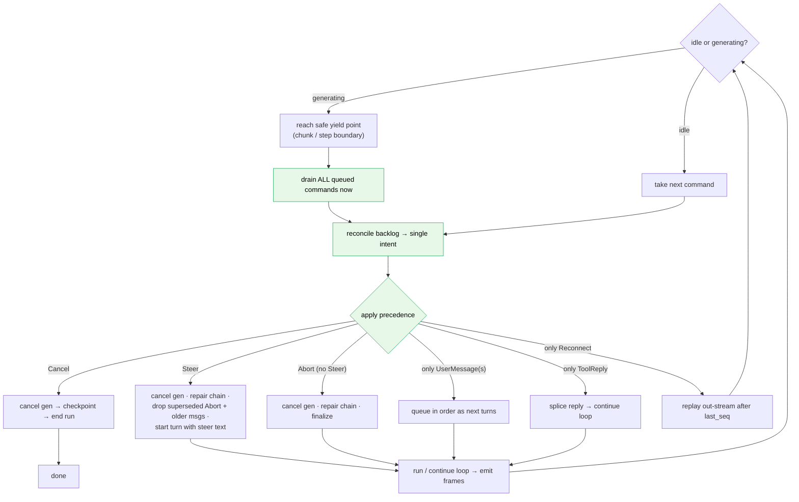

**Precedence rules (explicit and testable):**

| Backlog contains | Reconciled intent |
|---|---|
| `Cancel` | Wins over everything — tear down the run. |
| `Steer` (± older `Abort`/`UserMessage`) | `Steer` supersedes: cancel current generation, repair chain, **drop** the superseded `Abort` and any queued `UserMessage`s older than the steer, start a turn with the steer text. **This is the only interrupt-and-deliver path.** |
| Multiple `Abort`s | **Coalesce** to one. |
| `Abort` then later `UserMessage` | Abort the current turn cleanly, then begin the new message as the next turn. |
| Several `UserMessage`s while generating | **Queue** them in order as subsequent turns — the **firm default**. Interrupt-and-deliver is **not** a `UserMessage` behavior; redirecting the live turn is a `Steer`. |
| `ToolReply` for a `cid` no longer awaited | Drop (late/duplicate) — idempotency key handles it. |

**Polling cadence maps onto today's seams:** `Abort` / `Steer` / `Cancel` are polled **per chunk** — reuse the
existing per-event site (`retry.py:247-250`) and the relay-wait race (`anthropic_agent.py:785-800`) but read the
inbox head instead of `event.is_set()`. `UserMessage` / `ToolReply` apply at the **step boundary** (top of the
loop and the post-tool-batch check).

**Context-retention policy on abort — DECISION: keep today's behavior.** An aborted turn lands in one of two clean
states, chosen by whether the assistant produced content:

- **Assistant produced ≥1 *complete* content block** → **keep** the user message and the **sanitized** assistant
  message (incomplete trailing blocks removed; orphaned `tool_use`s answered with synthetic error
  `tool_result`s).
- **Assistant produced nothing complete** → today, `plan_stream_abort` (`message_sanitizer.py:120`) **keeps the
  user message and inserts a synthetic assistant placeholder** whose text is the `STREAM_ABORT_TEXT` constant —
  literally _"Agent run was aborted by the user."_ (`core/abort_types.py:29`), not a `[stopped]` marker. **We keep
  this behavior** — the reconciliation engine simply owns it explicitly and testably. *(An earlier draft proposed
  "drop both"; that is explicitly **not** adopted — current behavior stands.)*

The three sanitizing cleanup paths and the `AgentPhase` enum **stay valuable**: they become the actor's
transition handlers for an `Abort` command keyed by the current phase.

### 9.4 Call-sites — before / after

**Today** — abort and steer are the same Event.set(), differentiated by a side-channel
(`abort_steer/adapters/memory.py:40-59`):

```python
async def signal_abort(self, agent_uuid):
    handle = self._registry.get(agent_uuid)
    handle.cancellation_event.set()                 # abort

async def signal_steer(self, agent_uuid, new_instruction):
    handle = self._registry.get(agent_uuid)
    handle.steer_instruction = new_instruction      # side-channel (no prod consumer)
    handle.cancellation_event.set()                 # ...same signal as abort
```

**After** — typed commands on the session inbox; the owner reconciles:

```python
# Edge — same registry seam, but enqueue a typed command (Redis stream in Rung 2+)
await registry.send(session_id, Abort(seq=...))
await registry.send(session_id, Steer(text, seq=...))

# Owner — at each yield point
for cmd in self.inbox.drain():
    backlog.add(cmd)
intent = reconcile(backlog)        # precedence table above
```

The "inject the same Event" coupling and the empty `steer_instruction` consumer both **go away**; abort vs. steer
is now a real type, not a guess.

---

## 10. Parallel Sub-Agents & the Root-Session Tree

### 10.1 Today

A parent exposes one `spawn_subagent(...)` tool (`sub_agent_tool.py:269-330`). When the model emits N
`spawn_subagent` blocks in a turn, `ToolRegistry.execute_tools` runs them **concurrently** — one `asyncio.Task`
per call, bounded by `Semaphore(max_parallel_tool_calls)` (default 5) (`tools/registry.py:228-242`), results
reassembled in input order. Each child is a fresh `AnthropicAgent` in the **same process and event loop**, and
**shares the parent's**:

- output **`queue`** + `stream_formatter`,
- per-run **`cancellation_event`** (so one abort cascades to the whole subtree instantly),
- storage adapters / sandbox / media / memory (via `SubAgentParentContext`, `anthropic_agent.py:1685-1699`).

Usage/cost folds upward: every child step calls `_parent_usage_forward._ingest_child_usage(...)`
(`anthropic_agent.py:1994-1999`), chaining recursively, so the root `AgentResult.cost` reflects the whole tree.
Fresh children are forced into `inline_await` (`sub_agent_tool.py:294-295`) precisely because they are in-flight
coroutines inside `asyncio.gather` and **not picklable mid-run** — they must not serialize and return upward.

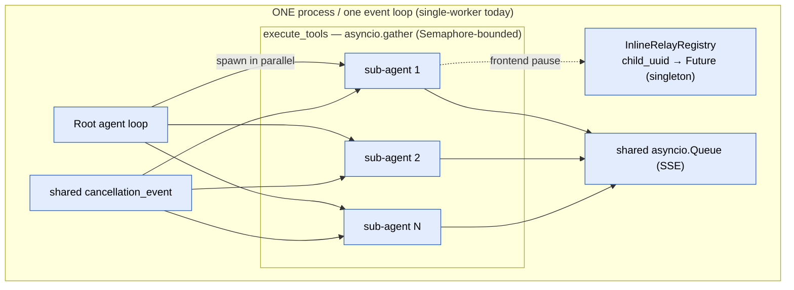

### 10.2 Pain

- **Hard single-process constraint:** the `InlineRelayRegistry` singleton + loop-bound Futures mean the entire
  tree must live in one process; sub-agent parallelism cannot scale across workers.
- **Fresh children are not durably resumable:** `pending_relay` is deliberately *not* persisted before parking
  (`anthropic_agent.py:1008-1016`), so a worker crash mid-spawn loses the whole in-flight subtree.
- **Shared-mutable hazards:** all children write one queue, share one cancel event, and mutate the **same** parent
  usage counters — correct only under cooperative single-loop scheduling (no locks).

### 10.3 Proposed — the tree is the unit of ownership

This is the decision the co-location facts force: **the single-writer unit is the entire tree rooted at the root
session, addressed by `root_session_id` — one lease, one inbox, one output stream, one checkpoint per root
session, not per agent.** This **dissolves the apparent paradox** of "single-writer *and* parallel sub-agents":
single-writer governs the **control plane and root state** (one consumer reconciles commands and splices
results); it does **not** forbid parallel *work*. Children remain co-located, supervised worker tasks — exactly
the Orleans/Akka stance ("a grain processes one request at a time" for **state**, while spawning as much parallel
work as it likes).

What changes vs. stays:

- **Stays:** parallel spawn via `gather`; shared `cancellation_event`; usage forwarding; bounded concurrency.
- **Changes:** the in-process `InlineRelayRegistry` becomes the owner's **correlation-ID await table**, fed by the
  distributed inbox. A reply landing on *any* edge is appended to the session inbox; the owner routes it to the
  parked child by `cid`. The single-worker assumption disappears; observable behavior is identical.
- **Recovery unit = the root turn boundary.** Mid-fan-out there is no consistent cross-instance checkpoint, so on
  owner death you **replay from the last completed root turn** — which is why idempotency is mandatory.
- **Escape hatch (defer):** if one tree out-scales a box, promote children to independently-leased actors (a "flat
  actor space"). Don't build this until a single owner is genuinely the bottleneck.

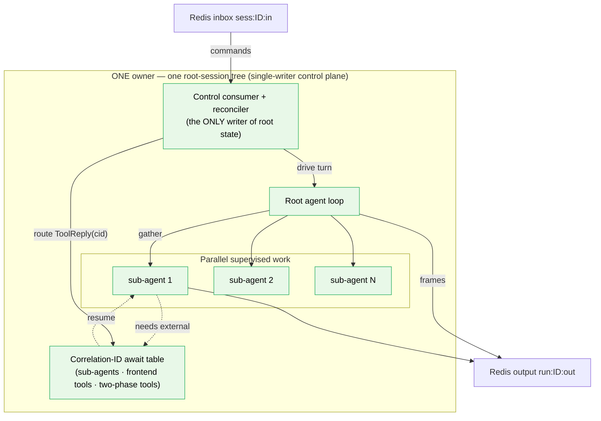

### 10.4 Call-sites — before / after

**Today** — child shares parent primitives, forced to inline-await (`sub_agent_tool.py:289-330`):

```python
if resume_agent_uuid is None:
    child._relay_mode = "inline_await"           # fresh child cannot serialize mid-gather
child._parent_usage_forward = parent_agent       # usage folds up
result = await child.run_stream(
    prompt=task,
    queue=instance._parent_context.queue,                         # shared
    cancellation_event=instance._parent_context.parent_cancellation_event,  # shared
)
```

**After** — spawn is a supervised task of the root actor; relay parks in the Redis-backed table:

```python
# Still co-located + parallel, still shares the root's cancellation scope and output stream.
child = self.supervise(spec, task)               # owned by THIS root-session actor
# A frontend pause is the same await_external primitive, recorded under root_session_id:
payload = await child.await_external(cid, request=...)   # entry lives in Redis, not a singleton Future
# ToolReply(cid) may arrive on ANY edge → routed to this owner → resumes the child.
```

`_parent_usage_forward` stays **in-process** (trees never span instances), so no cross-instance cost forwarding is
needed.

---

## 11. Transport: Fast Ingestion & Resumable Output

### 11.1 Today

The reference FastAPI host is a thin, **stateless** layer. `POST /run` (`agent_router.py:743-780`) returns a
`StreamingResponse` whose generator (`stream_agent_response`, `agent_router.py:500-551`): picks a config, builds a
**fresh** agent via `_create_agent` (`agent_router.py:301-323`), creates a **per-request `asyncio.Queue`**, runs
`agent.run_stream(...)` as a background task that pushes chunks + a `None` sentinel, and drains the queue into
`data:` SSE frames. So **intake == generation**: one connection is held open for the entire turn.

There is **no `cancellation_event`, no registered handle, no abort/steer endpoint** in the demo. The only
cancellation is `except asyncio.CancelledError: agent_task.cancel()` — i.e. *client disconnect kills the run.* The
only cross-request continuation is the frontend-tool flow (`POST /tool_results`, `agent_router.py:564-628`), which
rehydrates a fresh agent and opens a **new** stream — **not** a reconnect/replay of an in-flight stream.

```mermaid
sequenceDiagram
    autonumber
    participant Cli as Client
    participant Host as POST /run (one connection)
    participant Q as per-request asyncio.Queue
    participant Ag as fresh AnthropicAgent (background task)

    Cli->>Host: POST /run (prompt)
    Host->>Ag: _create_agent() + run_stream(queue)
    Ag->>Q: push chunks ... then None
    loop drain
        Q-->>Host: chunk
        Host-->>Cli: data: chunk (SSE held open)
    end
    Note over Cli,Q: disconnect → CancelledError → agent_task.cancel(); in-flight output LOST
```

### 11.2 Pain

- **acknowledge == process:** no quick ACK + detach; the client must hold the connection for the whole
  generation. Rapid-fire inputs have nowhere fast to land.
- **No resumable output:** chunks live only in a transient queue; a dropped connection loses in-flight output and
  cannot reconnect/replay.
- **No abort/steer/inject path; no single-writer guarantee:** two requests for the same `agent_uuid` build two
  agents and race on storage with no coordination.

### 11.3 Proposed — acknowledge ≠ process, and resumable output

**Split the transport into two thin endpoints (CQRS at the transport layer, not in the domain):**

1. **Intake endpoint** does only O(1) work — authenticate, validate + stamp `(seq, idempotency_key)`, `XADD` the
   typed command to `sess:ID:in`, return **`202 Accepted`** with the assigned `seq`. Sub-millisecond. Generation
   runs async on the owner.
2. **Output endpoint** the client subscribes to: it tails `run:ID:out` from a client-supplied cursor.

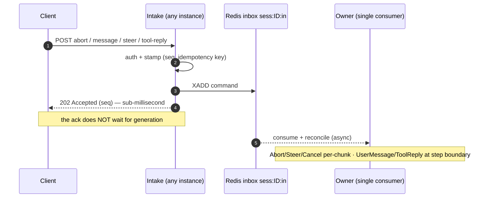

**Resumable output:** every frame carries a monotonic per-run `seq`; the client tracks the highest `seq` it
rendered; on reconnect it sends `Reconnect(last_seq)` and the serving edge replays `> last_seq` from the durable
buffer, then tails live. The buffer keeps a bounded tail (`XADD … MAXLEN ~ N`); if `last_seq` is older than the
tail, fall back to "resync from the last turn checkpoint." This is the Vercel/Upstash *resumable-stream* pattern —
Redis buffers the stream **independently of the SSE connection**, so the connection is disposable.

```mermaid
sequenceDiagram
    autonumber
    participant Cli as Client
    participant Edge as Any edge
    participant Out as Redis output run:ID:out
    participant Own as Owner

    Note over Cli: connection drops; client kept last_seq
    Cli->>Edge: reconnect(last_seq)
    Edge->>Out: read frames after last_seq
    Out-->>Edge: replay the gap
    Edge-->>Cli: re-send missed frames (client dedupes by seq)
    Own->>Out: live frames keep arriving (XADD / publish)
    Out-->>Edge: tail live
    Edge-->>Cli: resume live stream
    Note over Cli,Out: if last_seq older than tail → resync from last checkpoint, then go live
```

### 11.4 Call-sites — before / after

**Today** — intake and generation are one coupled generator (`agent_router.py:500-551`):

```python
queue: asyncio.Queue[str | None] = asyncio.Queue()
async def run_agent_and_signal():
    try:
        return await agent.run_stream(user_prompt, queue)
    finally:
        await queue.put(None)
agent_task = asyncio.create_task(run_agent_and_signal())
try:
    while True:
        chunk = await queue.get()
        if chunk is None: break
        yield f"data: {chunk}\n\n"        # connection held for the whole turn
except asyncio.CancelledError:
    agent_task.cancel()                    # disconnect == abort; output lost
    raise
```

**After** — intake returns immediately; a separate endpoint tails the durable stream:

```python
# Intake — O(1), returns 202
@router.post("/run")
async def run(req):
    seq = await intake.stamp_and_enqueue(req.session_id, StartTurn(req.prompt))
    return JSONResponse({"run_id": req.run_id, "seq": seq}, status_code=202)

# Output — thin reader, reconnect-safe
@router.get("/stream")
async def stream(session_id, run_id, last_seq: int = 0):
    async def gen():
        async for frame in out_stream.tail(run_id, after=last_seq):  # replay gap → live
            yield sse(frame)
    return StreamingResponse(gen(), media_type="text/event-stream")
```

---

## 12. Session State, Persistence & the Cache Tier

### 12.1 Today

There is **no live `SessionManager`.** Every request reconstructs the agent (`_create_agent`) and `initialize()`
cold-loads all state from the storage adapters keyed by `agent_uuid` (`anthropic_agent.py:344-388`; a pending
relay triggers an extra `load_by_run_id`). Live state therefore exists only on the in-process agent for the
duration of one run, and is flushed by `_persist_state()` (`anthropic_agent.py:2266-2294`) at a few discrete
points (finalize, relay pause, abort, rollback). Persistence is the three-adapter pattern (config / conversation /
run) over memory / filesystem / postgres; the Postgres config adapter does an idempotent full-state
`INSERT … ON CONFLICT (agent_uuid) DO UPDATE` (`postgres.py:313-340`) — already archive-shaped.

The output "queue" is a plain `asyncio.Queue` created by the **caller**, not the agent; the agent writes
serialized `StreamDelta` envelopes via a `StreamFormatter` (`streaming/base.py:22-40`). The closest things to a
live registry are the two process-local, single-worker registries (`MemoryAbortSteerRegistry`,
`InlineRelayRegistry`) — neither is a general session store.

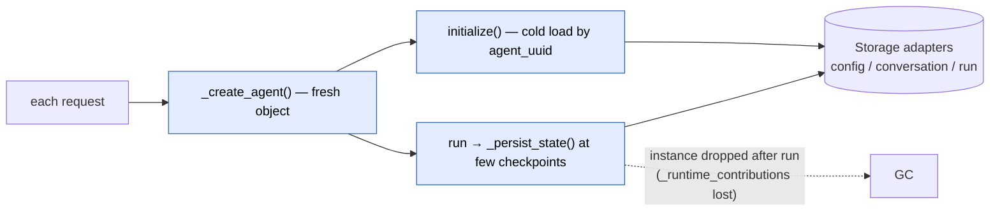

### 12.2 Pain

- **Every turn pays full deserialize** (no warm session). **`_runtime_contributions` is lost on cold-load
  resume** (a documented v1 limitation).
- **Coarse checkpointing:** plain tool steps persist nothing → a mid-turn crash loses progress since the last
  write.
- **Single-worker by construction;** the demo doesn't wire the live registries at all.

### 12.3 Proposed — SessionManager + write-through cache + DB archive

Separate the two things "cache the live state" conflates:

1. **Live actor (the big win):** a **`SessionManager`** keeps the resident session object in memory on its owner —
   one activation per `root_session_id`. While hot, reads/writes hit RAM (zero deserialize). This is the
   virtual-actor model (Orleans grains, Cloudflare Durable Objects).
2. **Cache tier (failover/scale-out enabler):** a write-through **Redis `SessionStore`**; fall back to Postgres
   only for cold/archived sessions.

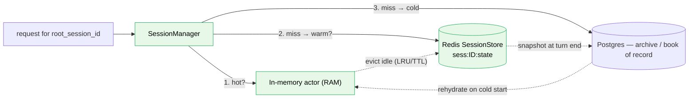

The natural seam is the existing `_persist_state()`: keep its full-snapshot write, but route the **hot copy to
Redis at each yield point** (closing the mid-turn gap), and let the Postgres UPSERT become the **async archive
behind** it. The storage `registry.py` is the natural place to add a `"redis"` backend alongside the existing
`AdapterType = Literal["memory", "filesystem", "postgres"]` — note this slot is **not present today** (net-new
across storage/transport/coordination, not a pre-existing hook).

### 12.4 Call-sites — before / after

**Today** — resume is always a cold load (`anthropic_agent.py:344-388`):

```python
loaded_config = await self.config_adapter.load(self._agent_uuid)   # full deserialize every turn
self.agent_config = loaded_config
if loaded_config.pending_relay and loaded_config.pending_relay.run_id:
    conversation = await self.conversation_adapter.load_by_run_id(
        self._agent_uuid, loaded_config.pending_relay.run_id)
```

**After** — the SessionManager serves a resident actor; cold load is the fallback:

```python
session = await session_manager.acquire(root_session_id)   # RAM → Redis → Postgres
# ...hot path touches RAM only; no per-turn deserialize...
await session.checkpoint(fence_token)                       # write-through Redis; async archive to PG
```

---

## 13. Horizontal Scale: Ownership, Leasing & Write-Amplification

### 13.1 Single-writer **across the fleet**

The in-memory registries are single-process; a multi-instance deployment must enforce the same guarantees through
Redis. **Four structures per session, each mapping to exactly one need:**

| Need | Redis structure | Why this one |
|---|---|---|
| **At most one writer** | **Ownership lease** `sess:ID:owner` via `SET NX PX` + heartbeat, plus a monotonic **fence token** (`INCR`) | Virtual-actor single-activation is only *eventual* under failure — two owners can briefly coexist, so every write must carry a fence token; stale writers are rejected. |
| **Deliver commands to that writer (from any edge)** | **Inbox stream** `sess:ID:in`; one consumer = the lease holder | `1 stream → 1 consumer` preserves order, decouples producers from the single consumer, durable + redeliverable. |
| **Stream output to whichever edge holds the client** | **Output stream** `run:ID:out`; edges tail from `last_seq` | Reconnect / replay with no sticky LB. |
| **Warm resume + failover** | **State checkpoint** `sess:ID:state`, write-through at the turn boundary | RAM-speed rehydrate; Postgres only on a cold miss. |

**Why this keeps reconciliation (§9) intact at scale:** every action funnels into the *one* inbox consumed by the
*one* owner, so reconciliation stays a **local, single-threaded** decision over a drained backlog. The fleet adds
*delivery* and *failover*; it does **not** reintroduce racing method calls.

### 13.2 Where do requests land, and how is exactly one owner guaranteed?

Three sub-questions, three precise answers:

- **(a) "Client actions can hit any server."** Fine — inbound needs **no routing.** Any edge `XADD`s to
  `sess:ID:in` and returns; the owner is the sole *consumer*. The inbox decouples producers (any edge) from the
  consumer (the owner).
- **(b) "If the SSE stream drops, where does the reconnect hit?"** **Any edge.** Output lives in the shared buffer
  `run:ID:out`, not in the owner's process. The reconnecting edge reads from `last_seq`, replays the gap, then
  tails live. It need **not** be the owner.
- **(c) "How is exactly one instance the lease-holder?"** Three Redis mechanisms compose: **activation lease**
  (`SET sess:ID:owner NX PX`; `NX` ⇒ first writer wins; heartbeat renews; expiry ⇒ auto-failover) + **single
  consumer** (only the owner reads the inbox group) + **fencing token** (`INCR`; every write carries it, stale
  tokens rejected). **Placement:** *claim-on-write* to start (the edge handling the first command tries the lease;
  wins ⇒ hosts the actor; loses ⇒ an owner already exists); add *consistent-hash* placement later as a warm-cache
  optimization, with the lease as the correctness backstop.

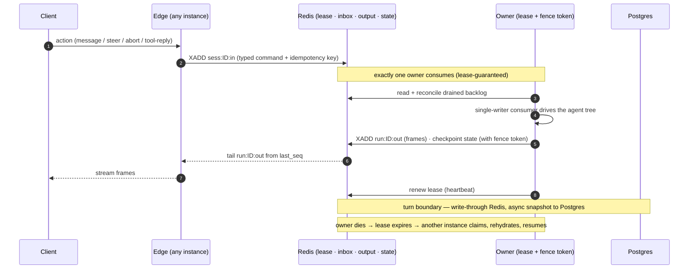

**In one line:** *inbound = enqueue anywhere; outbound = tail anywhere; ownership = lease + single consumer +
fence.* None of the three requires the client to reach a specific instance. Delivery is **at-least-once** (Redis
Streams redeliver un-acked entries), so every command carries an **idempotency key** and the consumer dedupes.

### 13.3 Output write-amplification — the deeper treatment

**The principle that dissolves the problem:** an output frame has two *independent* jobs — don't serve both from
one expensive mechanism.

| Job | Volume | Latency need | Durability need |
|---|---|---|---|
| **Live delivery** (smooth token stream) | High — every delta | ~30–80 ms | **None** — reconnect recovers a missed frame |
| **Replay buffer** (cover a reconnect gap) | Can be **coarse** | Seconds, reconnect-only | Bounded tail only |

Amplification only bites on what you **persist** — so **persist coarsely; deliver live cheaply.** Stackable
techniques (roughly cheapest-impact first):

1. **Delta batching/coalescing** — flush every ~50 ms (or N tokens / at block boundaries). Cuts writes **10–50×**;
   invisible (smooth streaming needs only ~20–30 fps).
2. **Split channels — pub/sub live + stream replay.** Push live frames on Redis **Pub/Sub** (fire-and-forget) for
   the connected edge; separately append a **coarse checkpoint** (~250–500 ms or per block) to a trimmed Stream.
   Persisted writes drop **~50–100×**. ⚠️ Pub/Sub is **at-most-once** — safe **only because** the durable buffer +
   reconnect (§11.3) covers any gap. Never rely on pub/sub alone for correctness.
3. **Bounded retention** (`XADD … MAXLEN ~ N`) — keep only the reconnect window.
4. **Semantic-boundary durability** — persist low-volume meaningful events (block start/stop, `tool_use`,
   `tool_result`, `turn_end`); send high-volume text deltas only on the ephemeral channel. The durable log stays
   small and doubles as the audit/reconnect log.
5. **Co-location shortcut** — when the client's connection is on the owner, deliver in-process (zero Redis on the
   live path); still write the coarse buffer so another edge can serve a reconnect.
6. **Pipelining** — batch several `XADD`s per round-trip.
7. **Scale the bus** — streams on a Redis instance/cluster separate from state, sharded by `run_id`.

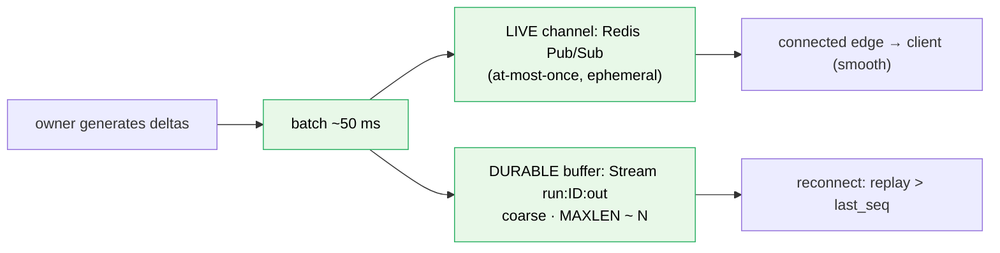

**Worked numbers** (200 tokens/s, 100 concurrent sessions):

| Strategy | Persisted writes/s | vs. naive | Reconnect gap |
|---|---|---|---|
| Naive — 1 persisted `XADD` per token | 200 × 100 = **20,000** | 1× | 0 |
| Batched @ 50 ms | ≤20 × 100 = **2,000** | **10× fewer** | ≤50 ms |
| Pub/sub live + 300 ms checkpoint | ≈3 × 100 = **~300** | **~65× fewer** | ≤300 ms |

**Recommended default:** **batched live delivery (1) + a coarse, trimmed replay buffer (2–4)** — live flushes
~50 ms; durable persists per content block (or ~300 ms) with `MAXLEN ~`; co-location shortcut (5) optional.

**Perceived-performance guarantees:**

- Smoothness is governed by the **live** cadence (≤80 ms), **never** the durable cadence.
- Reconnect resume target < 500 ms: serve the last checkpoint instantly, then live — the user sees text reappear,
  not a full regeneration.
- Slow/mobile clients benefit twice (batching also cuts client-side frame count).

---

# PART III — REFERENCE

## 14. Open decisions & what's ratified

**Ratified this round:**

- ✅ **Ownership unit = root-session tree** (key by `root_session_id`). Trees never span instances; sub-agent cost
  forwarding stays in-process.
- ✅ **Generalized `await_external(cid)` relay** replaces `persist_return` + `inline_await`.
- ✅ **Multiple `UserMessage`s queue by default; interrupt-and-deliver is `Steer` only.**
- ✅ **Context-retention on abort = keep today's behavior** (keep the user message + a synthetic `STREAM_ABORT_TEXT`
  placeholder — _"Agent run was aborted by the user."_ — when nothing completed; keep user + sanitized assistant
  when ≥1 block completed). The "drop both" variant is **not** adopted.
- ✅ **Stateless edges + lease-based ownership;** sticky routing is an optional cold-start optimization, never a
  correctness requirement.

**Still to settle before Rung 2:**

1. **Checkpoint granularity:** per turn (cheap) vs. per step (finer recovery). Start per-turn; move to per-yield as
   the write-through cache lands.
2. **Idempotency keys:** the canonical key for a tool reply / user message (`cid` + `seq`). Define before any
   at-least-once delivery exists.
3. **Inbox bounds & shedding:** bounded size + policy (coalesce duplicates; collapse superseded; shed last with an
   explicit error frame — never silently).
4. **Fence-token enforcement point:** every Redis state write **and** every DB snapshot.
5. **Lease TTL + heartbeat interval** (e.g. ~10 s TTL / ~3 s heartbeat) and claim strategy (lazy claim-on-write vs.
   a "wake" on a control channel).
6. **Delta-batching policy** for the output stream (the §13.3 default).

## 15. Source cross-reference (verified 2026-06-05)

| Concern | Location |
|---|---|
| Agent loop (the one `while`) | `anthropic_agent.py` · `_resume_loop` (def 830; while-loop 846-1104; `finally` 1105-1108) |
| Entry points | `run` / `run_stream` / `resume_with_relay_results` (643-675) / `steer` (1144-1181) / `abort` (1112-1142) |
| `stop_reason` dispatch | `anthropic_agent.py` (930-1100) |
| Relay branch (backend-first + `PendingToolRelay`) | `anthropic_agent.py` (969-1049; classification + `PendingToolRelay` 969-1006, mode fork `inline_await` 1008-1027 / `persist_return` 1029-1049) |
| `inline_await` pause | `anthropic_agent.py` · `_await_inline_relay` (729-828; register 759-783, race 785-828) |
| `persist_return` pause | `anthropic_agent.py` (1029-1049) |
| End-turn hook / rollback inject | `anthropic_agent.py` · `_run_end_turn_hook` (1628-1662) |
| Cancellation reset (injected dependency) | `anthropic_agent.py` · `_reset_cancellation_state` (439-445) |
| Per-chunk cancel poll | `providers/anthropic/retry.py` (247-250) |
| Abort cleanup | `_handle_stream_abort` (1183-1219) · `_abort_awaiting_relay` (1221-1251) |
| Chain sanitizer (abort placeholder text = `STREAM_ABORT_TEXT`, _"Agent run was aborted by the user."_, `core/abort_types.py:29`) | `providers/anthropic/message_sanitizer.py` · `plan_stream_abort` (108-138, empty-case at 120) |
| Tool classification | `tools/registry.py` · `classify_tool_calls` (311-349; bucketing 334-349) · `needs_relay` (42-52) |
| Parallel tool/sub-agent fan-out | `tools/registry.py` · `execute_tools` (199-242; gather 228-242) |
| `PendingToolRelay` | `core/config.py` (104-108) |
| Sub-agent spawn + co-location | `common_tools/sub_agent_tool.py` (269-330; inline-await at 294-295) |
| Parent context injection | `anthropic_agent.py` (1685-1699) |
| Usage forwarding | `anthropic_agent.py` · `_accumulate_usage` (1994-1999) · `_ingest_child_usage` |
| Inline relay registry | `relay/registry.py` (register 64-107 · deliver 109-133 · drop_tree 153-177 · singleton 204-209) |
| Abort/steer control plane | `abort_steer/base.py` · `adapters/memory.py` (40-59) · `core/abort_types.py` · `RunningAgentHandle` (33-47) |
| Persistence (one seam) | `anthropic_agent.py` · `_persist_state` (2266-2294) · `initialize` (327-388; cold-load 344-388) |
| Storage adapters | `storage/base.py` · `storage/registry.py` · `adapters/{memory,filesystem,postgres}.py` (PG UPSERT 313-340) |
| Output stream abstraction | `streaming/base.py` · `StreamFormatter` (22-40) · `streaming/types.py` |
| FastAPI host (demo) | `demos/fastapi_server/agent_router.py` (`/run` 743-780 · `stream_agent_response` 500-551 · `_create_agent` 301-323 · `/tool_results` handler 845, stream 564-628) · `main.py` (lifespan 29-42, `include_router` 62) |

> **Two honesty notes carried from the audit:** (1) the reference FastAPI demo does **not** wire abort/steer or the
> inline-relay HTTP path (`deliver`/`owner_of`/`drop_tree`) — those are library-complete but exercised only by
> tests; the demo's `/tool_results` uses the root `persist_return` path. (2) `assert_single_worker_configuration`
> is named in `relay/registry.py`'s docstring but is **not implemented** anywhere.

## 16. Sources

**Internal design (in this repo)**
- `agent_base/agent_base_design_diary/async-communication.html` — the proposed `EventLogAdapter`
  ("Correlation-ID Inbox on a Durable Log"), the Stream Bus, "why this solves sub-agents," the 4-step migration,
  and explicit non-commitments (no Temporal/CRDT day one).
- `agent_base/developer-diaries/abort-steer-diary.html` — multi-worker breakage table and the
  *"cancellation_event as injected dependency"* principle.
- Predecessor docs merged here: `AGENT_ARCHITECTURE.md`, `AGENT_ARCHITECTURE_EVALUATION.md`.

**External — actor / single-writer session model**
- [Microsoft Orleans — Grains (virtual actors, single-threaded, pluggable persistence)](https://learn.microsoft.com/en-us/dotnet/orleans/resources/best-practices)
- [Microsoft Orleans — Grain placement (single activation is guaranteed only *eventually* under failures)](https://learn.microsoft.com/en-us/dotnet/orleans/grains/grain-placement)
- [Cloudflare Durable Objects — single-writer actor; WebSocket Hibernation](https://developers.cloudflare.com/durable-objects/examples/websocket-hibernation-server/)
- [Actor model — mailbox, single-writer, backpressure (Akka for agentic AI)](https://pradeepl.com/blog/agentic-ai/akka-actor-model-agentic-ai/)

**External — leases / fencing / ordered delivery**
- [Martin Kleppmann — How to do distributed locking (why leases need **fencing tokens**)](https://martin.kleppmann.com/2016/02/08/how-to-do-distributed-locking.html)
- [Redis Streams — data type & consumer groups (order + at-least-once redelivery)](https://redis.io/docs/latest/develop/data-types/streams/)
- [Redis `XREADGROUP`](https://redis.io/docs/latest/commands/xreadgroup/)
- [Redis Pub/Sub — fire-and-forget, **at-most-once** (live channel only; pair with a durable buffer)](https://redis.io/docs/latest/develop/pubsub/)

**External — stream resumption / reconnect**
- [Vercel AI SDK — Chatbot Resume Streams](https://ai-sdk.dev/docs/ai-sdk-ui/chatbot-resume-streams)
- [vercel/resumable-stream (Redis pub/sub, no sticky LB)](https://github.com/vercel/resumable-stream)
- [Upstash — Build LLM streams that survive reconnects](https://upstash.com/blog/resumable-llm-streams)

**External — why NOT to over-reach (event-sourcing/CQRS, Temporal day-one)**
- [CQRS & Event Sourcing: is it worth it?](https://medium.com/@dorinbaba/cqrs-event-sourcing-sounds-cool-but-is-it-worth-it-e97bd5bfb7c1)
- [Azure Architecture Center — CQRS pattern (when to use / avoid)](https://learn.microsoft.com/en-us/azure/architecture/patterns/cqrs)
- [Temporal — durable execution for AI agents](https://temporal.io/solutions/ai)
- [LangGraph — interrupts, checkpointers, resume (re-execution/idempotency caveat)](https://docs.langchain.com/oss/python/langgraph/interrupts)
