# Consolidated Agent Architecture — Today, and the Single-Writer Redesign

How the `agent_base` runtime works today, and the architecture we are moving toward: a **single-writer session
actor** with a **command inbox** and (at scale) a **Redis coordination tier**. Part I is the whole picture; Part
II is the per-subsystem detail (today → pain → proposed → before/after call-sites). Code anchors were verified
against source on 2026-06-05; prefer the function-name anchors.

**What is real today vs. designed-but-unwired** (this matters — the redesign is partly *finishing the wiring*):

| Mechanism | Library code | Wired in the reference FastAPI demo |
|---|---|---|
| Agent loop, tool exec, relay (`persist_return`) | ✅ | ✅ |
| Inline sub-agent relay (`inline_await`, `InlineRelayRegistry`) | ✅ | ❌ — tests only; demo `/tool_results` uses the `persist_return` path |
| Abort / steer (`AbortSteerRegistry`, `cancellation_event`) | ✅ | ❌ — demo calls `run_stream` with no `cancellation_event`, registers no handle |
| `assert_single_worker_configuration` | ❌ docstring only | ❌ |
| `SessionManager` / live in-memory session registry | ❌ | ❌ — every request rebuilds the agent and cold-loads |

Diagrams are Mermaid. 🟦 blue = today; 🟩 green = proposed.

---

# PART I — THE HIGH-LEVEL PICTURE

## 1. Executive summary

Today, one async method — `AnthropicAgent._resume_loop()` — *is* the turn: it streams a response, branches on
`stop_reason`, runs tools (possibly many sub-agents in parallel), pauses for frontend tools, repairs the message
chain on interrupt, and persists whole-object snapshots at a few checkpoints. Control actions (abort, steer,
tool-result, new message) arrive as **racing method calls that mutate shared state with no per-session lock**, and
live state exists only on a per-request agent object **rebuilt from storage every turn**.

> **One idea.** Make each **root-session tree** a **single-writer actor**: exactly one consumer mutates its state.
> Every input enters through **one handler — `submit(AgentInput)`** — which routes it to one of **three planes by
> consumption discipline**: a **mailbox** (user messages — deferred, applied at a turn boundary), **joins** over an
> await table (tool replies — immediate, they resume a suspended turn), and a **control** plane (abort/steer —
> preemptive, they drive the chain's lifecycle). Live state lives in RAM with a **write-through checkpoint**;
> **Postgres is the archive**. Output frames are **sequence-numbered and replayable**. At fleet scale, a **lease +
> fence token** guarantees one owner per session while any edge accepts any action.

This removes the concurrency-race class, kills warm-resume cost, and unlocks horizontal scale. It **relocates (not
deletes)** chain-repair, and **adds one constraint**: at-least-once delivery means side-effecting tools must be
idempotent. We **avoid** full event-sourcing/CQRS and a day-one workflow engine.

## 2. The system today

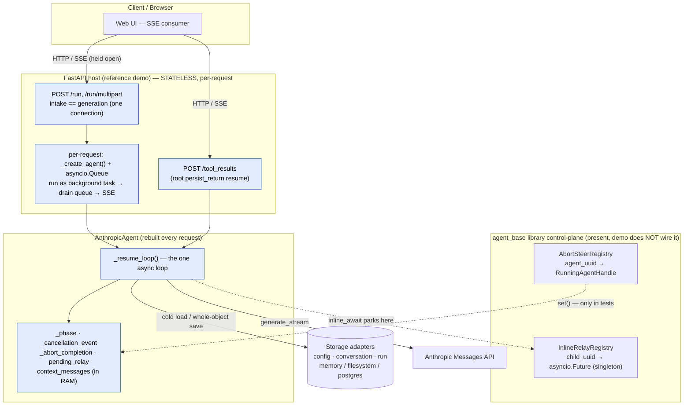

The host holds one connection open per generation; each request builds a fresh agent and cold-loads by
`agent_uuid`; the loop owns control inline; abort/steer and inline-relay exist but are not wired in the host.
Concurrency between two requests for the same session is **unmanaged**.

## 3. The system proposed

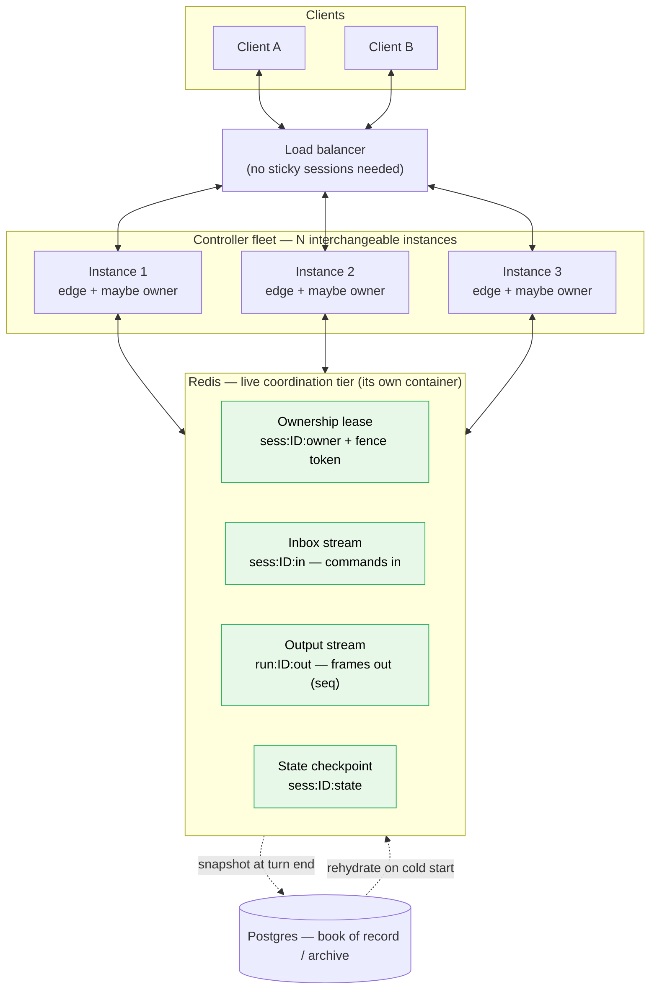

Any instance accepts any action (append to the session inbox) and serves any reconnect (tail the output stream).
Exactly **one** instance *owns* a session — the lease holder, the single writer and sole inbox consumer. Redis
holds four small per-session structures; Postgres sits off the hot path.

## 4. Side-by-side — what changes, what stays

| Concern | Today | Proposed |
|---|---|---|
| **Who mutates state** | Any racing coroutine, no per-session lock | **One** consumer per root-session tree |
| **How inputs arrive** | Method calls + `cancellation_event.set()` + side-channel `steer_instruction` | **One handler** `submit(AgentInput)` routes to **three planes**: mailbox · joins · control |
| **When applied** | Polled at scattered checkpoints | **Mailbox** at a turn boundary · **joins** the instant replies complete · **abort/steer** preempt |
| **Relay** | Two modes: `persist_return` vs `inline_await` | **One** `await_external(cid)` suspend/resume |
| **Sub-agents** | Co-located fan-out (`asyncio.wait` + `Semaphore`), in-memory `Future` registry | **A sub-agent is a recursive tool** (its body may `await_external` N times); cid routing within the root |
| **Live state** | Rebuilt from storage every request | **Resident in RAM** (SessionManager) + write-through checkpoint |
| **Persistence** | Whole-object save at a few checkpoints | Write-through per yield point; Postgres = archive |
| **Output stream** | Ephemeral `asyncio.Queue`; disconnect loses it | **Seq-numbered, replayable** buffer |
| **Intake** | `POST /run` *is* the generation (coupled) | Thin intake (stamp, enqueue, `202`) decoupled from generation |
| **Scale** | Single-process (asserted in prose) | **Lease + fence + single consumer** across a fleet |
| **Chain repair** | `_handle_stream_abort` / `_abort_awaiting_relay` + sanitizer | Same logic, owned by the actor's Abort handler |
| **Idempotency** | Not required (in-process) | **Required** (at-least-once delivery) |

Functionality is preserved. What changes: *who writes*, *how control reaches the writer*, *where live state lives*.

## 5. The design choices

1. **Single-writer actor, three input disciplines, one front door.** One consumer per session mutates its state;
   the loop is a plain `async def` state machine (Idle → Running → Awaiting). Inputs differ by how they meet that
   machine — **mailbox** (deferred, at a turn boundary), **joins** (immediate, resume a suspended turn), **control**
   (preemptive, drive lifecycle) — and all enter through one `submit(AgentInput)` handler. *(§7, §9)*
2. **Ownership unit = the root-session tree, keyed by `root_session_id`.** Sub-agents run co-located under the
   parent (shared queue + cancellation event); one lease, one inbox, one output stream, one checkpoint govern the
   whole tree. Children are supervised workers, not peers racing to write. *(§10)*
3. **One relay primitive: `await_external(cid)`.** Frontend tools, sub-agents, and two-phase backend tools all
   "suspend on a correlation-id, resume when a reply arrives." A turn's tool calls form a **join** over a set of
   cids; a `ToolReply` resolves one slot. Collapses `persist_return` + `inline_await`. *(§8)*
4. **Four Redis structures per session** (scale only): ownership **lease** + **fence token**; **inbox stream**;
   **output stream**; **state checkpoint**. Postgres is the archive. *(§12, §13)*
5. **Acknowledge ≠ process; output is resumable.** Intake does O(1) work and returns `202`; generation runs async.
   Every frame carries a per-run `seq` and replays on reconnect. *(§11)*

**Scope (ratified):** choice #1 and the **Rung-1** form of #2–#3 are **approved now**; #4–#5 (Redis tier,
resumable transport) are **gated behind Rung 2** (§6).

## 6. Migration ladder

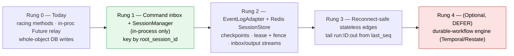

| Rung | Change | Risk |
|---|---|---|
| **0 — Today** | In-process `Future` relay; racing control methods; whole-object persistence. | — |
| **1 — Inbox + SessionManager (in-process) — APPROVED NOW** | Per-session inbox + single consumer + the single `submit()` handler over the mailbox/joins/control model (§9), keyed by `root_session_id`; resident live agents; in-process correlation-ID table replaces `InlineRelayRegistry`; **wire abort/steer/tool-result endpoints in the host**. Ship the **final command + cid protocol, memory-backed** (idempotency contract defined, enforcement deferred) so Rung 2 swaps in Redis without rewriting reconciliation. | Low |
| **2 — EventLogAdapter + Redis SessionStore + checkpoints** | Write-through Redis; lease+fence; inbox/output streams; abort/steer/tool-reply become events any worker delivers. | Medium (at-least-once + **idempotency**) |
| **3 — Reconnect-safe stateless edges** | Edges tail `run:ID:out` from `last_seq`; reconnect to any instance. | Medium (ops) |
| **4 — Durable-workflow engine (optional)** | Promote the loop onto Temporal/Restate behind the same `EventLogAdapter`. | High — defer |

> **Do Rung 1 first and standalone, then STOP and measure.** Rungs 2–4 are **gated, not scheduled** — climb only
> when a metric forces it: more than one production instance required, non-sticky routing needed, reconnect loss
> causing real user pain, or session cold-load p95 past an agreed SLO. Absent a triggering number, Rung 1 *is* the
> finish line. Before any Rung-2 code, run a half-day trade study (bespoke Redis vs. sticky process shards vs. a
> managed actor runtime like Orleans/Dapr/Durable Objects vs. Temporal/Restate). The one constraint that justifies
> a bespoke Redis tier is "must self-host on EC2" — state it if true.

---

# PART II — SUBSYSTEM DEEP-DIVES

## 7. The Agent Loop & Turn Lifecycle

### 7.1 Today

One turn = one invocation of `_resume_loop()` (`anthropic_agent.py`: def 830, while-loop 846-1104). Every entry
point converges here — `run`/`run_stream` and `resume_with_relay_results`/`steer`. Each iteration is a step: set
`_phase=STREAMING`; proactive compaction check; `provider.generate_stream(...)`; on cancel → `_handle_stream_abort`
(Scenario A); else bump `current_step`, accumulate usage, append the assistant message; **dispatch on
`stop_reason`** (`context_window_exceeded` → compact; `pause_turn` → continue; `tool_use` → classify & run/relay;
`end_turn` → end-turn hook then finalize or loop). Control is interleaved inline; `_phase` is a mutable attribute
reset only in the loop's `try/finally`. Persistence is uneven — plain `tool_use` steps persist nothing.

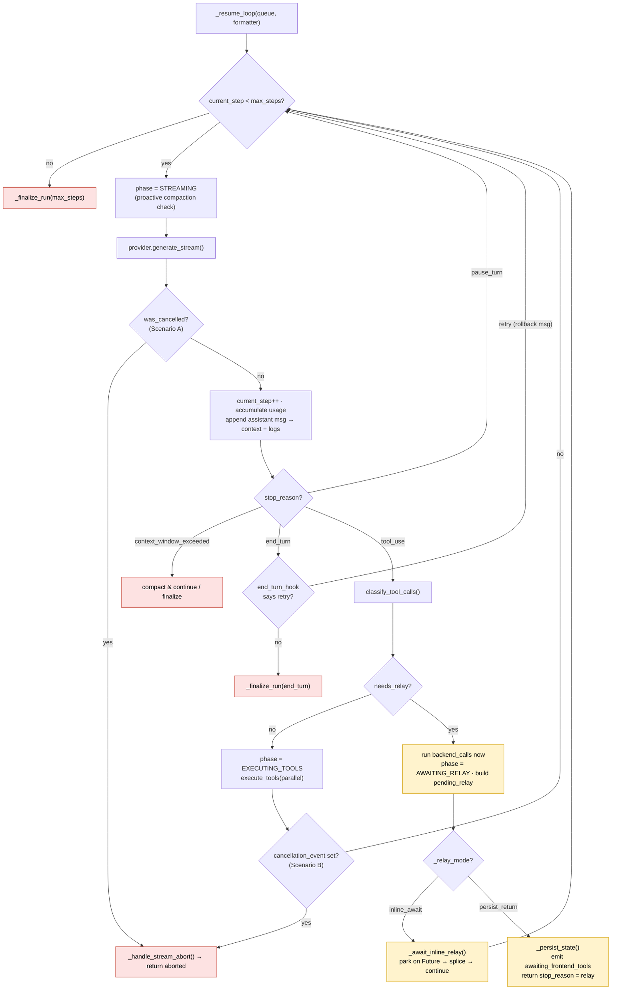

**Pain:** one ~265-line loop with tangled control concerns; cross-task coordination via raw `_cancellation_event`
+ `_abort_completion` + per-child Futures, where `abort()` (a different task) reads mutable `_phase` to pick a
cleanup path; a crash during plain `tool_use` steps loses progress since the last checkpoint.

### 7.2 Proposed

The loop becomes the **actor's run body — an explicit state machine** (Idle → Running → Awaiting); `_phase` becomes
that state. Each input meets the machine differently (§9): the **mailbox** is read only in Idle (which is *why* user
messages queue); a **join** is the exit condition of Awaiting (tool replies resume the suspended turn the instant
the join completes — there is nothing to defer them to); the **control** signal (abort/steer) is observed per-chunk
in every state. Per-step state is checkpointed at the turn/yield boundary (exact granularity is an open call, §14)
— closing the gap where plain `tool_use` steps persist nothing, and the lost-on-cold-load `_runtime_contributions`.
Mid-fan-out has no consistent checkpoint, so recovery still replays from the last root turn boundary (§10).

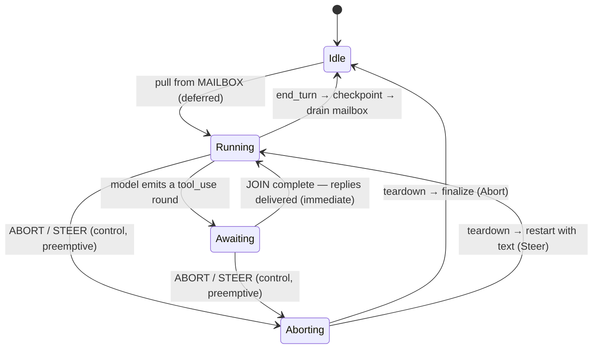

### 7.3 Call-sites — before / after

**Today** — out-of-band abort reads mutable phase (`anthropic_agent.py:1122-1142`):

```python
# abort() runs in a DIFFERENT task than the loop
self._cancellation_event.set()
phase = self._phase
if phase == AgentPhase.IDLE:
    return self._build_aborted_result()
if phase in (AgentPhase.STREAMING, AgentPhase.EXECUTING_TOOLS):
    await self._abort_completion.wait()      # loop self-cleans; cross-task handshake
elif phase == AgentPhase.AWAITING_RELAY:
    await self._abort_awaiting_relay()       # loop not running; clean chain here
```

**After** — abort/steer preempt via the shared signal; the queue is drained at yield points; no second task:

```python
# The actor's run body is a state machine; control arrives as cancellation of the scope.
async def run(self):
    with self.cancel_scope:                          # abort/steer cancel THIS scope (preemptive)
        while True:
            if self.state is IDLE:
                msg = await self.mailbox.get()         # MAILBOX — deferred: blocks for a user message
                self.begin_turn(msg)
            async for chunk in self.model.stream(self.history):   # cancellable per-chunk
                if chunk.is_tool_round:
                    cids    = self.dispatch_tools(chunk)           # register a JOIN + await records
                    replies = await self.join(cids)                # JOIN — immediate: resumes when complete
                    self.history += [assistant(chunk), tool_results(replies)]
                    break                                          # re-enter the stream with replies
                if chunk.is_end_turn:
                    self.finalize(); await self.checkpoint(); self.state = IDLE
                    break
```

The `_abort_completion` handshake and the three-way phase dispatch in `abort()` disappear — the owner is the only
writer; control arrives as scope cancellation, the mailbox is read only at Idle, and a join resumes the turn the
instant it completes.

---

## 8. Tool Classification & the Relay Mechanism

### 8.1 Today

After a `tool_use` turn, `classify_tool_calls()` (`tools/registry.py:334-349`) buckets calls into **backend**,
**frontend** (`executor=="frontend"`), and **confirmation** (`needs_confirmation`); `needs_relay`
(`registry.py:42-52`) is true if any frontend/confirmation call exists. Backend calls run first
(`PendingToolRelay.completed_results`, `core/config.py:104-108`), `_phase=AWAITING_RELAY`, then the loop **forks on
`self._relay_mode`**:

- **`persist_return` (default — roots, resumed sub-agents):** persist, emit `awaiting_frontend_tools` (closing the
  SSE), return `AgentResult(stop_reason="relay")`; a later `POST /tool_results` rehydrates and calls
  `resume_with_relay_results` (`anthropic_agent.py:643-675`).
- **`inline_await` (fresh sub-agents):** park on an `asyncio.Future` from the process-global `InlineRelayRegistry`,
  racing the cancellation event; on delivery, splice + continue. The child never returns upward (it would strand
  inside the parent's `asyncio.gather`).

```mermaid
sequenceDiagram
    autonumber
    participant Loop as Agent loop
    participant Cls as classify_tool_calls
    participant Reg as InlineRelayRegistry / Storage
    participant Cli as Client

    Loop->>Cls: tool_use → classify
    Cls-->>Loop: backend / frontend / confirmation
    Loop->>Loop: run backend_calls now → completed_results
    Loop->>Loop: phase = AWAITING_RELAY · build PendingToolRelay
    alt persist_return (root)
        Loop->>Reg: _persist_state() (to Storage)
        Loop-->>Cli: MetaDelta awaiting_frontend_tools (SSE closes)
        Loop-->>Loop: return stop_reason = relay
        Cli->>Loop: POST /tool_results → rehydrate + resume_with_relay_results
    else inline_await (fresh sub-agent)
        Loop->>Reg: register(child_uuid) → asyncio.Future
        Loop-->>Cli: MetaDelta awaiting_frontend_tools {child_uuid}
        Note over Cli,Reg: in the reference demo no handler calls deliver();<br/>only tests exercise this path
        Cli->>Reg: deliver(child_uuid, results)
        Reg-->>Loop: Future resolves → splice → continue
    end
```

**Pain:** two structurally different mechanisms for one event (in-memory Future vs. serialize→return→rehydrate),
selected implicitly; `inline_await` is process-bound, not durable, and singleton-keyed (blocks scale); the litellm
provider implements only `persist_return`. And a **two-phase tool** (fetch client context → more backend work →
return) has nowhere to live, because today the client's reply *is* the final `tool_result`.

### 8.2 Proposed — one `await_external(cid)` primitive

Lift relay from "the client returns the result" to **"any computation may suspend on a correlation-id and
resume."** One primitive, three users:

```python
cid = new_correlation_id()
payload = await ctx.await_external(cid, request=...)   # suspend; emit relay_request(cid) on the output stream
# ...resumes here when ToolReply(cid, payload) arrives on the inbox...
```

- **Frontend tool:** suspend → client computes → the reply *is* the result.
- **Two-phase backend tool:** phase-1 work → suspend for client context → **phase-2 work** → emit `tool_result`.
- **Sub-agent (the general case):** a tool whose body is an **agent loop** that may call `await_external`
  **arbitrarily many times** (one per internal relay) — a two-phase tool generalized to N phases. Each await
  suspends only that nested agent; the inbox routes `ToolReply(cid)` to the owning agent by `cid`. To the parent it
  is just a tool call returning a `SubAgentEnvelope`. Nesting is transparent.

**A turn's tool calls form a join.** One `tool_use` round issues K calls, and the turn suspends on a **join** over
their K cids (`Join(turn_id, owner_agent_id, cids, results)`). Each reply — local tool, frontend tool, or sub-agent
return — resolves one slot the instant it lands; the turn resumes the moment the last slot fills. A tool reply is
therefore never a queued message (there is nothing to defer it to — the turn is already parked on exactly these
cids); it is the resumption value of a suspended continuation. This is plane 2 of the control model (§9).

```mermaid
sequenceDiagram
    autonumber
    participant Loop as Root / sub-agent loop
    participant Tool as Two-phase tool
    participant CID as Correlation-ID table (owner)
    participant In as Redis inbox
    participant Out as Redis output
    participant Cli as Client

    Loop->>Tool: invoke (tool_use)
    Tool->>Tool: phase 1 — backend prep
    Tool->>CID: await_external(cid)
    Note over Tool,CID: suspends (does NOT return yet)
    CID->>Out: emit relay_request(cid, prompt)
    Out-->>Cli: "we need your input"
    Note over Cli,In: the reply may land on ANY edge
    Cli-->>In: ToolReply(cid, payload)
    In->>CID: route reply by cid (owner consumes)
    CID-->>Tool: resume(payload)
    Tool->>Tool: phase 2 — more backend processing
    Tool-->>Loop: final tool_result
```

**Two durability tiers, one suspension:** the **in-owner await** (fast — park in the correlation-id table while
the owner is alive; no SSE close, no DB write) and a **durable re-arm** (failover only — a long-lived pending
await is also in the checkpoint so a new owner re-arms the same `cid`). A mid-continuation is not separately
durable; on failover it **replays from the last turn boundary**, which is why backend work must be idempotent.

**Routing key = `cid`, not `child_agent_uuid`.** Today's `InlineRelayRegistry` holds one Future per child
(`relay/registry.py:64,109`) — one active await per child. Generalize to `cid → AwaitRecord(root_session_id,
owner_agent_id, child_agent_id, tool_use_ids, await_generation, state)` (keep `child_agent_uuid` as metadata) so
one agent can hold multiple concurrent awaits — grouped per turn by the `Join` that resumes it — and the interrupt
section (§9) can close them by generation.

**Tool-author surface (DX).** Defining a sub-agent is *defining an agent*; invoking one is *a tool call*. Extend
the tool-definition interface so a tool can declare "my body is an agent" (no separate owner append API). `ctx` is
injected by signature introspection (same pattern as today's sandbox injection); frontend/confirmation tools stay
**declarative** (`executor="frontend"` / `needs_user_confirmation=True`, unchanged); `await_external` is the
internal mechanism plus an advanced opt-in for two-phase tools. Consumer methods
(`run_stream`/`resume_with_relay_results`/`abort`/`steer`) stay as wrappers over commands for one major version,
with a migration table (`/run`→enqueue+stream, `/tool_results`→`ToolReply(cid)`, `agent_uuid`→`root_session_id`).

**Idempotency contract (defined now, enforced at Rung 2).** At-least-once delivery lets a side-effecting tool run
twice. Every invocation receives a `ToolContext` with `idempotency_key` (stable across retries), `tool_call_id`,
`run_id`, `attempt`, `replay_reason`, plus a `ctx.once(key, fn)` helper + dedupe store. Mutating/two-phase tools
must declare `idempotent=True` or use `ctx.once(...)`; in distributed mode a mutating tool with no policy **fails
loud**. The guarantee surfaced to authors hides the tiers: *"your tool may re-run from the last checkpoint on
failover; key every external side effect on `ctx.idempotency_key`."*

### 8.3 Call-sites — before / after

**Today** — the fork on `_relay_mode` (`anthropic_agent.py:1008-1049`):

```python
if self._relay_mode == "inline_await":
    relay_result = await self._await_inline_relay(...)   # park on asyncio.Future
    if relay_result is not None:
        return relay_result                              # cancelled
    continue                                             # spliced; keep looping
# else persist_return (root):
await self._persist_state()
await fmt.format_delta(MetaDelta(type="awaiting_frontend_tools", ...), queue)
return self._build_agent_result(response_message, "relay")
```

**After** — one suspension, no mode branch:

```python
# Run backend calls now, then suspend on a fresh correlation id.
cid = new_correlation_id()                              # one await = one cid
payload = await self.await_external(
    cid,
    request=awaiting_frontend_tools(pending_tools),     # carries pending_tool_use_ids as await metadata
)
# Resumes here for root or sub-agent, same process or another worker:
# a ToolReply(cid) command on the inbox is the universal wakeup.
self.splice_relay_results(payload)
```

`PendingToolRelay` becomes the actor's durable suspended state; the process-global `InlineRelayRegistry` and the
per-provider divergence both disappear.

---

## 9. Inputs, the Single Handler & the Control Model (mailbox · joins · control)

### 9.1 Today

There is **no single entry point**: user messages, tool replies, aborts, and steers arrive as separate racing
method calls (see §7.1, §8.1, §11.1). For control, one cancellation primitive per turn:
`self._cancellation_event` (injected at `run_stream`/`steer`, else fresh in
`_reset_cancellation_state`, `:439-445`). An out-of-band caller reaches a live run via `AbortSteerRegistry`
(`agent_uuid → RunningAgentHandle`, `core/abort_types.py:33-47`). `signal_abort` sets the event; `signal_steer`
writes `steer_instruction` then sets the **same** event (`abort_steer/adapters/memory.py:40-59`) — so abort and
steer are the identical wakeup, distinguished only by a side-channel. Detection is uneven: per-chunk in STREAMING
(`retry.py:247-250`); once after the batch in EXECUTING_TOOLS (`:1083-1088`); a Future-vs-event race in
AWAITING_RELAY (`:785-800`). Each path repairs the chain via `message_sanitizer.py`
(`_handle_stream_abort` `:1183-1219`, `_abort_awaiting_relay` `:1221-1251`). `steer()` = abort + append user
message + reset + re-enter the loop (`:1144-1181`).

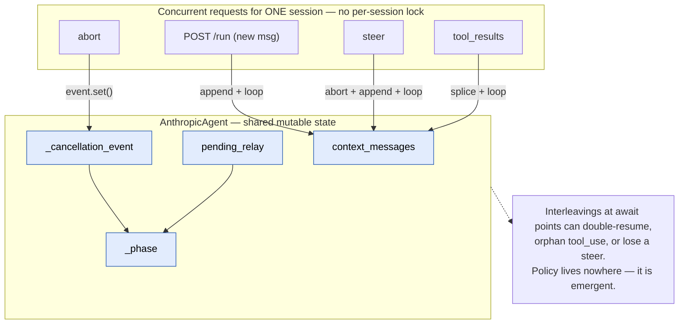

**Pain:** abort and steer collapse into one undifferentiated signal with a side-channel that has no production
consumer; no ordering of concurrent commands; the injected-event coupling is unenforced; single-process only, and
unwired in the demo.

### 9.2 Proposed — one handler, three planes

Three input types, **three different consumption disciplines**. The earlier "two lanes" framing was wrong because
it put user messages and tool replies in one ordered queue — but a tool reply is not a deferred message: it is the
**resumption value of a turn already suspended on exactly that reply**. Distinguish inputs by *how they meet the
loop* (the §7 state machine):

| Input | Discipline | Mechanism | Consumed when |
|---|---|---|---|
| **UserMessage** | Deferred, ordered, accumulates | **Mailbox** (actor inbox) | At a turn boundary — oldest-first, one per turn |
| **ToolReply** | Immediate, correlated, transient | **Join** over the await table (§8) | The instant its turn's join completes |
| **Abort / Steer** | Preemptive, lifecycle | **Control** (cancel scope) | Now, in any state — propagates over the chain (§10) |

That is the actor + structured-concurrency model: a **mailbox** (Hewitt actor inbox), **joins** (coroutine
resumption — `results = await gather(...)`), and a **cancel scope** (a control channel kept deliberately separate
from data flow). **The control plane is today's `cancellation_event`** — per-chunk (`retry.py:247-250`), injected
into tools (`:1834-1836`), racing relay waits (`:785-800`), shared down the subtree (`sub_agent_tool.py:324`); the
redesign keeps it. The mailbox and the unified front door below are what's new.

**One front door.** All three planes sit behind a single handler, so external callers have one call site and the
runtime has one chokepoint for sequencing, auth, audit, idempotency, and (at scale) transport:

```python
# The sealed input union callers construct
AgentInput = UserMessage(content)               # → mailbox  (deferred)
           | ToolReply(cid, result)             # → join     (immediate)
           | Abort(target=ROOT, grace_ms=...)   # → control  (preemptive)
           | Steer(content, target=ROOT, mode="forceful")   # default; "cooperative" per call

class Agent:
    async def submit(self, input: AgentInput) -> Ack:
        seq = self._next_seq()                       # total order for AUDIT/replay — NOT execution order
        if not self._authorize(input): return Ack(seq, REJECTED)
        if self._is_duplicate(input):  return Ack(seq, IGNORED_DUP)
        self._audit(seq, input)
        match input:
            case UserMessage() as m:                     # PLANE 1 — mailbox (deferred)
                self._mailbox.append(m);   return Ack(seq, ACCEPTED)
            case ToolReply() as r:                       # PLANE 2 — join (immediate)
                ok = self._await_table.resolve(r.cid, r.result)
                return Ack(seq, RESOLVED if ok else IGNORED_STALE)
            case Abort() as a:                           # PLANE 3 — control (preemptive)
                self._node(a.target).cancel(ABORT, a);   return Ack(seq, CANCELLING)
            case Steer() as s:                           # PLANE 3 — control (preemptive)
                n = self._node(s.target); n.steer_inbox.put(s); n.cancel(STEER, s)
                return Ack(seq, STEERING)
```

`submit()` **never blocks on the turn** — it classifies, dispatches, and returns an `Ack` (`ACCEPTED`, `RESOLVED`,
`IGNORED_STALE`, `IGNORED_DUP`, `CANCELLING`, `STEERING`, `REJECTED`). Output flows on a **separate** read path
(§11 `stream()`), preserving the write-in / read-out (CQRS) seam. **Friendly wrappers** are pure delegations, so the
chokepoint stays single:

```python
async def say(self, text):           return await self.submit(UserMessage(text))
async def reply(self, cid, result):  return await self.submit(ToolReply(cid, result))
async def abort(self, target=ROOT):  return await self.submit(Abort(target))
async def steer(self, text, **kw):   return await self.submit(Steer(text, **kw))
```

**The one caveat: `seq` is audit/replay order, not execution order.** A `ToolReply` at seq=5 takes effect *before* a
`UserMessage` at seq=3 — the reply resolves a live join now, the message waits for a turn boundary. `submit()`
stamps one monotonic seq for bookkeeping; each plane keeps its own discipline. Reading `submit()` as "one FIFO
queue" is the two-lane bug sneaking back.

**It maps 1:1 onto the inbox at scale.** In-process, `submit()` dispatches to the three local planes. Cross-process,
`submit()` *is* `XADD sess:ID:in` and the owner's consumer runs this same `match` to demux (§13) — public API and
wire protocol share one shape, so scaling out needs no surface redesign. There is **no `Cancel`, `Disconnect`, or
`Reconnect`** input: a dropped socket has no agent semantics (the run keeps going); reconnect is a transport request
to the output endpoint (§11), never an agent command.

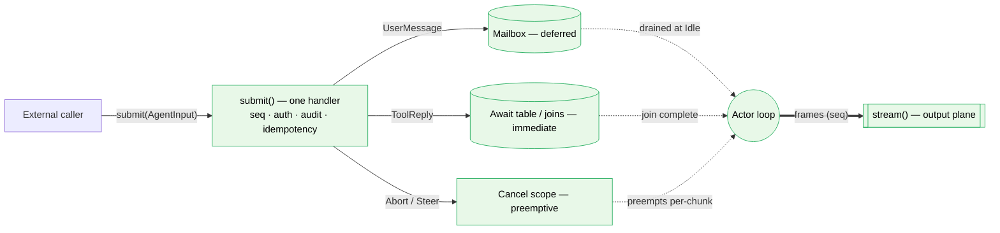

**Abort semantics:**

- **Preempt + teardown.** The signal propagates across the whole subtree: the stream breaks at the next chunk;
  a parked **join** wakes via the cancel scope (FIRST_COMPLETED race); in-flight tools/sub-agents stop; the chain is
  sanitized and `is_error` `tool_result`s are synthesized for every orphaned `tool_use`; **queued `UserMessage`s
  are dropped** (a bare abort means *stop* — the user re-sends); finalize at phase IDLE.
- **Latency = cooperative + a bounded hard backstop.** A non-cooperative tool (a 30 s HTTP call) or a sub-agent
  mid-LLM-call won't stop until it next checks the signal. So the tool interface gains an explicit `async def
  on_abort(self)` cleanup hook (generalizing the duck-typed `set_cancellation_event` seam); after a configurable
  `ABORT_GRACE_MS` window any straggler is hard-cancelled (`asyncio` task cancel). A hard cancel **releases the
  actor but cannot stop an in-flight thread side-effect** (sync tools use `to_thread`), so mutating tools must be
  idempotent and report "unknown outcome"; truly non-cooperative tools belong in a killable sandbox.
- **Still sequenced (and inbox-delivered at scale).** "Preemptive" means *wakes the owner immediately*, not
  *skips the protocol* — Abort/Steer still carry `seq` (stamped by `submit()`) + `run_id` and are written to a `CommandAuditLog`
  (`command_id, seq, idempotency_key, source, applied_at, dropped_reason, reconciled_intent, await-lifecycle,
  owner_fence`) that doubles as the audit/reconnect log and answers "why did my agent do X?". At fleet scale they
  travel on the same `sess:ID:in` inbox (the only cross-edge channel, so they are recorded and ordered there too),
  but the owner **applies them preemptively** — it peeks for a pending Abort/Steer every chunk instead of waiting
  for FIFO order. In Rung 1 (in-process) they are a direct signal and touch no queue at all.

**Steer = Abort + restart, with a per-call `mode`.** Steer carries its own message plus a `mode`: **forceful**
(default — cancel the open tool round with synthesized `tool_result`s, then inject the steer text and restart) or
**cooperative** (let the current round's join complete first, then inject). The message-structure invariant forces
the choice — you cannot splice a `user` message between an assistant `tool_use` and its `tool_result`, so a steer
arriving mid-round must either cancel the round or wait for its join. Because steer carries its own message, the
drop-queue rule never loses it.

**One non-reentrant interrupt critical section (correctness).** A race exists today: `_await_inline_relay` races
the relay future against `cancel_event.wait()` (`:785`), and if a `ToolReply` and the cancel both complete in the
same wait set, the **future wins** — so a `Steer` racing a `ToolReply` can resume the *old* await. Fix: on
Abort/Steer the owner enters one critical section that freezes the queue, closes every active `cid` (by
**await-generation** — a reply for a closed generation is dropped, never spliced), repairs the chain, then
finalizes or restarts. **Parent and child repair are separate obligations:** a parked sub-agent that loses the
cancel race today returns an aborted result *without* repairing its own chain, leaving its `tool_use` unmatched —
so teardown must walk the await table and repair *every* nested await.

**Context-retention on abort — keep today's behavior.** If the assistant produced ≥1 complete content block, keep
the user message + the sanitized assistant message; if nothing completed, `plan_stream_abort`
(`message_sanitizer.py:120`) keeps the user message and inserts a synthetic placeholder whose text is
`STREAM_ABORT_TEXT` — _"Agent run was aborted by the user."_ (`core/abort_types.py:29`). *(Codex dissents on
drop-queue: it would `hold` pre-abort messages by seq rather than drop; current decision = drop.)*

### 9.3 Call-sites — before / after

**Today** — abort and steer are the same `Event.set()`, differentiated by a side-channel
(`abort_steer/adapters/memory.py:40-59`):

```python
async def signal_abort(self, agent_uuid):
    handle = self._registry.get(agent_uuid)
    handle.cancellation_event.set()                 # abort

async def signal_steer(self, agent_uuid, new_instruction):
    handle = self._registry.get(agent_uuid)
    handle.steer_instruction = new_instruction      # side-channel (no prod consumer)
    handle.cancellation_event.set()                 # ...same signal as abort
```

**After** — one handler; the plane is chosen by the input type, not the call site:

```python
# Every input — message, reply, abort, steer — goes through ONE handler.
await agent.submit(UserMessage(text))              # → mailbox (runs at the next turn boundary)
await agent.submit(ToolReply(cid, result))         # → join    (resolves the suspended turn now)
await agent.submit(Abort())                         # → control (preempt + teardown)
await agent.submit(Steer(text))                     # → control (preempt + restart; mode defaults to forceful)

# ...or the friendly wrappers (pure delegation to submit(), so the chokepoint stays single):
await agent.say(text)
await agent.reply(cid, result)
await agent.abort()
await agent.steer(text)

# At scale this same call is the transport: submit() == XADD sess:ID:in; the owner's consumer demuxes by type —
# mailbox at Idle, joins on arrival, abort/steer preemptively (§13).
```

---

## 10. Parallel Sub-Agents & the Root-Session Tree

### 10.1 Today

A parent exposes one `spawn_subagent(...)` tool (`sub_agent_tool.py:269-330`). N `spawn_subagent` blocks run
**concurrently** — one `asyncio.Task` per call, bounded by `Semaphore(max_parallel_tool_calls)`
(`tools/registry.py:228-242`), reassembled in order. Each child is a fresh `AnthropicAgent` in the **same process
and loop**, sharing the parent's output **`queue`**, per-run **`cancellation_event`** (one abort cascades to the
subtree), and storage/sandbox/memory (`SubAgentParentContext`, `:1685-1699`). Usage folds up via
`_parent_usage_forward._ingest_child_usage(...)` (`:1994-1999`). Fresh children are forced into `inline_await`
(`:294-295`) because they are in-flight coroutines, not picklable mid-run.

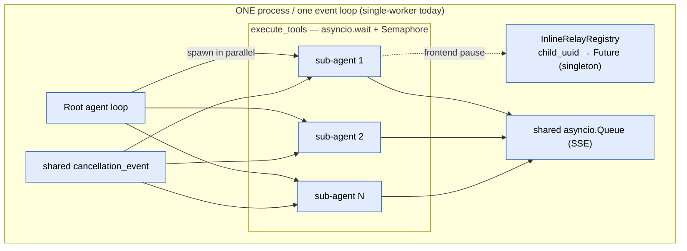

**Pain:** hard single-process constraint (singleton registry + loop-bound Futures); fresh children are not durably
resumable (`pending_relay` not persisted before parking, `:1008-1016`); all children share one queue, one cancel
event, and the same parent usage counters — correct only under cooperative single-loop scheduling.

### 10.2 Proposed — the tree is the unit of ownership

**The single-writer unit is the whole tree rooted at the root session, keyed by `root_session_id` — one lease,
one inbox, one output stream, one checkpoint per root, not per agent.** This dissolves the "single-writer *and*
parallel sub-agents" paradox: single-writer governs the **control plane and root state**; it does not forbid
parallel *work*. Children stay co-located supervised tasks (the Orleans/Akka stance — one request at a time for
*state*, unlimited parallel work).

Each node in the tree is itself the §7 state machine, and an await edge (a parent's `cid`) may point at a child
node. **Replies propagate up** (a child's terminal result resolves the parent's join slot); **abort propagates
down** (cancelling a node cancels its subtree); **steer targets a node** (its `target`, default root). The chain is
a tree of cancel scopes — structured concurrency, not a flat pool.

- **Stays:** parallel spawn; shared `cancellation_event`; usage forwarding; bounded concurrency. The only
  owner-serialized concerns are output-frame `seq` stamping + usage accumulation (the streaming/usage contract,
  not a new API).
- **Changes:** the in-process `InlineRelayRegistry` becomes the owner's `cid`-keyed await table, fed by the inbox;
  a reply landing on any edge is routed to the parked child by `cid`. Single-worker assumption gone; behavior
  identical. **Invariant:** a sub-agent is always a supervised task under its root — never an independently
  addressable top-level session — so its cids/uuid route within the root.
- **Recovery unit = the root turn boundary** (no consistent mid-fan-out checkpoint → replay + idempotency).
- **Escape hatch (defer):** if one tree out-scales a box, promote children to independently-leased actors.

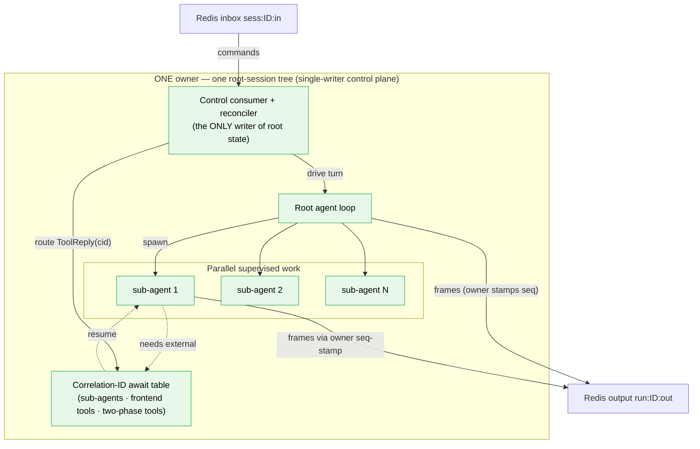

### 10.3 Call-sites — before / after

**Today** — child shares parent primitives, forced to inline-await (`sub_agent_tool.py:289-330`):

```python
if resume_agent_uuid is None:
    child._relay_mode = "inline_await"           # fresh child cannot serialize mid-gather
child._parent_usage_forward = parent_agent       # usage folds up
result = await child.run_stream(
    prompt=task,
    queue=instance._parent_context.queue,                         # shared
    cancellation_event=instance._parent_context.parent_cancellation_event,  # shared
)
```

**After** — spawn is a supervised task of the root actor; relay parks in the `cid`-keyed table:

```python
child = self.supervise(spec, task)               # owned by THIS root-session actor; shares cancel scope + output
payload = await child.await_external(cid, request=...)   # entry keyed by cid, not a singleton Future
# ToolReply(cid) may arrive on ANY edge → routed to this owner → resumes the child.
```

`_parent_usage_forward` stays in-process (trees never span instances) — no cross-instance cost forwarding.

---

## 11. Transport: Fast Ingestion & Resumable Output

### 11.1 Today

The reference host is stateless. `POST /run` (`agent_router.py:743-780`) returns a `StreamingResponse` whose
generator (`stream_agent_response`, `:500-551`) builds a fresh agent (`_create_agent`, `:301-323`), makes a
per-request `asyncio.Queue`, runs `run_stream` as a background task, and drains the queue into SSE frames. So
**intake == generation** — one connection held for the whole turn. There is no `cancellation_event`, no handle, no
abort/steer endpoint; the only cancellation is `except asyncio.CancelledError: agent_task.cancel()` (client
disconnect kills the run). The one continuation is `POST /tool_results` (`:564-628`), which rehydrates and opens a
**new** stream — not a reconnect/replay.

```mermaid
sequenceDiagram
    autonumber
    participant Cli as Client
    participant Host as POST /run (one connection)
    participant Q as per-request asyncio.Queue
    participant Ag as fresh AnthropicAgent (background task)

    Cli->>Host: POST /run (prompt)
    Host->>Ag: _create_agent() + run_stream(queue)
    Ag->>Q: push chunks ... then None
    loop drain
        Q-->>Host: chunk
        Host-->>Cli: data: chunk (SSE held open)
    end
    Note over Cli,Q: disconnect → CancelledError → agent_task.cancel(); in-flight output LOST
```

**Pain:** acknowledge == process (no quick ACK; rapid-fire inputs have nowhere fast to land); no resumable output
(a dropped connection loses in-flight frames); two requests for one `agent_uuid` race on storage.

### 11.2 Proposed — acknowledge ≠ process, resumable output

Split transport into two thin endpoints (CQRS at the transport layer, not the domain): an **intake** endpoint does
O(1) work (auth, stamp `(seq, idempotency_key)`, `XADD` to `sess:ID:in`, return `202` with the seq); an **output**
endpoint tails `run:ID:out` from a client cursor. A dropped socket has **no agent semantics** — the run keeps
going; teardown happens only via an explicit `Abort` or expiry, never generator cancellation.

```mermaid
sequenceDiagram
    autonumber
    participant Cli as Client
    participant Edge as Intake (any instance)
    participant In as Redis inbox sess:ID:in
    participant Own as Owner (single consumer)

    Cli->>Edge: POST abort / message / steer / tool-reply
    Edge->>Edge: auth + stamp (seq, idempotency key)
    Edge->>In: XADD command
    Edge-->>Cli: 202 Accepted (seq) — sub-millisecond
    Note over Cli,Edge: the ack does NOT wait for generation
    In-->>Own: consume (async); Abort/Steer preempt per-chunk · UserMessage at turn boundary · ToolReply resolves its join on arrival
```

**Resumable output:** every frame carries a monotonic per-run `seq`; the client tracks the highest `seq` rendered;
on reconnect it makes a transport request to the output endpoint (`GET …?last_seq=N`) and the serving edge replays
`> last_seq` from a bounded buffer (`XADD … MAXLEN ~ N`), then tails live. If `last_seq` is older than the tail,
resync from the last checkpoint. Redis buffers the stream independently of the SSE connection, so the connection is
disposable.

```mermaid
sequenceDiagram
    autonumber
    participant Cli as Client
    participant Edge as Any edge
    participant Out as Redis output run:ID:out
    participant Own as Owner

    Note over Cli: connection drops; client kept last_seq
    Cli->>Edge: GET /stream?last_seq=N
    Edge->>Out: read frames after last_seq
    Out-->>Edge: replay the gap
    Edge-->>Cli: re-send missed frames (client dedupes by seq)
    Own->>Out: live frames keep arriving (XADD)
    Out-->>Edge: tail live
    Edge-->>Cli: resume live stream
    Note over Cli,Out: if last_seq older than tail → resync from last checkpoint, then go live
```

### 11.3 Call-sites — before / after

**Today** — intake and generation are one coupled generator (`agent_router.py:500-551`):

```python
queue: asyncio.Queue[str | None] = asyncio.Queue()
async def run_agent_and_signal():
    try:
        return await agent.run_stream(user_prompt, queue)
    finally:
        await queue.put(None)
agent_task = asyncio.create_task(run_agent_and_signal())
try:
    while True:
        chunk = await queue.get()
        if chunk is None: break
        yield f"data: {chunk}\n\n"        # connection held for the whole turn
except asyncio.CancelledError:
    agent_task.cancel()                    # disconnect == abort; output lost
    raise
```

**After** — intake returns immediately; a separate endpoint tails the durable stream:

```python
# Intake — O(1), returns 202
@router.post("/run")
async def run(req):
    seq = await intake.stamp_and_enqueue(req.session_id, StartTurn(req.prompt))
    return JSONResponse({"run_id": req.run_id, "seq": seq}, status_code=202)

# Output — thin reader, reconnect-safe (disconnect drops only this subscriber)
@router.get("/stream")
async def stream(session_id, run_id, last_seq: int = 0):
    async def gen():
        async for frame in out_stream.tail(run_id, after=last_seq):  # replay gap → live
            yield sse(frame)
    return StreamingResponse(gen(), media_type="text/event-stream")
```

---

## 12. Session State, Persistence & the Cache Tier

### 12.1 Today

There is **no live `SessionManager`.** Every request reconstructs the agent and `initialize()` cold-loads all
state from the storage adapters by `agent_uuid` (`:344-388`). Live state exists only for one run, flushed by
`_persist_state()` (`:2266-2294`) at a few points (finalize, relay pause, abort, rollback). Persistence is the
three-adapter pattern (config/conversation/run) over memory/filesystem/postgres; the Postgres config adapter does
an idempotent `INSERT … ON CONFLICT (agent_uuid) DO UPDATE` (`postgres.py:313-340`) — already archive-shaped. The
output queue is a plain `asyncio.Queue` the caller creates; the agent writes `StreamDelta`s via a `StreamFormatter`
(`streaming/base.py:22-40`).

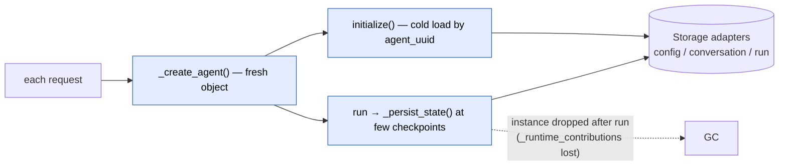

**Pain:** every turn pays a full deserialize (no warm session); `_runtime_contributions` is lost on cold-load
resume; plain tool steps persist nothing, so a mid-turn crash loses progress; single-worker by construction.

### 12.2 Proposed — SessionManager + write-through cache + DB archive

Separate the two things "cache the live state" conflates: a **live actor** — a `SessionManager` keeps the resident
session in memory on its owner, one activation per `root_session_id` (the virtual-actor model: Orleans grains,
Durable Objects), so hot reads/writes hit RAM — and a **cache tier**, a write-through Redis `SessionStore` with
Postgres as the cold/archive fallback.

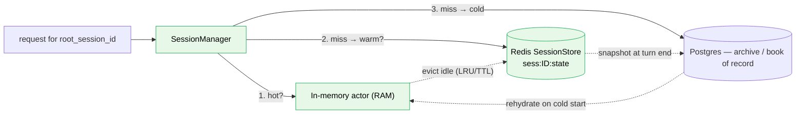

The seam is the existing `_persist_state()`: keep the full-snapshot write, but route the hot copy to Redis at the
checkpoint boundary (per-turn now, per-yield later — §14) and let the Postgres UPSERT become the async archive
behind it. The storage
`registry.py` is where a `"redis"` backend would be added next to `Literal["memory","filesystem","postgres"]` —
net-new, not a pre-existing hook. Local dev stays zero-infra via explicit modes: `local_inprocess` (default,
memory-backed inbox/outbox/await table) vs. `distributed_redis` (opt-in).

### 12.3 Call-sites — before / after

**Today** — resume is always a cold load (`anthropic_agent.py:344-388`):

```python
loaded_config = await self.config_adapter.load(self._agent_uuid)   # full deserialize every turn
self.agent_config = loaded_config
if loaded_config.pending_relay and loaded_config.pending_relay.run_id:
    conversation = await self.conversation_adapter.load_by_run_id(
        self._agent_uuid, loaded_config.pending_relay.run_id)
```

**After** — the SessionManager serves a resident actor; cold load is the fallback:

```python
session = await session_manager.acquire(root_session_id)   # RAM → Redis → Postgres
# ...hot path touches RAM only; no per-turn deserialize...
await session.checkpoint(fence_token)                       # write-through Redis; async archive to PG
```

---

## 13. Horizontal Scale: Ownership, Leasing & Write-Amplification

### 13.1 Single-writer across the fleet

A multi-instance deployment enforces the in-process guarantees through Redis. **Four structures per session:**

| Need | Redis structure | Why |
|---|---|---|
| **At most one writer** | **Lease** `sess:ID:owner` via `SET NX PX` + heartbeat, plus a monotonic **fence token** (`INCR`) | Virtual-actor single-activation is only *eventual* under failure — two owners can briefly coexist, so every write carries a fence token; stale writers are rejected. |
| **Deliver commands (from any edge)** | **Inbox stream** `sess:ID:in`; one consumer = the lease holder | `1 stream → 1 consumer` preserves order, decouples producers, durable + redeliverable. |
| **Stream output to whichever edge holds the client** | **Output stream** `run:ID:out`; edges tail from `last_seq` | Reconnect/replay with no sticky LB. |
| **Warm resume + failover** | **State checkpoint** `sess:ID:state`, write-through at the turn boundary | RAM-speed rehydrate; Postgres only on a cold miss. |

Every action funnels into the *one* inbox consumed by the *one* owner, so reconciliation stays a local,
single-threaded decision. The fleet adds delivery and failover; it does **not** reintroduce racing method calls.

### 13.2 Where requests land, and how one owner is guaranteed

- **(a) Actions hit any server.** Inbound needs no routing — any edge `XADD`s to `sess:ID:in` and returns; the
  owner is the sole consumer.
- **(b) A dropped SSE reconnects to any edge.** Output lives in `run:ID:out`, not in the owner's process; the
  reconnecting edge reads from `last_seq`, replays the gap, tails live. It need not be the owner.
- **(c) Exactly one lease-holder.** Three Redis mechanisms compose: **lease** (`SET NX PX`; `NX` ⇒ first writer
  wins; heartbeat renews; expiry ⇒ auto-failover) + **single consumer** (only the owner reads the inbox group) +
  **fence token** (`INCR`; every write carries it, stale rejected). Placement: claim-on-write first;
  consistent-hash later as a warm-cache optimization with the lease as the correctness backstop.

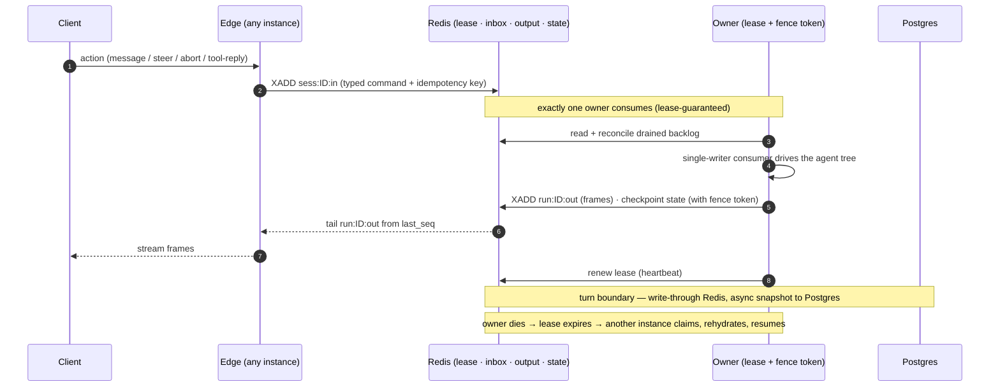

Delivery is **at-least-once** (Redis Streams redeliver un-acked entries), so every command carries an idempotency
key and the consumer dedupes. **Fence enforcement must cover *every* owner write** — output `XADD`, inbox `XACK`,
await table, DB snapshot — not just the checkpoint, or a zombie owner during failover duplicates frames and
silently acks commands. The lease heartbeat is a background task tied to actor residency (not run-body progress),
so a multi-minute parked `await_external` does not drop the lease.

### 13.3 Output write-amplification

An output frame has two independent jobs — don't serve both from one expensive mechanism:

| Job | Volume | Latency | Durability |
|---|---|---|---|
| **Live delivery** | High — every delta | ~30–80 ms | None — reconnect recovers |
| **Replay buffer** | Coarse | Seconds, reconnect-only | Bounded tail |

Amplification only bites on what you persist — so **persist coarsely, deliver live cheaply.** The model: the owner
batches deltas (~50 ms / N tokens) into a single **durable trimmed Stream** `run:ID:out` (`MAXLEN ~ N`); the
**edge** holding the client's SSE tails it via `XREAD` and relays. Redis never streams to the client. In **Rung 1
owner == edge**, so this collapses to the in-process queue — no hop. (Pub/Sub is *not* a primary path: it is
at-most-once, and a delta dropped on a still-connected client triggers no reconnect and isn't in the buffer; live
frames carry a monotonic `seq` so the client detects a gap and requests replay. Pub/Sub may survive only as an
optional "new frames available, go `XREAD`" wake hint.) Further levers: persist only semantic events (block
start/stop, `tool_use`, `tool_result`, `turn_end`) durably; pipeline `XADD`s; shard the bus by `run_id`.

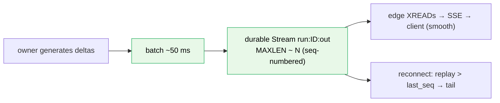

**Worked numbers** (200 tokens/s, 100 concurrent sessions):

| Strategy | Persisted writes/s | vs. naive | Reconnect gap |
|---|---|---|---|
| Naive — 1 `XADD` per token | **20,000** | 1× | 0 |
| Batched @ 50 ms | **2,000** | 10× fewer | ≤50 ms |
| Batched + 300 ms semantic checkpoint | **~300** | ~65× fewer | ≤300 ms |

Smoothness is governed by the live cadence (≤80 ms), never the durable cadence; reconnect resumes < 500 ms (serve
the checkpoint, then live) so the user sees text reappear, not a full regeneration.

---

## 14. Open decisions

**Ratified — design:** ownership = root-session tree; `await_external(cid)` replaces both relay modes; **one
`submit(AgentInput)` handler over three planes — mailbox (user messages, deferred), joins (tool replies, immediate),
control (abort/steer, preemptive)** — with `say/reply/abort/steer` wrappers delegating to it, and `seq` as
audit/replay order (not execution order); **mailbox drain = oldest-first, one message per turn** (FIFO; queuing
several is rare, but the interface supports it), **bounded with explicit backpressure** (an over-cap
`submit(UserMessage)` returns a `REJECTED`/backpressure `Ack`, never a silent drop; control and joins are never
shed); abort = cooperative + hard-cancel backstop (`ABORT_GRACE_MS`) + `on_abort()` hook; bare abort drops queued
messages; **steer default `mode` = forceful** (cancel the open round, then inject; per-call override to
`cooperative`); **user-facing abort/steer target the root** (whole tree) — per-node `target` is an advanced
capability the type allows but Rung 1 does not surface; context-retention keeps today's `STREAM_ABORT_TEXT`
placeholder; **checkpoint at the per-turn boundary** in Rung 1 (`checkpoint()` is a seam so Rung 2 can go per-yield
with the write-through cache); **idempotency + ordering fields are plumbed in Rung 1, enforced at Rung 2** — every
`AgentInput` carries `command_id` + `client_seq`, every tool gets `ctx.idempotency_key` (= `stable_hash(run_id,
tool_call_id)`) + `attempt`/`replay_reason` + `ctx.once()`; stateless edges + lease ownership; Rung 1 ships the
final command/cid protocol memory-backed.

**Ratified — Rung-1 spec must include (correctness, not optional):** the non-reentrant interrupt critical section +
await-generation (the Steer-vs-`ToolReply` race); walk-the-await-table nested repair (parent and child are separate
obligations); disconnect ≠ task-cancel (teardown only via explicit Abort/expiry, never generator cancellation).

**Still open — Rung-2 only (needs the trade study or live measurement; none touch the Rung-1 interface):**

1. Lease TTL + heartbeat interval (~10 s / ~3 s) and claim strategy (claim-on-write first, consistent-hash later).
2. Durable re-arm of long-lived awaits (orphaned `ToolReply` on failover); full fence-enforcement scope (every
   owner write: output `XADD`, inbox `XACK`, await table, DB snapshot).
3. The trade study (bespoke Redis vs. sticky shards vs. managed actor runtime vs. Temporal) before any Rung-2 code —
   likely lands on bespoke Redis given the multi-EC2 + self-hosted constraint, but stays a gate, not a pre-commit.
