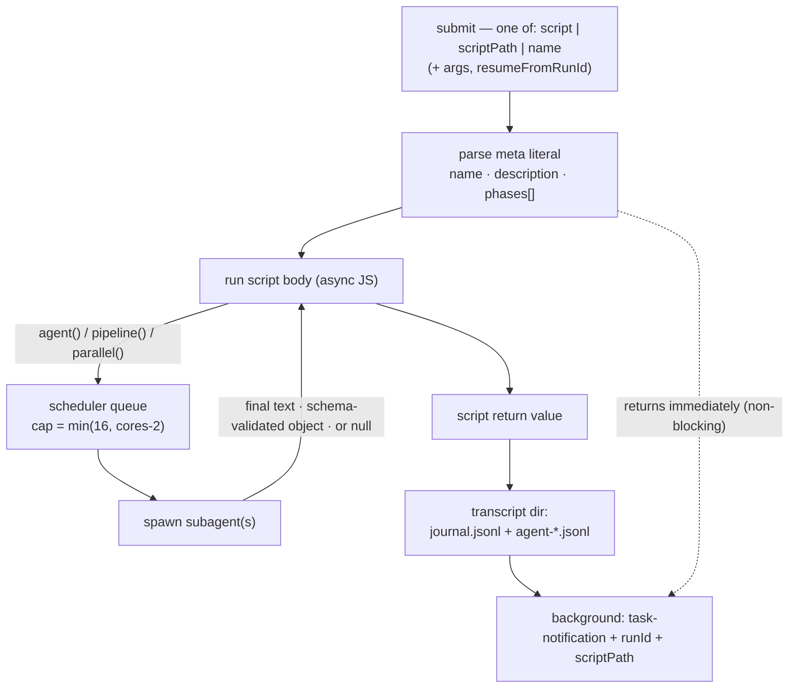
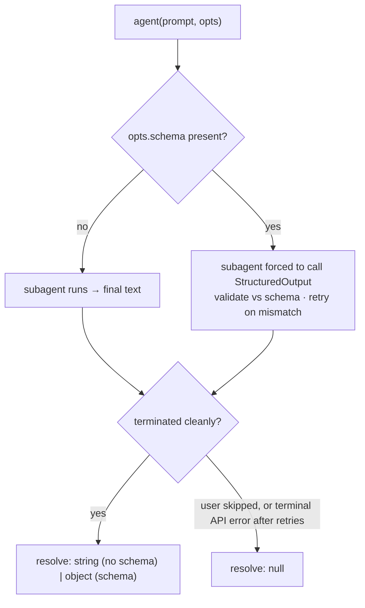
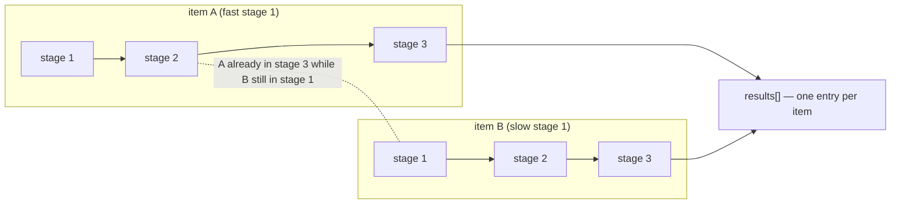
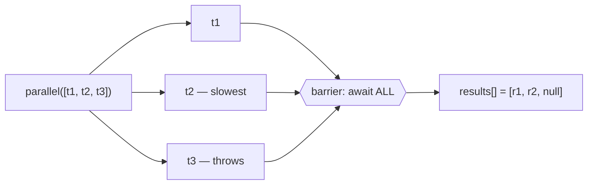
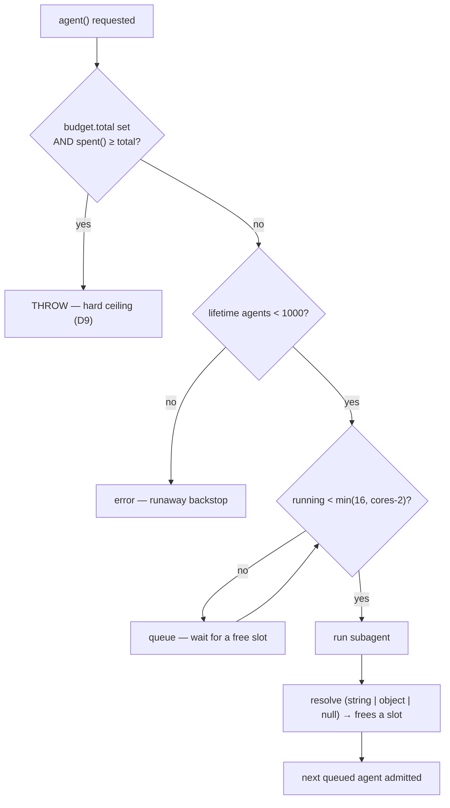
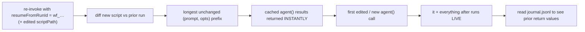

# The Workflow tool & its hooks — Design

> Classification: `feature` × `ai-agent` preset (structure + ai-components) + `ops` (failure-modes & limits only), `greenfield`.
> _(This line is A0 — correct it if the framing is wrong; everything below follows from it. This is a **reference** design: it documents an existing Claude Code harness tool rather than proposing a code change, so there is no annotated file tree and no brownfield seam classDef — all diagrams are plain because the whole surface is "the API.")_

**Problem.** The `Workflow` tool exposes a JavaScript orchestration surface — a `meta` header plus the hooks `agent` / `pipeline` / `parallel` / `phase` / `log` / `workflow` and the injected globals `args` / `budget` — that lets one turn fan out and coordinate many subagents deterministically. Today that contract lives scattered across the tool description; there is no single artifact an author can read top-to-bottom, reason about, and tune one hook's usage without re-deriving the rest. Authors reach for a barrier (`parallel`) where a `pipeline` was correct, forget that `agent()` resolves to `null` on failure, or trip the pure-literal `meta` rule — all avoidable with one addressable reference.
**Done when.** A developer can read this doc and correctly author a multi-stage workflow on the first try: the input/output schema, every hook's signature + return type + failure mode, the two globals, and the execution model (concurrency, caps, background completion, resume) are each documented with a runnable example script and a numbered walkthrough, and `python scripts/lint_doc.py` reports `OK`.

## Scope
- **In:** the `Workflow` tool's input schema and return value; the `meta` header contract; the six script-body hooks and two globals; the execution model (scheduler, concurrency/lifetime/per-call caps, token-budget ceiling, background completion + notification, resume/journal); example scripts + numbered walkthroughs.
- **Out:** _(locked)_ the internal implementation of the scheduler; the `ScheduleWakeup` / `/loop` dynamic-pacing mechanism (a **separate** tool — noted only to disambiguate); how individual subagents reason; the semantics of specific `agentType`s or MCP tools a subagent may call; anything about the `anthropic-agent` product in this repo.
- **Touches:** the `Workflow` tool surface only. No product code, no `agent_base/`, no interface specs. Adjacent tools an author uses alongside it — `TaskStop` (stop a run before resume), `/workflows` (live progress) — are referenced by name, not documented here.
- **Ordering:** none — a reference doc; sections are independently readable.
- **MVP cut:** the Overview flow + the Hook API interface sketch + one worked `pipeline` example. Everything else deepens coverage.
- **Failure / rollback:** the doc is wrong if an example doesn't match the tool's actual behavior. Rollback = correct the offending section; each fact is single-sourced so a fix never cascades.

## Gates
**Assumptions** _(resolve first in review — corrections cascade)_
- **A1** The concurrency cap is `min(16, cpu_cores - 2)` running agents per workflow; excess `agent()` calls **queue** rather than error. Stated by the tool contract; not independently measured on this host.
- **A2** The lifetime cap is **1000** total `agent()` calls per workflow and a single `parallel()`/`pipeline()` call accepts **≤ 4096** items (more is a hard error, not silent truncation).
- **A3** `budget.total` reflects a turn-level `+Nk`-style directive; the token pool is **shared** across the main loop and all workflows this turn, and the ceiling is **hard** (`agent()` throws once `spent() ≥ total`).
- **A4** Resume caches by unchanged `(prompt, opts)` per `agent()` call and is **same-session only**.

**Open questions**
- **OQ1** Is there any way to stream partial results out of a running workflow before it returns, or is the `task-notification` at completion the only signal beyond `/workflows`?
- **OQ2** When a `pipeline` stage throws and the item drops to `null`, is that drop surfaced in `journal.jsonl` distinctly from an `agent()` that itself resolved `null`?

## Overview

A `Workflow` invocation hands the harness a **script** (inline `script`, a `scriptPath` on disk, or a saved `name`) plus optional `args` and a `resumeFromRunId`. The script must open with a pure-literal `meta` header; the rest is ordinary async JavaScript whose only superpowers are the injected hooks. `agent()` spawns one subagent; `pipeline()` and `parallel()` spawn many under a fixed concurrency cap; `phase()` / `log()` narrate progress; `workflow()` runs another workflow inline. The tool **returns immediately** with a `runId`, the persisted `scriptPath`, and a transcript directory — the script runs in the **background** and fires a `task-notification` when it finishes. Whatever the script `return`s is the logical result, recorded to `journal.jsonl`.



1. **Submit** carries the script by one of three routes plus `args` (verbatim JSON) and an optional `resumeFromRunId`; `title`/`description` inputs are ignored — those come from `meta`.
2. The **`meta` literal** is parsed first; its `phases[]` seed the progress groups shown in `/workflows`.
3. The **body runs** as async JS. Every `agent()` (directly or via `pipeline`/`parallel`) enters the **scheduler queue**, which admits at most `min(16, cores-2)` at once; the rest wait for a slot.
4. Each subagent resolves back into the body as a **string**, a **schema-validated object**, or **`null`** (skip / terminal error).
5. The **return value** is journaled; per-agent transcripts land beside it in the transcript dir.
6. **Hook point:** the tool call itself returns at the dashed edge — right after accepting the script — so the caller gets `runId` + `scriptPath` immediately and is notified later on completion.

**Shaping decisions:**
- **D1** `pipeline()` runs stages with **no inter-stage barrier** — the default multi-stage primitive → Anatomy › Hook API › `pipeline`.
- **D2** `agent()` resolves to **`null`** on skip/terminal-error instead of throwing (only `budget` exhaustion throws) → Anatomy › Hook API › `agent`.
- **D3** `meta` must be a **pure literal** (no variables, calls, spreads, interpolation) → Anatomy › Submission surface.

## Execution walkthrough

Five worked scripts, simplest first, each isolating one execution behavior with a tick-by-tick timeline. Durations are illustrative wall-clock. **The one rule that governs all of it:** a workflow body is ordinary async JavaScript run top-to-bottom — `await X` **pauses the body** until `X` resolves (nothing textually after it has started yet), and `parallel()` / `pipeline()` are how you start many agents at once instead of one-at-a-time. Sequential vs. concurrent is entirely a consequence of *when you await*.

### 1. Two `await`s in a row → sequential

```javascript
export const meta = { name: 'seq-demo', description: 'Two awaited agents run one after another' }

const outline = await agent('Draft a 5-section outline for a post on Redis streams')  // ~20s
const draft   = await agent(`Write the intro for this outline:\n${outline}`)           // ~30s

return { outline, draft }
```

```
agent#1 outline  [====================]                                 (0-20s)
agent#2 draft                         [==============================]  (20-50s)
                 |--------------------- 50s wall ----------------------|
```

1. `t=0` — body starts, hits the first `await`; it spawns agent #1 and **pauses**. Line 2 has not run.
2. `t=0-20` — agent #1 runs alone.
3. `t=20` — #1 resolves, `outline` assigned; body resumes, hits the second `await`, and only **now** spawns agent #2 (its prompt embeds `outline`).
4. `t=20-50` — agent #2 runs alone; resolves, `draft` assigned, `return`.
5. **Notice:** wall-clock is 50s = 20 + 30. Sequential is correct *here* because #2 depends on `outline`. Independent work should not be written this way — use §2.

### 2. `parallel()` → concurrent + barrier

```javascript
export const meta = { name: 'par-demo', description: 'Summarize three files at once' }

const files = ['auth.ts', 'billing.ts', 'streaming.ts']
const summaries = await parallel(
  files.map(f => () => agent(`Summarize ${f} in 3 bullets`))   // note the thunks: () => ...
)
return { summaries }   // summaries[i] corresponds to files[i]; a failed one is null
```

Durations: auth 15s, billing 25s, streaming 10s.

```
auth       [===============]                      (0-15s)
billing    [=========================]            (0-25s)   <- slowest sets the barrier
streaming  [==========]                           (0-10s)
           |------------- 25s wall -------------|
```

1. `t=0` — body hits `await parallel([...])`; `parallel` invokes all three thunks now (3 <= cap, so all start). Body pauses at the **barrier**.
2. `t=0-25` — the three run concurrently.
3. The barrier holds the return until the **slowest** (billing) settles at `t=25`.
4. `t=25` — `summaries = [auth, billing, streaming]`, index-aligned to `files`; body resumes and returns.
5. **Notice:** wall-clock is 25s (the slowest), not 50. The `() => agent(...)` **thunks** matter — a thunk hasn't run yet, so the scheduler controls *when* each starts and can enforce the cap; passing already-started promises would defeat that.

### 3. `pipeline()` → concurrent + NO barrier (the crux)

Two PRs, each going review → verify, with the barrier alternative shown so the win is visible.

```javascript
export const meta = {
  name: 'pipe-demo', description: 'Review then verify each PR; stages do not wait across items',
  phases: [{ title: 'Review' }, { title: 'Verify' }],
}
const prs = ['PR-1', 'PR-2']
const out = await pipeline(
  prs,
  (pr)         => agent(`Review ${pr}`, { phase: 'Review' }),                        // stage 1
  (review, pr) => agent(`Verify review of ${pr}:\n${review}`, { phase: 'Verify' }),  // stage 2
)
return out
```

Durations: PR-1 review 10s / verify 25s; PR-2 review 30s / verify 5s.

```
PR-1 review [==========]                                 (0-10s)
PR-1 verify           [=========================]        (10-35s)  <- starts the instant PR-1 review ends
PR-2 review [==============================]             (0-30s)
PR-2 verify                               [=====]        (30-35s)
            |------------------ 35s wall -------------|
```

1. `t=0` — `pipeline` starts **stage 1 for both** items at once: PR-1 review (0-10), PR-2 review (0-30).
2. `t=10` — PR-1's review finishes, so PR-1 **immediately** enters stage 2 (verify, 10-35). It does not wait for PR-2.
3. `t=30` — PR-2's review finishes, PR-2 enters stage 2 (verify, 30-35).
4. `t=35` — both chains complete; `pipeline` returns `[PR-1 result, PR-2 result]`.

The **barrier alternative** (a `parallel` per stage — stage 2 can't begin until *every* stage-1 is done):

```
PR-1 review [==========]                                              (0-10s)
PR-2 review [==============================]                          (0-30s)
            <stage-1 barrier: wait for BOTH reviews -> t=30> -------- |
PR-1 verify                               [=========================] (30-55s)  <- idle from t=10 to t=30
PR-2 verify                               [=====]                     (30-35s)
            |-------------------------- 55s wall ---------------------|
```

1. The stage-1 barrier idles until **both** reviews finish at `t=30`.
2. Only then can stage 2 start, delaying PR-1's verify from `t=10` to `t=30` for no reason.
3. **Notice:** same agents, 35s vs 55s. `pipeline`'s wall-clock is the slowest single-item *chain* (PR-2: 30 + 5), not the sum of slowest-per-stage. Default to `pipeline`; reach for a `parallel` barrier only when a step needs the whole set at once (see D1).

### 4. More items than slots → the scheduler queues

The cap is real; extras wait rather than error. Cap is `min(16, cores-2)` — shown here as 4 to make queueing visible.

```javascript
export const meta = { name: 'cap-demo', description: '6 agents, 4 slots' }
const results = await parallel(
  [1, 2, 3, 4, 5, 6].map(i => () => agent(`Process unit ${i}`))   // each ~10s
)
return results
```

```
slot1  [ a1 =====][ a5 =====]
slot2  [ a2 =====][ a6 =====]
slot3  [ a3 =====]
slot4  [ a4 =====]
       0         10         20s
       (-wave 1-)(-wave 2-)
```

1. `t=0` — `parallel` wants all 6; only 4 slots, so agents 1-4 run (0-10) and 5-6 **queue**.
2. `t=10` — 1-4 finish, freeing 4 slots; 5-6 start (10-20) while the other two slots sit idle.
3. `t=20` — 5-6 finish, the barrier releases, `return`.
4. **Notice:** wall-clock is ~`ceil(N / cap) x per-agent` = `ceil(6/4) x 10` = 20s. You can pass up to 4096 items safely — only ~cap run at any instant (A1, A2).

### 5. Putting it together — a sequential gate then a fan-out

The real-world shape: scout inline first (a sequential step producing the work-list), then `pipeline` over it.

```javascript
export const meta = {
  name: 'triage-flaky', description: 'Find flaky tests, then diagnose + patch each',
  phases: [{ title: 'Scan' }, { title: 'Fix' }],
}

phase('Scan')
const scan = await agent('Grep CI logs; return flaky tests as {name,file}[]', { schema: FLAKY_SCHEMA })  // ~20s
log(`${scan.tests.length} flaky tests found`)

phase('Fix')
const fixes = await pipeline(
  scan.tests,                                                                                    // the work-list
  (t)       => agent(`Diagnose why ${t.name} is flaky`, { phase: 'Fix', schema: DIAG_SCHEMA }),  // stage 1
  (diag, t) => agent(`Propose a patch for ${t.name}. Cause: ${diag.cause}`, { phase: 'Fix' }),   // stage 2
)
return { found: scan.tests.length, fixes: fixes.filter(Boolean) }
```

1. `t=0` — `phase('Scan')` opens the Scan group; the `await` on the scan agent **pauses the body**, so the fan-out cannot start yet — it depends on `scan.tests`. This is a deliberate sequential gate.
2. `t=20` — scan resolves as a validated object (thanks to `schema`, no parsing); `log(...)` prints the count; `phase('Fix')` opens the next group.
3. `t=20+` — `pipeline` starts stage-1 diagnose for all tests at once (<= cap); each test then flows independently into stage 2 the moment its own diagnosis lands (no barrier, per §3).
4. `pipeline` returns when the slowest test's diagnose→patch chain finishes; `.filter(Boolean)` drops any test whose agent failed (`null`); `return` journals the value and fires the completion notification.
5. **Notice:** one sequential dependency (scan before fix) wrapping a no-barrier fan-out (the fix stage) — the backbone of most real workflows.

### Recap — hook to execution behavior

| Construct | When work starts | Concurrent? | Waits for others? |
|---|---|---|---|
| `await agent(...)` | at the `await` | no — one agent | body pauses on just this one |
| `await agent(...)` then `await agent(...)` | second only after first resolves | **sequential** | yes — use only for real dependencies |
| `parallel(thunks)` | all thunks at once (<= cap) | **yes** | **barrier** — returns when all done |
| `pipeline(items, ...stages)` | all items' stage 1 at once (<= cap) | **yes** | **no barrier** — each item flows independently |
| scheduler | <= `min(16, cores-2)` at a time | — | extras **queue** silently |

## Anatomy

### Submission surface

The tool inputs, as a contract (pass exactly one of `script` / `scriptPath` / `name`):

```typescript
Workflow({
  script?:          string,   // inline; MUST begin `export const meta = {…}`; ≤ 512 KB
  scriptPath?:      string,   // path on disk; TAKES PRECEDENCE over script and name
  name?:            string,   // a saved workflow (built-in or .claude/workflows/)
  args?:            any,      // exposed to the script as global `args`, VERBATIM (real JSON)
  resumeFromRunId?: string,   // ^wf_[a-z0-9-]{6,}$ ; resume a prior run in this session
  title?:  string,            // IGNORED — set in meta
  description?: string,       // IGNORED — set in meta
}) -> { runId: "wf_…", scriptPath: "…", /* + transcript dir */ }
```

The **`meta` header** every script must open with:

```javascript
export const meta = {
  name: 'find-flaky-tests',                    // required
  description: 'Find flaky tests and fix',     // required — shown in the permission dialog
  whenToUse: 'when CI is flaky',               // optional — shown in the workflow list
  phases: [                                    // optional — one entry per phase() call
    { title: 'Scan', detail: 'grep CI logs for retries' },
    { title: 'Fix',  detail: 'one agent per flaky test', model: 'sonnet' },
  ],
}
// script body starts here — use the hooks below
```

`meta.phases[].title` is matched **exactly** to `phase()` calls; a `phase()` with no matching entry simply gets its own progress group. Add `model` to a phase entry when that phase pins a model.

#### D3 — `meta` must be a pure literal
- **Touches:** every script's first statement; the permission dialog and `/workflows` list that render `meta` before the body runs.
- **Chosen:** `meta` is a literal object — no variables, function calls, spreads, or template interpolation in any field.
- **Rejected:** allowing computed `meta` — the harness reads `meta` **before executing the body** (to show the permission prompt and seed phases), so computed fields would be unavailable at read time.
- **Consequence:** phase titles must be duplicated verbatim between `meta.phases` and `phase()` calls; there is no DRY way to share them.

#### D4 — `scriptPath` precedence, and the persisted-script iteration loop
- **Touches:** `script`, `scriptPath`, `name` inputs; the returned `scriptPath`.
- **Chosen:** `scriptPath` > `script` > `name`. Every invocation **persists** its inline `script` to a file under the session dir and returns that path.
- **Rejected:** re-sending the full inline `script` on every edit — wastes tokens and loses the run's identity.
- **Consequence:** to iterate, `Edit` the returned `scriptPath` file and re-invoke with `{scriptPath}`; combine with `resumeFromRunId` to re-run only what changed (D7).

### Hook API

The globals available inside the script body. Signatures first (interface-first sketch; types are illustrative — the script itself is plain JS):

```typescript
// ── spawning ──────────────────────────────────────────────────────────────
agent(prompt: string, opts?: AgentOpts): Promise<string | T | null>
  // no opts.schema → resolves to the subagent's final TEXT (string)
  // opts.schema    → resolves to a VALIDATED object (T)
  // null           → user skipped, or terminal API error after retries

// ── fan-out ───────────────────────────────────────────────────────────────
pipeline(items: I[], ...stages: Stage[]): Promise<any[]>
  // each item flows through ALL stages independently — NO barrier between stages
  // stage signature: (prevResult, originalItem, index) => Promise<any>
  // a stage that throws → that item becomes null, remaining stages skipped

parallel(thunks: Array<() => Promise<any>>): Promise<any[]>
  // BARRIER: awaits all; a throwing thunk resolves to null (call never rejects)

// ── composition & progress ────────────────────────────────────────────────
workflow(ref: string | { scriptPath: string }, args?: any): Promise<any>
  // run another workflow inline; ONE level of nesting only
phase(title: string): void        // start a progress group
log(message: string): void        // narrator line above the progress tree

// ── injected values ───────────────────────────────────────────────────────
args:   any                                     // Workflow's `args` input, verbatim
budget: { total: number|null, spent(): number, remaining(): number }

type AgentOpts = {
  label?: string; phase?: string; schema?: object;
  model?: string; effort?: 'low'|'medium'|'high'|'xhigh'|'max';
  isolation?: 'worktree'; agentType?: string;
}
```

Pick the fan-out primitive by what the next stage needs — this is the single most consequential choice for wall-clock:

| Primitive | Barrier? | Use when | Wall-clock |
|---|---|---|---|
| `pipeline(items, …stages)` | **No** — item A can be in stage 3 while B is in stage 1 | Multi-stage per-item work with no cross-item dependency (**the default**) | slowest single-item **chain** |
| `parallel(thunks)` | **Yes** — awaits all before returning | You genuinely need **all** prior results together (dedup/merge, early-exit on zero, cross-item comparison) | slowest single **thunk** |
| `agent(prompt, opts)` | n/a — one subagent | A single unit of work | that agent |

> The engine defaults to `pipeline`. Reach for `parallel` only when a stage's prompt references "the other findings," or you must dedup/merge/early-exit across the **whole** set before spending on the next stage.

---

#### `agent()` — the subagent primitive (four-part card)

**1 — Contract.** `agent(prompt: string, opts?: AgentOpts): Promise<string | T | null>`. The subagent is told its **final text IS the return value** (not a human message), so it returns raw data. Workflow agents can reach all session-connected MCP tools via `ToolSearch` (schemas load on demand per agent).

**2 — Behavior params (`opts`).** Configs that change what/how, invisible in the signature:

| Option | Default | Effect |
|---|---|---|
| `label` | auto | Display label in the `/workflows` progress tree |
| `phase` | current `phase()` | Assigns this agent to a progress group **explicitly** — use inside `pipeline`/`parallel` stages to avoid racing the global `phase()` state |
| `schema` | none | JSON Schema → forces a `StructuredOutput` tool call; return is validated (D5) |
| `model` | inherit session model | Model override — **omit unless highly confident** (D6) |
| `effort` | inherit session effort | `'low'…'max'` reasoning effort; `'low'` for cheap mechanical stages, higher only for hardest verify/judge |
| `isolation` | none | `'worktree'` runs the agent in a fresh git worktree — **expensive**; only when agents mutate files in parallel and would conflict |
| `agentType` | default workflow subagent | Use a custom subagent type (e.g. `'general-purpose'`, `'code-reviewer'`); composes with `schema` |

**3 — Internal resolution.** How one `agent()` call resolves:



1. With **no `schema`**, the subagent runs and its final text becomes the resolved **string**.
2. With a **`schema`**, the subagent is forced to emit through a `StructuredOutput` tool; validation happens at the tool-call layer, so the model **retries on mismatch** — the resolved value is a ready-to-use **object**, no parsing.
3. Either way, a **clean termination** resolves to that value.
4. A **skip or a terminal API error** (after retries) resolves to **`null`** — never a throw (D2). Filter with `.filter(Boolean)` before use.

**4 — Sample results (three scenarios).**
```javascript
// normal, no schema → a string
const summary = await agent('Summarize src/auth in 3 bullets')
// → "- OAuth2 PKCE flow\n- JWT 15-min TTL\n- refresh in Redis"
```
```javascript
// schema → a validated object
const r = await agent('List failing tests as {file, name}[]', { schema: FAILING_SCHEMA })
// → { tests: [ { file: "test_auth.py", name: "test_expiry" } ] }
```
```javascript
// failure → null (NOT a throw)
const maybe = await agent('…', { model: 'opus' })
// → null   (user skipped it, or it died on a terminal API error after retries)
```

#### D2 — `agent()` resolves to `null` on failure, never throws
- **Touches:** every `agent()` call site; `parallel`/`pipeline` result arrays.
- **Chosen:** skip / terminal-error → `null`. The **only** thing that throws from spawning is `budget` exhaustion (D9).
- **Rejected:** throwing on agent failure — one dead agent would reject an entire `parallel()` and lose the survivors' results.
- **Consequence:** results are `(T | null)[]`; authors must `.filter(Boolean)` (and `parallel`/`pipeline` never reject for agent reasons — see each hook).

#### D5 — `schema` forces `StructuredOutput`, validated at the tool-call layer
- **Touches:** `agent()` with `opts.schema`; downstream code consuming the object.
- **Chosen:** a schema turns the return into a validated object; the model retries until it conforms.
- **Rejected:** returning text and having the script `JSON.parse` it — parse failures would surface as script crashes, and the model wouldn't get a retry.
- **Consequence:** schema'd agents cost a little more (retries) but never hand back malformed data.

#### D6 — `model` / `effort` default to inherit (omit them)
- **Touches:** `opts.model`, `opts.effort` on every `agent()`.
- **Chosen:** omit by default — the agent inherits the resolved session model and effort, which is almost always correct.
- **Rejected:** pinning a model per call as a habit — couples the workflow to a tier and usually mis-sizes it.
- **Consequence:** set `model`/`effort` only for a specific, justified reason (`'low'` on mechanical stages; a higher tier on the hardest verify/judge). When unsure, omit.

---

#### `pipeline()` — staged fan-out, no barrier

`pipeline(items, stage1, stage2, …): Promise<any[]>`. Each item flows through **all** stages independently; there is **no barrier** between stages, so wall-clock is the slowest single-item *chain*, not the sum of slowest-per-stage. Every stage callback receives `(prevResult, originalItem, index)` — use `originalItem`/`index` in later stages to label work without threading context through stage 1's return. A stage that **throws** drops that item to `null` and skips its remaining stages.



1. Item **A** clears stage 1 quickly and immediately proceeds to stages 2→3 — it does **not** wait for B.
2. Item **B**'s slow stage 1 delays only **B**; A is already in stage 3 (dashed edge).
3. Both land in `results[]` positionally (index-aligned to `items`); a stage throw would place `null` at that item's slot.
4. Net effect: no fast item is held hostage by a slow peer at a stage boundary — the win a barrier throws away.

```javascript
export const meta = {
  name: 'review-changes',
  description: 'Review changed files across dimensions, verify each finding',
  phases: [{ title: 'Review' }, { title: 'Verify' }],
}
const DIMENSIONS = [{ key: 'bugs', prompt: '…' }, { key: 'perf', prompt: '…' }]
const results = await pipeline(
  DIMENSIONS,
  // stage 1: review this dimension
  d => agent(d.prompt, { label: `review:${d.key}`, phase: 'Review', schema: FINDINGS_SCHEMA }),
  // stage 2: verify each finding as soon as THIS dimension's review lands
  (review, d) => parallel((review?.findings ?? []).map(f => () =>
    agent(`Adversarially verify: ${f.title}`, { label: `verify:${d.key}`, phase: 'Verify', schema: VERDICT_SCHEMA })
      .then(v => ({ ...f, verdict: v }))
  )),
)
return { confirmed: results.flat().filter(Boolean).filter(f => f.verdict?.isReal) }
```

1. `DIMENSIONS` are the pipeline items; stage 1 reviews each dimension, stage 2 verifies its findings.
2. Because there's no barrier (D1), the `bugs` dimension's findings **verify while `perf` is still reviewing** — no wasted wall-clock.
3. Stage 2 uses `originalItem` (`d`) to label verify agents per dimension, and assigns `phase:'Verify'` explicitly so the group is correct even though stages interleave.
4. `results.flat().filter(Boolean)` drops any `null` (a thrown stage or skipped agent) before the final predicate.

#### D1 — `pipeline()` has no inter-stage barrier
- **Touches:** `pipeline()`; any multi-stage fan-out.
- **Chosen:** stages advance per item; no synchronization between items at stage boundaries.
- **Rejected:** barrier-between-stages as the default (i.e. `parallel` per stage) — wastes the fast items' idle time whenever stage durations vary across items.
- **Consequence:** stages must not assume they can see other items' prior-stage results. When a stage genuinely needs the whole set, step out to an explicit `parallel()` barrier (below) for that step only.

---

#### `parallel()` — barrier fan-out

`parallel(thunks: Array<() => Promise<any>>): Promise<any[]>`. Runs all thunks concurrently and **awaits every one** before returning (a barrier). A thunk that throws — or whose `agent()` errors — resolves to **`null`**; the call itself **never rejects**. Use only when you need all results at once.



1. All three thunks start together, capped by the scheduler (§ Execution model).
2. The **barrier** holds the return until the **slowest** thunk (`t2`) settles — total time is that slowest thunk, not the sum.
3. `t3` throws, so its slot is **`null`**; the call does not reject, so `t1`/`t2` results survive.
4. Consume with `.filter(Boolean)`; a barrier is justified here only because the next step needs the full set.

```javascript
// Barrier IS correct: dedup across ALL findings before expensive verification
const all = await parallel(DIMENSIONS.map(d => () => agent(d.prompt, { schema: FINDINGS_SCHEMA })))
const deduped = dedupeByFileAndLine(all.filter(Boolean).flatMap(r => r.findings))  // needs everything at once
const verified = await parallel(deduped.map(f => () => agent(verifyPrompt(f), { schema: VERDICT_SCHEMA })))
```

1. The first `parallel` collects **every** dimension's findings — a genuine barrier, because dedup can't run until all are in.
2. `dedupeByFileAndLine` is plain JS between the two barriers — no agent needed for a pure transform.
3. The second `parallel` verifies the deduped set; each `null` (failed verify) is filtered by the caller.

---

#### `phase()` and `log()` — progress narration

`phase(title): void` starts a progress group; subsequent `agent()` calls group under it (match `meta.phases` titles). `log(message): void` emits a narrator line above the progress tree. Inside `pipeline`/`parallel`, prefer the per-agent `phase:` **option** over the global `phase()` — concurrent stages otherwise race the global state.

```javascript
phase('Scan')
const flaky = await agent('grep CI logs for retry markers', { schema: FLAKY_SCHEMA })
log(`${flaky.tests.length} flaky tests found`)
phase('Fix')
await parallel(flaky.tests.map(t => () =>
  agent(`Fix flaky test ${t.name}`, { phase: 'Fix' })))   // explicit phase inside parallel
```

1. `phase('Scan')` opens the first group; the scan agent renders under it.
2. `log(...)` surfaces a human-readable count to the user without affecting control flow.
3. `phase('Fix')` opens the next group; the `parallel` fixers pass `phase:'Fix'` explicitly so all land in the right group despite running concurrently.

---

#### `workflow()` — inline composition

`workflow(nameOrRef, args?): Promise<any>` runs another workflow inline and returns its result. Pass a saved `name` or `{ scriptPath }`. The child **shares** this run's concurrency cap, agent counter, abort signal, and token budget; its agents appear under a `▸ name` group and its tokens count toward `budget.spent()`. It **throws** on unknown name / unreadable path / child syntax error.

```javascript
const files = await agent('List changed .ts files as string[]', { schema: FILES_SCHEMA })   // scout inline first
const review = await workflow('review-changes', files.paths)                                 // then delegate
return review
```

1. Scout cheaply in the parent to discover the work-list (`files.paths`).
2. Hand it to a saved child workflow via `args`; the child's `args` global receives `files.paths` verbatim.
3. The child's result flows straight back; its agents and tokens are accounted under this run.

#### D8 — `workflow()` nesting is one level only
- **Touches:** `workflow()` inside any script.
- **Chosen:** a child workflow may **not** call `workflow()` — nesting is one level deep.
- **Rejected:** arbitrary recursion — unbounded fan-out that's hard to budget and reason about.
- **Consequence:** compose by having the **parent** sequence multiple children, not by deep nesting; a `workflow()` inside a child throws.

### Execution model

The scheduler, caps, background completion, and per-hook failure semantics — the operational envelope (ops vertical).



1. Each requested agent first checks the **token ceiling**: if a `budget.total` is set and already spent, the call **throws** (D9) — the one throwing failure mode.
2. It then checks the **lifetime cap** (A2): beyond 1000 agents in a run, the backstop trips (a runaway guard set far above any real workflow).
3. It checks the **concurrency cap** (A1): if `min(16, cores-2)` are already running, it **queues**; otherwise it runs.
4. On resolution the slot frees and the next queued agent is admitted — so passing 100 items to `pipeline`/`parallel` is fine; only ~cap run at any instant.

**Failure modes** — one row per credible failure and exactly what the author sees:

| Failure | Surfaces as | Detection | Handling |
|---|---|---|---|
| Subagent skipped / terminal API error | that call resolves **`null`** | `null` in the result array | `.filter(Boolean)` (D2) |
| `pipeline` stage throws | that **item** → `null`, later stages skipped | `null` at the item's slot | `.filter(Boolean)` after `.flat()` |
| `parallel` thunk throws | that **slot** → `null`; call does **not** reject | `null` in the array | `.filter(Boolean)` |
| `budget.total` reached | next `agent()` **throws** | try/catch, or guard the loop on `budget.remaining()` | stop spawning; return partial (D9) |
| Lifetime cap (>1000 agents) | run errors | run halts | restructure — you almost never need this many |
| `workflow()` bad ref / child syntax error | **throws** | try/catch around `workflow()` | catch to degrade gracefully (D8) |
| `Date.now()` / `Math.random()` / argless `new Date()` | **throws** at call | script crash | pass time via `args`; vary by `index` (D11) |

**Limits & envelope** — the knobs and their bounds:

| Driver | Bound | Note |
|---|---|---|
| Concurrent agents | `min(16, cores-2)` | excess queues; not an error (A1) |
| Total agents / run | 1000 | runaway backstop, far above real use (A2) |
| Items per `parallel`/`pipeline` call | ≤ 4096 | more is a hard error, not truncation (A2) |
| `workflow()` nesting | 1 level | child `workflow()` throws (D8) |
| Token budget | `budget.total` (or `null`) | hard, shared ceiling; `remaining()` is `Infinity` when `total` is `null` (D9) |

#### D9 — `budget` is a hard, shared ceiling
- **Touches:** `budget.total` / `spent()` / `remaining()`; every `agent()` under a budget.
- **Chosen:** the turn's `+Nk` target is a **hard** cap — `agent()` throws once `spent() ≥ total` — and the pool is **shared** across the main loop and all workflows this turn.
- **Rejected:** advisory-only budgeting — would let a fan-out blow far past the user's target.
- **Consequence:** dynamic loops must **guard on `budget.total`** (`while (budget.total && budget.remaining() > 50_000)`), because with no target `remaining()` is `Infinity` and the loop would run to the 1000-agent cap.

#### D10 — fixed concurrency, lifetime, and per-call caps
- **Touches:** `agent()` scheduling; `parallel`/`pipeline` sizing.
- **Chosen:** cap concurrency at `min(16, cores-2)`, lifetime at 1000 agents, and per fan-out call at ≤ 4096 items.
- **Rejected:** unbounded concurrency — would swamp the host and rate limits.
- **Consequence:** authors pass large item lists freely (they queue), but must not assume all run at once; timing-sensitive designs should account for the queue.

## Behavior

Two flows that compose the hooks: **resume** (how re-invocation reuses prior work) and a **loop-until-budget** accumulation.

### Resume — re-run only what changed



1. Stop the prior run first (`TaskStop`), edit the persisted `scriptPath`, then re-invoke with `resumeFromRunId`.
2. The harness diffs the new script against the prior run and finds the **longest unchanged prefix** of `agent()` calls by `(prompt, opts)`.
3. Every call in that prefix returns its **cached** result instantly — same script + same `args` → 100% cache hit.
4. The **first edited or new** call, and everything after it, runs **live**; consult `journal.jsonl` to see what cached calls actually returned before assuming they were non-empty.

#### D7 — resume caches the unchanged `(prompt, opts)` prefix
- **Touches:** `resumeFromRunId`; iterating on a script via its persisted `scriptPath` (D4).
- **Chosen:** cache by unchanged leading `agent()` calls; same-session only.
- **Rejected:** re-running everything on every edit — throws away expensive completed work when you tweak a late stage.
- **Consequence:** ordering matters — an early edit invalidates the whole tail; put stable, expensive stages first when you expect to iterate on later ones.

### Loop-until-budget — scale depth to the directive

```javascript
export const meta = { name: 'hunt-bugs', description: 'Find bugs until the token budget runs low' }
const bugs = []
while (budget.total && budget.remaining() > 50_000) {          // guard on budget.total (D9)
  const round = await agent('Find bugs in this codebase.', { schema: BUGS_SCHEMA })
  bugs.push(...round.bugs)
  log(`${bugs.length} found, ${Math.round(budget.remaining() / 1000)}k remaining`)
}
return { bugs }
```

1. The loop runs only when a **target was set** (`budget.total` non-null) — otherwise `remaining()` is `Infinity` and it would run to the agent cap.
2. Each round spawns one schema'd finder and accumulates results; `log` narrates progress and remaining budget.
3. It stops once fewer than 50k tokens remain, leaving headroom, and returns the partial-but-safe accumulation.

## Tailing decisions

#### D11 — `Date.now()` / `Math.random()` / argless `new Date()` are unavailable
- **Touches:** any script reaching for wall-clock time or randomness.
- **Chosen:** these throw inside a workflow script; standard JS built-ins (`JSON`, `Math`, `Array`, …) otherwise work.
- **Rejected:** allowing them — they would break resume's deterministic replay (D7), since a cached prefix must reproduce identically.
- **Consequence:** pass timestamps in via `args` and stamp results **after** the workflow returns; for variation, key off the agent `index`/label rather than randomness.

## Decision index
| ID | Decision | Where |
| --- | --- | --- |
| D1 | `pipeline()` has no inter-stage barrier | Anatomy › Hook API › `pipeline` |
| D2 | `agent()` resolves to `null` on failure, never throws | Anatomy › Hook API › `agent` |
| D3 | `meta` must be a pure literal | Anatomy › Submission surface |
| D4 | `scriptPath` precedence + persisted-script iteration | Anatomy › Submission surface |
| D5 | `schema` forces `StructuredOutput`, validated at tool-call layer | Anatomy › Hook API › `agent` |
| D6 | `model`/`effort` default to inherit (omit) | Anatomy › Hook API › `agent` |
| D7 | resume caches the unchanged `(prompt, opts)` prefix | Behavior › Resume |
| D8 | `workflow()` nesting is one level only | Anatomy › Hook API › `workflow` |
| D9 | `budget` is a hard, shared ceiling | Anatomy › Execution model |
| D10 | fixed concurrency / lifetime / per-call caps | Anatomy › Execution model |
| D11 | `Date.now`/`Math.random`/`new Date()` unavailable | Tailing decisions |

## Coupling notes

- **Prompts ↔ schemas (ai-components):** an `agent()`'s `prompt` and its `opts.schema` are coupled — a schema change usually forces prompt wording to match, and a schema'd agent's retries hinge on the prompt describing the shape. Review them together.
- **`meta.phases` ↔ `phase()` titles:** matched by exact string (D3); renaming one without the other silently splits a progress group. Review as a pair.
- **Fan-out choice ↔ failure handling:** `pipeline`/`parallel` both emit `null` slots (D2); the primitive choice (D1) and the `.filter(Boolean)` that follows are one decision — never consume a result array without it.
- **`budget` guard ↔ loop shape (D9):** any `while`/accumulator loop is coupled to the `budget.total` guard; a loop without it is a latent runaway.

## How to review this
```
Annotate inline by exact name or D#/A#/OQ#/I#. Use a verb + your *reasoning*, not a
bare instruction — "[D5] DISAGREE: reads are tenant-scoped, so scatter-gather on
entity_id will hurt" or "[EntityReconciler] TIGHTEN: the retry path is vague" lets
me pick the right fix and catch second-order effects; "[D5] use tenant_id" just
makes me a typist and throws away the part that catches your mistakes.
Verbs: AGREE · DISAGREE · CLARIFY · WRONG · TIGHTEN · ANSWER (for OQs).

When you hand this back I'll: resolve A#/OQ# first (they cascade), then work D# and
edits top to bottom; apply what I agree with and note the new consequence; push back
with reasoning on anything I think is wrong and leave it unchanged until you confirm.
```
