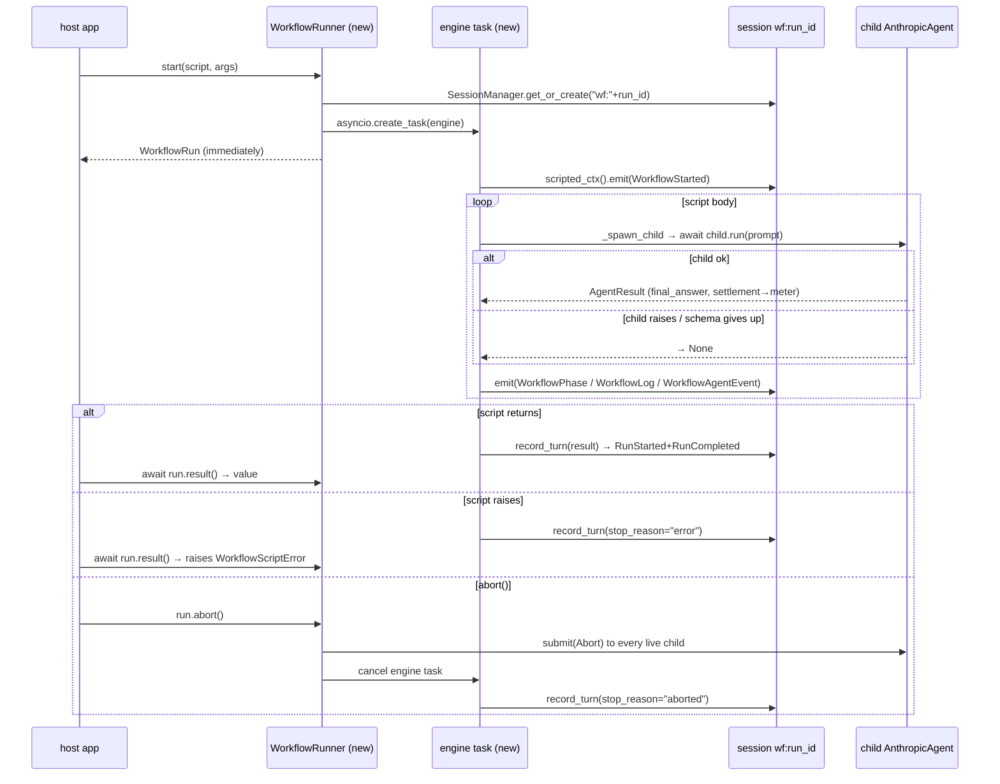

# agent-base workflows — Design

> Classification: `feature` × `ai-agent` preset (structure + ai-components) + `ops` (the run supervisor's caps & failure envelope are a distinct reviewer concern), `brownfield`.
> _(This line is A0 — correct it if the framing is wrong; everything below follows from it. Structure mirrors [workflow-tool.md](workflow-tool.md), which documents the Claude Code original this replicates; that doc is the parity reference, this one is the build plan.)_

**Problem.** agent-base can spawn sub-agents (`SubAgentTool`) but has no orchestration layer: anything shaped like "fan out N agents, stage the results, watch progress, observe spend" is hand-written per consumer (nova's `financial_statements` workflow is exactly this, re-derived by hand). The Claude Code `Workflow` tool proved the right surface — a script calling `agent` / `parallel` / `pipeline` / `phase` / `log` hooks under caps and a budget — and we want that surface as a first-class agent-base subsystem instead of per-app scaffolding.
**Done when.** A consumer can register an `async def` script, call `WorkflowRunner.start(script, args)`, get a `WorkflowRun` back immediately, watch typed progress frames on the run's own session stream, `await run.result()` for the script's return value, and `run.abort()` cleanly — with concurrency/lifetime caps enforced and advisory spend visible via `BudgetMeter` — all landed with `interface_plan/subsystems/workflows.md` + `tests/interface/workflows/` + an AMENDMENTS.md entry in the same cut, and both this suite and nova_backend's green.

## Scope
- **In:** a new additive subpackage `agent_base/workflows/` — `WorkflowMeta` + `@workflow` decorator, `WorkflowHooks` (the script-facing API: `agent`, `parallel`, `pipeline`, `phase`, `log`, `workflow`, plus `args`/`budget`), `WorkflowRunner`/`WorkflowRun` (dedicated-session run supervisor), `BudgetMeter` (advisory), registered progress `MetaBody` frames, and the `schema_guard` validate-and-steer hook.
- **Out:** _(locked, from the interview decisions plus consequences)_ the sandboxed script substrate (`LocalPythonExecutor`/AST evaluator — Rung 2 behind the same hook protocol); **any** hard budget enforcement; the journal, `workflow_runs`/`workflow_journal` tables, and `resumeFromRunId` (nothing persists a run in v1, so no `LIBRARY_SCHEMA_VERSION` bump and no nondeterminism ban — scripts may freely use `time`/`random`); an LLM-callable Workflow *tool* (exposing `start`/`status` as a model-facing tool is a consumer build; the library ships only the programmatic surface plus D11's text intake); `opts.effort` and `isolation: worktree` analogs; per-run stream replay/fan-out (Rung-2 streaming territory).
- **Touches:** `agent_base/workflows/` [new] only. Consumes public seams as-is: `SessionManager`, `AgentRuntime` (`scripted_ctx`, `record_turn`, `on_usage_report`, `submit(Abort)`), `AnthropicAgent` construction, `SubAgentSpec`, `register_meta_body`, `TurnSettlement`/`Usage`. **Zero modifications to core** — child stream routing reuses the library-internal `_stream_queue` seam (D7), same-package precedent as `SubAgentTool`.
- **Ordering:** the living-spec triple (subsystem doc, `tests/interface/workflows/`, AMENDMENTS entry) ships in the same cut as the code; nova_backend is unaffected until it adopts (purely additive surface).
- **MVP cut:** `WorkflowHooks.agent` + `parallel` + `WorkflowRunner.start/result` on a dedicated session with `WorkflowLog` frames. `pipeline`, `schema_guard`, `BudgetMeter`, `abort` complete v1.
- **Failure / rollback:** additive subpackage — rollback is deleting it; no schema, no core diffs, no consumer breakage. The risk shipped wrong is behavioral (a cap or abort bug strands child agents), covered by the failure-modes table.

## Gates
**Assumptions** _(resolve first in review — corrections cascade)_
- **A1** Children can be constructed and driven **programmatically** (fresh `AnthropicAgent(...)` + `await child.run(prompt)`) without going through `SubAgentTool` — the tool is LLM-dispatch sugar, not a required spawn path.
- **A3** `record_turn` (no settlement, B6) is the correct terminal write for the orchestrator session — a workflow's own bookkeeping turn is free; all real spend settles on the children.

**Resolved in review (2026-07-18)**
- **A2** Resolved — routing child frames via `child._stream_queue` ([sub_agent_tool.py:421](../../agent_base/common_tools/sub_agent_tool.py#L421)) is a legitimate **library-internal** seam: `workflows/` ships inside agent_base, same-package precedent as `SubAgentTool`. Mechanism recorded in D7; promotion to a public kwarg stays available later.
- **A4** Resolved — advisory `BudgetMeter` confirmed sufficient: nova enforces credits at its own layer, so the meter never needs to throw. D3 stands; no deferred-enforcement note wanted.
- **OQ1** Resolved → D11: script intake accepts callables, registry names, **and raw source text**; trust is documented, not gated.
- **OQ2** Resolved → `max_concurrent_agents` defaults to **8** (D10).

**Open questions**
- _None open — both OQs resolved above._

## Overview

A workflow is a **trusted `async def` Python coroutine** decorated with `@workflow(...)`, receiving `(wf: WorkflowHooks, args)`. `WorkflowRunner.start(script, args)` mints a run_id, materializes a **dedicated session** (`wf:<run_id>`) whose runtime is the run's emit surface and transcript home, and launches the script as a supervised asyncio task — returning a `WorkflowRun` handle immediately. Inside the script, `wf.agent(...)` builds a fresh `AnthropicAgent` per call (from an optional `SubAgentSpec` preset), runs it under one shared `asyncio.Semaphore`, and resolves to the final answer, a schema-validated dict, or `None` on failure. `wf.parallel` / `wf.pipeline` reproduce the Claude Code barrier / no-barrier fan-out semantics as thin asyncio combinators. Progress rides the workflow session's stream as registered `MetaBody` frames; completion is the session's terminal `RunCompleted` plus the in-process `await run.result()`.

```mermaid
flowchart TD
    classDef new fill:#1f6feb,color:#fff;
    classDef existing stroke-dasharray:4 4,opacity:0.7;

    Consumer[consumer / host app]:::existing
    Runner[WorkflowRunner.start]:::new
    Run[WorkflowRun<br/>run_id · result() · abort()]:::new
    Sess["dedicated session wf:&lt;run_id&gt;<br/>(orchestrator AgentRuntime)"]:::new
    Engine[engine task<br/>script coroutine + WorkflowHooks]:::new
    Sem[asyncio.Semaphore<br/>max_concurrent_agents]:::new
    Child1[AnthropicAgent per agent() call]:::existing
    Meter[BudgetMeter<br/>advisory Usage fold]:::new
    Stream[session stream<br/>WorkflowPhase / WorkflowLog / RunCompleted]:::existing

    Consumer -->|"start(script, args)"| Runner
    Runner -->|returns immediately| Run
    Runner --> Sess
    Runner --> Engine
    Engine -->|"wf.agent(...)"| Sem --> Child1
    Child1 -->|"final_answer · dict · None"| Engine
    Child1 -.->|on_usage_report: TurnSettlement| Meter
    Engine -->|"phase()/log() via scripted_ctx"| Stream
    Engine -->|"return value → record_turn"| Sess
    Sess -->|terminal RunCompleted| Stream
    Consumer -->|"await run.result()"| Run
```

1. `WorkflowRunner.start` returns the `WorkflowRun` handle **before** any child runs — the Claude Code "returns runId immediately" shape, with `await run.result()` playing the completion notification.
2. The dedicated session exists so the run owns its stream: progress frames and the terminal `RunCompleted` never collide with a chat turn's (the frames-after-`RunCompleted` trap that rules out running inside a normal turn).
3. Every `wf.agent(...)` call passes through the **one** semaphore — `parallel`, `pipeline`, and nested `wf.workflow(...)` all share it, so the cap is global to the run.
4. Each child's `TurnSettlement` reaches `BudgetMeter` via `on_usage_report` registered **at construction** (build-time-only propagation, GF-P7G1) — the meter observes, never enforces (D3).
5. The script's return value is written as the orchestrator's single `record_turn` (**A3**), whose `RunCompleted` closes the stream contract.
6. **Hook point:** everything blue is new; every dashed node is today's library, consumed through existing seams — the one library-internal seam is `_stream_queue` (D7).

**Shaping decisions:**
- **D1** Trusted `async def` substrate — the AST evaluator is explicitly rejected for v1 → Anatomy › Public surface.
- **D2** One dedicated session per run; the whole script is one logical turn → Anatomy › Runner.
- **D3** Budget is **advisory only** — `BudgetMeter` observes, nothing throws → Anatomy › BudgetMeter.
- **D4** No journal, no resume in v1 — nothing about a run persists beyond the orchestrator row and opted-in child rows → Behavior › What v1 deliberately loses.

## Anatomy

### Files

```
agent_base/
├── workflows/                  [new]   the subsystem (additive; no core edits)
│   ├── __init__.py             [new]   public exports
│   ├── meta.py                 [new]   WorkflowMeta, @workflow, load_workflow_source, registry
│   ├── hooks.py                [new]   WorkflowHooks — the script-facing API
│   ├── runner.py               [new]   WorkflowRunner, WorkflowRun, caps, engine task
│   ├── budget.py               [new]   BudgetMeter (advisory Usage fold)
│   ├── frames.py               [new]   WorkflowStarted/Phase/Log/AgentEvent MetaBodies
│   └── schema_guard.py         [new]   on_turn_end validate-and-steer hook for schema=
├── common_tools/
│   └── sub_agent_tool.py       [ - ]   SubAgentSpec reused as the preset carrier; tool untouched
└── core/                       [ - ]   consumed via public seams only
interface_plan/subsystems/
└── workflows.md                [new]   graduates from this doc on acceptance
tests/interface/
└── workflows/                  [new]   the living spec for the new surface
```

### Public surface

```python
@workflow(                                   # agent_base/workflows/meta.py · new
    name="review-changes",
    description="Review changed files across dimensions, verify findings",
    phases=["Review", "Verify"],             # optional; seeds progress groups
)
async def review_changes(wf: WorkflowHooks, args: Any) -> Any: ...

@dataclass(frozen=True)
class WorkflowMeta:                          # attached to the function by @workflow
    name: str
    description: str
    when_to_use: str | None = None
    phases: tuple[str, ...] = ()

# called by: WorkflowRunner.start (reads meta off the function)
# replaces: Claude Code's pure-literal `export const meta` header
```

#### D1 — Trusted `async def` Python is the script substrate
- **Touches:** `@workflow`, `WorkflowHooks`, `WorkflowRunner.start`; the rejected `LocalPythonExecutor` path.
- **Chosen:** scripts are ordinary coroutines executed in-process; concurrency is native asyncio. A model **may** author a script, but it is *not* routed through the code-executor tool / AST evaluator — it runs as trusted code (interview decision; intake path and trust posture = D11).
- **Rejected:** the sandboxed AST-evaluator substrate for v1 — the evaluator is sync-only (every `Async*` node falls through to `InterpreterError`, [ast_evaluator.py:1175](../../agent_base/python_executors/ast_evaluator.py#L1175)), its sync core is a ratified decision (R36), and `BASE_BUILTIN_MODULES` hard-includes `random`/`time`/`datetime` behind additive-only policy (O14a) — hosting concurrent orchestration there is real evaluator work, not configuration.
- **Consequence:** the meta header needs no literal-parsing rule (it's a decorator), and the whole nondeterminism ban evaporates with resume (D4). Rung 2 can add the sandboxed substrate as a second implementation behind the same `WorkflowHooks` protocol without touching v1 scripts.

```python
def load_workflow_source(text: str, *, name: str | None = None) -> WorkflowScript:
    """exec() workflow SOURCE TEXT (e.g. model-authored) into a @workflow callable.

    TRUSTED EXECUTION — the library ships no approval gate (D11): the text runs
    with full process privileges. Vetting it is the caller's responsibility.
    """                                       # agent_base/workflows/meta.py · new

# called by: consumers accepting model-/user-authored script text
# calls:     exec() in a fresh module namespace; returns the decorated callable
```

#### D11 — Script intake: callables, registry names, or raw source — trust documented, not gated
- **Touches:** `load_workflow_source`, `WorkflowRunner.start`, D1.
- **Chosen:** `start()` takes a `WorkflowScript` callable or a registered name; raw text (the model-authored case D1 allows) goes through the explicit `load_workflow_source(text)`, which `exec`s it into a callable with **no built-in approval gate** — the docstring and public docs state plainly that this is trusted execution and vetting is the caller's job (interview: document-only).
- **Rejected:** a callables-only API — pushes identical `exec` boilerplate into every consumer that wants model-authored scripts; a gated `compile_workflow(text, approval=...)` helper — library-owned approval machinery imposing a policy shape nobody asked for.
- **Consequence:** agent_base owns an `exec` path, so the security posture must stay loud in the public docs; the Rung-2 sandboxed substrate (D1) remains the real containment story for genuinely untrusted text.

```python
class WorkflowRunner:                        # agent_base/workflows/runner.py · new
    """Owns caps, presets, the child factory, and the engine tasks for its runs."""

    def __init__(self, *, session_manager: SessionManager | None = None,
                 specs: dict[str, SubAgentSpec] | None = None,      # named presets (agentType analog)
                 registry: dict[str, WorkflowScript] | None = None, # named scripts for wf.workflow(ref)
                 max_concurrent_agents: int = 8,                    # D10
                 max_total_agents: int = 1000,
                 child_factory: ChildFactory | None = None) -> None: ...

    async def start(self, script: WorkflowScript | str, args: Any = None, *,
                    principal: SessionPrincipal | None = None,
                    budget_total: int | None = None,
                    run_id: str | None = None) -> "WorkflowRun": ...

class WorkflowRun:                           # the handle start() returns immediately
    run_id: str
    session_id: str                          # f"wf:{run_id}" — attach_stream here for progress
    async def result(self) -> Any: ...       # awaits the engine; re-raises WorkflowScriptError
    async def abort(self) -> None: ...       # cancel engine + Abort all live children
    def status(self) -> WorkflowStatus: ...  # running / completed / failed / aborted

# called by: host app (nova backend endpoint, tests, another workflow's runner)
# calls:     SessionManager.get_or_create, AnthropicAgent(...), record_turn, scripted_ctx
```

#### D2 — One dedicated session per run
- **Touches:** `WorkflowRunner.start`, `WorkflowRun.session_id`, every progress frame.
- **Chosen:** each run materializes its own session (`wf:<run_id>`); the entire script execution is that session's one logical turn, closed by `record_turn` → its `RunCompleted` **is** "workflow done". Consumers watch progress via `attach_stream()` on that session.
- **Rejected:** running inside the submitting chat turn — every frame lands after that turn's terminal `RunCompleted` and documented consumers stop reading (frames-after-RunCompleted trap). Also rejected: parking the parent turn on an `await_external` cid — `await_external` unconditionally emits `AwaitInput` with `expects_reply=True` ([runtime.py:916](../../agent_base/core/runtime.py#L916)), which the FE treats as a real frontend-tool ask, and the single `pending_relay` slot per agent caps one durable park.
- **Consequence:** the run's identity doubles as a session id (status via `SessionManager.status`, stream via `attach_stream`); a long run pins its session resident (`_is_evictable` refuses eviction mid-turn) — acceptable at v1 scale, noted in the limits table. `RunStarted` fires only at the terminal `record_turn` (it wraps the whole pair); live consumers key on `WorkflowStarted` instead — see Behavior.

### Hook API

```python
class WorkflowHooks:                         # agent_base/workflows/hooks.py · new
    """The script-facing surface. One instance per run; all spawns share the run's caps."""

    args: Any                                # start()'s args, verbatim
    budget: BudgetMeter                      # advisory — see D3

    async def agent(self, prompt: str, *,
                    label: str | None = None,
                    phase: str | None = None,
                    schema: dict | None = None,        # JSON Schema → validated dict via schema_guard
                    spec: SubAgentSpec | str | None = None,  # preset instance or registered name
                    model: str | None = None,          # overrides spec.model
                    max_steps: int = 24                # ALWAYS finite — see invariants
                    ) -> str | dict | None: ...

    async def parallel(self, thunks: Sequence[Callable[[], Awaitable[Any]]]) -> list[Any]: ...
    async def pipeline(self, items: Sequence[Any], *stages: Stage) -> list[Any]: ...
    async def workflow(self, ref: "str | WorkflowScript", args: Any = None) -> Any: ...
    def phase(self, title: str) -> None: ...
    def log(self, message: str) -> None: ...

# called by: the script coroutine only
# calls:     runner._spawn_child (semaphore + counter + meter), scripted_ctx().emit
```

Hook-by-hook mapping against the Claude Code contract ([workflow-tool.md](workflow-tool.md) › Hook API):

| Claude Code construct | v1 here | Fidelity |
|---|---|---|
| `agent()` → text / object / `null` | `wf.agent()` → `str` / `dict` / `None` | same failure semantics (D5) |
| `opts.schema` forced StructuredOutput | `schema_guard` validate-and-steer (D6) | same outcome, different mechanism |
| `opts.model` / `agentType` | `model=` / `spec=` (a `SubAgentSpec` or registered name) | direct |
| `opts.effort` | **dropped** — nearest lever is `AnthropicLLMConfig.thinking_tokens` on `spec.config` | out (Scope) |
| `opts.isolation: worktree` | **dropped** — `sandbox_factory` exists as a future seam | out (Scope) |
| `pipeline` no-barrier / `parallel` barrier | same semantics as asyncio combinators (D8) | direct |
| `phase` / `log` | frames on the run's stream (D7) | direct |
| `workflow()` one-level nesting | `wf.workflow()` — shared caps, **no depth cap** (D9) | relaxed |
| `budget` hard ceiling | `BudgetMeter` advisory (D3) | relaxed |
| `resumeFromRunId` | **dropped** (D4) | out (Scope) |

#### D5 — `wf.agent()` returns `None` on failure; drive children with `await child.run()`, never the actor path
- **Touches:** `agent()`, `parallel`, `pipeline` result arrays; the child drive mode inside `runner._spawn_child`.
- **Chosen:** construct a fresh `AnthropicAgent` per call and `await child.run(prompt)` directly, wrapping raised `AgentError`/`ProviderError` into `None` (Claude Code parity: failure is a value, not an exception — one dead agent must not reject a whole `parallel`). `stop_reason == "max_steps"` still returns the partial `final_answer`.
- **Rejected:** the `submit()`+`wait_idle()` actor path per child — `_guard_continuation` converts turn failures into stream-only frames and `wait_idle()` returns with **no error signal**; with no attached reader those frames drop, making failure invisible.
- **Consequence:** scripts `filter(None, results)` exactly as Claude Code scripts `.filter(Boolean)`; the engine sees real exceptions only from its own bugs, which fail the run (Behavior).

#### D6 — `schema=` is a validate-and-steer `on_turn_end` hook, not a forced tool call
- **Touches:** `schema_guard.py`, `wf.agent(schema=...)`, the child's `hooks=` registry, `max_steps` headroom.
- **Chosen:** `schema_guard(schema)` registers an `on_turn_end` hook on the child: parse `final_answer` against the JSON Schema; on failure return `EndTurnOutcome(action="continue", continue_prompt=<validation errors>)` for a bounded number of retries (default 2), then give up → `None`. On success `agent()` returns the parsed `dict`.
- **Rejected:** adding an `output_schema` parameter to `run()`/`AgentResult` — a core interface change (living-spec triple + nova suite) for something the hook seam already expresses; nova's D21 rail agents run exactly this pattern on this seam today.
- **Consequence:** schema'd calls consume steps for retries — `schema_guard` requires the child's `max_steps` to leave headroom (coupling note); the continue-prompt template lives in `schema_guard.py` and is a designed prompt string:

````mdx
{/* schema_guard continue_prompt — sent as the synthetic user message on validation failure */}
Your final answer did not match the required output schema.

<validation_errors>
{{ errors }}
</validation_errors>

Respond again with ONLY a JSON object conforming to the schema. No prose.
````

#### D7 — Children stream into the run's session queue; default to memory adapters
- **Touches:** `runner._spawn_child`, the library-internal `_stream_queue` seam (A2, resolved), storage adapters on children, `frames.py`.
- **Chosen:** children write their deltas/frames into the workflow session's stream queue (the `sub_agent_tool.py:421` pattern) so one `attach_stream()` shows the whole tree, with `agent_id`/`parent_agent_id` attribution free on every envelope. Children get **memory adapters by default**; `persist_children=True` threads the consumer's real adapters through for durable per-child `Conversation` rows.
- **Rejected:** per-child persistent adapters by default — hundreds of throwaway agents write `AgentConfig` checkpoints + `Conversation` rows per turn and bloat storage for runs nobody will inspect (storage fan-out risk); also rejected: per-child stream attachment — `attach_stream()` **steals** (single-live-reader), so N observers on N children is a footgun.
- **Consequence:** with persistence off and no journal (D4), a crashed run leaves no trace beyond the orchestrator's terminal row — the documented v1 observability floor. `frames.py` registers `WorkflowStarted` / `WorkflowPhase` / `WorkflowLog` / `WorkflowAgentEvent` via `register_meta_body`; because `_hook_emit` stamps `run_id=""` on scripted-ctx envelopes today, every body carries `workflow_run_id` explicitly rather than relying on the envelope header.

#### D8 — `parallel`/`pipeline` are thin asyncio combinators with Claude Code semantics
- **Touches:** `hooks.py` only.
- **Chosen:** `parallel(thunks)` = `asyncio.gather` over wrapped thunks, each `try/except → None` (the call never raises for a thunk's failure); `pipeline(items, *stages)` = one task per item chaining its stages — **no inter-stage barrier**; stage callbacks receive `(prev, item, index)`; a raising stage nulls that item and skips its remaining stages. Both validate `len(items) <= 4096`.
- **Rejected:** any scheduler beyond the shared semaphore — items queue on it naturally; a second queue layer adds nothing.
- **Consequence:** wall-clock behavior matches the reference doc's walkthroughs exactly ([workflow-tool.md](workflow-tool.md) › Execution walkthrough); the semantics live in ~60 lines of combinator code that the interface tests pin.

#### D9 — `wf.workflow()` shares runner state; no depth cap
- **Touches:** `wf.workflow`, `registry`, caps, `BudgetMeter`.
- **Chosen:** invoking a named or direct child script runs its coroutine inline with the **same** `WorkflowHooks` internals — same semaphore, same lifetime counter, same meter — grouped on the stream under a `WorkflowPhase` named for the child.
- **Rejected:** Claude Code's one-level nesting rule — unenforceable on a trusted substrate (a script can simply call any async function), and the caps being runner-global makes depth harmless.
- **Consequence:** recursion is the script author's rope; `max_total_agents` is the backstop.

### BudgetMeter

```python
class BudgetMeter:                           # agent_base/workflows/budget.py · new
    """Advisory spend observer for one run. Never blocks, never raises."""
    total: int | None                        # token target from start(budget_total=...), or None
    def spent(self) -> Usage: ...            # fold of every child TurnSettlement.turn_usage
    def tokens_spent(self) -> int: ...       # flat sum of the Usage token fields
    def remaining(self) -> int | None: ...   # total - tokens_spent(), None if no total

# fed by: on_usage_report callback registered on each child AT construction
# read by: the script (wf.budget) and WorkflowAgentEvent frames
```

#### D3 — Budget is advisory only
- **Touches:** `BudgetMeter`, `wf.agent` admission, `WorkflowRun.status`.
- **Chosen:** the meter folds `TurnSettlement.turn_usage` (tokens, not USD — settlements are priced-at-generation and rates can shift mid-run) and exposes `total`/`spent()`/`remaining()`. Nothing throws, nothing aborts (interview decision). Scripts that care check `wf.budget.remaining()` themselves — the loop-guard idiom from the reference doc still works, it's just author-side policy.
- **Rejected:** the hard shared ceiling — enforcement has no honest home today: settlement is post-hoc and per billable *leg* (a whole multi-step turn late), `_emit_usage_report` swallows callback exceptions ([anthropic_agent.py:2841](../../agent_base/providers/anthropic/anthropic_agent.py#L2841)) so a raise there is a no-op, and the deleted `SettlementAggregator` (2026-07-14) is the standing warning against RAM-until-read billing state.
- **Consequence:** a runaway script can overspend; the mitigations are structural (finite `max_steps` per child, `max_total_agents`) not financial. Fold discipline: the meter consumes **only** the per-child `on_usage_report` channel and the runner never sets `_parent_usage_forward` — using both channels double-counts.

### Execution model

The engine's loop-control rules, as invariants (this subsection is the designed agent loop; children reuse the existing `AnthropicAgent` loop unmodified):

> - Every child is **backend-tool-only** — `runner._spawn_child` rejects a spec carrying `frontend_tools` (a frontend pause parks `run()` forever on `await_external`; nothing in a workflow can reply).
> - Every child gets a **finite `max_steps`** — `AnthropicAgent(max_steps=None)` means `float('inf')` in the concrete loop ([anthropic_agent.py:398](../../agent_base/providers/anthropic/anthropic_agent.py#L398)); the hooks default (24) or the spec value applies, never `None`.
> - The **meter callback registers at child construction** — `on_usage_report` propagation is build-time only (GF-P7G1); late registration silently leaks spend from the fold.
> - **One semaphore, one counter** for every spawn path — `agent()`, `parallel`, `pipeline`, nested `workflow()` all pass through `runner._spawn_child`; there is no second admission path to drift.
> - The engine task is the **only** writer of run status; children never touch `WorkflowRun`.

## Behavior

### Run lifecycle



1. `start()` returns the handle before the first child spawns; the host may `attach_stream()` on `session_id` at any point and sees the undelivered tail + live frames.
2. `WorkflowStarted` (not `RunStarted`) is the live begin-signal — `record_turn` emits its `RunStarted`/`RunCompleted` pair together at the **end** (D2's consequence), so stream consumers key on the registered workflow bodies for liveness and on `RunCompleted` for termination.
3. Child failure is absorbed into `None` at the hook (D5); only a bug in the engine/script itself reaches the `error` arm, where `result()` re-raises as `WorkflowScriptError`.
4. Abort fans out `submit(Abort)` to live children (each bounded by `ABORT_GRACE_MS`), then cancels the engine; aborted children still settle, so the meter's fold stays honest.
5. Frames are lossy by policy (R21) — a detached consumer misses narration but `result()` is unaffected; with D4 there is no replay.

### What v1 deliberately loses

#### D4 — No journal, no resume
- **Touches:** everything storage-shaped that this design does **not** build: `workflow_runs`/`workflow_journal` tables, `WorkflowJournalAdapter`, `resumeFromRunId`, the `LIBRARY_SCHEMA_VERSION` bump, the script-determinism rules.
- **Chosen:** v1 persists nothing about a run beyond the orchestrator's terminal `Conversation` row (and children's rows iff `persist_children=True`). A process death mid-run loses the run — `status()` on a fresh process knows nothing.
- **Rejected (for now):** journal-first designs — even "journal now, replay later" costs a schema bump, an append-cadence adapter unlike any existing one (`save_logs` is batch-at-end), and canonicalization discipline; the interview chose the smallest cut.
- **Consequence:** scripts may freely use `time`/`random`/wall-clock (no replay to break — the entire Claude Code determinism regime is moot); when resume is wanted later, the paved ingredients are `canonical_json` + `blob_key` (blake3) in `checkpoint_codec.py` and the upsert-by-`(id, index)` pattern from `agent_checkpoints` — a Rung-2 doc starts there.

### Worked example

```python
@workflow(name="review-changes", description="Review dimensions, verify findings",
          phases=["Review", "Verify"])
async def review_changes(wf: WorkflowHooks, args: list[str]) -> dict:
    wf.phase("Review")
    findings = await wf.pipeline(
        args,                                                  # e.g. ["bugs", "perf"]
        lambda d, *_: wf.agent(f"Review the diff for {d} issues; JSON findings[]",
                               schema=FINDINGS_SCHEMA, label=f"review:{d}"),
        lambda found, d, i: wf.parallel([
            (lambda f=f: wf.agent(f"Adversarially verify: {f['title']}",
                                  schema=VERDICT_SCHEMA, phase="Verify"))
            for f in (found or {}).get("findings", [])
        ]),
    )
    wf.log(f"{sum(len(x or []) for x in findings)} verdicts collected")
    confirmed = [v for batch in findings if batch for v in batch if v and v["is_real"]]
    return {"confirmed": confirmed, "tokens": wf.budget.tokens_spent()}

run = await runner.start(review_changes, ["bugs", "perf"], budget_total=500_000)
report = await run.result()
```

1. `pipeline` gives the no-barrier shape: `bugs` findings verify while `perf` is still reviewing — the same wall-clock win as the reference doc's §3.
2. Every spawn (review agents *and* nested verify `parallel`s) shares the run's semaphore; `budget_total` only makes `wf.budget.remaining()` non-`None` — nothing enforces it (D3).
3. `(found or {})` and the `if v` filters are the `None`-absorption idiom (D5) — Python's `filter(Boolean)`.

## Tailing decisions

#### D10 — Caps are runner config, not host-derived
- **Touches:** `WorkflowRunner.__init__`, the limits table.
- **Chosen:** `max_concurrent_agents=8` (confirmed in review) and `max_total_agents=1000` are plain constructor knobs; the 4096-item fan-out guard is a hooks-side constant.
- **Rejected:** Claude Code's `min(16, cores-2)` — child agents are API-rate-bound, not CPU-bound; core count is the wrong signal.
- **Consequence:** deployments tune per provider rate limits; tests pin the defaults.

### Failure modes (ops)

| Failure | Blast radius | Detection | Mitigation |
|---|---|---|---|
| Child raises `AgentError`/`ProviderError` | that `agent()` call | `None` in results | script filters; `WorkflowAgentEvent(error)` frame |
| Child hits `max_steps` | that call (partial answer) | `stop_reason` on the frame | returns partial text; script decides |
| Spec with `frontend_tools` | would hang forever | `_spawn_child` rejects at admission | hard error before spawn (invariant) |
| Script bug raises | whole run | `result()` raises `WorkflowScriptError`; `error` terminal row | fix script; children already-spawned are aborted by the engine's finally |
| `abort()` mid-run | whole run, cleanly | `status()` → aborted | Abort fan-out + engine cancel; spend still settles |
| Process death mid-run | whole run, lost | `status()` unknown on restart | none in v1 — documented D4 floor |
| Stream consumer detached | narration only | — | frames drop (R21); `result()` unaffected |

### Limits

| Driver | Bound | Note |
|---|---|---|
| Concurrent children | `max_concurrent_agents` (default 8) | one semaphore, all spawn paths |
| Lifetime children / run | `max_total_agents` (default 1000) | counter in `_spawn_child` |
| Items per `parallel`/`pipeline` | 4096 | hard error, parity with reference |
| Nesting depth | unbounded (D9) | `max_total_agents` is the backstop |
| Session residency | 1 resident session per run (D2) | long runs pin a `max_resident` slot |

## Decision index
| ID | Decision | Where |
| --- | --- | --- |
| D1 | Trusted `async def` substrate; AST evaluator rejected for v1 | Anatomy › Public surface |
| D2 | One dedicated session per run | Anatomy › Public surface |
| D3 | Budget is advisory only | Anatomy › BudgetMeter |
| D4 | No journal, no resume in v1 | Behavior › What v1 deliberately loses |
| D5 | `agent()` → `None` on failure; direct `run()`, never actor path | Anatomy › Hook API |
| D6 | `schema=` via validate-and-steer hook | Anatomy › Hook API |
| D7 | Children stream into the run's queue; memory adapters by default | Anatomy › Hook API |
| D8 | `parallel`/`pipeline` as asyncio combinators, CC semantics | Anatomy › Hook API |
| D9 | `wf.workflow()` shares state; no depth cap | Anatomy › Hook API |
| D10 | Caps are runner config, not host-derived | Tailing decisions |
| D11 | Script intake: callables, names, or raw source — trust documented, not gated | Anatomy › Public surface |

## Coupling notes

- **Hooks ↔ frames:** every hook that narrates (`phase`, `log`, spawn/finish events) has a matching registered body in `frames.py`; adding a hook without its frame silently breaks progress UIs. Review `hooks.py` and `frames.py` together.
- **`schema=` ↔ `max_steps`:** `schema_guard` retries consume child steps; a tight `max_steps` with a schema turns validation retries into `max_steps` exits. Review D6 against the hooks default whenever either changes.
- **`BudgetMeter` ↔ usage channels:** the meter is correct only while it consumes exclusively per-child `on_usage_report` and `_parent_usage_forward` stays unset (D3's fold discipline) — the two-channel double-count is the standing hazard.
- **This doc ↔ the living spec:** on acceptance, the surface here graduates into `interface_plan/subsystems/workflows.md` + `tests/interface/workflows/` + an AMENDMENTS.md entry in one cut; nova_backend's suite runs in the same cut per repo discipline.

## How to review this
```
Annotate inline by exact name or D#/A#/OQ#/I#. Use a verb + your *reasoning*, not a
bare instruction — "[D5] DISAGREE: reads are tenant-scoped, so scatter-gather on
entity_id will hurt" or "[EntityReconciler] TIGHTEN: the retry path is vague" lets
me pick the right fix and catch second-order effects; "[D5] use tenant_id" just
makes me a typist and throws away the part that catches your mistakes.
Verbs: AGREE · DISAGREE · CLARIFY · WRONG · TIGHTEN · ANSWER (for OQs).

When you hand this back I'll: resolve A#/OQ# first (they cascade), then work D# and
edits top to bottom; apply what I agree with and note the new consequence; push back
with reasoning on anything I think is wrong and leave it unchanged until you confirm.
```
