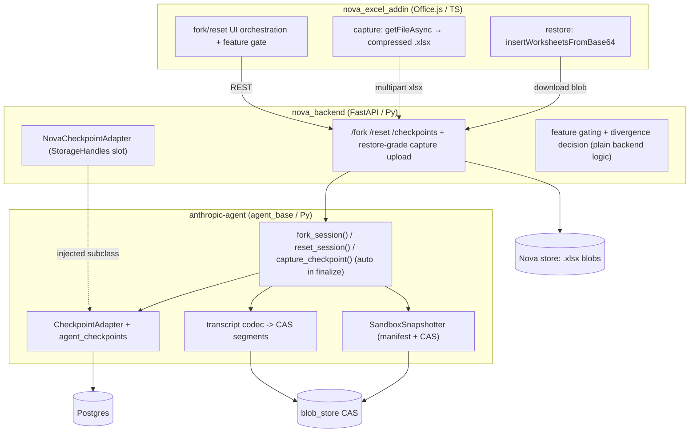
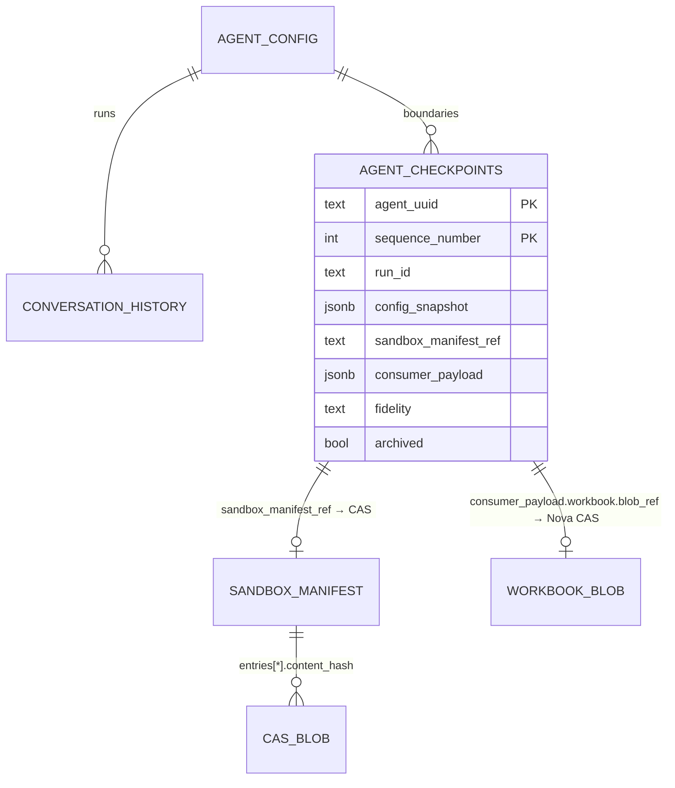
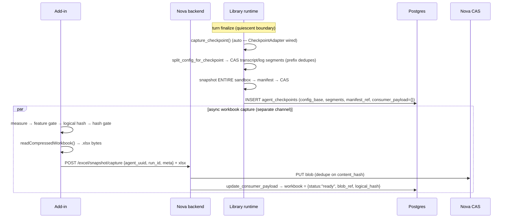
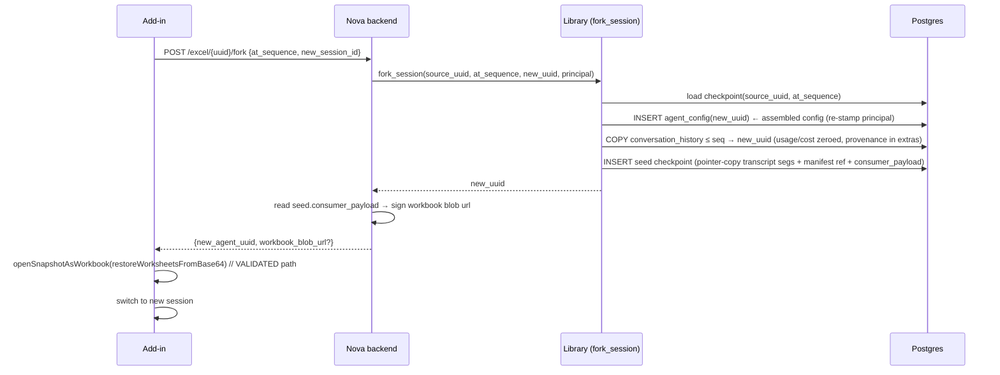

# Fork / Reset-to-Checkpoint — Cross-Repo Design (Overview)

> **Status:** design, not implemented. **`SPEC.md` is the finalized, authoritative decision record**
> (verified against current code 2026-06-16); this overview has been updated to match it. Where
> any detail here is thinner than `SPEC.md` or `01/02/03`, those files win.
> **Scope:** spans three repos — `anthropic-agent` (library), `nova_backend`, `nova_excel_addin`.
>
> **Key corrections baked in from the code-grounding pass (full rationale in `SPEC.md`):**
> 1. **No new library hooks** — the lifecycle catalog is LOCKED; the consumer customizes via an
>    injectable `CheckpointAdapter` + the opaque `consumer_payload` + backend orchestration (SPEC §F4).
> 2. **Checkpoint = hybrid** — the transcript (`context_messages`) is content-addressed into CAS
>    segments, not stored as a full per-turn snapshot (which would be O(n²)) (SPEC §F1).
> 3. **Capture config + sandbox as a unit**, auto-fired in turn-finalize when a `CheckpointAdapter`
>    is wired (SPEC §F2, §D1).
> 4. **Library reset of agent + sandbox is unconditional**; workbook divergence is a Nova-only
>    decision made in the backend (SPEC §F4).
>
> **Companion docs (do not duplicate):**
>
> - Design judgment + verified file:line facts — `…/Temp/fork-reset-design-handoff-2026-06-12.md`
> - Benchmark conclusions (substrate = compressed `.xlsx` + S1 full insert) — `…/Temp/restore-benchmark-handoff-2026-06-14.md`
> - Memory pointer — `fork-reset-design-direction.md`

---

## 1. What we are building

Let users **fork** a new chat session from any checkpoint in a chat's history, or **reset** an
existing chat back to any checkpoint. A "checkpoint" is a **completed turn boundary** (an
end-of-turn or an aborted turn — never a mid-pause parked await).

A checkpoint must restore **three classes of state**:


| Class                                                                               | Owner   | Backing store                                                                    |
| ----------------------------------------------------------------------------------- | ------- | -------------------------------------------------------------------------------- |
| **Agent state** — provider transcript, rich log, profile, identity, token baselines | library | Postgres (`agent_checkpoints`) + transcript content-addressed into `blob_store` (CAS) |
| **Workspace state** — real files in the agent sandbox                               | library | content-addressed `blob_store` (CAS) over the sandbox (EFS in prod)              |
| **Workbook state** — the live Excel document (client-side)                          | Nova    | Nova store (compressed `.xlsx`), ref'd from the library checkpoint's `consumer_payload` slot |


## 2. Repo responsibilities



> No `on_capture`/`on_fork`/`on_reset` hooks: the consumer plugs in via the injected
> `CheckpointAdapter` subclass + the opaque `consumer_payload` + backend orchestration (SPEC §F4).


**Boundary principle (validated by the benchmark):** the library treats the workbook as an
**opaque consumer payload** — it never parses `.xlsx`. Nova owns capture/restore/gating. The
benchmark outcome required *zero* change to the library design, which is the signal the cut is right.

## 3. Shared data contracts

### 3.1 Checkpoint ledger (library-owned, new table)

Schema bump `**LIBRARY_SCHEMA_VERSION` 4 → 5** + idempotent CREATE + an idempotent `Migration(4,5)`
in the same cut. **`config_snapshot` excludes the two unbounded transcript fields** — those are
content-addressed into CAS to avoid O(n²) storage (SPEC §F1; full DDL + `ColumnRegistry`/
`principal_columns` build in `01-anthropic-agent-library.md` §1).

```sql
CREATE TABLE IF NOT EXISTS agent_checkpoints (
    agent_uuid           TEXT        NOT NULL,
    sequence_number      INTEGER     NOT NULL,      -- mirrors conversation_history.sequence_number
    run_id               TEXT        NOT NULL,      -- the turn boundary this checkpoint captures
    config_snapshot      JSONB       NOT NULL,      -- serialize_config() MINUS context_messages + conversation_log
    transcript_segments  TEXT[]      NOT NULL DEFAULT '{}',  -- ordered CAS keys (transcript; prefix dedupes)
    log_segments         TEXT[]      NOT NULL DEFAULT '{}',  -- ordered CAS keys (conversation_log)
    transcript_codec_v   INTEGER     NOT NULL DEFAULT 1,     -- 0 = full inline fallback (no blob_store)
    sandbox_manifest_ref TEXT,                    -- CAS key of the SandboxManifest (nullable)
    consumer_payload     JSONB       NOT NULL DEFAULT '{}',  -- opaque slot (Nova workbook refs)
    fidelity             TEXT        NOT NULL DEFAULT 'full',-- full | degraded | none
    archived             BOOLEAN     NOT NULL DEFAULT FALSE, -- reset archives the tail, never deletes
    owner_tenant         TEXT        NOT NULL,     -- principal_columns() extras (consumer-declared)
    owner_subject        TEXT        NOT NULL,
    created_at           TIMESTAMPTZ NOT NULL,
    PRIMARY KEY (agent_uuid, sequence_number)
);
```

Why a 4th table (not extra columns on `conversation_history`): keeps `load_cursor` paging lean (the
snapshot is only read on fork/reset). Why content-address the transcript: `context_messages` lives
inside `AgentConfig` and the codec re-emits the whole list every save, so a literal full snapshot
per turn is O(n²); CAS segments make an unchanged prefix cost 0 bytes (SPEC §F1).

### 3.2 Sandbox manifest (library-owned, stored in CAS)

```python
ManifestEntry = { "content_hash": str, "size": int, "mode": int }
SandboxManifest = {
    "entries":     dict[str /*relpath*/, ManifestEntry],  # file bytes live in CAS by hash
    "total_bytes": int,
    "skipped":     list[str],   # files over the per-file cap: present-but-not-stored (fidelity badge)
    "_v":          int,
}
```

### 3.3 Consumer payload (Nova's shape inside the opaque slot)

The library never reads these keys; Nova writes and reads them.

```jsonc
{
  "workbook": {
    "status":        "pending" | "ready" | "skipped",  // async capture reconciliation
    "blob_ref":      "novacas://sha256/…",              // compressed .xlsx (restore-grade)
    "logical_hash":  "sha256:…",                        // values+formulas+structure → divergence key
    "used_cells":    55000,
    "bytes":         492000,
    "capture_api":   "getFileAsync",
    "restore_api":   "insertWorksheetsFromBase64@1.13",
    "feature_supported": true                           // size/cell/API gate verdict at capture time
  }
}
```

Note the deliberate split: `**blob_ref` is the storage/restore artifact; `logical_hash` is the
divergence-detection key.** They are different artifacts (compressed bytes don't compare logically).

## 4. The reconstruction invariant (answers "what about in-memory lifecycle objects?")

> **Invariant.** Restorable state ≡ `config_snapshot` ⊕ `transcript_segments`/`log_segments` (CAS)
> ⊕ `sandbox_manifest` ⊕ `consumer_payload`. Every other object in the agent lifecycle MUST be a
> **pure, deterministic function** of those, rebuilt on cold load. No in-memory object may hold
> unrecoverable state across a checkpoint boundary. The only genuinely unrecoverable state beyond
> `AgentConfig` is the **sandbox filesystem** (the externalizer writes `.context/` files the
> transcript references) — so config and sandbox are captured/restored as a unit (SPEC §F2).

This is enforceable because checkpoints are taken at **quiescent turn boundaries**, where the
runtime already knows how to cold-load from `AgentConfig` (today's resume path):


| Lifecycle object                         | Where it lives          | Restored by                                                             |
| ---------------------------------------- | ----------------------- | ----------------------------------------------------------------------- |
| `context_messages` (provider transcript) | `AgentConfig` + CAS     | `config_snapshot` + `transcript_segments` reassembled from CAS          |
| `conversation_log` (rich UI history)     | `AgentConfig` + CAS     | `config_snapshot` + `log_segments` reassembled from CAS                 |
| `pending_relay`                          | `AgentConfig`           | `config_snapshot` — but a checkpoint boundary is post-turn → `None`     |
| `active_profile`                         | `AgentConfig`           | `config_snapshot` → `_restore_persisted_profile()` on init              |
| token baselines (`last_known_`*)         | `AgentConfig`           | `config_snapshot`                                                       |
| compaction controller                    | derived                 | rebuilt from `config.compaction_config` on init                         |
| context externalizer                     | derived                 | rebuilt from config on init                                             |
| media registry (refs)                    | `AgentConfig` + CAS     | `config_snapshot` refs + **immutable** CAS blobs (shared, never copied) |
| sandbox files                            | EFS                     | `sandbox_manifest` → `materialize()`                                    |
| await-table records                      | runtime-only            | N/A — boundary is quiescent (no open awaits by construction)            |
| principal / identity                     | owner columns + ambient | **fork:** re-stamped to forker; **reset:** preserved                    |





## 5. End-to-end flows (cross-repo)

### 5.1 Capture (every mutating + changed turn boundary)




No `on_capture` hook: the library writes the checkpoint with an empty `consumer_payload`; Nova's
async upload reconciles the `workbook` slot via `update_consumer_payload` keyed by `(agent_uuid,
run_id)`. A fork/reset on a still-empty slot falls back to chat-only. Read-only or unchanged turns
skip the workbook capture (mutation gate + hash gate); per SPEC §D4 the `complete` and `failed`
boundaries are guaranteed, soft triggers are best-effort.

### 5.2 Fork (non-destructive — never touches the active workbook)



No `on_fork` hook: `fork_session` pointer-copies the source checkpoint's `consumer_payload` forward
(CAS blobs shared by reference, no byte copy); the backend reads the workbook ref from it.


### 5.3 Reset (non-destructive default; divergence-gated workbook handling)

```mermaid
sequenceDiagram
    participant FE as Add-in
    participant BE as Nova backend
    participant LIB as Library (reset_session)
    participant PG as Postgres

    FE->>FE: compute current workbook logical hash
    FE->>BE: POST /excel/{uuid}/reset {to_sequence, current_hash}
    BE->>LIB: reset_session(uuid, to_sequence)  (UNCONDITIONAL for agent + sandbox)
    LIB->>LIB: quiesce — evict if resident (evict guard refuses mid-flight)
    LIB->>PG: archive conversation_history > seq (flag, not delete)
    LIB->>PG: archive agent_checkpoints > seq
    LIB->>PG: restore agent_config ← assembled config(seq)  (CAS segments)
    LIB->>LIB: materialize ENTIRE sandbox ← manifest(seq)  (delete zones → setup → CAS rewrite, atomic)
    LIB-->>BE: restored CheckpointRef
    BE->>BE: _decide_workbook_action(target.consumer_payload, current_hash)  // plain backend logic
    BE-->>FE: {restored_to, workbook_action, workbook_blob_url?}
    FE->>FE: act on workbook_action (in_place_replace = V1 + confirm; open_copy; chat_only)
```

No `on_reset` hook: the library reset is unconditional; the workbook divergence decision is plain
backend logic around the verb (SPEC §F4). The workbook blob the action points at lives in the
target checkpoint's `consumer_payload`.


## 6. Gating (decided)

A checkpoint's workbook is captured **iff** all hold (else `feature_supported=false`, `fidelity="none"`,
fork/reset offered chat-only):

- Office host supports **both** `getFileAsync` (capture) **and** `insertWorksheetsFromBase64`
(ExcelApi **1.13**, restore) → the single min-API floor.
- `used_range_cells ≤ MAX_CELLS` (config, e.g. 1.0–1.5M — above this S1 also hits Excel guards).
- workbook `bytes ≤ MAX_BYTES` (config, e.g. 25–50 MB compressed).

Sandbox snapshots have their own per-file and total caps (oversize files → `skipped` marker →
`fidelity="degraded"`, checkpoint still lands).

## 7. v1 / v2 split


| In v1                                                                           | Deferred to v2                                                         |
| ------------------------------------------------------------------------------- | ---------------------------------------------------------------------- |
| Fork from any checkpoint (restore-into-new-workbook = benchmark-validated)      | Diff restore (S3/S4 — benchmark says not worth it yet)                 |
| Reset: agent+sandbox unconditional + workbook in-place (properly tested) / open_copy / chat_only | Blob deletion / retention / GC (must be refcount-safe — SPEC §D3) |
| Whole-blob `.xlsx` + content-addressed dedupe                                   | OOXML part-level dedup (storage optimization)                          |
| `getFileAsync` capture (no Graph dependency)                                    | Microsoft Graph version-id cross-reference                             |
| Capture at every completed + failed turn boundary (SPEC §D4)                    | Mid-relay-pause forks (turn-boundary only by construction)             |

> Change from the earlier draft: in-place workbook revert is **in V1** (properly tested, gated on
> the rich-data fidelity re-run + a divergence-aware confirm), and blob deletion/GC is **deferred to
> V2** (refcount-safe when built). See SPEC §6.


## 8. Living-spec checklist (library side, at implementation)

- `interface_plan/subsystems/storage.md` + `session-control.md` (+ likely a new `fork-reset.md`).
- New `tests/interface/fork_reset/` package — semantics: provenance, principal re-stamp,
archive-not-delete, pending-workbook fallback, analytics non-double-count, reconstruction invariant.
- `AMENDMENTS.md` entry; schema v5 + migration in the same cut.
- Run **both** suites (`pytest tests/interface` explicit + Nova `pytest`) — editable uv source.

