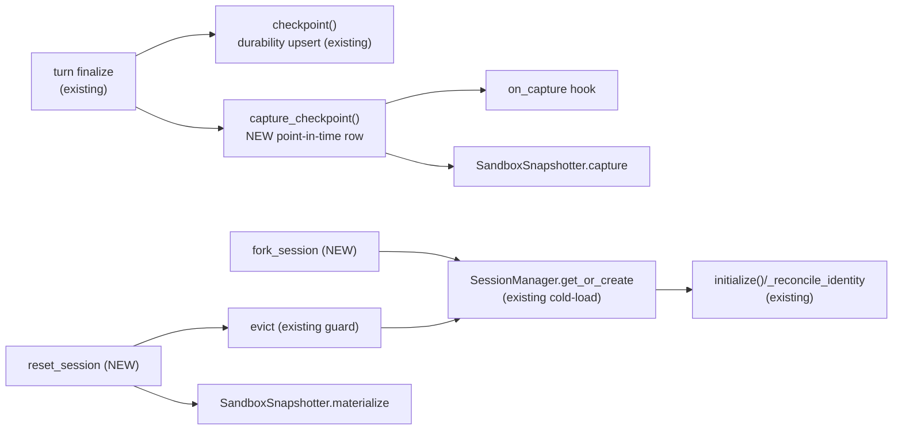

# Repo 1 — `anthropic-agent` (library) — Pseudo-code Interface

> The library owns **agent state + workspace (sandbox) state** checkpointing, and the
> generic **fork / reset verbs** + **hook seams** the consumer participates through.
> It is workbook-agnostic: the workbook rides the opaque `consumer_payload`.
>
> Grounded on the real surface: `AgentConfig` (`core/config.py`), `StorageHandles`
> (`storage/handles.py`), `ConversationAdapter` (`storage/base.py`), `KeyedBlobStore`
> (`blob_store/`), the hook protocol (`core/hooks/protocol.py`), `SessionManager`
> (`session/manager.py`), `SandboxConfig` + `import_tree` (`sandbox/`).

---

## 1. New module: `agent_base/core/checkpoint.py`

```python
@dataclass(frozen=True)
class CheckpointRef:
    agent_uuid: str
    sequence_number: int
    run_id: str
    created_at: str
    fidelity: str                      # "full" | "degraded" | "none"

@dataclass
class Checkpoint:
    ref: CheckpointRef
    config_snapshot: dict              # POINT-IN-TIME AgentConfig (storage-codec dict)
    sandbox_manifest_ref: str | None   # CAS key of the SandboxManifest blob
    consumer_payload: dict             # OPAQUE to the library (Nova workbook refs)


class CheckpointAdapter(StorageAdapter[Checkpoint]):
    """4th storage adapter, parallels ConversationAdapter. Append-only;
    reset 'archives' the tail (a flag) rather than deleting (non-destructive)."""

    async def save(self, cp: Checkpoint) -> None: ...
    async def load(self, agent_uuid: str, sequence_number: int) -> Checkpoint | None: ...
    async def load_latest(self, agent_uuid: str) -> Checkpoint | None: ...
    async def list_refs(self, agent_uuid: str, *, limit=50, offset=0,
                        include_archived=False) -> tuple[list[CheckpointRef], int]: ...

    # consumer slot is writable post-hoc (async workbook capture reconciliation, §3.1 overview)
    async def update_consumer_payload(self, agent_uuid: str, sequence_number: int,
                                      payload: dict) -> bool: ...

    # reset: flip archived=TRUE for rows AFTER the target; returns count. NEVER deletes.
    async def archive_after(self, agent_uuid: str, sequence_number: int) -> int: ...

    # R26 concrete default so custom adapters keep working without overriding.
```

The Postgres impl reuses the `ColumnRegistry` DDL engine (`storage/pg/columns.py`) and the
`config_to_row`-style codec to (de)serialize `config_snapshot`. `for_principal` scoping +
`owner_*` columns exactly as the other adapters (tenancy O2).

`StorageHandles` (`storage/handles.py`) gains a `checkpoint` slot alongside `config` /
`conversation` / `run`.

## 2. New module: `agent_base/sandbox/snapshot.py`

```python
@dataclass
class SandboxManifest:
    entries: dict[str, ManifestEntry]   # relpath -> {content_hash, size, mode}
    total_bytes: int
    skipped: list[str]                  # over per-file cap: present-not-stored (degraded fidelity)

class SandboxSnapshotter:
    """Content-addressed snapshot of a sandbox's EFS files. NOT git: a manifest of
    blake3/sha hashes + per-file blobs in the KeyedBlobStore. Unchanged file => 0 bytes
    written (hash already present). Unchanged sandbox => one tiny manifest."""

    def __init__(self, blobs: KeyedBlobStore, *,
                 per_file_cap_bytes: int, total_cap_bytes: int): ...

    async def capture(self, sandbox: Sandbox) -> tuple[SandboxManifest, str]:
        manifest = SandboxManifest(entries={}, total_bytes=0, skipped=[])
        for path, meta in await sandbox.walk():                 # EFS walk, relpaths
            if meta.size > self.per_file_cap_bytes:
                manifest.skipped.append(path); continue          # fidelity badge, don't block
            data = await sandbox.read_bytes(path)
            h = content_hash(data)
            if not await self.blobs.exists_key(h):               # CAS dedupe
                await self.blobs.put_key(h, data)
            manifest.entries[path] = ManifestEntry(h, meta.size, meta.mode)
            manifest.total_bytes += meta.size
        manifest_ref = await self.blobs.put_key(hash_of(manifest), serialize(manifest))
        return manifest, manifest_ref

    async def materialize(self, manifest_ref: str, sandbox: Sandbox) -> None:
        """Restore: clear the sandbox dir, then write every manifest entry from CAS onto EFS.
        Reuses the existing sandbox import_tree seam where possible."""
        manifest = deserialize(await self.blobs.get_key(manifest_ref))
        await sandbox.clear()
        for path, entry in manifest.entries.items():
            await sandbox.write_bytes(path, await self.blobs.get_key(entry.content_hash), mode=entry.mode)
        # 'skipped' files are absent by design — surfaced to the user via the fidelity badge.
```

## 3. Hook seams (additions to `agent_base/core/hooks/protocol.py`)

Same shape as the existing `on_session_start` / `before_tool` / `after_tool` — async,
return `HookOutcome | None`, `block` is vetoable, the ctx carries `emit` for frames.

```python
class HookProtocol(Protocol):
    # ... existing hooks ...
    async def on_capture(self, ctx: "CaptureContext") -> "HookOutcome | None": ...
    async def on_fork(self,    ctx: "ForkContext")    -> "HookOutcome | None": ...
    async def on_reset(self,   ctx: "ResetContext")   -> "HookOutcome | None": ...
```

```python
@dataclass
class CaptureContext(BaseHookContext):
    agent_uuid: str
    run_id: str
    sequence_number: int
    consumer_payload: dict     # MUTABLE — the consumer attaches its workbook ref here
    # block => skip taking a checkpoint at this boundary (rare; e.g. consumer policy)

@dataclass
class ForkContext(BaseHookContext):
    source_agent_uuid: str
    new_agent_uuid: str
    sequence_number: int
    principal: SessionPrincipal
    source_payload: dict       # the source checkpoint's consumer_payload (read)
    seed_payload: dict         # MUTABLE — consumer seeds the fork's first checkpoint payload
    # block => abort the fork (consumer veto)

@dataclass
class ResetContext(BaseHookContext):
    agent_uuid: str
    from_sequence: int         # current head
    to_sequence: int           # target
    target_payload: dict       # target checkpoint's consumer_payload (read — has logical_hash)
    decision: dict             # MUTABLE — consumer writes {workbook_action, ...}
    # block => abort the reset (consumer veto, e.g. "workbook diverged, user said cancel")
```

## 4. Runtime: capture at the turn boundary (`agent_base/core/runtime.py`)

`capture_checkpoint()` is **additive** to the existing durability `checkpoint()` (the
latest-wins `AgentConfig` upsert at `runtime.py:1035`). It writes the immutable point-in-time row.

```python
async def capture_checkpoint(self) -> CheckpointRef | None:
    """Take an immutable point-in-time checkpoint at a quiescent turn boundary.
    Called from the turn-finalize path, AFTER the Conversation row is saved."""
    if self.checkpoint_adapter is None:
        return None

    # 1) consumer participation — may attach workbook ref / may veto-skip.
    payload: dict = {}
    ctx = CaptureContext(**self._base_hook_kwargs(),
                         agent_uuid=self.agent_uuid, run_id=self._run_id,
                         sequence_number=self._next_checkpoint_seq(),
                         consumer_payload=payload)
    if (await self._run_hook("on_capture", ctx)) is blocked:
        return None
    payload = ctx.consumer_payload

    # 2) workspace snapshot (gated by size caps; degraded => still lands).
    manifest_ref, fidelity = None, "full"
    if self._snapshotter is not None and self.sandbox is not None:
        manifest, manifest_ref = await self._snapshotter.capture(self.sandbox)
        if manifest.skipped: fidelity = "degraded"

    # 3) point-in-time agent-state snapshot (the storage codec serializes AgentConfig).
    cp = Checkpoint(
        ref=CheckpointRef(self.agent_uuid, ctx.sequence_number, self._run_id, now_iso(), fidelity),
        config_snapshot=serialize_agent_config(self._agent_config),   # immutable copy
        sandbox_manifest_ref=manifest_ref,
        consumer_payload=payload,
    )
    await self.checkpoint_adapter.save(cp)        # principal-scoped via for_principal
    return cp.ref
```

**Ordering guarantee:** taken at finalize, the boundary is quiescent (no parked await,
`pending_relay is None`), so the invariant in §4 of the overview holds. The workbook capture
runs on a separate channel and reconciles the `consumer_payload` later via
`CheckpointAdapter.update_consumer_payload` (§1).

## 5. The fork / reset verbs (`agent_base/core/fork_reset.py`, new)

Module-level functions over **storage**, not a live runtime — they work cold and need no
resident session (a fork reads only immutable rows + CAS; a reset of a resident session
quiesces it first).

```python
async def fork_session(handles: StorageHandles, *, source_uuid: str, at_sequence: int,
                       new_uuid: str, principal: SessionPrincipal,
                       hooks: HookEngine | None = None,
                       copy_history: bool = True) -> str:
    """Create a NEW session 'new_uuid' from source_uuid's checkpoint at at_sequence.
    Non-destructive to the source. Returns new_uuid."""
    cp = await handles.checkpoint.for_principal(principal).load(source_uuid, at_sequence)
    if cp is None: raise CheckpointNotFound(source_uuid, at_sequence)

    # 1) agent state: write a fresh config row under new_uuid (re-stamp ownership to the forker).
    cfg = deserialize_agent_config(cp.config_snapshot)
    cfg.agent_uuid = new_uuid
    cfg.parent_agent_uuid = None                     # a fork is a new ROOT, not a sub-agent
    cfg.pending_relay = None                         # boundary is quiescent
    cfg.owner_tenant, cfg.owner_subject = principal.tenant, principal.subject
    cfg.extras["forked_from"]   = source_uuid
    cfg.extras["forked_at_seq"] = at_sequence
    await handles.config.for_principal(principal).save(cfg)

    # 2) history: copy Conversation rows <= seq (provenance + ZERO usage/cost => no analytics double-count).
    if copy_history:
        for conv in await _history_through(handles, source_uuid, at_sequence, principal):
            conv.agent_uuid = new_uuid
            conv.usage, conv.cost = Usage(), None     # forked spend is not re-billed
            conv.extras["forked_from_run_id"] = conv.run_id
            await handles.conversation.for_principal(principal).save(conv)  # caller-seq preserved (NV-1)

    # 3) workspace: copy the manifest ref forward; sandbox materializes lazily on first session init.
    #    CAS dedupe makes this near-free (no byte copy; same content hashes).
    seed = Checkpoint(ref=CheckpointRef(new_uuid, at_sequence, cp.ref.run_id, now_iso(), cp.ref.fidelity),
                      config_snapshot=serialize_agent_config(cfg),
                      sandbox_manifest_ref=cp.sandbox_manifest_ref,
                      consumer_payload={})

    # 4) consumer participation: seed workbook ref into the fork's first checkpoint payload.
    if hooks:
        fctx = ForkContext(source_agent_uuid=source_uuid, new_agent_uuid=new_uuid,
                           sequence_number=at_sequence, principal=principal,
                           source_payload=cp.consumer_payload, seed_payload={})
        if (await hooks.run("on_fork", fctx)) is blocked: raise ForkVetoed(fctx.reason)
        seed.consumer_payload = fctx.seed_payload
    await handles.checkpoint.for_principal(principal).save(seed)
    return new_uuid


async def reset_session(handles: StorageHandles, *, agent_uuid: str, to_sequence: int,
                        principal: SessionPrincipal, sessions: SessionManager | None = None,
                        hooks: HookEngine | None = None) -> CheckpointRef:
    """Reset an existing session back to its checkpoint at to_sequence. Non-destructive:
    the tail is ARCHIVED, not deleted (=> 'undo the reset' is possible). Returns the head ref."""
    # 0) quiesce — eviction refuses while a turn is in flight or an await is parked (manager.py:414).
    if sessions and sessions.is_resident(agent_uuid):
        if not await sessions.evict(agent_uuid):
            raise SessionBusy(agent_uuid)        # caller retries after wait_idle()

    cp = await handles.checkpoint.for_principal(principal).load(agent_uuid, to_sequence)
    if cp is None: raise CheckpointNotFound(agent_uuid, to_sequence)
    head = await handles.checkpoint.for_principal(principal).load_latest(agent_uuid)

    # 1) consumer participation FIRST: divergence decision (may veto). target has logical_hash.
    if hooks:
        rctx = ResetContext(agent_uuid=agent_uuid, from_sequence=head.ref.sequence_number,
                            to_sequence=to_sequence, target_payload=cp.consumer_payload, decision={})
        if (await hooks.run("on_reset", rctx)) is blocked: raise ResetVetoed(rctx.reason)
        # rctx.decision (workbook_action) is returned to the caller via the backend.

    # 2) archive the tail (non-destructive), restore agent state in place.
    await handles.conversation.for_principal(principal).archive_after(agent_uuid, to_sequence)
    await handles.checkpoint.for_principal(principal).archive_after(agent_uuid, to_sequence)
    cfg = deserialize_agent_config(cp.config_snapshot)
    cfg.pending_relay = None
    await handles.config.for_principal(principal).save(cfg)   # latest-wins row now == checkpoint

    # 3) workspace: materialize the sandbox from the checkpoint manifest onto EFS.
    if cp.sandbox_manifest_ref and (snap := _snapshotter_for(handles)):
        await snap.materialize(cp.sandbox_manifest_ref, _sandbox_for(agent_uuid, principal))

    return cp.ref
    # Next SessionManager.get_or_create cold-loads the restored config;
    # ensure_chain_validity (core/chain.py:195) sanitizes the transcript on the first turn.
```

## 6. Where it plugs into existing flow



## 7. Notes / invariants the library must hold

- **Append-only + archive, never delete** — reset is reversible; analytics history is preserved.
- **Principal re-stamp on fork, preserve on reset** — a fork is owned by the forking user;
  cross-tenant addressing is already impossible (`PrincipalConflict`, `StrictScopePolicy`).
- **Media + externalized tool results are shared by reference** — they are immutable CAS blobs;
  `config_snapshot` carries the refs, never the bytes. No deep copy.
- **Sandbox manifest is the only mutable-state copy** — and it dedupes against CAS, so a fork is
  a manifest-pointer copy, not a file copy.
- **The library never reads `consumer_payload`** — workbook semantics stay entirely in Nova.
