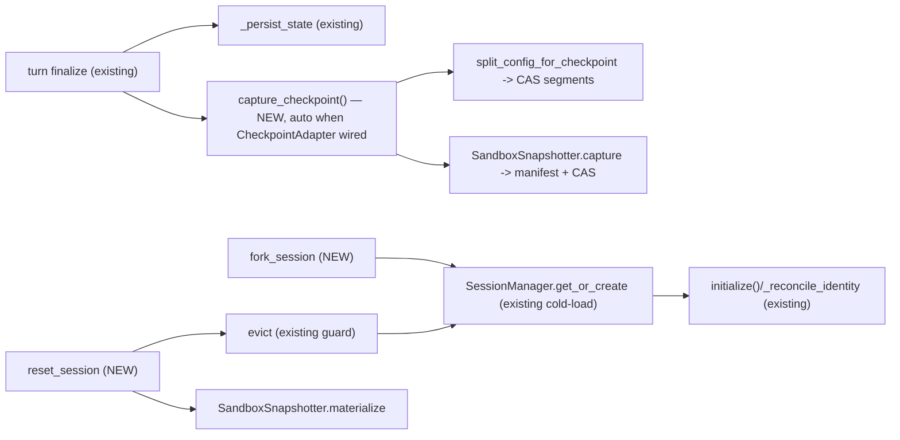

# Repo 1 — `anthropic-agent` (library) — Interface

> The library owns **agent state + workspace (sandbox) state** checkpointing and the generic
> **fork / reset verbs**. It is workbook-agnostic: the workbook rides the opaque
> `consumer_payload`. See `SPEC.md` for the finalized decision ledger; this file is the concrete
> interface that matches it.
>
> **Grounded on the real surface (verified 2026-06-16):** `AgentConfig` (`core/config.py:160`),
> `serialize_config`/`deserialize_config` (`storage/serialization.py:56`/`:122`), `StorageHandles`
> (`storage/handles.py:29`), the `StorageAdapter`/`ConversationAdapter` ABCs (`storage/base.py:34`/
> `:179`), `ColumnRegistry`/`principal_columns` (`storage/pg/columns.py:38`/`:135`),
> `LIBRARY_SCHEMA_VERSION`/migrations (`storage/pg/schema.py:23`/`:50`), `KeyedBlobStore`
> (`blob_store/base.py:98`), the sandbox surface (`sandbox/sandbox_types.py`, `sandbox/local.py`),
> the turn-finalize path (`providers/anthropic/anthropic_agent.py:2465`/`_persist_state:2616`;
> scripted `record_turn` `core/runtime.py:560`/`checkpoint():700`).

---

## 0. What changed from the original draft (read first)

The first draft of this file proposed `on_capture`/`on_fork`/`on_reset` hooks, a literal full
`config_snapshot` per turn, and `sandbox.walk()/clear()/read_bytes()/write_bytes()` +
`blobs.put_key()/get_key()`. **None of those match reality:**

- The lifecycle hook catalog is LOCKED (12 + 1; `on_checkpoint` dropped). **No new hooks** — the
  consumer customizes via an injectable `CheckpointAdapter`, the opaque `consumer_payload`, and
  backend orchestration (SPEC §F4).
- A full `config_snapshot` per turn is **O(n²)** because `context_messages` (the transcript) lives
  inside `AgentConfig` and the codec re-emits the whole list every save. We content-address the
  transcript instead (SPEC §F1).
- The real blob API is `put_at`/`get_by_key`/`exists_key`/`delete_key`; the real sandbox API is
  `read_file_bytes`/`write_file_bytes`/`list_dir`/`delete`/`setup`/`import_tree`/`extract_archive`.
  There is no `walk`/`clear` (we add one recursive `walk`).

## 1. New module: `agent_base/core/checkpoint.py`

```python
@dataclass(frozen=True)
class CheckpointRef:
    agent_uuid: str
    sequence_number: int
    run_id: str
    created_at: str
    fidelity: str                       # "full" | "degraded" | "none"

@dataclass
class Checkpoint:
    ref: CheckpointRef
    config_base: dict                   # serialize_config() MINUS context_messages + conversation_log
    transcript_segments: list[str]      # ordered CAS keys (one per provider message)
    log_segments: list[str]             # ordered CAS keys (one per conversation_log entry)
    transcript_codec_v: int             # 0 = full inline (no CAS), 1 = CAS-segmented
    sandbox_manifest_ref: str | None    # CAS key of the SandboxManifest blob
    consumer_payload: dict              # OPAQUE to the library (Nova workbook refs)


class CheckpointAdapter(StorageAdapter["Checkpoint"]):
    """4th storage adapter, parallels ConversationAdapter (storage/base.py:179).
    Append-only; reset 'archives' the tail (a flag) rather than deleting."""

    async def save(self, cp: Checkpoint) -> None: ...                       # INSERT immutable row
    async def load(self, agent_uuid: str, sequence_number: int) -> Checkpoint | None: ...
    async def load_latest(self, agent_uuid: str) -> Checkpoint | None: ...
    async def list_refs(self, agent_uuid: str, *, limit: int = 50, offset: int = 0,
                        include_archived: bool = False) -> tuple[list[CheckpointRef], int]: ...

    # consumer slot is writable post-hoc (async workbook capture reconciliation)
    async def update_consumer_payload(self, agent_uuid: str, sequence_number: int,
                                      payload: dict) -> bool: ...

    # reset: flip archived=TRUE for rows AFTER the target; returns count. NEVER deletes.
    async def archive_after(self, agent_uuid: str, sequence_number: int) -> int: ...
```

`for_principal` scoping is inherited from `StorageAdapter` (`storage/base.py:63`). The Pg impl
composes SQL from a `ColumnRegistry` (`storage/pg/columns.py:38`); the owner columns are the canned
`principal_columns(tenant="owner_tenant", subject="owner_subject")` extras (`columns.py:135`), added
by the consumer adapter exactly as `NovaConfigAdapter` does today. `StorageHandles`
(`storage/handles.py`) gains a 4th `checkpoint` slot alongside `config`/`conversation`/`run`/
`analytics`.

**Schema:** `agent_checkpoints` table, `LIBRARY_SCHEMA_VERSION` **4 → 5** (`storage/pg/schema.py:23`)
+ an idempotent `Migration(4, 5)` appended to `LIBRARY_MIGRATIONS` (`schema.py:50`) in the same cut.

```sql
CREATE TABLE IF NOT EXISTS agent_checkpoints (
    agent_uuid           TEXT        NOT NULL,
    sequence_number      INTEGER     NOT NULL,      -- mirrors conversation_history.sequence_number
    run_id               TEXT        NOT NULL,      -- the turn boundary captured
    config_snapshot      JSONB       NOT NULL,      -- serialize_config() MINUS the 2 transcript fields
    transcript_segments  TEXT[]      NOT NULL DEFAULT '{}',
    log_segments         TEXT[]      NOT NULL DEFAULT '{}',
    transcript_codec_v   INTEGER     NOT NULL DEFAULT 1,  -- 0 = full inline fallback (no blob_store)
    sandbox_manifest_ref TEXT,
    consumer_payload     JSONB       NOT NULL DEFAULT '{}',
    fidelity             TEXT        NOT NULL DEFAULT 'full',  -- full | degraded | none
    archived             BOOLEAN     NOT NULL DEFAULT FALSE,   -- reset archives the tail, never deletes
    owner_tenant         TEXT        NOT NULL,                 -- principal_columns() extras (consumer)
    owner_subject        TEXT        NOT NULL,
    created_at           TIMESTAMPTZ NOT NULL,
    PRIMARY KEY (agent_uuid, sequence_number)
);
-- + idx on (agent_uuid, run_id) and owner_tenant/owner_subject (principal_columns indexes)
```

Why a 4th table (not extra columns on `conversation_history`): keeps `load_cursor` history paging
lean — the heavy snapshot is only read on fork/reset.

## 2. New module: `agent_base/storage/checkpoint_codec.py` (the hybrid transcript codec)

Defeats the O(n²) of a literal full snapshot (SPEC §F1). Layered on `serialize_config`/
`deserialize_config` + `KeyedBlobStore` (`put_at`/`get_by_key`/`exists_key`) + `compute_blake3`
(`blob_store/hashing.py:20`).

```python
async def split_config_for_checkpoint(config, blobs, *, tenant) -> tuple[dict, list[str], list[str], int]:
    base = serialize_config(config)              # CODEC path — carries agent_phase + owner_* (NOT config_to_row)
    if blobs is None:                            # no CAS -> store full inline, codec_v = 0
        return base, [], [], 0
    seg_keys, log_keys = [], []
    for m in config.context_messages:            # one segment per message; append-stable -> prefix dedupes
        data = canonical_json(m.to_dict())       # SORTED keys -> identical messages hash identically
        key = f"{tenant}/{compute_blake3(data)}" # TENANT-SCOPED key (keyed surface has no scope arg)
        if await blobs.exists_key(key) is None:  # CAS dedupe: unchanged prefix => 0 bytes written
            await blobs.put_at(key, data, mime_type="application/json")
        seg_keys.append(key)
    for e in config.conversation_log.entries:    # same shape for the rich log
        data = canonical_json(e.to_dict())
        key = f"{tenant}/{compute_blake3(data)}"
        if await blobs.exists_key(key) is None:
            await blobs.put_at(key, data)
        log_keys.append(key)
    base.pop("context_messages"); base.pop("conversation_log")
    return base, seg_keys, log_keys, 1

async def assemble_config_from_checkpoint(cp, blobs, llm_config_class) -> AgentConfig:
    base = dict(cp.config_base)
    if cp.transcript_codec_v == 1:
        base["context_messages"] = [json.loads(await blobs.get_by_key(k)) for k in cp.transcript_segments]
        base["conversation_log"] = {"entries": [json.loads(await blobs.get_by_key(k)) for k in cp.log_segments]}
    cfg = deserialize_config(base, llm_config_class)  # base LLMConfig unless subclass passed
    return cfg
    # CALLER MUST re-land the provider-native llm_config (provider.make_llm_config) if it
    # reconstructs WITHOUT going through AnthropicAgent.initialize() (anthropic_agent.py:449),
    # or thinking_tokens / server_tools / beta headers are lost.
```

**Compaction caveat:** at the turn compaction fires, `context_messages` is reassigned to
`[summary] + recent` (`anthropic_agent.py` `_replace_context_messages`), so the prefix shifts and
dedupe drops for that one checkpoint. Correct and bounded (the new set is small); the codec must not
assume monotonic prefix sharing.

## 3. New module: `agent_base/sandbox/snapshot.py` (CAS content-manifest)

SPEC §F3. Built on the real sandbox + blob primitives. Captures the **entire** sandbox by default
(SPEC §D2), client-narrowable via `zones=`.

```python
@dataclass(frozen=True)
class ManifestEntry:
    content_hash: str            # "blake3:<hex>"  ("" when status="skipped")
    size: int
    mode: int | None = None      # None on win32 / where modes are meaningless
    status: str = "stored"       # "stored" | "skipped" (oversize)

@dataclass(frozen=True)
class SandboxManifest:
    entries: dict[str, ManifestEntry]   # relpath (posix) -> entry
    zones: tuple[str, ...]              # captured zones (default = ALL)
    fidelity: str = "full"              # "full" | "degraded"
    total_bytes: int = 0

class SandboxSnapshotter:
    DEFAULT_ZONES = ("workspace", ".imported", ".exports", ".plans", ".context", ".tool_results")

    def __init__(self, sandbox, blobs, *, tenant, zones=DEFAULT_ZONES,
                 per_file_cap=50*2**20, total_cap=500*2**20): ...

    async def capture(self) -> tuple[SandboxManifest, str]:
        entries, total, fidelity = {}, 0, "full"
        for zone in self._zones:
            for fe in await self._sandbox.walk(zone):              # NEW recursive primitive (see below)
                if fe.size > self._per_file_cap or total + fe.size > self._total_cap:
                    entries[fe.relpath] = ManifestEntry("", fe.size, status="skipped")
                    fidelity = "degraded"; continue
                data = b"".join([c async for c in self._sandbox.read_file_bytes(fe.relpath)])  # local.py:198
                key = f"{self._tenant}/{compute_blake3(data)}"     # tenant-scoped
                if await self._blobs.exists_key(key) is None:      # dedupe -> 0 bytes if unchanged
                    await self._blobs.put_at(key, data)
                entries[fe.relpath] = ManifestEntry(key, len(data), mode=fe.mode)
                total += len(data)
        manifest = SandboxManifest(entries, tuple(self._zones), fidelity, total)
        manifest_ref = await self._blobs.put_at(f"{self._tenant}/{hash_of(manifest)}", serialize(manifest))
        return manifest, manifest_ref

    async def materialize(self, manifest_ref: str) -> None:
        manifest = deserialize(await self._blobs.get_by_key(manifest_ref))
        for zone in manifest.zones:                                # no clear(): delete + recreate skeleton
            await self._sandbox.delete(zone)                       # recursive for dirs (local.py:256)
        await self._sandbox.setup()                               # recreates DEFAULT_ZONE_LAYOUT
        members = {rel: await self._blobs.get_by_key(e.content_hash)
                   for rel, e in manifest.entries.items() if e.status == "stored"}
        verify  = {rel: e.content_hash for rel, e in manifest.entries.items() if e.status == "stored"}
        # extract_archive(members=...) writes many at once; atomic=True rolls back ALL on any failure
        # and verify= checks each blob against its hash (sandbox_types.py:565).
        await self._sandbox.extract_archive(members=members, dest_prefix=".", verify=verify, atomic=True)
        # 'skipped' entries are absent by design -> surfaced via the fidelity badge.
```

**One additive Sandbox primitive** (the rest of the surface exists):

```python
# Sandbox ABC (sandbox/sandbox_types.py): list_dir is SINGLE-LEVEL, so add a recursive walk.
# Base impl composes list_dir; Docker/E2B may override with native recursion.
async def walk(self, path: str = ".") -> list[FileEntry]: ...   # FileEntry gains relpath (+ mode where real)
```

## 4. Capture at the turn boundary: `agent_base/core/runtime.py` (auto, no hook)

SPEC §D1. `capture_checkpoint()` runs in turn-finalize **iff** a `CheckpointAdapter` is wired —
core runtime behavior, not a hook. It captures config (codec-split) + sandbox snapshot as one row
(SPEC §F2).

```python
async def capture_checkpoint(self) -> CheckpointRef | None:
    if self.checkpoint_adapter is None:
        return None                                  # feature off unless the consumer wired an adapter

    tenant = self._agent_config.owner_tenant or "_"
    base, segs, logs, codec_v = await split_config_for_checkpoint(
        self._agent_config, self._blobs, tenant=tenant)

    manifest_ref, fidelity = None, "full"
    if self._snapshotter is not None:
        manifest, manifest_ref = await self._snapshotter.capture()   # ENTIRE sandbox (D2)
        if manifest.fidelity == "degraded":
            fidelity = "degraded"

    cp = Checkpoint(
        ref=CheckpointRef(self.agent_uuid, self._next_checkpoint_seq(), self._run_id, now_iso(), fidelity),
        config_base=base, transcript_segments=segs, log_segments=logs, transcript_codec_v=codec_v,
        sandbox_manifest_ref=manifest_ref,
        consumer_payload={},   # the consumer (Nova) reconciles its workbook ref post-hoc
    )
    await self.checkpoint_adapter.save(cp)            # principal-scoped via for_principal
    return cp.ref
```

**Wire-in:** call `capture_checkpoint()` on both turn-finalize paths, after the Conversation row is
saved at the quiescent boundary:
- live loop: inside / adjacent to `_finalize_run` → `_persist_state` (`anthropic_agent.py:2465`/
  `:2616`),
- scripted: `record_turn` after `checkpoint()` (`runtime.py:700`).

The workbook capture is a **separate async channel** (Nova FE → backend) reconciled later via
`CheckpointAdapter.update_consumer_payload` keyed by `(agent_uuid, run_id)` (SPEC §3.2).

## 5. The verbs: `agent_base/core/fork_reset.py`

Module-level functions over **storage** (not a live runtime). They work cold.

```python
async def fork_session(handles, *, source_uuid, at_sequence, new_uuid, principal,
                       copy_history=True) -> str:
    """New session from source_uuid's checkpoint at at_sequence. Non-destructive to source."""
    cp = await handles.checkpoint.for_principal(principal).load(source_uuid, at_sequence)
    if cp is None: raise CheckpointNotFound(source_uuid, at_sequence)

    # 1) agent state: write a fresh config row under new_uuid, re-stamp ownership to the forker.
    cfg = await assemble_config_from_checkpoint(cp, handles.blobs, principal_llm_config_class)
    cfg.agent_uuid = new_uuid
    cfg.parent_agent_uuid = None                       # a fork is a new ROOT, not a sub-agent
    cfg.pending_relay = None                           # boundary is quiescent
    cfg.owner_tenant, cfg.owner_subject = principal.tenant, principal.subject
    cfg.extras["forked_from"], cfg.extras["forked_at_seq"] = source_uuid, at_sequence
    await handles.config.for_principal(principal).save(cfg)

    # 2) history: copy Conversation rows <= seq, usage/cost zeroed (no analytics double-count).
    if copy_history:
        for conv in await _history_through(handles, source_uuid, at_sequence, principal):
            conv.agent_uuid = new_uuid
            conv.usage, conv.cost = Usage(), None
            conv.extras["forked_from_run_id"] = conv.run_id
            await handles.conversation.for_principal(principal).save(conv)   # caller-seq preserved

    # 3) seed checkpoint: pointer-copy the transcript segments + sandbox manifest ref (CAS shared,
    #    no byte copy) + carry the consumer_payload forward so Nova can open the turn-N workbook.
    seed = Checkpoint(
        ref=CheckpointRef(new_uuid, at_sequence, cp.ref.run_id, now_iso(), cp.ref.fidelity),
        config_base=serialize_config(cfg_without_transcript(cfg)),
        transcript_segments=cp.transcript_segments, log_segments=cp.log_segments,
        transcript_codec_v=cp.transcript_codec_v,
        sandbox_manifest_ref=cp.sandbox_manifest_ref,
        consumer_payload=cp.consumer_payload)          # Nova reads workbook blob_ref from here
    await handles.checkpoint.for_principal(principal).save(seed)
    return new_uuid


async def reset_session(handles, *, agent_uuid, to_sequence, principal,
                        sessions=None) -> CheckpointRef:
    """Reset an existing session back to to_sequence. UNCONDITIONAL for agent + sandbox.
    Non-destructive: the tail is ARCHIVED, not deleted. Workbook divergence is the CONSUMER's
    concern, decided in the backend AROUND this call (no hook here)."""
    # 0) quiesce — eviction refuses while a turn is in flight (manager.py evict guard).
    if sessions and sessions.is_resident(agent_uuid):
        if not await sessions.evict(agent_uuid):
            raise SessionBusy(agent_uuid)

    cp = await handles.checkpoint.for_principal(principal).load(agent_uuid, to_sequence)
    if cp is None: raise CheckpointNotFound(agent_uuid, to_sequence)

    # 1) archive the tail (non-destructive => "undo the reset" works), restore agent state in place.
    await handles.conversation.for_principal(principal).archive_after(agent_uuid, to_sequence)
    await handles.checkpoint.for_principal(principal).archive_after(agent_uuid, to_sequence)
    cfg = await assemble_config_from_checkpoint(cp, handles.blobs, principal_llm_config_class)
    cfg.pending_relay = None
    await handles.config.for_principal(principal).save(cfg)   # latest-wins row now == checkpoint

    # 2) workspace: materialize the sandbox from the checkpoint manifest (clear in-scope zones -> CAS).
    if cp.sandbox_manifest_ref and (snap := _snapshotter_for(handles, agent_uuid, principal)):
        await snap.materialize(cp.sandbox_manifest_ref)

    return cp.ref
    # Next SessionManager.get_or_create cold-loads the restored config; ensure_chain_validity
    # (core/chain.py:195) sanitizes the transcript on the first turn. The backend reads
    # cp.consumer_payload to decide the workbook action (open_copy / in_place_replace / chat_only).
```

**`conversation` archive:** `ConversationAdapter` has no delete/truncate today (`storage/base.py:179`)
— `archive_after` is a net-new additive method (a flag, never a delete) that `load_history`/
`load_cursor` filter out by default.

## 6. Where it plugs into existing flow



## 7. Notes / invariants the library must hold

- **Append-only + archive, never delete** — reset is reversible; analytics preserved. Blob deletion
  is deferred (SPEC §D3); when built it MUST be refcount/GC-safe across checkpoints + forks.
- **No new lifecycle hooks** — customization is the injectable `CheckpointAdapter` + injectable
  `SandboxSnapshotter`/`Sandbox` + the opaque `consumer_payload` + backend orchestration. If a
  richer first-class seam is ever wanted, follow the `Provider`/`MediaBackend` template: a
  `runtime_checkable` Protocol injected as a value via a ctor kwarg — never a new locked hook.
- **Transcript is authoritative + content-addressed** — `context_messages` cannot be rebuilt from
  `conversation_history`; it is CAS-segmented, tenant-scoped, canonical-JSON hashed.
- **Capture config + sandbox as a unit** — or restored configs get dangling `.context/` references.
- **Codec path, not row mapper** — serialize via `serialize_config` (carries `agent_phase`).
- **Media shared by reference** — immutable CAS blobs; `config_snapshot` carries refs, never bytes.
- **Turn-boundary only** — a fork/reset while `pending_relay` is set falls back to the last
  completed boundary or refuses.
