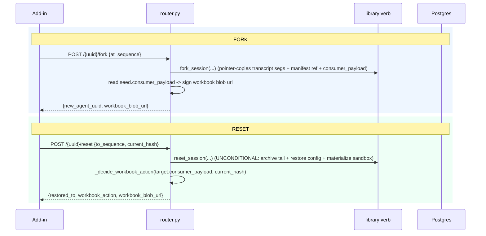

# Repo 2 — `nova_backend` — Interface

> Nova backend exposes the **frontend-facing REST API** for fork/reset + checkpoint listing, the
> **restore-grade workbook upload** endpoint, and the **consumer customization** of the library's
> fork/reset machinery. See `SPEC.md` for the decision ledger.
>
> **Grounded on the real surface (verified 2026-06-16):** `excel_agent/router.py` (run_id +
> sequence_number reach the FE via `GET /{agent_uuid}/conversations`, `router.py:721-768`, field at
> `:746`), `excel_agent/snapshot_router.py` (`WorkbookSnapshotStore`, dedupe `(conversation_uuid,
> content_hash)`, `storage/snapshot_adapter.py:43`/`:191`), `excel_agent/agent_factory.py`
> (`create_nova_adapters` → StorageHandles, `sandbox_factory=` lambda `:245`, `end_turn_hook=` `:239`,
> `register_settlement_deduction` `:277`, `agent.hooks.add` `:269`), `storage/principals.py:21`
> (`principal_for`), `storage/adapters.py:58` (`NovaConfigAdapter(PgConfigAdapterBase)` +
> `extra_columns()` = org/member), the inherited `is_owned` probe (`agent_base/storage/base.py:75`).

---

## 0. What changed from the original draft (read first)

The first draft proposed a `NovaForkResetHooks` class implementing `on_capture`/`on_fork`/
`on_reset`. **Those library hooks do not exist and will not be added** (locked catalog, SPEC §F4).
Nova instead customizes fork/reset through the seams the agent factory **already** uses:

1. a custom **`NovaCheckpointAdapter`** in the `StorageHandles` bundle (mirrors `NovaConfigAdapter`),
2. the existing **`sandbox_factory=`** injection (for the snapshotting sandbox),
3. plain **backend logic** for the workbook divergence decision (NOT a hook),
4. the opaque **`consumer_payload`** column for the workbook ref.

No library hook is needed because the library's agent+sandbox reset is unconditional; only the
workbook (Nova's concern) is divergence-gated, and that decision is made in the router around the
verb call.

## 1. Consumer customization (the wiring in `agent_factory.py`)

```python
# storage/adapters.py — add the 4th adapter, exactly like NovaConfigAdapter today.
class NovaCheckpointAdapter(PgCheckpointAdapterBase):
    def extra_columns(self):
        return _owner_columns()        # principal_columns("organization_id", "member_id")

# create_nova_adapters(db.pool, principal) -> StorageHandles{config, conversation, run, checkpoint}
def create_nova_adapters(pool, principal) -> StorageHandles:
    return StorageHandles(
        config=NovaConfigAdapter(pool).for_principal(principal),
        conversation=NovaConversationAdapter(pool).for_principal(principal),
        run=NovaRunAdapter(pool).for_principal(principal),
        checkpoint=NovaCheckpointAdapter(pool).for_principal(principal),   # NEW slot
    )
```

In `create_excel_agent` (`agent_factory.py`), the checkpoint adapter rides in via the existing
`config_adapter=/conversation_adapter=/run_adapter=` pattern (now plus `checkpoint_adapter=`), and
the snapshotting sandbox rides in via the existing `sandbox_factory=` lambda. **Capture then fires
automatically from the library finalize path (SPEC §D1)** — Nova does not need an `end_turn_hook`
just to trigger capture; the library does it when the adapter is present.

```python
agent = AnthropicAgent(
    ...,
    config_adapter=handles.config, conversation_adapter=handles.conversation,
    run_adapter=handles.run, checkpoint_adapter=handles.checkpoint,        # NEW
    sandbox_factory=lambda sandbox_id: LocalSandbox(sandbox_id=sandbox_id, base_dir=sandbox_base_dir),
    blob_store=nova_blob_store,                                            # CAS for segments + manifest
)
```

## 2. REST API (new endpoints on `excel_agent/router.py`)

```python
@router.get("/{agent_uuid}/checkpoints")
async def list_checkpoints(agent_uuid, member=Depends(get_current_member),
                           limit=50, offset=0) -> CheckpointListResponse:
    """Powers the checkpoint picker. Member-private (bound principal)."""
    principal = principal_for(member.organization_id, member.member_id)
    refs, total = await NovaCheckpointAdapter(db.pool).for_principal(principal) \
                        .list_refs(agent_uuid, limit=limit, offset=offset)
    return CheckpointListResponse(items=[
        CheckpointItem(sequence_number=r.sequence_number, run_id=r.run_id,
                       created_at=r.created_at, fidelity=r.fidelity,
                       workbook_supported=_payload_supported(r))   # from consumer_payload
        for r in refs], total=total)


@router.post("/{agent_uuid}/fork")
async def fork_chat(agent_uuid, body: ForkRequest,
                    member=Depends(get_current_member)) -> ForkResponse:
    principal = principal_for(member.organization_id, member.member_id)
    new_uuid = body.new_session_id or str(uuid4())          # consumer mints the id (O15a)
    await fork_session(storage_handles(db.pool), source_uuid=agent_uuid,
                       at_sequence=body.at_sequence, new_uuid=new_uuid, principal=principal)
    seed = await NovaCheckpointAdapter(db.pool).for_principal(principal).load(new_uuid, body.at_sequence)
    return ForkResponse(new_agent_uuid=new_uuid,
                        workbook_blob_url=_sign_blob(seed.consumer_payload))   # turn-N copy, if any


@router.post("/{agent_uuid}/reset")
async def reset_chat(agent_uuid, body: ResetRequest,
                     member=Depends(get_current_member)) -> ResetResponse:
    principal = principal_for(member.organization_id, member.member_id)

    # 1) library reset = UNCONDITIONAL for agent + sandbox (no hook, no divergence input).
    cp = await reset_session(storage_handles(db.pool), agent_uuid=agent_uuid,
                             to_sequence=body.to_sequence, principal=principal,
                             sessions=session_manager())

    # 2) workbook decision = plain backend logic AROUND the verb (divergence is Nova's concern).
    target = await NovaCheckpointAdapter(db.pool).for_principal(principal).load(agent_uuid, body.to_sequence)
    action, blob_url = _decide_workbook_action(target.consumer_payload, body.current_workbook_hash)
    return ResetResponse(restored_to=body.to_sequence, workbook_action=action, workbook_blob_url=blob_url)


def _decide_workbook_action(payload: dict, current_hash: str | None) -> tuple[str, str | None]:
    wb = payload.get("workbook", {})
    if wb.get("status") != "ready":
        return "chat_only", None                                  # nothing restore-grade to apply
    diverged = current_hash is None or current_hash != wb["logical_hash"]
    if not diverged:
        return "in_place_replace", _sign(wb["blob_ref"])          # safe to revert the current book
    return "open_copy", _sign(wb["blob_ref"])                     # diverged -> non-destructive copy
    # To hard-block a diverged in-place revert instead, return ("chat_only", None) + surface a confirm.
```

```python
class ForkRequest(BaseModel):  at_sequence: int;  new_session_id: str | None = None
class ResetRequest(BaseModel): to_sequence: int;  current_workbook_hash: str | None = None
```

## 3. Restore-grade workbook upload (extends `snapshot_router.py`)

Same multipart + `(conversation_uuid, content_hash)` dedupe the telemetry pipeline already uses
(`storage/snapshot_adapter.py:191`), but **promoted from PNG tiles to a restore-grade compressed
`.xlsx`**, and it writes the ref back into the library checkpoint's `consumer_payload`.

```python
@snapshot_router.post("/excel/snapshot/capture")
async def upload_workbook_capture(request: Request,
                                  member=Depends(get_current_member)) -> CaptureUploadResponse:
    principal = principal_for(member.organization_id, member.member_id)
    meta, xlsx = await _parse_capture_multipart(request)   # {agent_uuid, run_id, sequence_number,
                                                           #  logical_hash, used_cells, bytes,
                                                           #  capture_api, restore_api}, blob

    # Ownership: agent_uuid must be owned by caller (inherited is_owned probe — base.py:75).
    if not await NovaConfigAdapter(db.pool).for_principal(principal).is_owned(meta.agent_uuid):
        raise HTTPException(404)

    blob_ref = await WorkbookBlobStore(...).put_if_absent(content_hash(xlsx), xlsx)   # dedupe

    # Reconcile into the checkpoint consumer slot (pending -> ready) keyed by (agent_uuid, run_id).
    await NovaCheckpointAdapter(db.pool).for_principal(principal).update_consumer_payload(
        meta.agent_uuid, meta.sequence_number,
        {"workbook": {"status": "ready", "blob_ref": blob_ref, "logical_hash": meta.logical_hash,
                      "used_cells": meta.used_cells, "bytes": meta.bytes,
                      "capture_api": meta.capture_api, "restore_api": meta.restore_api,
                      "feature_supported": True}})
    return CaptureUploadResponse(blob_ref=blob_ref, deduped=...)
```

The library writes the checkpoint row with an empty `consumer_payload`; the add-in's async upload
fills the `workbook` slot here. A fork/reset on a still-empty slot degrades to `chat_only`.

## 4. Feature gating (Nova policy, server-side source of truth)

The add-in evaluates the gate at capture time and sends `feature_supported`; the backend
re-validates (never trust the client).

```python
MIN_EXCEL_API   = "1.13"            # insertWorksheetsFromBase64 (restore) — the binding floor
MAX_USED_CELLS  = 1_200_000         # above this S1 restore hits Excel guards
MAX_WORKBOOK_BYTES = 40 * 2**20     # compressed .xlsx ceiling

def workbook_feature_supported(meta) -> bool:
    return (api_at_least(meta.restore_api, MIN_EXCEL_API)
            and meta.used_cells <= MAX_USED_CELLS
            and meta.bytes      <= MAX_WORKBOOK_BYTES)
# Gate fails -> capture skipped, checkpoint workbook slot absent -> fork/reset offered chat-only.
```

## 5. Billing note (unchanged settlement path)

Forked `Conversation` rows carry zero usage/cost (the library zeroes them), so
`AnalyticsReader.agent_totals` does not double-count forked spend. New turns in the forked session
settle normally through the existing `register_settlement_deduction` / `on_usage_report` path
(`credits/manager.py`, `agent_factory.py:277`). No change to settlement wiring.

## 6. Sequence: the backend's role



## 7. Tests (Nova side)

- Router: fork creates a new owned session; reset archives (not deletes) and is idempotent.
- Capture upload: dedupe on content hash; pending→ready reconciliation; ownership 404.
- `_decide_workbook_action` matrix: no-snapshot → `chat_only`; hash match → `in_place_replace`;
  hash mismatch / no-current-hash → `open_copy`.
- Gating: oversize / old-API → `feature_supported=false` → chat-only.
- Run the suite against the editable library source (breaks instantly if a verb signature drifts).
