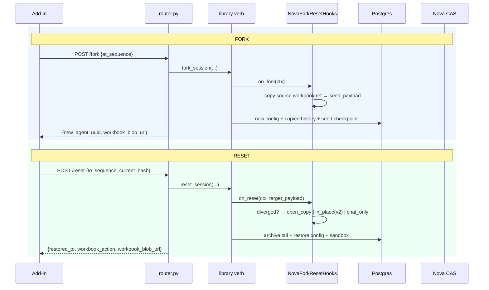

# Repo 2 — `nova_backend` — Pseudo-code Interface

> Nova backend exposes the **frontend-facing REST API** for fork/reset and the **workbook
> capture upload** endpoint, and **implements the library hook seams** (`on_capture` /
> `on_fork` / `on_reset`) with Excel-specific behavior: feature gating, async workbook-ref
> reconciliation, and divergence policy.
>
> Grounded on the real surface: the existing `excel_agent/router.py`,
> `excel_agent/snapshot_router.py` (`WorkbookSnapshotStore`, `(conversation_uuid,
> content_hash)` dedupe), `excel_agent/agent_factory.py` (principal threading,
> `register_settlement_deduction`), `principal_for(org, member)`, `NovaConfigAdapter` /
> `NovaConversationAdapter`.

---

## 1. REST API (new endpoints on `excel_agent/router.py`)

```python
@router.get("/{agent_uuid}/checkpoints")
async def list_checkpoints(agent_uuid, member=Depends(get_current_member),
                           limit=50, offset=0) -> CheckpointListResponse:
    """Powers the user-facing checkpoint picker. Member-private (bound principal)."""
    principal = principal_for(member.organization_id, member.member_id)
    refs, total = await CheckpointAdapter(db.pool).for_principal(principal) \
                        .list_refs(agent_uuid, limit=limit, offset=offset)
    # Join to conversation_history for the human label (user_message preview, completed_at).
    return CheckpointListResponse(items=[
        CheckpointItem(sequence_number=r.sequence_number, run_id=r.run_id,
                       created_at=r.created_at, fidelity=r.fidelity,
                       workbook_supported=_payload_supported(r))   # from consumer_payload
        for r in refs], total=total)


@router.post("/{agent_uuid}/fork")
async def fork_chat(agent_uuid, body: ForkRequest,
                    member=Depends(get_current_member)) -> ForkResponse:
    principal = principal_for(member.organization_id, member.member_id)
    new_uuid = body.new_session_id or str(uuid4())     # consumer mints the id (O15a)

    await fork_session(                                # library verb
        storage_handles(db.pool), source_uuid=agent_uuid, at_sequence=body.at_sequence,
        new_uuid=new_uuid, principal=principal, hooks=nova_hook_engine())

    # Hand the frontend a short-lived URL to the seeded workbook blob (turn-N copy), if any.
    seed = await CheckpointAdapter(db.pool).for_principal(principal).load(new_uuid, body.at_sequence)
    return ForkResponse(new_agent_uuid=new_uuid,
                        workbook_blob_url=_sign_blob(seed.consumer_payload))


@router.post("/{agent_uuid}/reset")
async def reset_chat(agent_uuid, body: ResetRequest,
                     member=Depends(get_current_member)) -> ResetResponse:
    principal = principal_for(member.organization_id, member.member_id)

    # Capture the consumer decision the on_reset hook produces (divergence verdict).
    decision_sink: dict = {}
    await reset_session(
        storage_handles(db.pool), agent_uuid=agent_uuid, to_sequence=body.to_sequence,
        principal=principal, sessions=session_manager(),
        hooks=nova_hook_engine(current_hash=body.current_workbook_hash, sink=decision_sink))

    return ResetResponse(restored_to=body.to_sequence,
                         workbook_action=decision_sink.get("workbook_action", "chat_only"),
                         workbook_blob_url=decision_sink.get("blob_url"))
```

```python
class ForkRequest(BaseModel):  at_sequence: int;  new_session_id: str | None = None
class ResetRequest(BaseModel): to_sequence: int;  current_workbook_hash: str | None = None
```

## 2. Workbook capture upload (extends `snapshot_router.py`)

Same multipart + `(conversation_uuid, content_hash)` dedupe the telemetry pipeline already uses —
but promoted from PNG tiles to a **restore-grade compressed `.xlsx`**, and it writes the ref back
into the library checkpoint's consumer slot.

```python
@snapshot_router.post("/excel/snapshot/capture")
async def upload_workbook_capture(request: Request,
                                  member=Depends(get_current_member)) -> CaptureUploadResponse:
    principal = principal_for(member.organization_id, member.member_id)
    manifest, xlsx = await _parse_capture_multipart(request)   # {agent_uuid, run_id, seq,
                                                               #  logical_hash, used_cells, bytes,
                                                               #  capture_api, restore_api}, blob

    # Ownership: agent_uuid must be owned by caller (library is_owned probe — existing P4/E8 pattern).
    if not await NovaConfigAdapter(db.pool).for_principal(principal).is_owned(manifest.agent_uuid):
        raise HTTPException(404)

    # Store the .xlsx in Nova CAS, deduped on content hash (re-submit => skip PUT).
    blob_ref = await WorkbookBlobStore(...).put_if_absent(content_hash(xlsx), xlsx)

    # Reconcile the async capture into the library checkpoint's consumer slot (status pending -> ready).
    await CheckpointAdapter(db.pool).for_principal(principal).update_consumer_payload(
        manifest.agent_uuid, manifest.sequence_number,
        {"workbook": {"status": "ready", "blob_ref": blob_ref,
                      "logical_hash": manifest.logical_hash, "used_cells": manifest.used_cells,
                      "bytes": manifest.bytes, "capture_api": manifest.capture_api,
                      "restore_api": manifest.restore_api, "feature_supported": True}})
    return CaptureUploadResponse(blob_ref=blob_ref, deduped=...)
```

## 3. Hook overrides (Nova implements the library seams)

Registered on the Nova hook engine wired into the agent factory (`agent_factory.py`).

```python
class NovaForkResetHooks:
    # --- capture: attach a PENDING workbook marker; the add-in's upload fills it in async ---
    async def on_capture(self, ctx: CaptureContext) -> HookOutcome | None:
        # The library is taking a point-in-time checkpoint. We don't have the .xlsx here
        # (it's captured client-side); we mark the slot pending so a fork/reset before the
        # upload lands degrades to chat-only rather than dangling.
        ctx.consumer_payload["workbook"] = {"status": "pending"}
        return None      # never blocks capture

    # --- fork: copy the source checkpoint's workbook ref into the fork's seed payload ---
    async def on_fork(self, ctx: ForkContext) -> HookOutcome | None:
        wb = ctx.source_payload.get("workbook", {})
        if wb.get("status") == "ready":
            # Share the SAME immutable blob (CAS) — the fork opens turn-N as a NEW workbook.
            ctx.seed_payload["workbook"] = {**wb, "origin": "fork"}
        return None

    # --- reset: divergence decision drives the workbook action ---
    async def on_reset(self, ctx: ResetContext) -> HookOutcome | None:
        wb = ctx.target_payload.get("workbook", {})
        if wb.get("status") != "ready":
            self.sink["workbook_action"] = "chat_only"            # nothing restore-grade to apply
            return None

        diverged = (self.current_hash is None
                    or self.current_hash != wb["logical_hash"])   # manual edits / different book
        if not diverged:
            # v2 fast path (validated only on plain data) — confirmation-gated at the FE.
            self.sink.update(workbook_action="in_place_replace", blob_url=_sign(wb["blob_ref"]))
        else:
            # v1 default: non-destructive. Offer the turn-N workbook as a COPY (validated path).
            self.sink.update(workbook_action="open_copy", blob_url=_sign(wb["blob_ref"]))
        return None
        # To hard-block a diverged reset instead, return HookOutcome(decision="block", reason=...).
```

## 4. Feature gating (Nova policy)

The add-in evaluates the gate at capture time and sends `feature_supported`; the backend
re-validates server-side (never trust the client) and is the source of truth for whether a
checkpoint is fork/reset-eligible.

```python
MIN_EXCEL_API = "1.13"          # insertWorksheetsFromBase64 (restore) — the binding floor
MAX_USED_CELLS = 1_200_000      # above this S1 restore hits Excel guards
MAX_WORKBOOK_BYTES = 40 * 2**20 # compressed .xlsx ceiling

def workbook_feature_supported(meta) -> bool:
    return (api_at_least(meta.restore_api, MIN_EXCEL_API)
            and meta.used_cells  <= MAX_USED_CELLS
            and meta.bytes       <= MAX_WORKBOOK_BYTES)
# Gate fails -> capture skipped, checkpoint.fidelity="none" -> fork/reset offered chat-only.
```

## 5. Billing note (existing settlement path)

Forked `Conversation` rows carry **zero usage/cost** (the library zeroes them), so
`AnalyticsReader.agent_totals` does not double-count the forked spend at org level. New turns in
the forked session settle normally through the existing `register_settlement_deduction` /
`on_usage_report` path under the forker's principal. No change to the settlement wiring.

## 6. Sequence: the backend's role in each op



## 7. Tests (Nova side)

- Router: fork creates a new owned session; reset archives (not deletes) and is idempotent.
- Capture upload: dedupe on content hash; pending→ready reconciliation; ownership 404.
- Hooks: divergence branch matrix (no-hash / match / mismatch / pending) → correct `workbook_action`.
- Gating: oversize/old-API → `feature_supported=false` → chat-only.
- Run the suite against the editable library source (breaks instantly if the library verb drifts).
