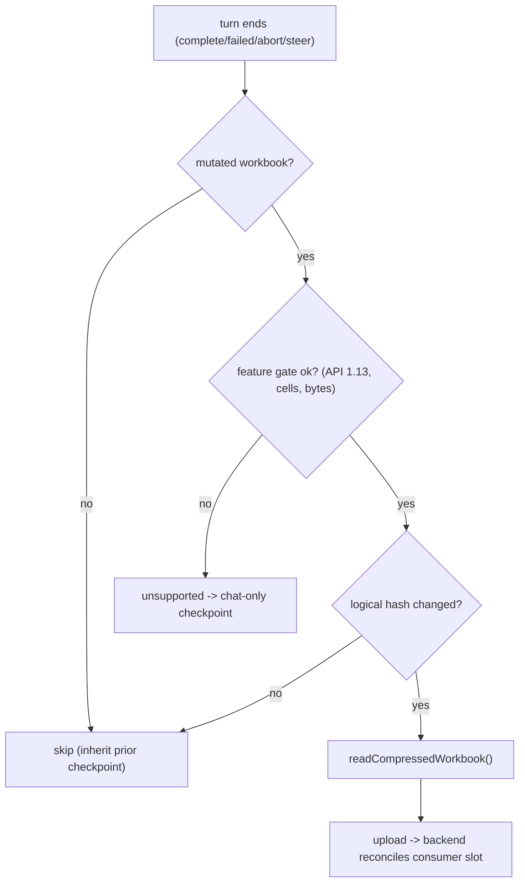

# Repo 3 — `nova_excel_addin` — Interface

> The add-in implements the **actual workbook capture and restore** (Office.js), the **feature
> gate**, and the fork/reset **UX orchestration**. See `SPEC.md` for the decision ledger.
>
> **Grounded on real code (verified 2026-06-16):** the capture/restore transport already exists on
> branch **`AuroSoni/benchmark-excel-reset`** at `src/lib/excel/workbook-file.ts` — `readCompressed
> Workbook`, `restoreWorksheetsFromBase64`, `bytesToBase64`, `isInsertWorksheetsApiAvailable`. The
> lifecycle snapshot pipeline is `src/lib/telemetry/{workbook-snapshot,run-session,snapshot-queue}.ts`,
> driven from `src/hooks/use-conversation.ts` + `src/lib/agent-stream.ts`. The ExcelApi gate is
> `isApiSupported` (`src/lib/excel/excel-service.ts:27`). NOTE: this transport is **not yet in the
> product branch** — lifting it from `AuroSoni/benchmark-excel-reset` is the first add-in task.

---

## 0. What changed from the original draft (read first)

The first draft invented `getFileAsyncCompressed()` / inline `insertWorksheetsFromBase64` /
`concat(slices)`. The **real, benchmarked API** (on `AuroSoni/benchmark-excel-reset`) is:

| Draft pseudo-name | Real API in `workbook-file.ts` |
|---|---|
| `getFileAsyncCompressed()` | `readCompressedWorkbook({sliceSize}) -> WorkbookFileResult` (sequential 4 MB slices; normalizes `slice.data` across hosts; closes the File handle in `finally`; ≤2 open handles) |
| inline `insertWorksheetsFromBase64` | `restoreWorksheetsFromBase64(base64, {sheetNamesToInsert, positionType, relativeTo})` — **inserts, never replaces**; caller deletes same-named sheets first |
| (none) | `bytesToBase64(bytes)` — chunked at 32 KB (avoids stack overflow at XL) |
| `Office.context.requirements.isSetSupported(...)` | `isInsertWorksheetsApiAvailable()` = `isApiSupported('ExcelApi','1.13')` |

## 1. Feature gate (capture-time, client-side)

```typescript
const MIN_API = "1.13";              // restore floor (insertWorksheetsFromBase64)
const MAX_USED_CELLS = 1_200_000;
const MAX_BYTES = 40 * 2 ** 20;

async function workbookFeatureSupported(): Promise<{ok: boolean; meta: WorkbookMeta}> {
  const meta = await measureWorkbook();              // used-range cells across sheets, sheet count
  const ok =
    isInsertWorksheetsApiAvailable() &&              // ExcelApi 1.13 gate (excel-service.ts:27)
    meta.usedCells <= MAX_USED_CELLS;                // bytes re-checked after the read
  return { ok, meta };
}
```

If `!ok`, the add-in does not capture; those checkpoints are workbook-less and the picker badges
them **chat-only**.

## 2. Capture — on the existing agent-run lifecycle (hardened per SPEC §D4)

The lifecycle snapshot pipeline already exists for telemetry. It fires on four events through
`TelemetryRunSession → enqueueSnapshot → snapshot-queue → workbook-snapshot`:

| Event | Source | Reset role | Coverage (D4) |
|---|---|---|---|
| `prompt` | `submitPrompt()` | pre-turn baseline | best-effort |
| `complete` | `emitCompleted()` | **the turn a user resets to** | **guaranteed** (never dropped) |
| `failed` | `emitFailed()` | failed-turn restore point | **add (new)** — today emits no snapshot |
| `abort` / `steer` | `emitAborted()` / `emitSteered()` | interruption boundaries | best-effort (may drop under saturation) |

**The two D4 changes** to the telemetry pipeline for restore-grade use:
1. **Guarantee `complete`** lands (never shed under `MAX_QUEUE_DEPTH` saturation) and **add a
   `failed`-turn snapshot** (`emitFailed` currently enqueues nothing).
2. Keep best-effort dropping only for the noisy soft triggers (`steer`/`abort`).

```typescript
async function captureWorkbookSnapshot(agentUuid, runId, sequenceNumber, trigger): Promise<CaptureOutcome> {
  // (a) mutation gate — skip read-only turns (from the agent's tool journal).
  if (!turnMutatedWorkbook(runId)) return { status: "skipped", reason: "read-only-turn" };

  // (b) feature gate.
  const { ok, meta } = await workbookFeatureSupported();
  if (!ok) return { status: "unsupported", meta };

  // (c) hash gate — logical hash over values+formulas+structure (~free per benchmark).
  const logicalHash = await computeLogicalHash();
  if (logicalHash === lastUploadedHash(agentUuid)) return { status: "skipped", reason: "unchanged" };

  // (d) THE capture — compressed, restore-grade .xlsx (benchmark winner, ~280 ms/MB on the client).
  const { bytes } = await readCompressedWorkbook();           // workbook-file.ts (sequential 4 MB slices)
  if (bytes.byteLength > MAX_BYTES) return { status: "unsupported", meta };

  // (e) upload out-of-band; backend reconciles into the checkpoint consumer slot.
  await api.uploadCapture(agentUuid, runId, sequenceNumber, {
    logicalHash, usedCells: meta.usedCells, bytes: bytes.byteLength,
    captureApi: "getFileAsync", restoreApi: "insertWorksheetsFromBase64@1.13",
  }, bytes);
  rememberUploadedHash(agentUuid, logicalHash);
  return { status: "ready" };
}
```

## 3. Restore — the validated path (into a NEW / blank workbook)

Used by **fork** and by **non-destructive reset** (`open_copy`). Exactly what the benchmark measured
(S1 into a blank book).

```typescript
async function openSnapshotAsWorkbook(blobUrl: string): Promise<void> {
  const xlsx = await downloadBlob(blobUrl);
  const base64 = bytesToBase64(xlsx);                          // chunked 32 KB encode
  await restoreWorksheetsFromBase64(base64, { positionType: "Beginning" });   // ExcelApi 1.13
  await dropPlaceholderSheets();                               // remove the blank book's default sheet
}
```

## 4. Restore in place — V1, properly tested (SPEC §F5, §6)

In-place revert of the **current** workbook. NOT what the blank-book benchmark measured, so it ships
**gated on the rich-data fidelity re-run** and a divergence-aware confirm so it never silently
discards manual edits made since the last captured boundary.

```typescript
async function replaceWorkbookInPlace(blobUrl: string): Promise<void> {
  await confirmDestructive();                                  // "This reverts the current workbook"
  const base64 = bytesToBase64(await downloadBlob(blobUrl));
  await Excel.run(async (ctx) => {
    // insert-then-delete: restoreWorksheetsFromBase64 INSERTS; delete the pre-reset sheets after.
    ctx.workbook.insertWorksheetsFromBase64(base64);
    await ctx.sync();
    await deleteOriginalSheets(ctx);
    await reconcileNamesAndActiveSheet(ctx);                   // named ranges, active sheet
    await ctx.sync();
  });
}
```

## 5. Orchestration

```typescript
async function forkChat(agentUuid: string, atSequence: number): Promise<void> {
  const { newAgentUuid, workbookBlobUrl } = await api.fork(agentUuid, { atSequence });
  if (workbookBlobUrl) await openSnapshotAsWorkbook(workbookBlobUrl);   // turn-N copy, new book
  await switchToSession(newAgentUuid);                                  // fork never touches the live book
}

async function resetChat(agentUuid: string, toSequence: number): Promise<void> {
  const currentHash = await computeLogicalHash();              // pre-flight divergence signal
  const { workbookAction, workbookBlobUrl } =
        await api.reset(agentUuid, { toSequence, currentWorkbookHash: currentHash });

  switch (workbookAction) {
    case "in_place_replace": await replaceWorkbookInPlace(workbookBlobUrl); break;  // V1 + confirm
    case "open_copy":        await openSnapshotAsWorkbook(workbookBlobUrl); break;  // diverged
    case "chat_only":        /* agent+sandbox reset already done server-side; leave the book */ break;
  }
  await reloadChatHistory(agentUuid);                          // tail archived server-side
}
```

## 6. Checkpoint picker (UI)

```typescript
async function loadCheckpointPicker(agentUuid: string) {
  const { items } = await api.listCheckpoints(agentUuid);
  // each: {sequence_number, run_id, created_at, fidelity, workbook_supported}
  //   full     -> "restores chat + workspace + workbook"
  //   degraded -> "large files skipped"
  //   none     -> "chat only"
  // Per-row actions: [Fork from here] [Reset to here]
}
```

## 7. Capture decision flow



## 8. Constraints carried from the benchmark

- **Capture cost** ~280 ms/MB on the client, paid only on mutating + changed turns. Negligible for
  typical models; a few seconds at XL (acceptable at a turn boundary, not a hot path).
- **Restore = `insertWorksheetsFromBase64` only** (S1). Diff (S3/S4) is **not** shipped (benchmark:
  not worth it; full insert is the XL-only survivor with no fallback cliff).
- **Min API 1.13** gates the whole feature; capture works on older hosts but restore does not, so
  the gate keys on the restore API.
- **GA gate (in flight):** re-run the restore benchmark on **rich** data (charts/pivots/styling) to
  convert the fidelity verdict from timing-proven to fully proven and to validate the in-place
  delete-then-insert choreography (§4). The benchmark harness lives on `AuroSoni/benchmark-excel-reset`
  (`src/lib/benchmark/restore/`).
