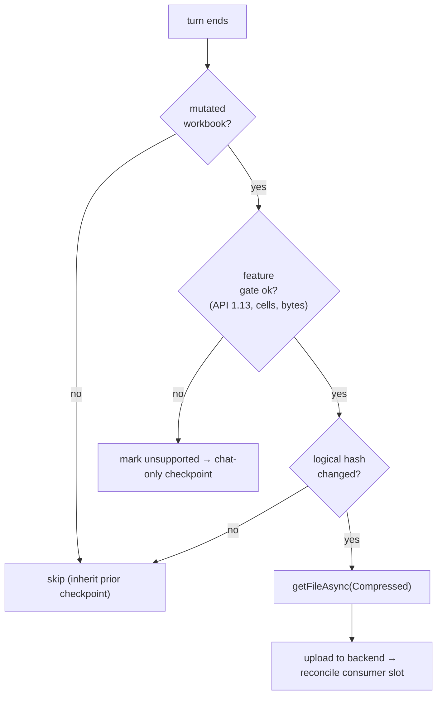

# Repo 3 — `nova_excel_addin` — Pseudo-code Interface

> The add-in implements the **actual workbook capture and restore** (Office.js), evaluates the
> **feature gate**, and **orchestrates** the fork/reset UX by calling the backend.
>
> Grounded on the benchmark outcome (`…/Temp/restore-benchmark-handoff-2026-06-14.md`):
> **capture = `getFileAsync(Compressed)`**, **restore = `insertWorksheetsFromBase64` (ExcelApi
> 1.13)**, restore-into-new-workbook is the validated path. Builds on the existing
> `src/lib/benchmark/` capture/restore modules and `workbook-file.ts` helpers
> (`bytesToBase64`, `restoreWorksheetsFromBase64`, `isInsertWorksheetsApiAvailable`) and the
> telemetry snapshot pipeline (`src/lib/telemetry/workbook-snapshot.ts`).

---

## 1. Feature gate (capture-time, client-side)

```typescript
const MIN_API: ExcelApiVersion = "1.13";        // restore floor (insertWorksheetsFromBase64)
const MAX_USED_CELLS = 1_200_000;
const MAX_BYTES = 40 * 2 ** 20;

async function workbookFeatureSupported(): Promise<{ok: boolean; meta: WorkbookMeta}> {
  const meta = await measureWorkbook();          // used-range cells across sheets, sheet count
  const ok =
    isInsertWorksheetsApiAvailable() &&          // ExcelApi 1.13 — gates BOTH capture+restore use
    Office.context.requirements.isSetSupported("ExcelApi", MIN_API) &&
    meta.usedCells <= MAX_USED_CELLS;            // bytes re-checked after getFileAsync
  return { ok, meta };
}
```

If `!ok`, the add-in does not capture; checkpoints for that turn are workbook-less, and the
fork/reset UI offers **chat-only** for them.

## 2. Capture — at each turn-end lifecycle trigger

The lifecycle hook points already exist (the telemetry pipeline fires on prompt / complete /
steer / abort). Capture is **mutation-gated** then **hash-gated** before the expensive byte grab.

```typescript
async function captureWorkbookSnapshot(agentUuid: string, runId: string,
                                       sequenceNumber: number): Promise<CaptureOutcome> {
  // (a) mutation gate — did this turn mutate the workbook? (from the agent's tool journal)
  if (!turnMutatedWorkbook(runId)) return { status: "skipped", reason: "read-only-turn" };

  // (b) feature gate
  const { ok, meta } = await workbookFeatureSupported();
  if (!ok) return { status: "unsupported", meta };

  // (c) hash gate — logical hash over values+formulas+structure (≈ free per benchmark).
  const logicalHash = await computeLogicalHash();          // serialize + SHA-256
  if (logicalHash === lastUploadedHash(agentUuid)) return { status: "skipped", reason: "unchanged" };

  // (d) THE capture — compressed, restore-grade .xlsx via 4 MB slices (benchmark winner).
  const xlsx = await getFileAsyncCompressed();             // ~280 ms/MB on the client
  if (xlsx.byteLength > MAX_BYTES) return { status: "unsupported", meta };

  // (e) upload out-of-band; backend reconciles into the checkpoint consumer slot.
  await api.uploadCapture(agentUuid, runId, sequenceNumber, {
    logicalHash, usedCells: meta.usedCells, bytes: xlsx.byteLength,
    captureApi: "getFileAsync", restoreApi: "insertWorksheetsFromBase64@1.13",
  }, xlsx);
  rememberUploadedHash(agentUuid, logicalHash);
  return { status: "ready" };
}

// getFileAsync reads the IN-MEMORY document → works for local AND shared-drive/cloud books
// (no Graph dependency). Reassemble from slices:
async function getFileAsyncCompressed(): Promise<Uint8Array> {
  const file = await officeGetFile(Office.FileType.Compressed, { sliceSize: 4 * 2**20 });
  const slices = await Promise.all(range(file.sliceCount).map(i => file.getSliceAsync(i)));
  await file.closeAsync();
  return concat(slices.map(s => s.data));
}
```

## 3. Restore — the validated path (into a NEW / blank workbook)

Used by **fork** and by **non-destructive reset** (`open_copy`). This is exactly what the
benchmark measured (S1 into a blank workbook).

```typescript
async function openSnapshotAsWorkbook(blobUrl: string): Promise<void> {
  const xlsx = await downloadBlob(blobUrl);
  const base64 = bytesToBase64(xlsx);
  // ExcelApi 1.13: rebuild sheets inside Excel's process (one bulk transfer — flattest scaler).
  await Excel.run(async (ctx) => {
    ctx.workbook.insertWorksheetsFromBase64(base64, {
      position: Excel.WorksheetPositionType.beginning,
    });
    await ctx.sync();
  });
  await dropPlaceholderSheets();    // remove the blank book's default sheet
}
```

```typescript
// v2 only — destructive in-place replace. NOT benchmarked (S1 was measured into a blank book).
// Gate behind explicit user confirmation; validate fidelity on rich data before shipping.
async function replaceWorkbookInPlace(blobUrl: string): Promise<void> {
  await confirmDestructive();                         // "This overwrites the current workbook"
  const base64 = bytesToBase64(await downloadBlob(blobUrl));
  await Excel.run(async (ctx) => {
    ctx.workbook.insertWorksheetsFromBase64(base64);  // insert snapshot sheets (suffixed)
    await ctx.sync();
    await deleteOriginalSheets(ctx);                  // then drop the pre-reset sheets
    await reconcileNamesAndActiveSheet(ctx);          // edge cases: named ranges, active sheet
    await ctx.sync();
  });
}
```

## 4. Orchestration

```typescript
async function forkChat(agentUuid: string, atSequence: number): Promise<void> {
  const { newAgentUuid, workbookBlobUrl } = await api.fork(agentUuid, { atSequence });
  if (workbookBlobUrl) await openSnapshotAsWorkbook(workbookBlobUrl);   // turn-N copy, new book
  await switchToSession(newAgentUuid);                                  // fork never touches the live book
}

async function resetChat(agentUuid: string, toSequence: number): Promise<void> {
  const currentHash = await computeLogicalHash();          // pre-flight divergence signal
  const { workbookAction, workbookBlobUrl } =
        await api.reset(agentUuid, { toSequence, currentWorkbookHash: currentHash });

  switch (workbookAction) {
    case "open_copy":  await openSnapshotAsWorkbook(workbookBlobUrl); break;   // v1 default (diverged)
    case "in_place_replace": await replaceWorkbookInPlace(workbookBlobUrl); break; // v2 + confirm
    case "chat_only":  /* agent+sandbox reset already done server-side; leave the book alone */ break;
  }
  await reloadChatHistory(agentUuid);                       // tail archived server-side
}
```

## 5. Checkpoint picker (UI)

```typescript
async function loadCheckpointPicker(agentUuid: string) {
  const { items } = await api.listCheckpoints(agentUuid);
  // Each item: {sequence_number, run_id, created_at, fidelity, workbook_supported}
  // Render a per-turn row; badge fidelity:
  //   full      → "restores chat + workspace + workbook"
  //   degraded  → "large files skipped"   none → "chat only"
  // Actions per row: [Fork from here] [Reset to here]
}
```

## 6. Capture decision flow



## 7. Constraints carried from the benchmark

- **Capture cost** ≈ 280 ms/MB on the client, paid only on **mutating + changed** turns
  (negligible for typical models; a few seconds at XL — acceptable for a turn boundary, not a hot path).
- **Restore** = `insertWorksheetsFromBase64` only; the diff strategies (S3/S4) are **not** shipped
  (benchmark: not worth it; full insert is the XL-only survivor and has no fallback cliff).
- **Min API 1.13** gates the whole feature — capture works on older hosts but restore does not, so
  the gate keys on the restore API.
- **Open item before GA:** re-run the restore benchmark on **rich** data (charts/pivots/styling) to
  convert the fidelity verdict from timing-proven to fully proven — and to validate the v2
  in-place-replace choreography, which the blank-workbook benchmark never exercised.
