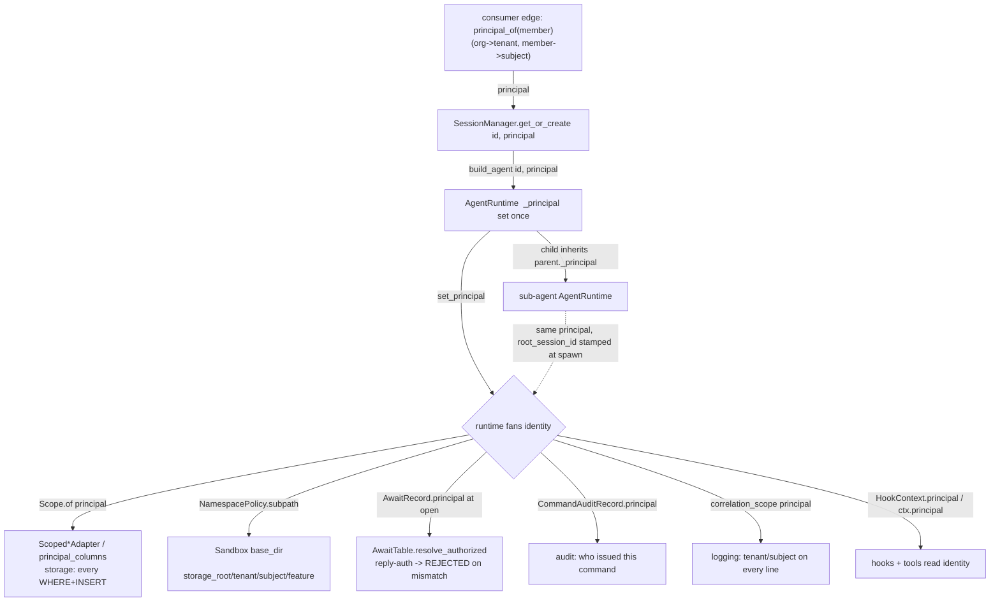
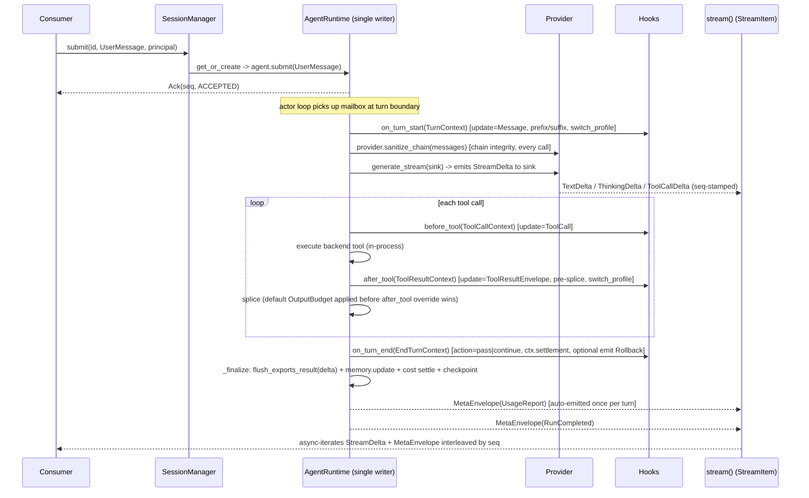
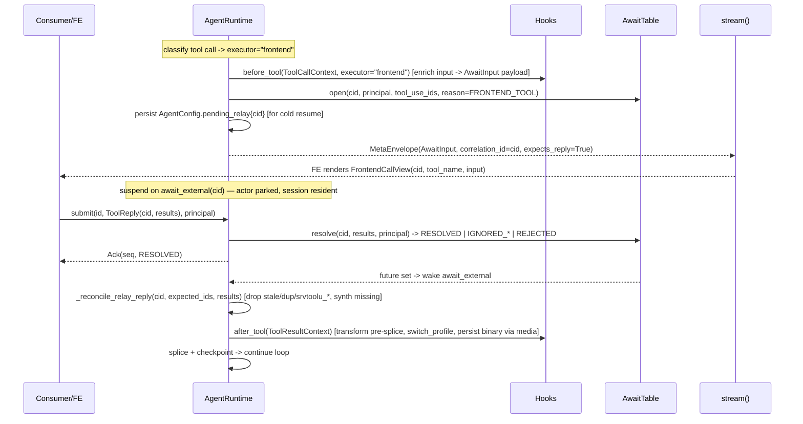
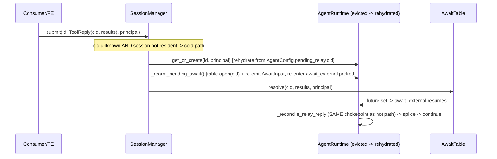
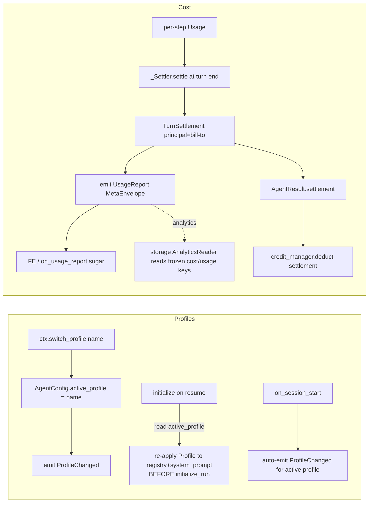

# agent-base Interface Redesign — Reconciliation

> Reconciles the 15 independently-designed subsystem interface documents in `interface_plan/subsystems/`
> against `interface_plan/DESIGN_CONTRACT.md` into **one coherent library**. This document is the
> authority where two subsystem docs diverge. It does **not** edit the subsystem docs; instead §7 lists
> the exact edit each doc needs to converge.
>
> Method: every shared type, seam, and home-module reference in all 15 docs was cross-checked for
> name/shape consistency, then grounded against the shipped source (`agent_base/core/`,
> `agent_base/tools/context.py`, `agent_base/session/`, `agent_base/await_table/`,
> `agent_base/streaming/`). Where the contract said "design BOTH variants," the still-open maintainer
> choice is recorded in §6; where two docs *accidentally* diverged, §3 picks the single answer.

**Status of the codebase (grounded facts that anchor every decision below):**

- `SessionPrincipal` **does not exist yet** anywhere in `agent_base/`. Its home module is therefore a
  free choice — and the 15 docs reference **three different paths** for it. Resolved in §1/§3-R1.
- `MetaEnvelope`/`MetaBody` do not exist yet; docs reference **two different paths**. Resolved in §1/§3-R2.
- `Disposition` (shipped, `agent_base/core/ack.py`) has exactly: `ACCEPTED, RESOLVED, IGNORED_STALE,
  IGNORED_DUP, CANCELLING, STEERING, REJECTED`. `NOT_FOUND`/`NOT_RUNNING`/`MISDIRECTED` are **proposed**, not shipped.
- `ToolReply` (shipped, `agent_base/core/commands.py`) is `{cid, results, meta, is_error}` — **no
  principal/target field**. This is load-bearing for the relay-auth seam (§2.2, §3-R7).
- `ToolContext` (shipped, `agent_base/tools/context.py`) carries `{run_id, tool_call_id, attempt,
  replay_reason, idempotency_key, _once_store}` + `once()` — **no `principal`, `sandbox`, `emit`, or
  `await_external`**. Five docs assume one or more of these are added. Resolved in §3-R3/R7.
- `agent_base/session/{manager,mailbox}.py`, `agent_base/await_table/{table,types}.py`,
  `agent_base/core/{commands,ack,audit}.py` are shipped (the control/await foundation the docs ratify).

---

## 0. The one-paragraph mental model

A caller holds a `SessionManager`. `get_or_create(root_session_id, principal)` returns a resident
single-writer `AgentRuntime` (one class; the provider is a value plugged into it). The runtime threads
**one** `SessionPrincipal` into storage (scope), sandbox (namespace), the await-table (reply-auth),
audit, logging, and every hook/tool context. Input enters through **one** door — `submit(AgentInput)
-> Ack` — across three planes (mailbox / joins / control). Output leaves through **one** door —
`stream() -> AsyncIterator[StreamItem]` where `StreamItem = StreamDelta | MetaEnvelope` — content
deltas and a correlated control channel interleaved by `seq`. A tool is just a callable; a *frontend*
tool is a runtime execution mode that emits `AwaitInput` (a `MetaBody`) with `correlation_id=cid`,
suspends on `await_external(cid)`, and resumes when `submit(ToolReply(cid, results))` lands. Lifecycle
hooks fire at capability-scoped boundaries, returning composable `HookOutcome`s. Cost, errors,
profiles, media flush, chain integrity, and output budgeting are **library defaults with override
seams** — never consumer reimplementations.

---

## 1. Shared-type glossary (one canonical definition each)

Every subsystem MUST import these from the canonical home below and MUST NOT redefine them. Where docs
currently disagree on the home path, the **Canonical home** column is binding (drift flagged in §3 and
fixed per-doc in §7).

| Type | Canonical home (binding) | Canonical shape (authority) | Notes / who owns evolution |
|---|---|---|---|
| `SessionPrincipal` | `agent_base/core/identity.py` | `@dataclass(frozen=True) SessionPrincipal{tenant: str\|None=None, subject: str\|None=None, claims: Mapping[str,Any]={}}` + pure ergonomics `scope_key`, `is_anonymous()`, `authorizes(other)`, `to_dict()/from_dict()` | **tenancy** owns the type + ergonomics; everyone consumes verbatim. Home chosen `core.identity` (majority: storage/hooks/core/sandbox/logging/memory already say `core.identity`). Generic `tenant`/`subject` naming is mandatory library-wide; no `organization`/`member` anywhere in the library. |
| `Scope` | `agent_base/storage/scope.py` | `@dataclass(frozen=True) Scope{tenant, subject}` + `Scope.of(principal)`, `is_unscoped()` | **tenancy** defines; **storage** consumes. The serializable *filter* projection of a principal (adapters never depend on `claims`). |
| `HookContext` | `agent_base/core/hooks/context.py` (re-exported from `agent_base/hooks`) | base: `{run_id, agent_id, parent_agent_id, principal, executor, sandbox, storage, media, memory, agent_config, conversation, emit, once, logger}` — see §3-R4 for the reconciled field set | **agent-loop-hooks** owns. Subclasses add ONLY capabilities legal for that hook. |
| `HookOutcome` | `agent_base/core/hooks/outcome.py` | `{decision: "proceed"\|"block"="proceed", reason, update: Any\|None, additional_context, events: list[MetaBody], switch_profile: str\|None=None}` (the `switch_profile` field is the §3-R5 resolution) | **agent-loop-hooks** owns. Specialized: `TurnStartOutcome`, `EndTurnOutcome`. Composition: decision most-restrictive-wins; `update` chains in registration order; `additional_context`/`events` concatenate; `switch_profile` last-non-None-wins. |
| `MetaEnvelope` | `agent_base/streaming/meta.py` | `@dataclass(frozen=True) {event_id, run_id, agent_id, parent_agent_id, seq, ts, correlation_id=None, expects_reply=False, kind="", body: MetaBody}` + `to_wire()/from_wire()` | **streaming-and-meta** owns. Header stamped by the runtime, never the consumer. |
| `MetaBody` | `agent_base/streaming/meta.py` | discriminated union base (`kind: ClassVar[str]`, `to_payload()/from_payload()`). Members: `AwaitInput`, `ProfileChanged`, `UsageReport`, `ErrorReport`, `Rollback`, `RunStarted`, `RunCompleted`, `FilesUpdated`, `Custom` | **streaming-and-meta** owns the union + registry; producing subsystems (pricing→`UsageReport`, core→`ErrorReport`, relay→`AwaitInput`, profiles→`ProfileChanged`) supply the **payload shape** but register it here. |
| `FrontendCallView` | `agent_base/streaming/meta.py` | `@dataclass(frozen=True) {cid, tool_name, input: dict}` where `cid == tool_use_id` (the reply key) | **streaming** owns. See §3-R6 for the field-name reconciliation (`cid`/`tool_name` vs `tool_use_id`/`name`). |
| `StreamDelta` (+ subclasses) | `agent_base/streaming/types.py` | base `{agent_uuid, type="", is_final=False, parent_agent_uuid: str\|None=None, seq: int=0}` + `to_wire()/from_wire()`. Subclasses: `TextDelta, ThinkingDelta, ToolCallDelta, ToolResultDelta, CitationDelta, ErrorDelta` (and `RollbackDelta` as a deprecated alias — §6 Fork D) | **streaming** owns. `parent_agent_uuid`+`seq` are additions for sub-agent attribution parity — the **loop** must stamp them (§3-R6). |
| `ErrorCode` | `agent_base/core/errors.py` | closed `str` Enum; the single error vocabulary (see §3-R8 for the reconciled member list) | **core** owns the taxonomy; **streaming** (`ErrorDelta.code`) and **providers** (`ProviderError`→map) import it. Exactly one enum (§3-R8). |
| `StreamItem` | `agent_base/streaming/__init__.py` | `StreamItem = StreamDelta \| MetaEnvelope` | **streaming** owns; the read surface element type. |
| `AgentInput` | `agent_base/core/commands.py` (shipped) | `UserMessage \| ToolReply \| Abort \| Steer` | **core/commands** (shipped) — kept verbatim. |
| `ToolReply` | `agent_base/core/commands.py` (shipped) | `@dataclass(frozen=True, kw_only=True) {cid, results: list[ContentBlock], meta: CommandMeta, is_error=False}` — **no principal field** (auth rides `submit(..., principal=)`, §3-R7) | **core/commands** (shipped). |
| `Ack` | `agent_base/core/ack.py` (shipped) | `@dataclass(frozen=True) {seq, disposition: Disposition, detail: str\|None}` | **core/ack** (shipped). |
| `Disposition` | `agent_base/core/ack.py` (shipped, extended additively) | shipped 7 + proposed `NOT_FOUND`, `NOT_RUNNING` (and reserved-but-not-yet-used `MISDIRECTED` — §6 Fork F) | **session-control** owns the additive extension; **relay** and **tenancy** consume `REJECTED`. See §3-R9 for the principal-mismatch verdict. |
| `ToolContext` (`ctx`) | `agent_base/tools/context.py` (shipped, extended) | shipped `{run_id, tool_call_id, attempt, replay_reason, idempotency_key, _once_store}` + `once()`; **+ `sandbox: Sandbox\|None`, `principal: SessionPrincipal\|None`, `emit: Callable[[MetaBody],None]`, `await_external(...)`** (the §3-R3/R7 additions) | **tools** owns the type; the **loop** populates `emit`/`await_external`/`sandbox`/`principal` at call-time. |
| `ToolResultEnvelope` | `agent_base/tools/tool_types.py` (shipped ABC, extended) | ABC with `for_context_window() -> list[ContentBlock]`, `for_conversation_log() -> ToolLogProjection`; + `from_blocks/from_text/from_image` builders; stable mutation surface `with_text/append_text/with_blocks` (§3-R10) | **tools** owns. This is the `after_tool` `update=` payload (§3-R10 reconciles the `ToolResult` vs `ToolResultEnvelope` naming). |
| `ToolCall` | `agent_base/tools/tool_types.py` | `{name: str, input: dict}` (+ `with_input(...)`) — the `before_tool` `update=` payload | **tools** owns. |
| `StorageHandles` | `agent_base/storage/handles.py` | `@dataclass(frozen=True) {config: AgentConfigAdapter, conversation: ConversationAdapter, run: AgentRunAdapter, analytics: AnalyticsReader\|None=None}` | **storage** owns (confirmed); **hooks** consumes on `HookContext.storage`. The optional `analytics` field is accepted. |
| `Sandbox` | `agent_base/sandbox/sandbox_types.py` (shipped ABC, extended) | existing ABC + concrete path-grammar (`resolve_agent_path`, `check_allowed`, `assert_allowed`, …), bulk ops (`import_tree`, `extract_archive`, `staging`), `layout: ZoneLayout` | **sandbox** owns. Referenced by `HookContext.sandbox` and `ToolContext.sandbox`. |
| `MediaBackend` | `agent_base/media_backend/media_types.py` (shipped ABC, extended) | existing ABC + `to_content_block`, static `content_block_from_bytes`, `flush_exports` (now delta), `flush_exports_result`, `find_by_content_hash`, `flush_strategy`, optional `.blob_store` | **media-backend** owns. |
| `MemoryStore` | `agent_base/memory/base.py` (Protocol + `BaseMemoryStore` ABC) | `retrieve(ctx: MemoryRetrieveContext) -> list[ContentBlock]`, `update(ctx: MemoryUpdateContext) -> MemoryUpdate` | **memory** owns. |
| `Provider` | `agent_base/core/provider.py` (shipped, expanded) | Protocol: `generate`, `generate_stream(sink=…)`, `build_request`, `parse_response`, `translate_event`, `classify_error -> ProviderError`, `sanitize_chain`, `plan_stream_abort`, `extract_tool_calls`, `collect_api_files`, `name`, `default_model()`, `llm_config_cls()`, `coerce_llm_config()`, `token_estimator` | **providers** owns. |
| `AgentRuntime` | `agent_base/core/runtime.py` (new home; lifted out of `AnthropicAgent`) | the ONE provider-agnostic agent class holding a `Provider` value | **providers** owns the boundary; **session-control** + **relay** + **agent-loop-hooks** all attach behavior to it. (§6 Fork E gates the lift.) |
| `Profile` | `agent_base/profiles.py` | `@dataclass(frozen=True) {name, tools, frontend_tools, system_prompt, tail, ui_capabilities}` | **agent-loop-hooks** owns; persisted as `AgentConfig.active_profile: str\|None`. |
| `Settlement` / `TurnSettlement` | `agent_base/core/cost.py` | the once-per-turn billing fact carrying `{agent_id/agent_uuid, run_id, parent_agent_id, principal, turn_usage, turn_cost, cumulative_*, model, step_count}` | **core** + **pricing-cost** co-own — see §3-R11 (the two docs ship *two names for one type*; reconciled to one). |
| `CostBreakdown` | `agent_base/core/cost.py` | `{total_cost, currency="USD", breakdown: dict, run_id: str\|None}` + `to_dict()/from_dict()` + `__add__` | **core** owns the type + serialization; **pricing-cost** owns the `__add__` accumulation + the `run_id` promotion. |
| `Serializable` + `SCHEMA_VERSION_KEY` | `agent_base/core/serializable.py` | Protocol + `_v` stamping; the canonical `.to_dict()` contract for wire-crossing entities | **core** owns. **pricing-cost** must adopt the same version constant (§3-R12). |
| `AwaitTable` / `AwaitRecord` / `AwaitReason` / `Join` | `agent_base/await_table/{table,types}.py` (shipped, extended) | `AwaitRecord` gains `principal: SessionPrincipal\|None`; `AwaitTable.resolve(cid, results, *, principal=None) -> Disposition` may return `REJECTED` | **relay-await** owns. |

**Naming bridge (binding, library-wide):** the contract's generic `tenant`/`subject` are canonical.
Nova's `organization_id → tenant`, `member_id → subject`, mapped exactly once at the consumer edge
(`principal_of(member)`). No library symbol, column default, or log field uses `organization`/`member`.

---

## 2. Cross-subsystem wiring (end-to-end)

### 2.1 Identity flow (the spine): how `SessionPrincipal` reaches the four planes + audit + logs



Key invariant: **identity is supplied once** (at `get_or_create`/construction) and **never
hand-passed per subsystem**. The recommended composition (§6 Fork A) is "ambient `SessionPrincipal`
(behavioral planes) **+** persisted `owner_tenant/owner_subject` columns (storage projection)" so that a
cold-load resume restores ownership from the row even if a direct constructor forgot the principal.

### 2.2 A normal turn (mailbox → loop → finalize)



### 2.3 A frontend-tool round-trip (the unified relay — no second endpoint, no uuid spoof)



Cross-seam contract for this round-trip (who owns what):
- **streaming** owns the wire shape of `AwaitInput`/`FrontendCallView` and `correlation_id`.
- **relay-await** owns `await_external`, the `AwaitTable`, `_reconcile_relay_reply` (the resume-boundary
  chain integrity), and `cid` allocation.
- **agent-loop-hooks** owns `before_tool`/`after_tool` and *where in the relay path they fire*.
- **tenancy** owns that `AwaitRecord.principal` is the auth subject; **session-control** owns that
  `submit(ToolReply, principal=)` carries the claimant identity.
- **media-backend** owns the binary-attachment ↔ `ContentBlock` codec used inside `after_tool`.

### 2.4 An abort (preemptive, awaited — no race window)

```mermaid
sequenceDiagram
    participant C as Consumer
    participant SM as SessionManager
    participant RT as AgentRuntime
    participant AT as AwaitTable
    C->>SM: status(id)  [peek; no materialize]
    alt not in_flight
        SM-->>C: NOT_RUNNING (409)
    else in flight
        C->>SM: submit(id, Abort(), principal)
        SM->>RT: principal check -> match? else NOT_FOUND
        RT->>RT: _do_abort() interrupt critical section (AWAITED)
        RT->>AT: interrupt(root) -> bump generation, close every OPEN cid
        Note over AT: a racing ToolReply(cid) now resolves to IGNORED_STALE (no-op)
        RT->>RT: drain mailbox + run tool on_abort() + bounded hard-cancel backstop
        RT-->>C: Ack(seq, CANCELLING)  [slot is genuinely free on return]
    end
    Note over RT: on_abort hook fires; optional ctx.emit(ErrorReport ABORTED / Rollback)
```

Disconnect ≠ cancel: an SSE reader leaving calls `SessionManager.detach(id)` (turn keeps running);
only an explicit `submit(Abort())` cancels. The abort generation bump is what makes a late/duplicate
`ToolReply` idempotent (the C7 race fix).

### 2.5 A resume (cold-load — same primitive, one door)



The hot/cold boundary is invisible to the consumer (one `submit(ToolReply)`); `_reconcile_relay_reply`
runs inside `await_external`, which both paths re-enter — so chain integrity has exactly one chokepoint.

### 2.6 Profile persistence + restore; cost flow



Cost has exactly **one** delivery mechanism (the `UsageReport` MetaEnvelope) with `AgentResult.settlement`
as the awaited-caller copy of the same object; `on_usage_report(cb)` is sugar over the channel (§6 Fork
G recommends A — no second lifecycle hook). The frozen `CostBreakdown.to_dict()`/usage keys are the
contract the storage `AnalyticsReader` projects into typed rows.

---

## 3. Conflicts and resolutions

Each row is a place two (or more) docs diverged, or a seam-ownership question a doc flagged. The
**Resolution** column is binding; the per-doc edit it implies is in §7.

| # | Area | Subsystems | Conflict / question | Resolution (binding) |
|---|---|---|---|---|
| **R1** | Home of `SessionPrincipal` | tenancy (`core.principal`), relay-await (`core.tenancy`), storage/hooks/core/sandbox/logging/memory/pricing (`core.identity`) | Three different import paths for the same not-yet-existing type. | **`agent_base/core/identity.py`** is canonical (majority + logging §7.2 asks for a shared `core.identity` home for field names too). Tenancy doc's `core/principal.py` and relay's `core/tenancy.py` are wrong; both must import from `core.identity`. The tenancy doc still *owns* the type and its ergonomics — it just lives at `core.identity`. |
| **R2** | Home of `MetaEnvelope`/`MetaBody` | streaming (`streaming.meta`), relay (`streaming.meta`), hooks (`streaming.meta`), tools (`core.meta`), core (`core.meta`), memory (`core.meta`), pricing (`core.commands`) | Two/three paths for the meta types. | **`agent_base/streaming/meta.py`** is canonical (streaming owns the union + wire codec; relay+hooks already agree). tools/core/memory must import from `streaming.meta`, not `core.meta`; pricing must not put `UsageReport` in `core.commands`. |
| **R3** | Does `ToolContext` gain `sandbox`/`emit`/`await_external`/`principal`? | tools, sandbox, streaming, relay, media, pricing, python-executors | Shipped `ToolContext` has none of these; multiple docs read `ctx.sandbox`, `ctx.emit`, `ctx.await_external`, `ctx.media`, `ctx.principal`. | **Add all four to `ToolContext`** (`tools` owns the field additions): `sandbox: Sandbox\|None`, `principal: SessionPrincipal\|None`, `emit: Callable[[MetaBody],None]`, and `await_external(...)`. The **loop** populates them at call-time (the loop already attaches the sandbox via `registry.attach_sandbox` → `set_sandbox`; it now also threads them onto `ctx`). `ctx.media` is reached via `ctx.sandbox`? No — add `media: MediaBackend\|None` too (media doc reads `ctx.media.blob_store`). python-executors keeps `ctx` **optional** (`run(code, *, ctx=None)`) — it only reads identity/idempotency, never emits. |
| **R4** | `HookContext` field set | hooks (full set incl. `executor`, `agent_config`, `conversation`, `logger`), contract §1.2 (no `executor`/`agent_config`/`conversation`/`logger`), session-control (contract subset) | The contract's §1.2 `HookContext` omits fields the hooks doc adds. | **Adopt the hooks-doc superset** as canonical (`executor`, `agent_config`, `conversation`, `logger` added to the contract base). These are additive and load-bearing (`ctx.executor` branches relay; `ctx.agent_config` for profile reads; `logger` for §7.2 correlation). The contract §1.2 is the *minimum*; the hooks doc is authoritative for the full shape. |
| **R5** | `switch_profile`: imperative `ctx.switch_profile()` vs outcome field | hooks (flagged), tools, core, providers | Two frontend results in one `ToolReply` could each switch; imperative form has ambiguous ordering and isn't composable. | **Model it as BOTH**: keep `ctx.switch_profile(name)` as the ergonomic imperative call (it sets a pending value), and add `HookOutcome.switch_profile: str\|None=None` as the composable channel with **last-non-None-wins** in registration order. The runtime applies the folded value once, post-composition. This resolves the hooks-doc Q4 and matches the contract's `ctx.switch_profile()` wording while making it deterministic. |
| **R6** | `FrontendCallView` / `StreamDelta` field names + who stamps attribution | streaming (`FrontendCallView{cid, tool_name, input}`), relay (`FrontendCallView{tool_use_id, name, input}`), hooks (`FrontendCallView{tool_use_id, name, input}`) | Same type, two field spellings; and `StreamDelta` gains `parent_agent_uuid`/`seq` only if the loop stamps them. | Canonical `FrontendCallView{cid, tool_name, input}` (streaming owns it; `cid == tool_use_id`). Relay + hooks docs must rename `tool_use_id→cid`, `name→tool_name`. **The loop MUST stamp `parent_agent_uuid` + `seq` on every `StreamDelta`** (not only on `MetaEnvelope`), so content-delta sub-agent attribution needs no side map. |
| **R7** | Relay reply-auth: where the principal check lives + does `ToolReply` carry it | tenancy (`resolve_authorized` in table), relay (`resolve(…, principal=)` in table), session-control (`submit(…, principal=)` carries it; check is library mechanism) | Three placements; `ToolReply` has no principal field today. | **`ToolReply` stays principal-free** (shipped shape kept). The claimant identity rides `SessionManager.submit(sid, ToolReply, principal=)`. The **auth check lives in the await-table** as `AwaitTable.resolve(cid, results, *, principal=)` (merge tenancy's `resolve_authorized` INTO `resolve` — one method, not two) so it is enforced regardless of caller. The table holds the owner via `AwaitRecord.principal` (stamped at `open`). The *policy* is injectable (`PrincipalPolicy` at `SessionManager` construction); the *mechanism* is the library's. |
| **R8** | Error taxonomy: one enum or three | core (`ErrorCode`), streaming (`ErrorCode`), providers (`ProviderErrorKind`) | Three parallel enums for the same concept. | **One enum: `agent_base/core/errors.py::ErrorCode`** is the single source of truth. streaming's `ErrorCode` must BE this import (not a parallel def). providers' `ProviderErrorKind` is allowed to exist as a **provider-internal** classification BUT must map 1:1 onto `ErrorCode` via a documented table, and `ProviderError`→`MetaBody.ErrorReport(code=ErrorCode…)` at the runtime edge. Reconciled member set (union of all three, deduped): `PROVIDER_OVERLOADED, RATE_LIMITED, PROVIDER_TIMEOUT, PROVIDER_AUTH, PROVIDER_BAD_REQUEST, PROVIDER_STATUS, CONTEXT_OVERFLOW, CREDITS_EXHAUSTED, TOOL_FAILED, ABORTED, AUTH, VALIDATION, INTERNAL`. (streaming's `PROVIDER_SERVER_ERROR`→`PROVIDER_STATUS`; providers' `FATAL`→`INTERNAL`; providers' `TRANSIENT` is conveyed by `retriable=True`, not a code.) |
| **R9** | Principal mismatch disposition: `REJECTED` vs `NOT_FOUND` vs `IGNORED_STALE` | tenancy (`REJECTED`), relay (`REJECTED`, but flags IGNORED_STALE option), session-control (`NOT_FOUND` for submit-level; no existence leak) | Two different dispositions for "wrong tenant." | **Two distinct checks, two dispositions, by layer**: (a) `SessionManager.submit` addressing a *session* owned by another principal → `NOT_FOUND` (no existence leak about whether the session exists). (b) `AwaitTable.resolve` for a *cid* whose record principal mismatches → `REJECTED` (the cid was a valid reply target; the reply is refused for auth). These do not conflict — they fire at different granularities. Relay must NOT downgrade the cid mismatch to `IGNORED_STALE` (that would hide auth failures). |
| **R10** | `after_tool` `update=` payload type: `ToolResult` vs `ToolResultEnvelope` | contract §2 (`update=ToolResult`), hooks/relay/tools/core (`ToolResultEnvelope`) | Contract table says `ToolResult`; shipped pre-splice unit is `ToolResultEnvelope` (dual projection). | **`ToolResultEnvelope`** is canonical for `after_tool`/`on_tool_error` `update=`. The contract's "`ToolResult`" is shorthand. tools must ship the stable mutation surface `with_text/append_text/with_blocks` + `from_blocks/from_text/from_image` (the override examples in hooks §3 and relay §3.3 depend on it). `before_tool` `update=` is `ToolCall{name, input}`. |
| **R11** | Settlement type: `Settlement` (core) vs `TurnSettlement` (pricing) | core (`Settlement{agent_uuid, run_id, cost, usage, principal}`), pricing (`TurnSettlement{agent_id, run_id, parent_agent_id, principal, turn_usage, turn_cost, cumulative_*, model, step_count}`) | Two names + two shapes for the once-per-turn billing fact. | **One type: `TurnSettlement`** at `agent_base/core/cost.py` with the pricing-doc superset of fields (it carries `parent_agent_id`, cumulative, model, step_count — all needed for attribution + analytics). core's `Settlement` is the same concept under a shorter name — core must rename to `TurnSettlement` and adopt the superset. `EndTurnContext.settlement: TurnSettlement` (the field core's billing example reads). `AgentResult.settlement: TurnSettlement\|None`. **pricing computes it (`_Settler`); core owns the type + serialization.** |
| **R12** | Serialization version constant: one or many | core (`CORE_SCHEMA_VERSION`, `SCHEMA_VERSION_KEY="_v"`), storage (`SCHEMA_VERSION=3`, `LIBRARY_SCHEMA_VERSION=3`), pricing (`SERIALIZATION_VERSION=1`), streaming (`WIRE_PROTOCOL_VERSION="1"`) | Four version counters. | **Separate concerns, but de-duplicate within each**: (a) **entity wire shape** → `core.serializable.CORE_SCHEMA_VERSION` with the `_v` key; pricing's `SERIALIZATION_VERSION` MUST become this import (one entity-serialization version, not a per-subsystem counter). (b) **storage DB schema** → `storage.LIBRARY_SCHEMA_VERSION` (DDL/migrations — legitimately separate from wire). (c) **wire protocol** → `streaming.WIRE_PROTOCOL_VERSION` (the SSE byte contract — legitimately separate). So: collapse pricing→core; keep storage-DDL and streaming-wire distinct (they version different things). Document the three as distinct axes. |
| **R13** | Rollback channel: content delta vs MetaBody | streaming (Fork F-1, recommends MetaBody), hooks (`on_turn_end` emits `Rollback(...)`), contract §1.4 + §3 (lists in BOTH) | Contract has `RollbackDelta` (content) AND `Rollback` (meta). | **`Rollback` is a `MetaBody`** (streaming Variant B). `RollbackDelta` becomes a one-major-version back-compat alias the codec maps to a `Rollback` envelope. `ctx.emit(Rollback(...))` targets the meta channel. hooks `on_turn_end` and the abort path both agree. (This is also §6 Fork D for the maintainer's explicit sign-off, but the reconciled default is B.) |
| **R14** | Blob-store ownership (media vs storage) | media-backend (proposes `BlobStore`), storage (snapshots/skills out of scope except "reusable blob-store proposal" → routed to media) | Could become a 4th object-store interface if storage also proposes one. | **`BlobStore` is owned by media-backend** at `agent_base/blob_store/` (the contract §5 explicitly routes the reusable content-addressed store there). Storage consumes it for nothing of its 3 tables; consumer snapshot/skill stores (out of library scope) reuse it. Storage's only obligation: expose `is_owned(agent_uuid, principal)` so those stores authorize against the library tables. There must be exactly one S3 client + one `safe_blob_key` + one `S3Settings.from_env` — all in `blob_store`. |
| **R15** | Media flush registry location | media (sidecar/sentinel default; consumer may inject a table), storage (column-registry/extra-table story) | Where the cross-turn blake3 registry persists; overlaps storage's extra-table story. | **Default registry lives in media** (`MediaFlushRegistry`, sidecar/sentinel record), consumer-injectable. It is NOT one of the 3 library tables and NOT a storage-owned table by default. If a consumer wants it in Postgres, they inject a `MediaFlushRegistry` impl using the storage-injected pool — but the library default is media-local. (Removes the `extras['export_hash_registry']` smell either way.) |
| **R16** | Image budget / `image_block` ownership | tools (`image_block`, `ImageContent.from_bytes_capped`), media (`fit_image_to_budget`, `image_content_from_bytes`, `content_block_from_bytes`) | Both docs ship an image-budget pipeline; the library's own `common_tools/read_file.py` is the duplicate to delete. | **media-backend owns the canonical pipeline** (`fit_image_to_budget`/`image_content_from_bytes`/`content_block_from_bytes` in `agent_base/media_backend/projection.py`). tools' `image_block`/`ImageContent.from_bytes_capped` become **thin wrappers** over media's pipeline (tools must not re-implement Pillow). When a `MediaBackend` is configured, tool binary persistence (`emit_capped_bytes`) delegates to `MediaBackend`/`BlobStore`; otherwise it falls back to the sandbox. `ImageBudget` is media's type; tools imports it. |
| **R17** | Output budget: chars vs tokens; per-tool default vs sub-agent token budget | tools (`OutputBudget.max_chars=25_000`), python-executors (`max_output_chars=50_000` print buffer), sub-agent (`max_tool_result_tokens=25_000`, a TOKEN budget) | `25_000` chars collides numerically with a `25_000`-*token* budget; two truncation layers compose but confuse. | **Budgeting is char-based at the tool-result layer** (`OutputBudget.max_chars`, default 25_000 chars) — it is a sandbox-offload reference, not a token cap. The sub-agent `max_tool_result_tokens` is a **separate token budget** at a different layer; rename is not required but the docs MUST state they are different units/layers. The executor's `max_output_chars` (print buffer, 50_000) is a **third, upstream** layer. The three compose; document them as distinct so consumers stop double-truncating (the F6 root cause). The per-tool `OutputBudget.max_chars` does NOT auto-derive from the sub-agent token value (different units). |
| **R18** | Chain-integrity home: provider `sanitize_chain` vs runtime `_reconcile_relay_reply` vs shared `ensure_chain_validity` | providers (`provider.sanitize_chain` before every generate), relay (`_reconcile_relay_reply` at resume), hooks (single chokepoint), agent-loop (relay-result validation home) | Two related but distinct guarantees risk being conflated or duplicated. | **Two distinct, complementary chokepoints, both library-owned**: (a) **pre-generate** chain validity (drop orphaned/duplicate tool_results, strip `srvtoolu_*`, reorder) = `provider.sanitize_chain(messages)`, called by the runtime before EVERY `generate`. Providers share a common `ensure_chain_validity` helper so Anthropic/LiteLLM don't diverge; `Provider.sanitize_chain` defaults to it. (b) **resume-boundary** validation of an UNTRUSTED `ToolReply` against the parked await = `_reconcile_relay_reply(cid, expected_ids, reply)`, owned by **relay-await**, called inside `await_external`. These are NOT the same code: (a) repairs the accumulated context; (b) validates a single incoming reply. Neither is ever a consumer responsibility. The relay doc owns (b); providers own (a)'s shape; the loop calls both. |
| **R19** | `on_session_start` firing point | session-control (fires in `get_or_create`, pre-publish), hooks (catalog owner; could fire in `initialize()`) | Risk of double-firing on resume if both fire it. | **Fires exactly once, in `SessionManager.get_or_create`, pre-publish** (session-control's placement), via `agent._run_hook("on_session_start", ctx)`. The hooks subsystem owns the `SessionContext`/`HookOutcome` types and the `_make_session_context`/`_run_hook` machinery but does NOT fire session-start inside `AnthropicAgent.initialize()`. `block` ⇒ discard the half-built agent (`SessionBlocked`). |
| **R20** | Profile config source of truth: ctor `default_profile=` vs `on_session_start` handlers | hooks (flagged Q5) | Overlap between `default_profile=` kwarg and `set_profiles`/`set_default_profile` handlers. | **Ctor `default_profile=` is canonical** for the cold-create default; `on_session_start` `set_profiles`/`set_default_profile` handlers are the **dynamic per-session override** (e.g. choose profile from `principal.claims["role"]`). On resume, the **persisted `active_profile` wins** over both. Precedence: persisted active_profile (resume) > on_session_start handler (dynamic) > ctor default_profile (cold create). |
| **R21** | `ctx.emit` sync vs async under backpressure | hooks (flagged Q2), streaming (owns queue policy) | A sync `emit` can drop/raise under queue backpressure. | **`emit` stays synchronous** (`Callable[[MetaBody], None]`, per contract §1.2) with **lossy-by-policy** semantics: the runtime's output queue is unbounded OR drops-with-a-logged-warning on full (like a log line), never blocks the loop and never raises into a hook body. streaming documents the queue as unbounded/lossy. A hook that needs delivery guarantees uses `events=[...]` on its `HookOutcome` (applied by the runtime, not fire-and-forget). |
| **R22** | `AgentConfig.to_dict()` — entity method vs storage codec | core (Fork S1: entity methods for the wire-crossing trio; `AgentConfig` stays storage-owned), storage (column-registry codec) | Contract §6 mandates uniform `.to_dict()`, but `AgentConfig` is deliberately storage-serialized. | **Split by entity**: `Conversation`/`AgentResult`/`CostBreakdown`/`Usage`/`TurnSettlement` get entity `.to_dict()` (core Variant S1 — these cross the wire). **`AgentConfig` stays storage-codec-owned** (it is heavy: tool schemas, sandbox config, pending_relay; it never crosses the FE wire as a unit). storage's `serialize_config`/`deserialize_config` remain the `AgentConfig` path; the storage codec MAY internally call child `.to_dict()`s. This honors §6 for wire-crossing entities without forcing `AgentConfig` to grow a method. |
| **R23** | `PendingToolRelay` gains a persisted `cid` | relay (needs `cid` for cold match), storage (must ratify the additive column) | Cold-resume matching needs `cid` persisted on `AgentConfig.pending_relay`. | **Approved**: `PendingToolRelay.cid: str` is an additive field on the serialized `AgentConfig.pending_relay`. storage's `serialize_config` round-trips it (additive, nullable for old rows). This is the only storage change the relay cold-path needs. |
| **R24** | `root_agent_uuid` recoverability (not an owner column) | tenancy (derivable == root_session_id via parent chain / `_root_session_id_value` stamped at spawn), relay/session (root_session_id == root agent_uuid, ratified) | Is root identity always recoverable without persisting it as an owner field? | **Confirmed recoverable; never an owner column.** `root_session_id == root agent_uuid` is ratified. A sub-agent's `_root_session_id_value` is stamped at spawn (SubAgentTool copies parent's principal + root id onto the child). `_root_session_id()` returns `self._root_session_id_value or self.agent_config.agent_uuid` — no `extras["owner"]["root_agent_uuid"]` read (kept only as a one-major back-compat fallback when `_root_session_id_value` is unset). |
| **R25** | Storage A1/A2 fork is "sugar" not "co-equal engine" | storage (recommends A1 primitive + A2 sugar) | Is A2 (annotated model) a parallel engine or sugar over A1? | **A2 is sugar**: A1 (`ColumnSpec` list) is the single execution primitive; A2's `reflect_columns()` emits A1 `ColumnSpec`s. One code path. `principal_columns()` covers the dominant owner-column case in A1 directly. (This is the maintainer fork in §6 Fork B, but the reconciled engineering stance is one engine.) |
| **R26** | `StorageAdapter` widening: new abstractmethods break custom adapters | storage (`get_media_metadata`/`find_generated_file`/`is_owned` as `@abstractmethod`) | Adding abstractmethods breaks existing memory/filesystem adapters. | **Provide default mixin implementations** so only Postgres needs the optimized query: filesystem scans, memory is trivial, the ABC methods get concrete defaults (NOT bare `@abstractmethod`). Custom adapters keep working. If a backend genuinely can't implement one, it returns `None`/raises `NotImplementedError` at runtime, not at class-definition time. |
| **R27** | `AnalyticsReader` couples to `conversation_log` JSONB layout + `stop_reason` vocab | storage (`tool_usage` walks `conversation_log->'entries'`; owns `TERMINAL_STOP_REASONS`), core (owns conversation_log entry schema), streaming/result (versions wire shape) | Shared dependency on one layout + taxonomy owned by multiple subsystems. | **One owner each**: the `conversation_log` *entry schema* is owned by **core** (`conversation_log.py`, shipped) and versioned via `CORE_SCHEMA_VERSION`. The `stop_reason` taxonomy (`TERMINAL_STOP_REASONS`/`is_error_stop`) is owned by **storage/analytics** (it is the analytics concern). `AnalyticsReader` tracks `CORE_SCHEMA_VERSION` for the entry layout. The streaming `RunCompleted.stop_reason` carries the same vocabulary but does not own it. |
| **R28** | `flush_exports` semantics change (full → delta) | media (B2 fix: now returns delta), providers/loop (calls it in finalize) | Silent behavior change for anyone relying on full-set return each turn. | **Accepted as the intended fix**, guarded by `FullReuploadFlush` opt-out strategy. The runtime finalize calls `flush_exports_result()` and uses `.delta` for streaming and `.all_current` where the full set is needed. Document the change prominently; provide `media_backend.flush_strategy = FullReuploadFlush()` for any consumer that truly needs the old behavior. |
| **R29** | Providers P-A (lift loop into `AgentRuntime`) vs P-B (shared mixin) | providers (recommends P-A), session-control/relay/hooks (all attach to the loop) | P-A physically moves the loop out of `AnthropicAgent`; large migration touching `_resume_loop`/`submit`/`await_external`. | **Commit to P-A** (`AgentRuntime` is the one class; providers are values) as the **target**, but sequence it LAST (§5). All other subsystems are written against "the runtime" (provider-agnostic) so they are P-A/P-B-agnostic in their interfaces. Until P-A lands, `AnthropicAgent`/`LiteLLMAgent` remain the concrete classes and a shared mixin holds de-duplicated methods (effectively P-B as the interim). The public type name consumers target is `AgentRuntime`; `AnthropicAgent(...)` stays as a back-compat factory one major version. (This is §6 Fork E for explicit maintainer sign-off on appetite.) |
| **R30** | `generate_stream` signature: `DeltaSink` vs `(queue, stream_formatter)` | providers (`sink: DeltaSink`), streaming (owns the wire; must define `DeltaSink`) | Provider depends on streaming actually shipping `DeltaSink`. | **streaming MUST ship `DeltaSink`** (`agent_base/streaming/wire.py` or `sink.py`) with `emit(StreamDelta)` + `emit_meta(MetaBody)`. providers' `generate_stream(sink=…)` is canonical. The `(queue, stream_formatter)` pair is a one-major back-compat shim the runtime wraps into a `DeltaSink`. If streaming declines `DeltaSink`, the shim becomes permanent — but the reconciled decision is streaming ships it. |
| **R31** | `collect_api_files` owner (provider vs media) | providers (Anthropic Files-API download is a `Provider` method, `[]` default), media (owns provider-hosted-artifact retrieval?) | Who downloads provider-hosted artifacts. | **Provider owns retrieval** (`Provider.collect_api_files(runtime) -> list[MediaMetadata]`, `[]` default; Anthropic implements, LiteLLM returns `[]`). It is genuinely provider-specific (Files API). Media owns *storage* of the bytes (the provider stores via `runtime.media_backend`/`BlobStore`). No conflict — provider fetches, media stores. |
| **R32** | Memory fires via existing `on_turn_start`/`on_turn_end`, not a new hook | memory, hooks (owns the catalog, LOCKED) | Memory must not add a hook to the LOCKED catalog. | **Confirmed**: memory rides the existing `on_turn_start` (retrieve) / `on_turn_end` (update) boundaries; the runtime derives `MemoryRetrieveContext`/`MemoryUpdateContext` from the hook `HookContext`. No new hook. `MemoryStore` remains the place for storage logic; a consumer wanting to veto a recall registers an ordinary `on_turn_start` hook. |
| **R33** | Sandbox `.context` zone in the default layout | sandbox (`DEFAULT_ZONE_LAYOUT` includes `.context` to match shipped `local.py`) | Should `.context` be readable/explicit by default or opt-in? | **`.context` IS in the default layout** (the shipped `local.py` already creates it; the reconciliation is matching reality). It is `create=True`; default **`explicit=True, readable=True`** so bare-path grammar exposes it consistently with the other zones. A consumer who wants it hidden passes a custom `ZoneLayout`. This matches what Nova's fork actually needed (the only real delta was the `sandbox_type` rename, not the zone). |
| **R34** | Logging field names = storage columns = MetaEnvelope header | logging (`LogField` must equal storage X8 columns + meta header), storage, streaming | Field-name single-source-of-truth across three subsystems. | **One home: `agent_base/core/identity.py`** exports the canonical field-name constants (`run_id`, `agent_id`, `parent_agent_id`, `seq`, `event_id`, `tenant`, `subject`). logging's `LogField`, storage's read-model columns, and the `MetaEnvelope` header all import these spellings rather than redeclaring. (This is why R1 puts `SessionPrincipal` there too — `core.identity` becomes the identity+correlation vocabulary module.) |
| **R35** | `on_relay_result` pre-splice vs post-combination | relay (after_tool fires pre-splice), hooks (after_tool is pre-splice), shipped (`on_relay_result` fires AFTER context combination) | Moving to pre-splice is a behavior change. | **after_tool fires pre-splice** on the relay path (canonical). The shipped `on_relay_result` (post-combination) is bridged as a deprecated adapter the runtime calls from the `after_tool` site (last in the chain), one major version, with a warning. Consumers relying on post-combination ordering get the warning; the new contract is pre-splice. |
| **R36** | Python-executor `run()` sync vs async | python-executors (sync core + `arun()` mixin) | Does sync-core match how the actor loop / await-table expect tool bodies to block? | **Sync core + `arun()` async wrapper is correct.** Tool bodies run inside the single-writer actor; a CPU-bound AST interpreter blocking via `await asyncio.to_thread(self.run)` (`arun`) does not stall the actor's other planes because the actor awaits the tool coroutine. Backend tool execution is already awaited by the loop. No change needed; the executor stays usable standalone (bare `ctx=None`). |

---

## 4. Consistency verification summary (drift found across the 15 docs)

The following shared-type usages were checked across all docs. ✓ = consistent; ⚠ = drift resolved above.

| Shared type | Consistency | Drift (→ resolution) |
|---|---|---|
| `SessionPrincipal` **shape** | ✓ | All docs use `{tenant, subject, claims}` identically. |
| `SessionPrincipal` **home** | ⚠ | 3 paths → `core.identity` (R1). |
| `HookContext` **shape** | ⚠ | hooks superset vs contract subset → adopt superset (R4). |
| `HookOutcome` **shape** | ⚠ | `switch_profile` field missing in most → add it (R5). |
| `MetaEnvelope` **shape** | ✓ | Header identical everywhere (`event_id…body`). |
| `MetaEnvelope`/`MetaBody` **home** | ⚠ | `streaming.meta` vs `core.meta` vs `core.commands` → `streaming.meta` (R2). |
| `MetaBody` **union members** | ✓ | All docs agree on the member set; streaming adds `RunStarted`/`RunCompleted`/`FilesUpdated` (superset, consistent). |
| `StreamDelta` **shape** | ⚠ | `parent_agent_uuid`/`seq` added by streaming; loop must stamp (R6). |
| `Ack`/`Disposition` | ✓ shape | Additive `NOT_FOUND`/`NOT_RUNNING` consistent; principal-mismatch disposition reconciled (R9). |
| `ToolReply` | ✓ | All keep the shipped `{cid, results, meta, is_error}`; auth via `submit(principal=)` (R7). |
| `ctx` (`ToolContext`) | ⚠ | Needs `sandbox`/`principal`/`emit`/`await_external`/`media` added (R3). |
| `ToolResultEnvelope` as `update=` | ⚠ | contract says `ToolResult` → `ToolResultEnvelope` (R10). |
| `FrontendCallView` field names | ⚠ | `tool_use_id`/`name` vs `cid`/`tool_name` → `cid`/`tool_name` (R6). |
| `ErrorCode` taxonomy | ⚠ | 3 enums → one in `core.errors` (R8). |
| Settlement type | ⚠ | `Settlement` vs `TurnSettlement` → `TurnSettlement` (R11). |
| Serialization version | ⚠ | 4 counters → collapse pricing→core; keep storage-DDL + streaming-wire distinct (R12). |
| `StorageHandles` | ✓ | storage owns; `analytics` field accepted; home `storage.handles` (consistent with hooks import). |

---

## 5. Recommended landing sequence (so the seams compose without a flag day)

This ordering lets each step ship independently because back-compat shims keep old call-sites working.

1. **Identity + vocabulary first.** `core/identity.py`: `SessionPrincipal` + the field-name constants
   (R1, R34). `core/scope.py` lives in storage but depends only on identity. Pure additive.
2. **Serialization + error taxonomy.** `core/serializable.py` (`CORE_SCHEMA_VERSION`, `_v`), the three
   entity `.to_dict()`s + `CostBreakdown.run_id` + `TurnSettlement` type (R11, R12, R22), and
   `core/errors.py::ErrorCode`/`AgentError`/`classify_provider_error` (R8). Resolves E10/D3 taxonomy
   immediately, no caller changes.
3. **Streaming meta + wire.** `streaming/meta.py` (`MetaEnvelope`/`MetaBody` union, `FrontendCallView`
   with `cid`/`tool_name`), `streaming/wire.py` (`WireCodec`/`SseCodec`/`DeltaSink`/`StreamDecoder`),
   `sse_response` (R2, R6, R13, R30). v1 bytes frozen so FE/decoder migrate independently.
4. **Hooks family.** `HookContext` superset + subclasses, `HookOutcome` (with `switch_profile` field),
   `HookMatcher`/resolver, the LOCKED catalog signatures (R4, R5, R10). Bridge shipped `end_turn_hook`/
   `on_relay_result`.
5. **ctx extension + tools.** Add `sandbox`/`principal`/`emit`/`await_external`/`media` to `ToolContext`
   (R3); `ToolResultEnvelope.from_blocks/with_text/...` (R10); `ConfigurableToolBase.run()`/`as_tool()`;
   `OutputBudget` (char-based, R17).
6. **Sandbox + media.** `ZoneLayout` (incl. `.context`, R33), path grammar on `Sandbox`, bulk ops;
   media `projection.py` (canonical image pipeline, R16), `flush_strategy`/`flush_exports_result`
   (R28), `BlobStore` (R14, R15), `MediaMetadata` canonical id.
7. **Storage.** `ColumnRegistry`/`ColumnSpec` (A1 engine, A2 sugar — R25), `principal_columns`,
   injectable pool, `ensure_schema`, public row-mappers, `get_media_metadata`/`find_generated_file`/
   `is_owned` with **default mixins** (R26), `AnalyticsReader` (R27). `PendingToolRelay.cid` round-trip
   (R23). `AgentConfig` stays codec-owned (R22).
8. **Tenancy wiring.** `Scope`/`Scoped*Adapter` (Variant A) + `owner_*` columns (Variant B projection)
   per §6 Fork A; `NamespacePolicy`; `PrincipalPolicy`; `AwaitRecord.principal` (R7, R24).
9. **Relay-await.** Promote `AwaitTable`; `await_external` as the one primitive; `_reconcile_relay_reply`
   (R18b); `resolve(cid, …, principal=)` merging the auth check (R7, R9); cold-resume `_rearm_pending_await`.
10. **Session-control.** Promote `SessionManager` public; `principal` params; `status()`/`detach()`/
    `NOT_RUNNING`/`NOT_FOUND` (R9, R19); `on_session_start` firing point (R19); profile precedence (R20).
11. **Pricing + memory + logging + executors.** `_Settler` auto-emit `UsageReport` (R11, §6 Fork G-A);
    `PricingPolicy`; memory `Protocol`+ctx (R32); logging `correlation_scope`/`LogField` from
    `core.identity` (R34); executor `ExecutorPolicy`/Protocol (R36). All supporting, additive.
12. **Providers (P-A) LAST.** Lift the loop into `AgentRuntime`; `AnthropicAgent`/`LiteLLMAgent` become
    factory subclasses (R29). Everything above is written against "the runtime" so this is a relocation,
    not a rewrite of the seams.

---

## 6. Open maintainer forks (BOTH variants still on the table)

These are the contract's explicit "design BOTH" decisions plus genuine local forks. The **reconciled
recommendation** is given, but the maintainer makes the final call. Each has been threaded so the rest
of the library composes under either choice.

| Fork | Owner doc(s) | Variants | Reconciled recommendation | What it touches if flipped |
|---|---|---|---|---|
| **A — Tenancy A vs B** | tenancy (contract §4) | **A**: ambient `SessionPrincipal` (runtime-threaded). **B**: typed `owner_*` columns on entities. | **A+B composition**: ship A as the runtime identity surface (relay-auth, sandbox namespace, audit, the `principal` input) **and** B as the storage projection (`owner_tenant`/`owner_subject` columns the Postgres adapter reflects). A-alone loses isolation on a direct cold-load resume; B-alone re-introduces per-entity reads. The composition makes them "one system from two ends." If maintainer wants ONE seam only: pick **A** (smaller migration; `SessionManager` enforces the principal is always supplied). | storage `_scoped_where` get-from-principal vs get-from-entity lambdas; `Settlement.principal` vs entity owner; sandbox `NamespacePolicy` reads principal vs owner fields; memory synthesizes a principal view from columns. All docs already thread both. |
| **B — Storage column registry A1 vs A2** | storage (contract §5) | **A1**: `ColumnSpec` list (imperative). **A2**: annotated model (declarative). | **A1 as the single primitive; A2 as sugar** whose `reflect_columns()` emits A1 `ColumnSpec`s (R25). One code path; `principal_columns()` makes A1 a one-liner for the 90% case. | If A2 is co-equal: a second registry engine to maintain. Reconciled stance avoids this. |
| **C — Streaming read surface** | streaming (Fork F-3), session-control (Fork A) | **A1**: merged `AsyncIterator[StreamItem]` (deltas+envelopes by `seq`). **A2 (session)**: caller-owned queue (status quo). **B (streaming)**: two iterators. | **Merged `AsyncIterator[StreamItem]`** (`agent.stream()`); ship the caller-queue path as a one-major bridge; expose split iterators only as filtered views if asked. `from_seq` resumable replay gated at Rung 2. | If two-iterator: consumers re-merge by `seq` (re-creates coordination burden). |
| **D — Rollback channel** | streaming (Fork F-1), hooks, abort | **A**: `RollbackDelta` on content channel. **B**: `Rollback` as `MetaBody`. | **B** (R13): `Rollback` is a `MetaBody`; `RollbackDelta` is a deprecated alias. `ctx.emit(Rollback(...))` → meta channel. | If A: content stream conflates UI-only signals with LLM output; consumers special-case. |
| **E — Provider boundary P-A vs P-B** | providers (Fork P-A) | **P-A**: `Provider` Protocol value in one `AgentRuntime`. **P-B**: shared mixin under both agent subclasses. | **P-A** as target (R29), sequenced last; P-B-shaped mixin as the interim. Confirms appetite to physically move the loop out of `AnthropicAgent`. | If P-B: provider stays inheritance (can't swap at runtime; harder to fake-test the loop). All other docs are boundary-agnostic. |
| **F — Cross-worker `submit` (Rung 2)** | session-control (Fork B2) | Forward (RPC/pub-sub) vs return `NOT_FOUND`/`MISDIRECTED`. | **Reserve `Disposition.MISDIRECTED` (→ 421) now** to avoid a later enum break; Rung-1 behavior is single-process (in-process dict + LRU + idle-TTL), so the choice is deferred but the value is reserved. | Adding `MISDIRECTED` later is a public-enum break; reserving now is free. |
| **G — Cost settlement delivery** | pricing (Fork P-1) | **A**: `UsageReport` MetaEnvelope is the single delivery (+ `on_usage_report` sugar). **B**: a new `on_turn_settled` lifecycle hook. | **A** (matches §3 correlation-header attribution; avoids a 2nd delivery path for one datum; the §2 catalog is LOCKED so B would require adding a row). `AgentResult.settlement` is the awaited-caller copy. | If B: adds a LOCKED-catalog row; mild double-delivery tension (same object, not double extraction). |
| **H — Media `BlobStore` now vs helpers-only** | media (Fork) | **A**: ship `BlobStore` package now. **B**: ship only shared helpers (`S3Settings.from_env`, `safe_blob_key`, projection). | **A** (R14): the evidence is 3 independent S3 clients + 3 key-safety routines — exactly the reusable object store the contract §5 asked media to propose. B leaves E9's root cause standing. | If B: `ctx.media.blob_store` accessor doesn't exist; snapshot/skill overrides must inject a `BlobStore` directly; §3.3/§3.4 media examples adjust. |
| **I — Sandbox local forks** | sandbox (Fork A, Fork B) | **A1/A2**: path grammar concrete-on-`Sandbox` vs standalone `PathGrammar`. **B1/B2**: bulk ops `atomic=` flag vs always-atomic. | **A1** (concrete on `Sandbox`, pure fns still exported so A2 is a trivial future wrapper) + **B1** (`atomic=True` default, overridable; `staging()` covers hand-managed). | A2 if a wire validator also needs the grammar; B2 for a minimal surface. |
| **J — Tools envelope spelling** | tools (Fork, contract §7) | **A**: `ToolResultEnvelope.from_blocks(...)` classmethod. **B**: standalone `StructuredEnvelope` dataclass. | **A** as primary (one public class), **B** as a thin alias; if B wins, `from_blocks` returns a `StructuredEnvelope`. Same `_StructuredEnvelope` mechanics either way. | Purely ergonomic; both back the same projection. |
| **K — Logging claims PII** | logging (Fork) | **A**: never log `claims`. **B**: `LogConfig.claims_allowlist`. | **A** for v1 (token/email risk); `principal_fields()` logs only `tenant`/`subject`. B only if the tenancy subsystem wants audit-grade claim logging. | If B: add `claims_allowlist` to a `LogConfig`. |
| **L — Compaction veto semantics** | core (Fork 4.2) | **V1**: `block` vetoes only `auto`. **V2**: vetoes both with `force=True` escape on manual. | **V1** (literal reading of the LOCKED catalog's "veto auto"). | If V2: a buggy hook can wedge an operator-requested manual compaction. |

---

## 7. Per-document consistency checklist (the exact edit each doc needs)

Each subsystem doc needs the edits below to converge on this reconciliation. Edits are grouped by file.
"Import-path" edits are mechanical; "shape"/"seam" edits are substantive.

### 7.1 `tenancy-principal.md`
- **R1 (import path):** change the canonical home of `SessionPrincipal` from `agent_base/core/principal.py` to **`agent_base/core/identity.py`** (the §2.0 home block and all cross-refs). The doc still owns the type + ergonomics.
- **R7 (seam):** merge `AwaitTable.resolve_authorized` INTO `AwaitTable.resolve(cid, results, *, principal=)` — do not ship two methods. State the auth check lives in the table; `ToolReply` stays principal-free; claimant rides `submit(principal=)`.
- **R9 (disposition):** clarify the two-layer split — session-addressing mismatch → `NOT_FOUND` (session-control); cid-record mismatch → `REJECTED` (table). Both legal; different granularity.
- **R34:** note that the field-name constants (`tenant`/`subject`/`run_id`/…) also live in `core.identity` (so logging/storage/meta import them from there).
- **Fork A:** keep both variants; record the A+B composition as the reconciled recommendation.

### 7.2 `storage.md`
- **R1 (import path):** `SessionPrincipal` from `core.identity` (already says `core.identity` — ✓ confirm).
- **R12 (version):** keep `LIBRARY_SCHEMA_VERSION` for DDL; clarify it is a **distinct axis** from `core.serializable.CORE_SCHEMA_VERSION` (entity wire) and `streaming.WIRE_PROTOCOL_VERSION`. The `SCHEMA_VERSION` in `serialization.py` for entity dicts should defer to `CORE_SCHEMA_VERSION`.
- **R22:** confirm `AgentConfig` stays codec-owned (the doc already does); state explicitly that `Conversation`/`AgentResult`/`CostBreakdown` use entity `.to_dict()` (core S1) and the codec may call them.
- **R26 (seam):** change `get_media_metadata`/`find_generated_file`/`is_owned` from bare `@abstractmethod` to **concrete default mixins** (filesystem scan, memory trivial) so custom adapters don't break.
- **R27:** state that the `conversation_log` entry schema is owned by **core** (storage tracks `CORE_SCHEMA_VERSION`); storage owns only the `stop_reason` taxonomy.
- **R23:** add `PendingToolRelay.cid` to the `AgentConfig.pending_relay` serialization round-trip (additive, nullable).
- **`StorageHandles`:** confirm home `agent_base/storage/handles.py` (hooks imports it there).
- **Fork B:** keep A1/A2 both; record A1-engine/A2-sugar as reconciled (R25).

### 7.3 `agent-loop-hooks.md`
- **R2 (import path):** `MetaEnvelope`/`MetaBody` from `streaming.meta` (already says so — ✓).
- **R4 (shape):** this doc's `HookContext` superset is canonical — note the contract §1.2 is the minimum and this doc is authoritative (`executor`, `agent_config`, `conversation`, `logger`).
- **R5 (shape):** add `HookOutcome.switch_profile: str|None=None` (last-non-None-wins) AND keep `ctx.switch_profile()` — resolve the doc's own Q4 to "both."
- **R6 (field names):** `FrontendCallView` uses `cid`/`tool_name` (not `tool_use_id`/`name`).
- **R10:** confirm `after_tool` `update=ToolResultEnvelope` (the doc already uses it; ratify against contract's `ToolResult` shorthand) and that tools ships `with_text/append_text/with_blocks`.
- **R18b:** confirm the relay-result validation home is **relay-await's `_reconcile_relay_reply`** (the doc's Q1 answer = the former), not an implicit first `after_tool`.
- **R19:** `on_session_start` fires in `SessionManager.get_or_create` (NOT in `initialize()`); the doc provides `_make_session_context`/`_run_hook`.
- **R20:** profile precedence persisted > on_session_start handler > ctor `default_profile` (resolve Q5).
- **R21:** `emit` stays sync, lossy-by-policy (resolve Q2).

### 7.4 `streaming-and-meta.md`
- **R6 (seam):** state explicitly that **the loop stamps `parent_agent_uuid` + `seq` on `StreamDelta`** (not only `MetaEnvelope`), so content-delta attribution needs no side map.
- **R8 (taxonomy):** `ErrorCode` must be **imported from `core.errors`**, not redefined here. Map the streaming-only names (`PROVIDER_SERVER_ERROR`→`PROVIDER_STATUS`) and adopt the union member set (R8).
- **R12 (version):** keep `WIRE_PROTOCOL_VERSION` as the **wire axis**; the `_v` on meta_final/RunCompleted payloads is the entity `CORE_SCHEMA_VERSION` (don't conflate).
- **R13:** confirm `Rollback` as `MetaBody`, `RollbackDelta` deprecated alias (the doc's recommended Variant B is the reconciled default).
- **R30 (seam):** **ship `DeltaSink`** (`emit(StreamDelta)` + `emit_meta(MetaBody)`) — providers depend on it.
- **R2:** confirm `streaming.meta` is the home other docs import (it is the owner).

### 7.5 `relay-await.md`
- **R1 (import path):** `SessionPrincipal` from **`core.identity`**, not `core.tenancy`.
- **R6 (field names):** `FrontendCallView` uses `cid`/`tool_name` (the doc currently uses `tool_use_id`/`name` in §2.3/§2.7 — rename).
- **R7 (seam):** `AwaitTable.resolve(cid, results, *, principal=)` is the single auth+resolve method (no separate `resolve_authorized`); the principal check lives here.
- **R9:** cid-record principal mismatch → `REJECTED` (do NOT downgrade to `IGNORED_STALE`).
- **R18b:** confirm `_reconcile_relay_reply` is relay-await's, runs inside `await_external` for hot+cold.
- **R23:** `PendingToolRelay.cid` is the persisted cold-match field (coordinate with storage R23).
- **Fork (cid allocation):** keep A (runtime-minted opaque cid) as design, B (cid==agent_uuid) as one-major bridge — already aligned; note it's decided jointly with streaming (which owns `correlation_id`).

### 7.6 `session-control.md`
- **R9:** keep `NOT_FOUND` for session-addressing mismatch (no existence leak); note `REJECTED` is the *table-level* cid-auth disposition (different layer) — resolve the doc's Q3 to "library performs the equality check at submit (NOT_FOUND) AND the table checks cid-auth (REJECTED)."
- **R19:** confirm `on_session_start` fires in `get_or_create` pre-publish (the doc's Q1 — the answer is "yes, here, not in initialize()").
- **R7:** `submit(sid, ToolReply, principal=)` carries the claimant (the doc's Q6 — `ToolReply` does NOT grow an auth field).
- **Fork F:** reserve `Disposition.MISDIRECTED` (→421) now (the doc's Q5).
- **Q4 (`new_session_id`):** reconciled = **consumer mints the id** (the doc's assumption); the manager does not own id allocation. Document `new_session_id()` as an optional convenience helper, not the required path.
- **R29:** the factory builds an `AgentRuntime` (provider-agnostic); arity-back-compat for 1-arg factories stays.

### 7.7 `tools.md`
- **R2 (import path):** `MetaEnvelope`/`MetaBody` from **`streaming.meta`**, not `core.meta`.
- **R3 (seam):** the doc correctly assumes `ctx` gains fields — confirm `ToolContext` gains `sandbox`, `principal`, `emit`, `media`, `await_external` (this doc owns the field additions).
- **R10:** confirm `ToolResultEnvelope.from_blocks/from_text/from_image` + `with_text/append_text/with_blocks` (the override examples across hooks/relay depend on these).
- **R16:** `image_block`/`ImageContent.from_bytes_capped` become **thin wrappers over media's `fit_image_to_budget`** (do not re-implement Pillow); `emit_capped_bytes` delegates to `MediaBackend`/`BlobStore` when configured.
- **R17:** `OutputBudget.max_chars` is **char-based** and a **different layer/unit** from sub-agent `max_tool_result_tokens` (tokens) and the executor's `max_output_chars` (print buffer). State the three layers; do NOT auto-derive `OutputBudget` from the token value.
- **Fork J:** keep A (`from_blocks`) primary, B (`StructuredEnvelope`) alias.

### 7.8 `sandbox.md`
- **R1 (import path):** `SessionPrincipal` from `core.identity` (already says so — ✓).
- **R3 (seam):** confirm the dependency that **`ToolContext` gains `sandbox: Sandbox|None`** (the doc flags it; tools doc owns the add — R3 grants it).
- **R33:** confirm `.context` is in `DEFAULT_ZONE_LAYOUT` with `explicit=True, readable=True` (matches shipped `local.py`).
- **Fork I:** keep A1 (concrete-on-Sandbox) + B1 (`atomic=` default) as reconciled; pure fns still exported.
- **Tenancy note:** `NamespacePolicy` reads `SessionPrincipal` under Fork A; under Fork B it reads the identity object the runtime threads (synthesized from owner columns) — the sandbox needs *an* identity, not a specific variant.

### 7.9 `media-backend.md`
- **R2 (import path):** any `MetaBody`/meta refs from `streaming.meta`.
- **R14 (seam):** confirm `BlobStore` lives in `agent_base/blob_store/` and is the **single** object store (media owns it; storage/snapshots/skills reuse). One S3 client + `safe_blob_key` + `S3Settings.from_env`.
- **R15:** default `MediaFlushRegistry` is media-local (sidecar/sentinel), consumer-injectable; NOT a library table.
- **R16:** media owns the canonical image pipeline; tools wraps it.
- **R28:** `flush_exports` returning the delta is the intended B2 fix, guarded by `FullReuploadFlush`; the runtime finalize uses `flush_exports_result()`.
- **R31:** media stores provider-hosted artifacts; the **provider** (`collect_api_files`) fetches them.
- **Fork H:** keep A (ship `BlobStore`) recommended.

### 7.10 `memory.md`
- **R1/R2 (import paths):** `SessionPrincipal` from `core.identity`; `MetaBody`/`Custom` from `streaming.meta` (doc says `core.meta` — change).
- **R32:** confirm memory rides existing `on_turn_start`/`on_turn_end` (no new hook); the runtime derives `MemoryRetrieveContext`/`MemoryUpdateContext` from `HookContext`.
- **Tenancy:** memory reads `ctx.principal` only (never entity owner columns), under either Fork A or B (the doc already recommends this).

### 7.11 `providers.md`
- **R1/R2 (import paths):** `SessionPrincipal` from `core.identity`; meta from `streaming.meta`.
- **R8 (seam):** `ProviderErrorKind` may stay provider-internal BUT must map 1:1 to `core.errors.ErrorCode`; `ProviderError`→`MetaBody.ErrorReport(code=ErrorCode…)` at the edge. Do not present `ProviderErrorKind` as a parallel public taxonomy.
- **R18a (seam):** `Provider.sanitize_chain` defaults to a **shared `ensure_chain_validity`** helper so Anthropic/LiteLLM don't diverge; it is the **pre-generate** guarantee (distinct from relay's resume-boundary `_reconcile_relay_reply`).
- **R30 (seam):** `generate_stream(sink: DeltaSink)` depends on streaming shipping `DeltaSink` (R30 grants it).
- **R31:** `collect_api_files` is the provider's (Anthropic Files API), `[]` default — confirmed.
- **R29 / Fork E:** P-A is the target (lift loop into `AgentRuntime`), sequenced last; note the migration appetite is the maintainer's sign-off.

### 7.12 `core.md`
- **R2 (import path):** `MetaEnvelope`/`MetaBody`/`UsageReport`/`ErrorReport` from `streaming.meta`, not `core.meta`.
- **R8:** `core/errors.py::ErrorCode` is the single taxonomy (this doc owns it); streaming/providers import it. Adopt the union member set (R8).
- **R11 (shape):** rename `Settlement` → **`TurnSettlement`** and adopt the pricing-doc superset (`parent_agent_id`, `turn_*`, `cumulative_*`, `model`, `step_count`). core owns the **type + serialization**; pricing owns the **computation** (`_Settler`). `EndTurnContext.settlement: TurnSettlement`; `AgentResult.settlement: TurnSettlement|None`.
- **R12:** `CORE_SCHEMA_VERSION` is the entity-wire version; pricing's `SERIALIZATION_VERSION` collapses into it.
- **R22 / Fork S1:** entity `.to_dict()` for the wire-crossing trio; `AgentConfig` stays codec-owned — confirmed (the doc's S1 recommendation, narrowed to exclude `AgentConfig`).
- **R27:** core owns the `conversation_log` entry schema + version; storage's `AnalyticsReader` tracks it.
- **Fork L:** V1 compaction veto (auto only).

### 7.13 `pricing-cost.md`
- **R1/R2 (import paths):** `SessionPrincipal` from `core.identity`; put `UsageReport` in **`streaming.meta`** (the doc says `core.commands` — change; streaming owns the union, pricing supplies the payload shape).
- **R11 (shape):** use the canonical **`TurnSettlement`** type at `core/cost.py` (don't define a separate one); pricing owns `_Settler` (computation) and the `__add__` accumulation. `AgentResult.settlement` is the carrier.
- **R12 (version):** `SERIALIZATION_VERSION` becomes `core.serializable.CORE_SCHEMA_VERSION` (one entity-wire version).
- **Fork G:** keep A (UsageReport-only delivery + `on_usage_report` sugar) recommended; B (new lifecycle hook) requires a LOCKED-catalog row.
- **Sub-agent aggregation:** confirm per-turn settlement; children bill independently via their own principal (parent does not auto-roll-up child cost). Coordinate with the credits consumer.

### 7.14 `python-executors.md`
- **R3 (seam):** `ctx` stays **optional** (`run(code, *, ctx=None)`); the executor reads identity/idempotency only, never emits. Confirmed.
- **R17:** the executor's `max_output_chars` (print buffer, 50_000) is the **upstream** layer, distinct from the tool-result `OutputBudget.max_chars` (25_000) and the sub-agent token budget. State the three-layer composition.
- **R36:** sync-core + `arun()` is correct for the actor loop. Confirmed; no change.
- No registry needed (supporting subsystem) — confirmed.

### 7.15 `logging.md`
- **R34 (seam):** `LogField` spellings + `SessionPrincipal` import both come from **`core.identity`** (the single home for identity+correlation vocabulary). storage read-model columns and `MetaEnvelope` header import the same constants — don't redeclare in three places.
- **R19 (seam):** the loop/session actor opens `correlation_scope(...)` at run/turn entry; the hook dispatcher wraps each hook in `bind_from_hook_context(ctx)` (confirm the owner calls the binder).
- **Fork K:** A (never log `claims`) for v1.
- **`emit` logging:** keep optional (auto-stamping `event_id`/`seq` on `ctx.emit` is a nice-to-have, not required).

---

## 8. Invariants the whole library must uphold (cross-checked against all 15 docs)

1. **One identity, supplied once.** No subsystem accepts a `(tenant, subject)` tuple; all read
   `SessionPrincipal`/`Scope` threaded by the runtime. No `extras["owner"]` (one-major fallback only).
2. **One input door, one output door.** `submit(AgentInput) -> Ack`; `stream() -> AsyncIterator[StreamItem]`.
   No second relay endpoint; no uuid-spoofing; relay is request/response on the meta channel.
3. **Chain integrity is a library guarantee at every boundary** — pre-generate (`provider.sanitize_chain`)
   and resume (`_reconcile_relay_reply`). Never a consumer responsibility.
4. **Structured outcomes, not free mutation.** Hooks return `HookOutcome`; the runtime applies and keeps
   invariants. `switch_profile` composes (last-non-None-wins).
5. **Versioned wire, byte-frozen at v1.** `MetaEnvelope`/`StreamDelta` ship a reference decoder; v1 bytes
   are unchanged so FE/decoder/backend migrate independently.
6. **Defaults + override seams** for media flush (incremental), output budgeting (char-based), cost
   (auto-emit `UsageReport`), profiles (persist + restore), error classification (typed `ErrorCode`).
   Consumers override via a documented seam, never by reimplementing a `_private` method.
7. **One home per shared vocabulary:** identity+correlation fields → `core.identity`; meta wire →
   `streaming.meta`; error taxonomy → `core.errors`; entity serialization version → `core.serializable`.
8. **Abort is awaited; disconnect ≠ cancel.** `submit(Abort())` returns only when the slot is free; an SSE
   reader leaving calls `detach()`.
