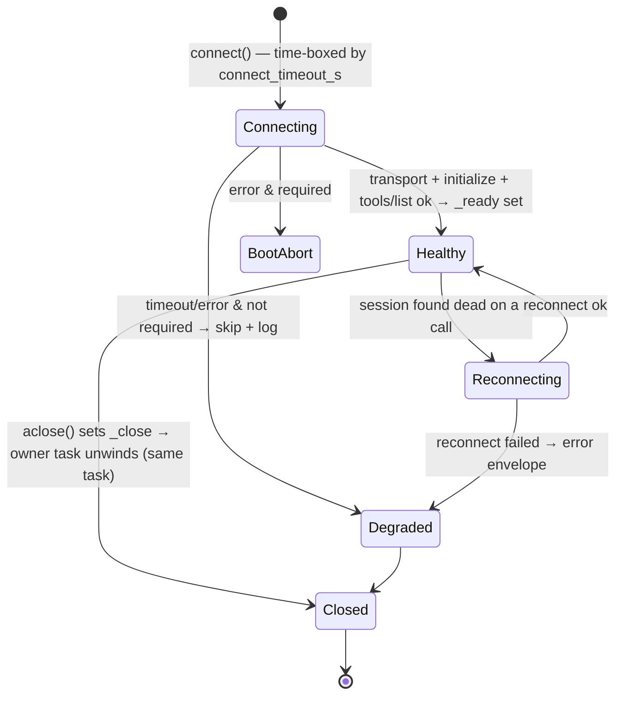

# Subsystem: MCP client bridge (`mcp`)

> **What this owns.** How `agent_base` connects to MCP (Model Context Protocol) servers
> **as a client**, snapshots their tools, and surfaces each one as an ordinary in-loop
> backend tool — so the agent loop and the Anthropic API treat a remote/local MCP tool
> exactly like a native one. Code lives in `agent_base/mcp/`
> (`spec.py`, `client.py`, `bridge.py`, `naming.py`, `schema.py`, `result.py`, `errors.py`);
> the optional `mcp` SDK is pulled in via the `agent-base[mcp]` extra and imported lazily.
>
> The inverse direction — projecting *our* tools out *as* an MCP server — is the
> counterpart `agent_base/mcp/server.py` (`build_mcp_server` / `serve_stdio`); see
> **§7 — The other direction**.

---

## 0. The big idea — a client-side bridge, not a server connector

`agent_base` never tells the Anthropic Messages API that MCP exists. At connect time it
pulls each server's `tools/list` and wraps every remote tool in a plain
`async def(**kwargs)` Python function. Those wrappers register in the normal
`ToolRegistry` and ride the standard `tools` array to the model. **To the API and to the
agent loop, a bridged MCP tool is indistinguishable from any other backend tool** — there
is no `mcp_servers` request field and no beta header. The MCP protocol is confined to a
single seam: `MCPConnection ↔ Server`.

Why a bridge instead of Anthropic's server-side connector: the bridge is the only path
that (a) keeps the framework's governance — `before_tool` / `after_tool` / `on_tool_error`,
per-call confirmation, context externalization — because bridged tools run **in-loop**;
(b) keeps auth tokens in-process; and (c) extends to local **stdio** servers. The
connector forfeits all three.

## 1. Components and where they live

| Concern | Type / function | File |
|---|---|---|
| Declarative description of a server to bridge | `MCPServerSpec` (frozen), `MCPToolFilter` | `agent_base/mcp/spec.py` |
| One live server connection (owner-task pattern) | `MCPConnection` | `agent_base/mcp/client.py:66` |
| N servers, concurrent fail-open connect | `MCPConnectionManager` | `agent_base/mcp/client.py:236` |
| `tools/list` snapshot → registrable bundle | `build_bundle_from_connection`, `_make_wrapper` | `agent_base/mcp/bridge.py:26` |
| Name mangling `mcp__<server>__<tool>` | `mangle_tool_name` | `agent_base/mcp/naming.py` |
| Anthropic-safe `inputSchema` normalization | `normalize_input_schema` | `agent_base/mcp/schema.py:19` |
| `CallToolResult` → `ToolResultEnvelope` | `map_call_tool_result`, `error_envelope` | `agent_base/mcp/result.py:27` |
| In-loop dispatch / classification / wrap | `ToolRegistry.execute`, `classify_tool_calls`, `_wrap_result` | `agent_base/tools/registry.py:200` |
| Lifecycle wiring (open at init, close at teardown) | `_initialize_mcp`, `aclose`, `_shutdown_actor` override | `agent_base/providers/anthropic/anthropic_agent.py` |

A `MCPServerSpec` is a **construction input** (passed to `AnthropicAgent(mcp_servers=...)`),
never persisted — so secrets never hit a serialized surface and `auth_token_env` is
resolved only at connect time. Key policy fields: `connect_timeout_s`, `call_timeout_s`,
`required`, `tool_filter`, `needs_confirmation`, plus transport fields (`url`/`headers`/
`auth_token_env` for remote; `command`/`args`/`env`/`cwd` for stdio).

## 2. The connection mechanism

### 2.1 When connections open

Once, during agent initialization: `_initialize_sandbox → _initialize_mcp`, under the
session build lock (the same place the sandbox is set up). They close on teardown via the
agent's `aclose()`, invoked from a `_shutdown_actor` override so eviction, shutdown, and
build-failure are all covered.

### 2.2 How one server connects — the **owner-task** pattern

An MCP `ClientSession` sits on an anyio transport, and anyio enforces a hard rule: the
task that **enters** the connection context must be the one that **exits** it. But the
agent opens connections during init and closes them later during shutdown — a *different*
task. To satisfy anyio, each `MCPConnection` spawns one dedicated **owner task**
(`MCPConnection._run`, `client.py:124`) that:

1. opens the transport — `stdio_client` for local servers, Streamable-HTTP / SSE for
   remote (`_open_http_transport`, `client.py:38`, picks the SDK variant by signature);
2. enters the `ClientSession`, runs `initialize()`, then `list_tools()`;
3. caches that tool list, flips the `_ready` event, and then **parks** on
   `await self._close.wait()` — holding the session open and doing nothing else.

`connect()` (`client.py:87`) merely waits for `_ready`, time-boxed by `connect_timeout_s`.
`aclose()` (`client.py:191`) sets `_close`; the owner task unwinds its `async with` blocks
**in the same task that entered them**. Tool calls run concurrently against the one parked
session — safe because `ClientSession` multiplexes requests by id.

> **stdio env/PATH note (Windows).** The SDK uses a stdio spec's `env` dict *verbatim* as
> the child environment, so a non-empty `env` is merged over
> `mcp.client.stdio.get_default_environment()` (empty → `None` → SDK default). Otherwise a
> bare `{"API_KEY": ...}` drops `PATH`/`PATHEXT` and `npx`/`uvx`/`uv` fail to resolve.

### 2.3 Many servers — concurrent and fail-open

`MCPConnectionManager.connect_all()` (`client.py:250`) connects every configured server
concurrently (`gather(..., return_exceptions=True)`). A non-`required` server that times
out or errors is logged (`mcp_server_connect_failed`) and **skipped** — the agent still
boots, just without those tools. Only a `required` server's failure closes everything and
re-raises.

### 2.4 Snapshot → bundle → registry

For each healthy connection, `build_bundle_from_connection` (`bridge.py:26`) turns the
cached `tools/list` into one `ToolBundle` named `mcp:<server>`. Each remote tool becomes a
wrapper (`_make_wrapper`, `bridge.py:54`) that:

- **closes over the original server-side name** for dispatch;
- carries `__tool_schema__` — name **mangled** to `mcp__<server>__<tool>`, `inputSchema`
  **normalized** (inline `$ref`/`$defs`, guarantee a top-level object);
- carries `__tool_executor__ = "backend"` and `__tool_needs_confirmation__` from the spec;
- **never raises into the loop** — a transport/protocol error returns an `error_envelope`.

`registry.register_tools(bundles)` coerces each wrapper (`_coerce_to_callables`,
`registry.py:79`) and registers it next to the native tools. The exported schemas are
ordinary custom tools — the API never learns they are MCP-backed. **The tool set is
snapshotted here**; v1 does not react to `notifications/tools/list_changed` (the registry
has no `unregister`).

## 3. Connection lifecycle (the owner task's view)



## 4. The tool-running mechanism, inside the loop

1. The model returns a `tool_use` block named, e.g., `mcp__deepwiki__ask_question`. To the
   loop this is just a backend tool name.
2. `classify_tool_calls` sees `executor="backend"` and no confirmation → route to immediate
   in-loop execution (up to 5 in parallel via a semaphore), wrapped by the governance chain
   (`before_tool` / `after_tool` / `on_tool_error`). **MCP tools inherit all of this for
   free because they run in-loop** — the whole reason for a bridge.
3. `registry.execute` (`registry.py:200`) does `await wrapper(**kwargs)`.
4. The wrapper calls `conn.call_tool(original_name, kwargs)` (`client.py:205`), which fires
   `tools/call` over the live session, time-boxed by `call_timeout_s`, with a best-effort
   reconnect (`_maybe_reconnect`, `client.py:223`) if the session died.
5. The server's `CallToolResult` is mapped by `map_call_tool_result` (`result.py:27`) into a
   canonical `ToolResultEnvelope` — text/image/structured content preserved, `isError`
   mapped, never a lossy `str()`. A transport failure becomes an error envelope instead.
6. The envelope is projected to a `tool_result` content block and returned to the model on
   its next turn.

```mermaid
sequenceDiagram
    participant M as Model (Anthropic API)
    participant L as _resume_loop
    participant REG as ToolRegistry
    participant W as MCP wrapper
    participant C as MCPConnection (parked session)
    participant SRV as MCP Server

    M-->>L: tool_use  mcp__deepwiki__ask_question
    L->>REG: classify → backend, no confirm → execute (≤5 parallel)
    Note over L,REG: before_tool / after_tool / on_tool_error wrap this
    REG->>W: await wrapper(**kwargs)
    W->>C: call_tool(original_name, kwargs)
    C->>SRV: tools/call  (wait_for: call_timeout_s; reconnect if dead)
    SRV-->>C: CallToolResult(content, isError)
    C-->>W: result
    W-->>REG: map_call_tool_result → ToolResultEnvelope
    REG-->>L: tool_result block
    L-->>M: tool_result  (next turn)
```

## 5. Initialization sequence (once, at agent boot)

```mermaid
sequenceDiagram
    participant SM as SessionManager
    participant AG as AnthropicAgent
    participant MGR as MCPConnectionManager
    participant OT as Owner Task (per server)
    participant SRV as MCP Server
    participant REG as ToolRegistry

    SM->>AG: get_or_create (build lock)
    AG->>AG: _initialize_sandbox → _initialize_mcp
    AG->>MGR: connect_all()  (concurrent, fail-open)
    MGR->>OT: spawn owner task per server
    OT->>SRV: open transport · initialize · tools/list
    SRV-->>OT: tool list
    OT-->>MGR: cache tools, set _ready (then park on _close)
    Note over MGR: non-required failure → log & skip;<br/>required failure → abort boot
    MGR-->>AG: one ToolBundle per healthy server
    AG->>REG: register_tools(bundles)  → mcp__server__tool (backend)
    Note over REG: now indistinguishable from native tools
```

## 6. Boundaries / non-goals

- **Snapshot, not live.** Tools are listed once at connect; `tools/list_changed` is not
  honored (a vanished remote tool returns an error envelope). Re-list awaits registry
  `unregister`.
- **Tools only** — no MCP resources/prompts.
- **Governance is the loop's.** Bridged tools inherit `before_tool`/confirmation/etc.
  because they run in-loop; `needs_confirmation=True` per server forces user approval (the
  recommended default for untrusted servers).
- **Server-side connector is not used** (HTTPS-only, executes on Anthropic infra, leaks the
  token, no stdio) — see §0.
- **Secrets never persist.** Specs are construction inputs; `auth_token_env` resolves at
  connect time and never enters the schema, the request, logs, or persisted state.

## 7. The other direction — projecting our tools *as* an MCP server

The mirror image lives in `agent_base/mcp/server.py`. Tools authored with the framework's
own primitives (`@tool` / `ConfigurableToolBase` → `ToolBundle`) are projected **into** a
standalone MCP server via `build_mcp_server(bundle, name=...)` / `serve_stdio(...)`, built
on the low-level `mcp.server.lowlevel.Server` so each tool's authored `ToolSchema.input_schema`
(already JSON-Schema 2020-12) is used verbatim. `list_tools` emits `types.Tool(...)`;
`call_tool` dispatches through a `ToolRegistry` and returns a `CallToolResult` built by
`envelope_to_call_tool_result` (`result.py`, the inverse of `map_call_tool_result`) — full
`content` + `structuredContent` + `isError` fidelity. Same `ToolBundle`, two surfaces:
register it in-loop here, or serve it to external clients (Claude Code, Cursor, Codex).
Boundary: served tools run outside the loop, so there is no `ctx`/sandbox/governance.
