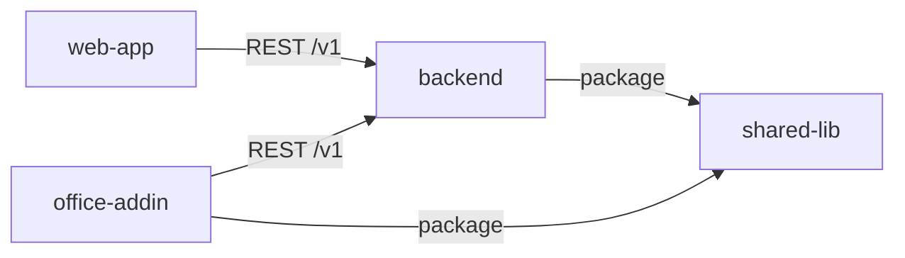
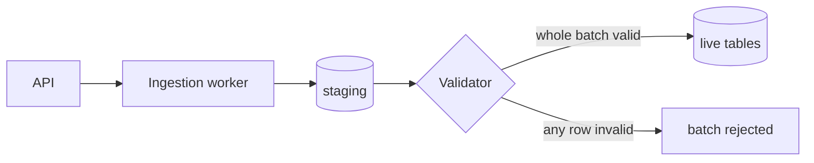

# How this mental model is organised

This folder is the story of the product: its characters (domain concepts, subsystems, infrastructure), how they behave, how they relate, and how they came to be the way they are. Its readers are developers and their agents, and it is the shared vocabulary everyone on the team uses to talk about the system.

The code is the source of truth for *what* the system does. This model is the source of truth for *why*, and for how the pieces fit together. It shouldn't restate the code line by line; it should make the code make sense.

The general principles live in the root `CLAUDE.md`. This file covers how the model is laid out in **this** repo and how to write in it. Other repos may organise their models differently; for this repo, this file is the authority.

## The layout

- **`features/`**: what the library does for a host and its users, as flows across subsystems: a run from start to end, a pause, an abort, a rollback, a bill. Only flows that stay inside this repo are told here.
- **`subsystems/`**: the technical characters. Each has its own responsibility, boundaries and relationships with the others.
- **`infrastructure/`**: what the library needs around it and how it ships: external services, packaging, tests and release.
- **`planned_items/`**: drafts of work about to be built. **Not as-built.** Everything outside this folder describes the library as it exists today.

There is no `product/` folder. This repo is not a home repo of the product.

## This repo in the product

This repo is the **agent runtime library** of **Nova**. It ships as the Python package `agent-base` and runs inside the Nova backend's process. It is a provider only: it depends on no other repo of the product.

The product has two home repos, **[nova_backend](https://github.com/Project-Hedge/nova_backend)** and **[nova_excel_addin](https://github.com/Project-Hedge/nova_excel_addin)**. Each holds:

- the product map ([backend's copy](https://github.com/Project-Hedge/nova_backend/blob/main/mental_model/product/map.md), [add-in's copy](https://github.com/Project-Hedge/nova_excel_addin/blob/main/mental_model/product/map.md)): every repo, its role, and the contracts between them;
- the end-to-end features;
- the planned items for any work that crosses repos.

Both are private. This repo is public, so this model names Nova as the consumer and describes the contracts it provides, and carries nothing else about Nova: no business logic, no deployment detail.

This repo provides two of the product's contracts:

| Contract | Consumer | Marked in |
|---|---|---|
| `agent-base` package: the public Python surface and the library's tables | Backend | [infrastructure/packaging-and-release.md](infrastructure/packaging-and-release.md) |
| Wire protocol: the stream's frames and the conversation log shape | Add-in, through the backend | [subsystems/streaming.md](subsystems/streaming.md) |

No character here uses another repo's contract, so the Depends on sections in this repo name external services only.

**To read another repo's model,** read its default branch, not whatever happens to be checked out locally:

1. Find a local checkout. If the product's repos are cloned side by side, it is at `../<repo>`.
2. Run `git -C <checkout> fetch origin`, then `git -C <checkout> show origin/main:mental_model/<path>`.
3. Without a local checkout, use `gh api repos/Project-Hedge/<repo>/contents/mental_model/<path> -H "Accept: application/vnd.github.raw"`.

If neither works, ask. Don't guess what another repo says.

## Where to start reading

Start with the index below and open the files your work touches. Every file opens with a short summary: read that, then jump to the sections you need. Follow links when a character you need is introduced elsewhere. If your work crosses into another repo, start from the product map.

A good first read is [features/run.md](features/run.md), then [subsystems/session-actor.md](subsystems/session-actor.md).

### Index

**Features**

- [features/run.md](features/run.md): one run from the user's message to the frame that ends it; what the model receives; how runs end
- [features/pause-and-resume.md](features/pause-and-resume.md): relay; a run stops for a tool only the client can run, and resumes when the reply arrives
- [features/abort-and-steer.md](features/abort-and-steer.md): stopping a run in each phase, and replacing it with a new instruction
- [features/fork-and-reset.md](features/fork-and-reset.md): checkpoints; starting a new session from a past point, or rolling one back
- [features/billing-a-run.md](features/billing-a-run.md): pricing steps, settle points, the settlement the host bills from
- [features/answer-finalization.md](features/answer-finalization.md): the opt-in, crash-safe way to end a run that announces the answer early

**Subsystems**

- [subsystems/session-actor.md](subsystems/session-actor.md): `SessionManager`, `submit` and its three planes, `Ack`, the actor, the await table
- [subsystems/turn-loop.md](subsystems/turn-loop.md): the step loop, the tool round, chain repair, compaction and externalization
- [subsystems/providers.md](subsystems/providers.md): the `Provider` protocol, the Anthropic request, retries, what LiteLLM lacks
- [subsystems/hooks-and-profiles.md](subsystems/hooks-and-profiles.md): the 13 hooks, what each can change or block, and switchable profiles
- [subsystems/identity.md](subsystems/identity.md): `SessionPrincipal`, the ownership rule, where it is enforced
- [subsystems/streaming.md](subsystems/streaming.md): the wire protocol: content and meta frames, order, SSE framing
- [subsystems/conversation-log.md](subsystems/conversation-log.md): one run's record: entries, tool projections, trace spans
- [subsystems/tools.md](subsystems/tools.md): `@tool`, the registry, `ToolContext`, result envelopes, the common tools
- [subsystems/sub-agents.md](subsystems/sub-agents.md): `spawn_subagent`; what a child shares with its parent
- [subsystems/mcp.md](subsystems/mcp.md): tools from external MCP servers, their life cycle and results
- [subsystems/storage.md](subsystems/storage.md): the four tables, the Postgres adapters, tenant scoping, schema versioning, analytics
- [subsystems/sandbox.md](subsystems/sandbox.md): the agent's filesystem and shell; local and E2B; life cycle, coordinator, snapshots
- [subsystems/blob-store-and-media.md](subsystems/blob-store-and-media.md): keyed blobs for checkpoints; media for uploads and exported files

**Infrastructure**

- [infrastructure/external-services.md](infrastructure/external-services.md): the services the library talks to, who configures them, what happens when one is down
- [infrastructure/packaging-and-release.md](infrastructure/packaging-and-release.md): the package, its contract, the test suites, how a change reaches the consumer

### The cast

Units of work:

- **Session**: one main agent and everything it has done, identified by its `agent_uuid` (the root session id). Introduced in [subsystems/session-actor.md](subsystems/session-actor.md).
- **Conversation**: what is said within a session. The class `Conversation` is narrower: it is one run's record. See [subsystems/conversation-log.md](subsystems/conversation-log.md).
- **Turn**: a user turn or an agent turn.
- **Run**: the agent turn as it executes, from the user's message to the terminal frame; has a `run_id`. Introduced in [features/run.md](features/run.md).
- **Step**: one provider call within a run, and what follows from it. Counted by `current_step`.
- **Leg**: the stretch of a run between two settle points. Introduced in [features/billing-a-run.md](features/billing-a-run.md).
- **Turn loop**: the loop that drives the steps of a run. [subsystems/turn-loop.md](subsystems/turn-loop.md).

Driving a session:

- **Session actor**: the single task that runs a session's runs one at a time. [subsystems/session-actor.md](subsystems/session-actor.md).
- **Plane**: one of the three ways `submit` treats a command: mailbox (queued), joins (resolves a wait), control (preempts).
- **Phase**: what a session is doing right now: `IDLE`, `STREAMING`, `EXECUTING_TOOLS` or `AWAITING_RELAY`.
- **Ack**, **disposition**: `submit`'s immediate answer, and its verdict on the command.
- **Resident**: a session that is live in process memory.
- **Rung**: a tier of the runtime's scaling plan. Rung 1 (one process per session) is what is built.

Pausing:

- **Relay**: the feature; a run pauses for a tool the client runs. **Pause** is the plain word for it. [features/pause-and-resume.md](features/pause-and-resume.md).
- **Await**: the mechanism; a record in the await table that a reply resolves.
- **cid**: correlation id, the key of an await and the token the client echoes back.
- **Join**: what a parked run waits on (`Join` in the code). Plane 2 is named for it: a `ToolReply` arriving there resolves the join.
- **Generation**: a per-session counter that an abort bumps, so late replies are ignored.
- **Re-arm**: reopening a saved pause's await after the process lost it, so the reply can still resolve it.
- **Splice**: adding a pause's results to the context as one user message.
- **Scripted pause**, **scripted run**: a pause or a run produced by code, not by the model.
- **Frontend tool**, **confirmation tool**, **server tool**: a tool the client runs; a tool the client must approve; a tool the model provider runs.

Ending a run:

- **Finalize**: the closing work of every run. [features/run.md](features/run.md#finalize).
- **Answer finalization**: the opt-in alternative that announces the answer early. A different thing. [features/answer-finalization.md](features/answer-finalization.md).
- **Settlement**, **settle point**: the priced record of unbilled steps, and the moments one is produced. [features/billing-a-run.md](features/billing-a-run.md).
- **Checkpoint**: a restore point of a session at a run boundary. [features/fork-and-reset.md](features/fork-and-reset.md).

What the model sees and what is kept:

- **Context**: the transcript sent to the model (`context_messages`). Compacted and repaired.
- **Conversation log**: the record of a run for people and clients. Never edited.
- **Contribution**: text attached to the user message at render time and never persisted (memory, hook text).
- **Tail**: the instruction appended after the user's message when it is rendered.
- **Chain repair**: making the transcript valid before it is sent. [subsystems/turn-loop.md](subsystems/turn-loop.md#chain-repair).
- **Compaction**, **externalization**: summarizing old context; moving a large block to a sandbox file.
- **Envelope**: a tool's result in two forms, one for the model and one for the log. Also the header of a meta frame.
- **Content frame**, **meta frame**: the model's output on the stream; everything else on the stream.

Who and where:

- **Principal**: the owner of a session, as `(tenant, subject)`. [subsystems/identity.md](subsystems/identity.md).
- **Host**: the application the library runs inside. For Nova, the backend.
- **Profile**: a named set of tools, system prompt and tail. A consumer may call it a mode. [subsystems/hooks-and-profiles.md](subsystems/hooks-and-profiles.md).
- **Zone**: a named directory of a sandbox (`workspace/`, `.exports/`, …). [subsystems/sandbox.md](subsystems/sandbox.md).
- **Coordinator**: the host's object that serializes sandbox use across processes.
- **agent-base**: the library and its package name. The repo is `agent-harness`; the library is to take that name too.

Characters without a file of their own:

- **Memory** (`agent_base/memory/`): a `MemoryStore` protocol, called at the start of a run to retrieve and at the end to update. The library ships only `NoOpMemoryStore`; a host supplies a real one.
- **Python executors** (`agent_base/python_executors/`): an in-process Python interpreter behind the legacy `code_execution` tool. Model-written code belongs in the sandbox.
- **Logging** (`agent_base/logging/`) and **observability** (`agent_base/observability.py`): structured logs, and an optional sink for timed events. See [infrastructure/external-services.md](infrastructure/external-services.md#what-the-host-observes).
- **`agent_runs`**: a table of step-log entries, despite its name. Runs are rows of `conversation_history`. See [subsystems/storage.md](subsystems/storage.md).

Not in this model: the demos under `demos/`, and work that is planned and not built.

## Writing the as-built story

Each file covers one character: what it is, where it sits, how it works, what it depends on, and why it is the way it is. The readers are developers, so write for scanning. Lead with structure, and use sentences only where structure can't carry the point. It is still a story, because the why sits next to the what, but it is told in whatever form is quickest to read.

**Open with a 2–3 line summary** of what the character is and its place in the product. A newcomer should be able to stop there.

**Choose the format by the shape of the information:**

| Information | Format |
|---|---|
| How components connect | Mermaid `flowchart` |
| A request or event moving through several parts | Mermaid `sequenceDiagram` |
| An entity's lifecycle | Mermaid `stateDiagram-v2` |
| Ordered steps | Numbered list |
| Rules, invariants, peer facts | Bullets |
| Data shapes, contracts, events | Schema or type in a code block, or a table |
| Items compared on the same attributes | Table |
| A cause and its consequence, a tradeoff | A sentence or two |

**Prefer Mermaid and code blocks to images.** They diff in PRs, render on GitHub, and agents can read and update them. Keep each diagram to one idea, with few enough nodes to take in at a glance. A diagram that no longer matches the code is worse than none, so update it with the code.

**A shape that suits most subsystem files** (adapt it freely):

- Summary
- Where it sits: its neighbours, usually as a diagram
- How it works: flows, steps, states
- Contracts: the schemas, APIs and events it provides
- Depends on: what it needs from other repos, and any assumption it makes about its neighbours

**Put each why where it applies.** A decision goes next to the step, field or boundary it explains, as a short callout:

> **Why staging first:** a half-loaded batch once left reports showing numbers that matched no source.

Use this `> **Why …:**` form everywhere, so decisions stand out when scanning and can be found with a grep. Don't gather them into a decisions section; away from what they explain, they lose their meaning. If a decision constrains another character, add a one-line pointer in that character's file linking back to it.

**Use whys sparingly.** Write one for a decision a newcomer would otherwise question. Above all, write one for a choice made for where the product is heading, which looks unnecessary today and will otherwise get simplified away. A why may name that direction; it is the one place in an as-built file where the future belongs. Don't add confidence levels or changeability notes anywhere; this is a map, not a proof.

**Write only whys a person gave.** A why records a reason a person actually stated: in review discussion, when asked, or in a planned item whose reasons a reviewer accepted. Text an agent drafted, including most PR descriptions and commit messages, doesn't count until a person confirms it. Never write a reason you inferred, however plausible. Once it is written down, it becomes canon for every agent that reads it, and a wrong reason does more harm than none. If you think you know the reason, ask.

**Describe what is true now.** Include history only where it explains the present, and put it in place: "Used to do X; moved to Y after Z." Git keeps the rest.

**Describe the system, not the implementation.** Include schemas, interfaces and key data shapes when a reader needs them. Don't walk through code line by line; name a file or function as an anchor instead.

**Use standard technical terms freely.** Terms like idempotent, fan-out, backpressure or CQRS need no explanation. Product-specific terms go in the cast.

**Keep each file scannable in a few minutes.** If a file keeps growing past that, the character has probably become two.

**Links:** use relative markdown links within this repo. Link to other repos with GitHub URLs on their default branch.

**This repo is public.** Name Nova as the consumer and describe the contracts this repo provides. Don't write anything else about Nova here: its business logic, its deployment, its data.

### Crossing repo boundaries

When the product spans several repos, each repo's model tells the story of its own characters, and every fact still has exactly one home.

- **The provider owns the contract.** An API, event, schema or library interface is described in the repo that defines it, together with its guarantees and the whys behind it.
- **The consumer owns its usage.** A character that uses another repo's contract says so in its **Depends on** section: what it uses, and what it assumes beyond the contract. Assumptions are things like ordering, timing, or a field that is "never null in practice", and they are what breaks first when the provider changes. Give a version only where an assumption depends on it; the package manifest already has the rest. Dependencies inside this repo show in "Where it sits", and get a Depends on entry only when they carry an assumption worth stating.
- **Mark the boundary on the provider's side.** Each contract that appears on the product map, such as an API, an event stream or a package, gets one callout, not one per endpoint or export:

  > **Cross-repo contract:** other repos depend on this. Before changing it, check the product map, then those repos' Depends on sections and code.

  Which repos depend on it is recorded in the product map, so the callout never goes stale.
- **Tell end-to-end features once, in the home repo,** at the level of which repo does what. Each step links to the file in the repo that implements it.
- **Never copy another repo's story.** Summarise it in a line and link to it; a copy goes stale without anyone noticing.

A consumer's Depends on section:

```markdown
## Depends on

- **backend: [Ingestion](https://github.com/<org>/backend/blob/main/mental_model/subsystems/ingestion.md)**: `POST /v1/batches`. Assumes the call returns only once the batch is in staging, so the upload screen shows "received" straight away.
- **shared-lib: [Nova ID](https://github.com/<org>/shared-lib/blob/main/mental_model/subsystems/nova-id.md)**: IDs are parsed and validated before upload.
- **[Upload queue](../subsystems/upload-queue.md)**: retries failed uploads, so this screen never retries on its own.
```

**The product map** (`product/map.md`, home repo only) shows each repo, its role, and the contracts between repos. It is one Mermaid diagram with each edge labelled by its contract, plus a table of the same edges. It changes only when a dependency between repos appears or goes away, so it stays small:



### What good looks like

Lists are fine, but a list of *changes* is not. It records what happened without saying how the system works or why. Changelog style:

> - Added retry logic to the ingestion worker
> - Ingestion now writes to a staging table first
> - Validator updated to reject rows without an ID

Mental-model style:

````markdown
# Ingestion

Loads source rows into the live tables. Nothing reaches a live table until its whole batch has passed validation.



## How a batch moves

1. The worker writes the batch to `staging`.
2. The validator checks every row. A row without an ID fails the whole batch.
3. Promotion to live runs in one transaction: all rows or none.

> **Why staging first:** a half-loaded batch once left reports showing numbers that matched no source. Users trust the product only as far as its numbers reconcile.

Because promotion is all-or-nothing, the worker can retry a failed batch from the start without creating duplicates.
````

In a few seconds the reader has the shape, the flow, the rule and the reason for it. They can change this code without breaking the reason it exists.

## Writing a planned item

A planned item is the next chapter of the story, drafted before the code exists so it can be reviewed while change is still cheap.

- **One file per piece of work**, named after the feature or subsystem (`planned_items/bulk-import.md`). Use a folder only if the work is genuinely large.
- **Open with a single `Touches:` line** listing the as-built files in this repo that it will change or add. This is the only bookkeeping a planned item carries. It shows when two planned items overlap.
- **Write it in the existing cast's terms, in the same formats as the as-built files.** Introduce new characters properly. For existing ones, show how their behaviour changes and why. A before/after diagram is often the fastest thing to review. Mention alternatives only if they mattered to the choice.
- **Review it in its own PR, before any code.** The planned item merges to main by itself, so everyone, people and agents alike, can see what is about to change. The implementation follows in one or more later PRs, built against it. Until the last of them, the as-built files stay as they are; the planned item already describes where the work is heading. Explain small divergences during the build in the implementation PRs. If the build forces a real change of direction, update the planned item and get it re-reviewed before carrying on.
- **If the work is dropped, delete the planned item.**

In the PR that completes the work, the `merge-mental-model` skill weaves the planned item into the as-built files, following what was actually built, and removes it from this folder.

### Work that crosses repos

- **Plan it in a home repo,** whichever repos it touches, so every cross-repo plan is in one place. One planned item covers the whole change: each repo's part, the end-to-end flow if a feature changes, and any change to the product map. Its `Touches:` line lists files in other repos as `<repo>:<path>`.
- **Split a part out only if it needs its own review.** That part then gets its own planned item in its repo, linked from the home one. A change that is only to this library is planned here.
- **For a contract change,** name every consuming repo. Find them from the product map, then the consumers' Depends on sections and code.
- **Each repo updates its own story in the PR that completes its part,** reading its part from the home repo's planned item. A part has shipped when its code is merged to its repo's default branch.
- **The home repo's planned item is merged and deleted in one home-repo PR, once every part has shipped.** That PR is usually opened by the developer who ships the last part. If the home repo's own part ships earlier, merge that part then and leave the rest of the planned item in place.
