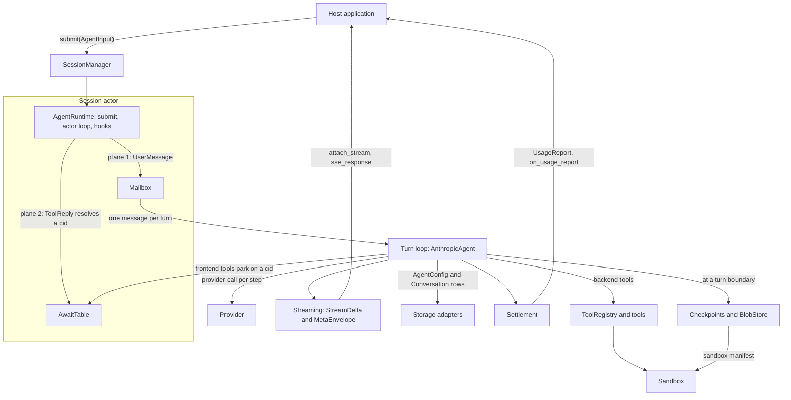
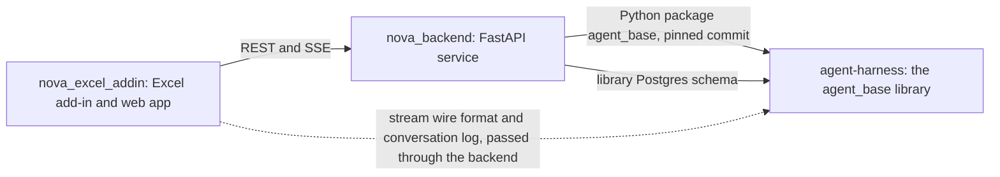

# Checkpoint 1: the characters and the map

**Status: answered by Auro on 2 Oct 2026.** His answers are in section 5, verbatim. Section 6 lists what they settle. Sections 1 to 4 are kept as they were asked; where they disagree with section 6, section 6 wins.

The evidence behind this file is in [survey.md](survey.md).

---

## 1. Characters and terms

Names are the code's own. Where one concept has several names, the row uses the name this file guesses is canonical and the question that asks about it is noted.

### Session and control

| Character | What it is | Lives in |
|---|---|---|
| `SessionManager` | Keeps resident sessions in the process, keyed by `root_session_id`. Builds or rehydrates one on demand and routes `submit` to it. | `agent_base/session/manager.py` |
| Session actor | The single writer for one session. `AgentRuntime._actor_loop` takes one mailbox message per turn. | `agent_base/core/runtime.py` |
| `AgentRuntime` | Base class of every agent: the `submit` router, the actor loop, `await_external`, the hook engine, the stream queue, `record_turn`. | `agent_base/core/runtime.py` |
| `AgentInput` | The four commands: `UserMessage`, `ToolReply`, `Abort`, `Steer`. | `agent_base/core/commands.py` |
| Planes | The three ways `submit` consumes a command: plane 1 mailbox (`UserMessage`), plane 2 joins (`ToolReply`), plane 3 control (`Abort`, `Steer`). | `agent_base/core/runtime.py` |
| `Ack`, `Disposition` | What `submit` returns at once, without waiting for the turn. `ack_to_http` maps it to an HTTP status. | `agent_base/core/ack.py`, `agent_base/session/http.py` |
| `Mailbox` | Bounded FIFO of user messages. | `agent_base/session/mailbox.py` |
| `AwaitTable` | Process-wide table of open pauses, keyed by cid. `await_external` parks a turn on it. | `agent_base/await_table/` |
| cid | The pause-level reply key (`relay_{run_id}_{step}`), carried as `MetaEnvelope.correlation_id`. Not the same as `tool_use_id`. | `agent_base/core/runtime.py` |
| `SessionPrincipal` | Who owns a session: tenant, subject, claims. Threaded into storage scoping, sandbox namespacing and pause resolution. Owner is the principal stamped on a record; claimant is whoever presents a reply. | `agent_base/core/identity.py` |

### The turn

| Character | What it is | Lives in |
|---|---|---|
| Turn loop | The model-driven loop: call the provider, run the tool calls, repeat until the model stops. See Q2. | `AnthropicAgent._resume_loop` |
| `AnthropicAgent` | Subclass of `AgentRuntime` that holds the turn loop, the relay pause, abort, finalize, persist and settle. `LiteLLMAgent` and `AnyLLMAgent` subclass it. | `agent_base/providers/anthropic/anthropic_agent.py` |
| `Provider` | Protocol for the model-specific parts: request build, stream translation, error classification, chain-repair primitives. `AnthropicProvider` and `LiteLLMProvider` implement it. | `agent_base/core/provider.py` |
| Run, turn, step, leg | A turn is one `run()` with a `run_id` and one `Conversation` row. A step is one provider call. A leg is a stretch between settle points. See Q5. | |
| `AgentPhase` | `IDLE`, `STREAMING`, `EXECUTING_TOOLS`, `AWAITING_RELAY`. | `agent_base/core/abort_types.py` |
| Relay | A mid-turn pause for a frontend tool: persist `PendingToolRelay`, emit `AwaitInput`, park on the cid, resume on `ToolReply`. See Q4. | `anthropic_agent.py`, `runtime.py` |
| Hot and cold resume, re-arm | Hot: the parked turn is still in memory. Cold: the session was evicted or the process restarted, and the manager re-arms the pause from the persisted `pending_relay`. | `agent_base/session/manager.py` |
| Scripted turn, scripted pause | `record_turn` records a turn no provider produced. `ctx.call_frontend_tool` lets a backend tool body start its own pause. | `agent_base/core/runtime.py` |
| `Abort`, `Steer` | `Abort` stops the running turn and drops queued messages; its stream ends with `Custom('aborted')`, not `RunCompleted`. `Steer` queues an instruction as the next turn; a forceful steer first preempts the open round and marks the stream with `Custom('steered')`. | `runtime.py`, `anthropic_agent.py` |
| Chain repair | Keeps the message chain valid for the provider and byte-stable on replay: `sanitize_chain`, `ensure_chain_validity`, and the resume-side and abort-side repairs. | `agent_base/core/chain.py` |
| Compaction, context externalizer | `CompactionController` shrinks the context; `ContextExternalizer` moves oversized tool results into a sandbox file. | `agent_base/providers/anthropic/` |
| Hooks | A 12-hook lifecycle catalog plus `on_profile_changed`. A hook returns a `HookOutcome`. | `agent_base/core/hooks/` |
| `Profile` | A named set of tools and a system prompt that a session can switch between. | `agent_base/profiles.py` |
| Finalize, answer finalization | `_finalize_run` ends every turn. `finalize_answer` is an opt-in durable answer boundary behind `early_answer_completion`. See Q6. | `anthropic_agent.py`, `finalization.py` |
| Settlement | The billing fact for a turn: `TurnSettlement`, delivered as a `UsageReport` frame and to `on_usage_report` callbacks. Priced from a bundled CSV. | `agent_base/core/cost.py`, `agent_base/pricing/` |
| `ConversationLog`, `Conversation` | The typed log of a turn (messages, tool results, rollbacks, stream events, trace spans) and the row it is stored in. | `agent_base/core/conversation_log.py`, `config.py` |

### Streaming

| Character | What it is | Lives in |
|---|---|---|
| `StreamDelta` | Content frames: the model's own output (text, thinking, tool calls and results, citations, errors). | `agent_base/streaming/types.py` |
| `MetaEnvelope`, `MetaBody` | Control frames, 11 kinds. `Custom(name, data)` is the open kind for consumer events. | `agent_base/streaming/meta.py` |
| Wire | Framing: 2,048-byte chunks, `[DONE]`, `[PING]`. The encoder and `SseStreamDecoder` ship together. | `agent_base/streaming/wire.py`, `decode.py` |
| `attach_stream`, `sse_response` | One live reader per session; attaching takes the stream from the previous reader. `sse_response` is the FastAPI transport. | `runtime.py`, `agent_base/streaming/transport.py` |

### Tools

| Character | What it is | Lives in |
|---|---|---|
| Tool | A callable stamped with a schema and an executor. Written with `@tool`, as a `ConfigurableToolBase` subclass, grouped in a `ToolBundle`, or sourced from MCP. | `agent_base/tools/` |
| Backend, frontend, confirmation, server tool | Backend runs in the library. Frontend (`executor="frontend"`) pauses the turn for the host's client. Confirmation needs user approval. A server tool is hosted by the model provider. | `agent_base/tools/registry.py` |
| `ToolRegistry` | The name-to-tool map: exports schemas, classifies calls, executes backend tools. | `agent_base/tools/registry.py` |
| `ToolContext` | The per-call context injected into a tool: `emit`, `emit_capped`, `spill`, `call_frontend_tool`. | `agent_base/tools/context.py` |
| `ToolResultEnvelope` | A tool result with two projections: what the model sees and what the conversation log keeps. | `agent_base/tools/tool_types.py` |
| Common tools | Built-ins: read, grep, glob, list, apply-patch, todos, code execution. | `agent_base/common_tools/` |
| Sub-agent | A child agent started by `SubAgentTool` (`spawn_subagent`) from a `SubAgentSpec`. It shares the parent's stream, sandbox, storage and cancellation. | `agent_base/common_tools/sub_agent_tool.py` |
| MCP | External MCP servers as a tool source: `McpServerSpec`, `McpToolSource`, per-server state, auth. An optional extra. | `agent_base/mcp/` |

### State and execution

| Character | What it is | Lives in |
|---|---|---|
| `AgentConfig` | The persisted session state: context messages, `pending_relay`, current step, extras. | `agent_base/core/config.py` |
| Storage adapters | Config, conversation, run and checkpoint adapters, bundled as `StorageHandles`. Memory, filesystem and Postgres families. See Q7. | `agent_base/storage/` |
| `ColumnRegistry`, library schema | Postgres SQL is composed from declared columns; a consumer adds its own with `extra_columns()`. Four tables, versioned by `LIBRARY_SCHEMA_VERSION`. | `agent_base/storage/pg/` |
| `Checkpoint`, fork, reset | A restore point taken at a turn boundary. `fork_session` copies a session up to a checkpoint; `reset_session` rewinds one. | `agent_base/core/checkpoint.py`, `fork_reset.py` |
| `BlobStore` | Object store, content-addressed or keyed. Holds checkpoint segments and sandbox snapshots. | `agent_base/blob_store/` |
| `MediaBackend` | Per-session media files, and the flush of a turn's exports. | `agent_base/media_backend/` |
| `Sandbox` | Where tools read, write and run code: a zone layout over a host directory (`LocalSandbox`) or an E2B micro-VM (`E2BSandbox`). | `agent_base/sandbox/` |
| `SandboxCoordinator` | A Protocol the host application implements to own sandbox readiness, pausing and reset. | `agent_base/sandbox/coordinator.py` |
| `SandboxSnapshotter`, `SandboxManifest` | Capture and restore of a sandbox's files for checkpoints. | `agent_base/sandbox/snapshot.py` |

### Terms without a character of their own

| Term | Meaning here |
|---|---|
| Living spec | `tests/interface/`, the contract tests for the public surface. Run explicitly. |
| `interface_plan/`, `AMENDMENTS.md` | The redesign's subsystem designs and its decision ledger. See Q3. |
| G0 | The rule that breaking changes are allowed and compatibility shims are deleted. |
| Rung 1, Rung 2 | Rung 1 is what is built: one process, one live stream reader. Rung 2 (replay, cross-process) is not built. |
| Fork A to L | Labels for the redesign's design choices, such as "Fork E". Unrelated to `fork_session`. |
| Nova | The consuming product. |

---

## 2. The map

### Inside this repo

Sub-agents, MCP, the media backend, compaction and hooks hang off the turn loop and are left out to keep the diagram readable.

### Where this repo sits in the product

No product map is settled yet, because the three repos' runs are in parallel and the home repo is unconfirmed (Q1). This is a proposal from the code, to be reconciled with the home repo's run.

| This repo provides | To | What crosses |
|---|---|---|
| The `agent_base` package | `nova_backend` | Session and commands, hooks, tools, providers, fork/reset, MCP, settlement. The backend also subclasses the Postgres adapters and sandbox classes, implements `SandboxCoordinator`, and reads some private agent attributes. |
| The library Postgres schema | `nova_backend` | Four tables, defined here and mirrored in the backend's own migrations. |
| The stream wire format | `nova_excel_addin`, through `nova_backend` | Content deltas, meta envelopes, chunking, `[DONE]`, `[PING]`. The backend passes frames through almost untouched. |
| The `await_input` payload and reply shape | `nova_excel_addin`, through `nova_backend` | The cid, and `tools[]` of `{tool_use_id, tool_name, input}`. |
| The conversation log shape | `nova_backend`, `nova_excel_addin` | Carried on `run_completed` and replayed from history. |

This repo uses nothing from the other two.

---

## 3. Layout and file list

**Proposed layout:** the default three folders, read for a library.

- `features/`: the flows a host application drives through the library.
- `subsystems/`: the technical characters.
- `infrastructure/`: what the library runs on, and how it ships.
- `planned_items/`: empty at the start.

There is no `product/` folder, on the guess in Q1 that this repo is not the product's home.

**Proposed files.** Depth goes first to the areas named in Q8; a file is only written where it can be accurate.

| File | Covers |
|---|---|
| `features/a-turn.md` | From `submit(UserMessage)` to `RunCompleted`: the actor, the loop, tools, finalize. |
| `features/pause-and-resume.md` | Relay: the frontend-tool pause, hot and cold resume, scripted pauses, pauses inside sub-agents. |
| `features/abort-and-steer.md` | Stopping or redirecting a running or parked turn. |
| `features/fork-and-reset.md` | Checkpoints, and what fork and reset do to config, conversation and sandbox. |
| `features/billing-a-turn.md` | Usage to cost to settlement to the host's callback, including aborted and errored turns. |
| `features/answer-finalization.md` | The opt-in durable answer boundary and its recovery. |
| `subsystems/session-actor.md` | `SessionManager`, `AgentRuntime`, the planes, `Mailbox`, `AwaitTable`, `Ack`. |
| `subsystems/turn-loop.md` | The loop in `AnthropicAgent`, the `Provider` seam, chain repair and byte-stable replay, compaction. |
| `subsystems/providers.md` | The `Provider` protocol, Anthropic request building, where LiteLLM differs. |
| `subsystems/hooks-and-profiles.md` | The hook catalog, `HookOutcome`, profiles. |
| `subsystems/identity.md` | `SessionPrincipal`, the policy, owner and claimant. |
| `subsystems/streaming.md` | Deltas, meta envelopes, the wire, the transport. A cross-repo contract. |
| `subsystems/conversation-log.md` | The log, the `Conversation` row, trace spans, the legacy reader. A cross-repo contract. |
| `subsystems/tools.md` | Tool definitions, the registry, executors, `ToolContext`, envelopes, overflow. |
| `subsystems/sub-agents.md` | `SubAgentSpec`, what a child shares with its parent. |
| `subsystems/mcp.md` | MCP servers as a tool source. |
| `subsystems/storage.md` | Adapters, `AgentConfig`, the tables, the column registry, the schema version. A cross-repo contract. |
| `subsystems/sandbox.md` | The ABC, zones, local and E2B, the coordinator Protocol, snapshots. A cross-repo contract. |
| `subsystems/blob-store-and-media.md` | What each stores and who calls which. |
| `infrastructure/external-services.md` | LLM APIs, E2B, S3, Postgres, MCP servers, and the constraints each imposes. |
| `infrastructure/packaging-and-release.md` | `dev` to `main`, how a consumer pins a commit, the interface suite as the contract. |

**Cast lines only, no file:** Python executors, memory, observability, logging, the demos, the `any_llm` provider. See Q7.

---

## 4. Questions

**Q1. Which repos make up the product, and which is home?**
Guess: the product is Nova; its repos include `nova_backend`, `nova_excel_addin` and `agent-harness`; home is `nova_backend`, since it holds most of the business logic. `agent-harness` is a provider only, so it gets no `product/` folder, and its end-to-end features stay inside the library. I read "the home directory for this agent is agent-harness" as "this agent works in agent-harness", not as "agent-harness is the product's home".
Evidence: `nova_backend` imports `agent_base`; this repo imports nothing from Nova; UAT and the tool contract docs live in the backend. This repo is also public (Q11), which argues against it holding the product map.
→ Confirm / correct. If other repos belong to the product (`nova_eyesight`, `nova_eyesight_backend`, others), name them.

**Q2. Where does the turn loop live, and what do you call it?**
The code and the docs disagree. `AgentRuntime.run` raises `NotImplementedError`; the loop is `AnthropicAgent._resume_loop`; `LiteLLMAgent` and `AnyLLMAgent` subclass `AnthropicAgent`. `CLAUDE.md` says "`AgentRuntime` as the one turn loop", and commit `aad0bc5` is titled "move the turn loop into AgentRuntime".
Guess: lifting the loop into `AgentRuntime` with the provider as an injected value ("Fork E", "P-A") is still the direction, and it is unfinished. The model would describe what is built: `AgentRuntime` owns the actor, `submit`, awaits, hooks and the stream; `AnthropicAgent` owns the loop. A why callout would name the direction.
→ Confirm / correct. And which name do you use for the thing that runs a turn: "the runtime", "the agent", "the turn loop"?

**Q3. How should the mental model sit beside `interface_plan/`, `AMENDMENTS.md` and `tests/interface/`?**
This is a direct conflict, so I am listing it, not resolving it. `CLAUDE.md` says every interface change must update the subsystem doc, the interface tests and an `AMENDMENTS.md` entry. The mental-model convention has no decision log: each decision sits beside what it explains.
Guess: `tests/interface/` stays the contract. The mental model takes over the role of the subsystem docs as the description of how the system works, absorbing what is still true. `AMENDMENTS.md` is frozen as history, and new decisions go into why callouts.
→ Confirm / correct. Other options: keep the ledger as it is and run both; or keep `interface_plan/` as the interface spec and have the model link to it.

**Q4. Relay, await, pause, join: one concept or several?**
Guess: three layers. "Relay" is the feature, a frontend-tool pause. "Await" is the mechanism: the `AwaitTable` record and its cid. "Join" is plane 2, the command that resolves an await. "Pause" is the plain-English word for a relay.
Evidence: `PendingToolRelay`, `_run_relay_pause`, `AwaitTable`, `await_external`, `AwaitInput`, "plane 2 (joins)".
→ Confirm / correct.

**Q5. Run, turn, step, leg.**
Guess: "turn" is canonical for one `run()` from a user message to `RunCompleted`; "run" is the same unit seen through its `run_id` and its `Conversation` row. A "step" is one provider call. A "leg" is a stretch between settle points. The `agent_runs` table holds log entries, not runs.
→ Confirm / correct. Which word should the model use for the unit: turn or run?

**Q6. "Finalization" names two things.**
`_finalize_run` ends every turn. `finalize_answer`, behind `early_answer_completion`, is an opt-in journaled boundary that emits `AnswerCompleted` before the stream closes and can be recovered after a crash.
Guess: two characters. The first is "finalize" (a step of every turn); the second is "answer finalization" (an opt-in feature).
→ Confirm / correct, and give your names.

**Q7. Characters I am not sure are real.**
For each, guess → confirm / correct / leftover, don't document.
- **`providers/any_llm/`**: every method raises `NotImplementedError`. Guess: planned work, not a character yet.
- **`memory/`**: only `NoOpMemoryStore` ships. Guess: a real seam, one cast line.
- **`python_executors/`**: an in-process AST interpreter, used only by `CodeExecutionTool`. Guess: a real character, one cast line; code execution in the sandbox is the main path.
- **Filesystem storage adapters, and the legacy `Postgres*Adapter` family** that `create_adapters("postgres")` still returns. Guess: `Pg*AdapterBase` with the column registry is canon; the others are leftover.
- **The demos** (`demos/fastapi_server`, `demos/vite_app`) and `examples/`. Guess: not part of the model.
- **`observability.py` and `logging/`**: Guess: real, cast lines only.

**Q8. Which areas cause the most review friction, or confuse new developers most?**
These get written in depth first, and the pilot (Checkpoint 3) is one subsystem file and one feature file from them.
Guess, from where September's fixes cluster and where the consumer reaches into private state: (1) pause and resume, especially cold resume; (2) the sandbox lifecycle and coordinator; (3) finalize, settlement and trace capture; (4) chain repair and byte-stable replay.
Proposed pilot: `subsystems/session-actor.md` and `features/pause-and-resume.md`.
→ Confirm / correct.

**Q9. The layout and file list in section 3.**
Guess: keep the default folders. `features/` holds the flows a host application drives; `infrastructure/` holds external services and how the library ships.
→ Confirm / correct. Anything to merge, split or drop? Two candidates to merge: `providers.md` into `turn-loop.md`, and `answer-finalization.md` into `a-turn.md`.

**Q10. Do `AMENDMENTS.md` entries count as your words?**
The ledger calls itself "the canonical decision ledger from the maintainer Q&A". The decisions are yours; the rationale text reads as agent-drafted.
Guess: treat every written reason in the repo, ledger included, as a guess for you to confirm at Checkpoint 2. The 34 candidates so far are in [sources.md](sources.md).
→ Confirm, or say "ledger rationale counts as mine" and I will only bring you the rest.

**Q11. This repo is public; the Nova repos are private.**
Guess: the model names Nova as the consumer and describes the contracts this repo provides, at the level the repo already publishes in `interface_plan/nova-backend-interface-smells.md`. It carries no Nova business logic. The bootstrap files in this PR follow the same rule.
→ Confirm / restrict further.

**Q12. What is this product called?**
The package and README say `agent-base`; the repo is `agent-harness`; `CLAUDE.md` is titled `anthropic-agent`; the backend's docs say "the `anthropic-agent` / `agent-harness` library".
Guess: the library is "agent-base" (package `agent_base`), and "agent-harness" is only the repo's name.
→ Confirm / correct.

**Q13. Skills and commands that write plans, designs or PR descriptions.**
This repo has no `.claude/skills/`. The ones in play are user-level, so this PR cannot change them:
- `create-pr`: writes the PR description from its own template (summary, risk, rollout, testing). The convention wants the PR told as a chapter against the planned item.
- gstack `/spec`, `/autoplan`, `/plan-eng-review`: write plans and specs outside `mental_model/planned_items/`.
- gstack `/ship` and `/document-release`: write PR bodies, changelogs and doc updates without reading the model.
- `CLAUDE.md` "Skill routing" sends requests to these skills.
- `.cursor/commands/` has three stale commands describing `anthropic_agent`.
Guess: adapt later. The root `CLAUDE.md` section gets one line saying the mental-model conventions take precedence over these skills until they are updated.
→ Confirm / adapt now (and say where the skill sources live).

**Q14. One model, or several?**
The repo holds the library, two demos and an example.
Guess: one model, for the library.
→ Confirm / correct.

**Q15. Your own words.**
- Is there a spoken walkthrough of the library, or could you record 10 to 15 minutes explaining it to a new senior engineer? It would be the best source for names and emphasis.
- GitHub handle: `AuroSoni`? Git identities: `Auro Soni`, `AuroSoni` and `Enter the DOJO` are all you?
- Any notes, docs or chat exports to use? The HTML diaries in `agent_base/agent_base_design_diary/` and `agent_base/developer-diaries/` predate the redesign; say if they still reflect your thinking.

---

## 5. Answers (Auro, in chat, 2 Oct 2026)

Copied verbatim.

> 1. Both nova_backend and nova_excel_addin should be considered as product home and they will both contain the product map.
> 2. Confirm
> 3. Correct. The mental model replaces the subsystem docs, tests remain, ledger can be removed as long as the as-built mental model is captured.
> 4. correct
> 5. Agree. Read the backend agent mental first though to confirm and align with that.
> 6. Yes.
> 7. yes, leave out planned items and demos from the mental model right now.
> 8. Agree
> 9. Agree with the layout.
> 10. Correct.
> 11. Agree.
> 12. Yes. Later on the library name will also be updated to agent-harness.
> 13, Agree. Adapt later.
> 14. Agree
> 15. Yes. Its all me.

## 6. What the answers settle

### The product

- **Product:** Nova. **Homes:** `nova_backend` and `nova_excel_addin`; both carry the product map (Q1). This repo is a provider only and has no `product/` folder.
- The backend run's settled map names the two contracts this repo provides. This model uses those names:
  - **`agent-base` package**: the public Python surface of `agent_base`, plus the library-owned tables. Consumer: the backend.
  - **Wire protocol**: typed JSON frames over SSE and the conversation log shape. Consumer: the add-in, through the backend.
- The backend's draft still says the home is `nova_backend` alone. That is a note for the two home runs, not something this run edits.
- This repo is public, so its model names Nova as the consumer and describes contracts only (Q11).

### Names

Read from the backend run's Checkpoint 1 (its sections 6 and 7), as Q5 asked.

| Term | Meaning |
|---|---|
| **Session** | One main agent id (`agent_uuid`). A resident session is one whose agent is alive in the process. |
| **Conversation** | What is said within a single session. The library class `Conversation` is narrower: one run's record. |
| **Turn** | A user turn (the user enters a prompt) or an agent turn (the agent calls tools and gives a final response). |
| **Run** | The agent turn as it runs after the user submits a prompt. Its id is `run_id`. A conversation has many runs. |
| **Step** | One provider call inside a run. |
| **Leg** | A stretch of a run between settle points. |
| **Relay** | The feature: a frontend-tool pause (Q4). "Pause" is the plain word for it. |
| **Await** | The mechanism: the `AwaitTable` record and its cid (Q4). |
| **Join** | Plane 2: the command that resolves an await (Q4). |
| **Finalize** | The step that ends every run (Q6). |
| **Answer finalization** | The opt-in durable answer boundary (Q6). |
| **Profile** | The concept. `mode` is only the consumer's wire field. |
| **agent-base** | The library (package `agent_base`). `agent-harness` is the repo. |

Where sections 1 to 4 say "turn" for the library's work on one prompt, read **run**.

### Everything else

- **Turn loop (Q2):** the model describes what is built. `AgentRuntime` owns the actor, `submit`, awaits, hooks and the stream; `AnthropicAgent` owns the loop. Lifting the loop into `AgentRuntime` with the provider as an injected value is the direction, and it is unfinished.
- **Existing design docs (Q3):** the mental model replaces the subsystem docs. `tests/interface/` remains the contract. The ledger can be removed once the as-built model captures what it holds.
- **Left out (Q7):** planned work (`providers/any_llm/`, the workflows plan, the cost ledger plan) and the demos. The legacy `Postgres*Adapter` family and the filesystem adapters are leftover and go to the PR as a follow-up. Memory, Python executors, observability and logging get cast lines only.
- **Friction and pilot (Q8):** pause and resume; the sandbox lifecycle; finalize, settlement and trace capture; chain repair and replay. Pilot: `subsystems/session-actor.md` and `features/pause-and-resume.md`.
- **Layout (Q9):** agreed. One rename follows from Q5: `features/a-turn.md` becomes `features/run.md`, matching the backend's file.
- **Sources (Q10):** every written reason in the repo is a candidate for Auro to confirm at Checkpoint 2. In the backend run he added that such text was "written by agents and may be out of date", so each candidate is checked against today's code first.
- **Skills (Q13):** adapted later. The root `CLAUDE.md` section gets a line giving the mental-model conventions precedence over `create-pr` and the gstack plan and ship skills until then.
- **One model (Q14)**, for the library.
- **Identities (Q15):** `Auro Soni`, `AuroSoni` and `Enter the DOJO` are all Auro. There is no separate walkthrough; his decisions in the backend run are the reference.

### Still open after this round

- What to call the thing that runs a run: "the turn loop", "the runtime" or "the agent" (Q2's second half). Asked again at Checkpoint 2.
- The direction in Q12: the library will later be renamed to `agent-harness`. Recorded; nothing changes now.
