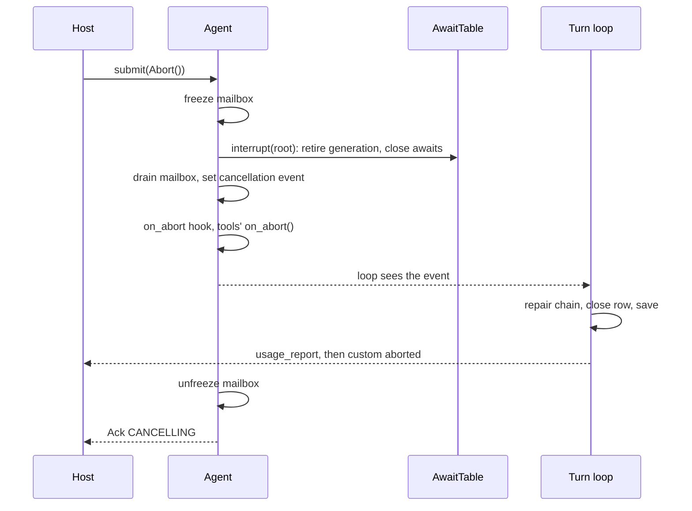

# Abort and steer

**Abort** stops the run in flight and leaves the session in a state the next run can start from. **Steer** replaces what the agent is doing with a new instruction: a forceful steer is an abort followed by a new run.

Both are control commands on the [session actor](../subsystems/session-actor.md)'s third plane. They act at once, on the root agent only, and `submit` waits for the teardown before it returns.

## The teardown

Anchor: `AnthropicAgent._do_abort`. It is a critical section: one abort at a time per session.



1. **Freeze the mailbox.** New messages are refused (`REJECTED`, `mailbox_full`) until the teardown ends.
2. **Retire the generation.** Every open await of the session closes, and a reply still in transit becomes `IGNORED_STALE`.
3. **Drop queued messages.** An abort discards the user messages waiting in the mailbox.
4. **Set the cancellation event,** which the loop, the tools and any sub-agents share.
5. **Fire `on_abort`,** then each tool instance's own `on_abort()` cleanup.
6. **Wait for the loop to clean up,** up to the grace period: 5 seconds (`ABORT_GRACE_MS`). The `grace_ms` field of the `Abort` command is not read. If it has not, the loop's task is cancelled; the marker frame then carries `forced: true`.
7. **Bill** the steps that completed.

## What it does in each phase

| Phase | What is cut | What the context gets |
|---|---|---|
| `STREAMING` | The provider stream stops at the next event. The partial response is not a step and is not billed | Only blocks that finished streaming are kept. Tool calls among them get an error result, then an assistant message "Agent run was aborted by the user." |
| `EXECUTING_TOOLS` | Unfinished tool tasks are cancelled; finished ones keep their results. A sandbox command dies with its tool task | One result per call; the cancelled ones say "Tool execution was aborted by the user." |
| `AWAITING_RELAY` | The parked run wakes as aborted | The step's backend results, plus an error result for each call the client had not answered. See [Pause and resume](pause-and-resume.md#abort-while-paused) |
| `IDLE` | Nothing. `submit` answers `NOT_RUNNING` and runs no teardown | Unchanged |

The transcript is always left valid: every tool call has a result, so the next run can send it to the model as it is.

## Afterwards

- **The row** is closed with `stop_reason="aborted"`, its step count, usage, cost and `completed_at`. It has no `final_response`.
- **Persisted:** config, row and a checkpoint, as at a normal end.
- **Billed:** yes, for completed steps. `usage_report` is emitted and the usage callbacks run.
- **Stream:** `usage_report`, then `custom` with `name: "aborted"` and `data: {"phase": "streaming" | "executing_tools"}`. There is no `run_completed`. The marker goes only to the reader attached when the abort began, and is not sent for a parked run or by a sub-agent.
- **If the run finished or failed first,** `run_completed` is the terminal frame and no marker is sent.
- **`AgentResult`:** `stop_reason="aborted"`, `was_aborted=True`. It carries no `settlement`; the settlement reaches the host through the callbacks and the frame.

During an [answer finalization](answer-finalization.md) an abort does nothing: the answer is already saved, and the teardown returns it.

## Steer

```python
await agent.submit(Steer(instruction=Message.user("…"), mode=SteerMode.FORCEFUL))
```

| Mode | What happens |
|---|---|
| `FORCEFUL` (default) | The teardown above, then the instruction is queued as a `UserMessage` and the actor started. It runs as a new run with a new `run_id` |
| `COOPERATIVE` | Only queues the instruction. The run in flight finishes first; the instruction is the next run |

- The ack is `STEERING` in both modes, whether or not anything was running.
- A forceful steer's marker is `custom` `steered`, with the same `data` as `aborted`.

> **Why `steered` and not `aborted`:** consumers close their stream on `aborted`, and the steered run's frames were then dropped.

## Sub-agents

- A [sub-agent](../subsystems/sub-agents.md) runs with its parent's cancellation event, and its awaits are filed under the root session, so one abort of the root stops the whole tree.
- A sub-agent emits no marker; the root's marker ends the stream.
- `Abort` and `Steer` submitted to a sub-agent's own runtime are `REJECTED` with detail `not_root`.

## Contracts

- Commands `Abort`, `Steer`, `SteerMode`; dispositions `CANCELLING`, `STEERING`, `NOT_RUNNING`.
- The terminal marker: `custom` `aborted` or `steered`, `data.phase`, and `data.forced` when the loop was hard-cancelled.
- The `on_abort` [hook](../subsystems/hooks-and-profiles.md), with `phase` and `grace_ms`. It also fires for a forceful steer and for an eviction; it does not fire on `NOT_RUNNING`.
- Abort texts written into the transcript: `STREAM_ABORT_TEXT`, `TOOL_ABORT_TEXT` (`core/abort_types.py`).
