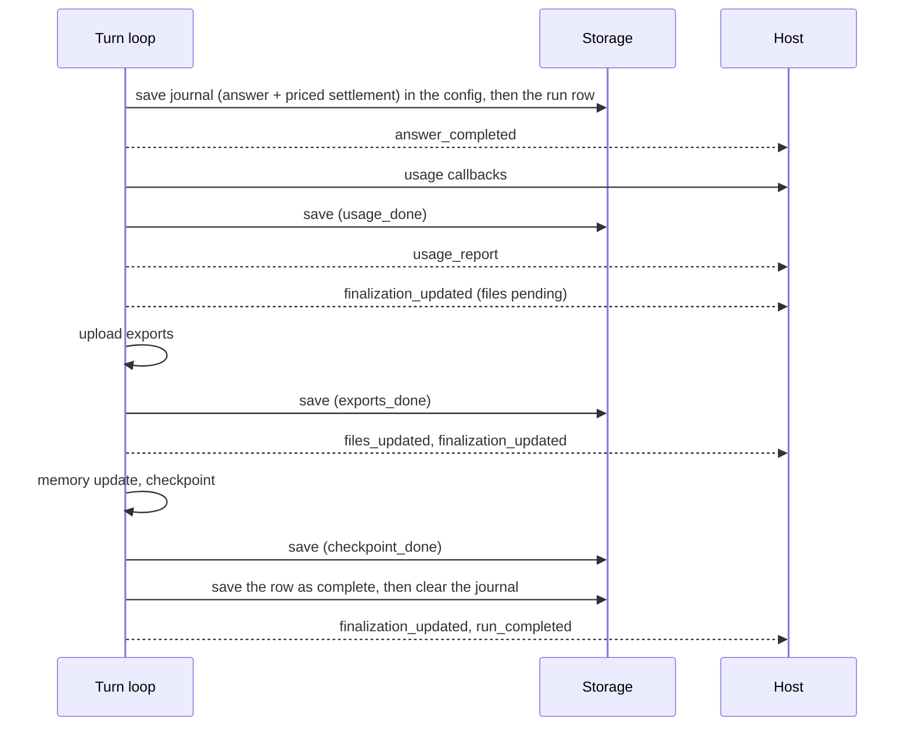

# Answer finalization

An opt-in way to end a run that tells the client the answer is ready before the slow closing work (uploading exports, updating memory, checkpointing) is done, and that survives a crash in the middle of that work.

It is not the same thing as **finalize**, which ends every run (see [A run](run.md#finalize)). Answer finalization replaces finalize for a root agent built with `early_answer_completion=True`. Sub-agents always use the ordinary finalize.

## The two ways a run closes

| | Finalize (default) | Answer finalization |
|---|---|---|
| Client learns the answer is final | At `run_completed`, after everything | At `answer_completed`, before exports and checkpoint |
| Billed | After persist | Right after `answer_completed` |
| A crash during the closing work | Nothing resumes it | The work is resumed from a journal |
| Frames | `usage_report`, `files_updated`, `run_completed` | `answer_completed`, `usage_report`, `finalization_updated`, `files_updated`, `finalization_updated` twice, `run_completed` |

## How it works

Anchor: `providers/anthropic/finalization.py`.



1. **Journal.** The answer, the run's row and the already-priced settlement are written into the config under `extras["pending_finalization"]`, then the row is saved.
2. **`answer_completed`** is emitted.
3. **Usage.** The usage callbacks run with the journaled settlement and the flag is saved; then `usage_report` is emitted. A callback that raises fails the stage, and the retry runs every callback again.
4. **Exports.** `finalization_updated` reports the files about to be uploaded; they are uploaded; `files_updated` lists the result and `finalization_updated` reports `files_ready`.
5. **Memory update.** A failure is logged and skipped.
6. **Checkpoint,** taken from a copy of the config with the journal removed.
7. **Complete.** The row is saved as complete, then the journal is cleared, then `run_completed` is emitted.

Each stage sets a `*_done` flag in the journal. The usage, exports and checkpoint stages save it at once, so they are never repeated. The memory flag is saved with the checkpoint stage, so a crash between the two repeats the memory update.

> **Why the journal is written before `answer_completed`:** it holds the answer and its already-priced settlement in the config, so a crash between the two adapter writes cannot lose the answer, and cannot re-price or re-run the model.

The usage callbacks can run twice for one settlement, if the process dies between a callback and the save of `usage_done`. The settlement is the same priced object both times, so a ledger keyed on `(run_id, agent_id, step_count)` absorbs the repeat. See [Billing a run](billing-a-run.md).

## What the client sees

The lifecycle is `conversation.extras["answer_lifecycle"]`, and each `finalization_updated` frame carries a copy:

```json
{
  "answer_completed_at": "<ISO time>",
  "status": "pending | complete | failed",
  "stage": "usage | exports | checkpoint | complete",
  "files_ready": false,
  "pending_paths": ["<absolute export path>"],
  "error": null,
  "retryable": true
}
```

- `pending_paths` starts as the export paths the answer mentions that are not uploaded yet; once the flush starts it is every changed export being uploaded. It is not cleared afterwards: `files_ready` turning `true` is the signal.
- `retryable` is present only after a failure.

## Recovery

While the journal exists, the session has a pending finalization:

- **It is finished before anything else.** The actor completes it before taking the next message, and `run()` does the same.
- **Recovery** rebuilds the row from the journal, emits `answer_completed` again, and runs the stages whose flag is not set.
- **An abort does nothing.** The answer is already saved; the abort returns it.
- **Persists** save the journal and row only, with no checkpoint.

Failures:

| Failure | Raised | `retryable` | Meaning |
|---|---|---|---|
| A stage fails | `FinalizationFailed` | `true` | The answer is saved; the next attempt resumes at that stage |
| The sandbox was replaced before its checkpoint | `WorkspaceStateLost` | `false` | The answer is saved; its unpublished files cannot be rebuilt |

Either way the stream gets `finalization_updated` with `status: "failed"`, then `error_report` and `run_completed` with `stop_reason: "error"`.

## Contracts

- Constructor argument `early_answer_completion` (default off).
- Frames `answer_completed` (`answer_completed_at`, `finalization`) and `finalization_updated` (`finalization`), in [Streaming](../subsystems/streaming.md).
- `Conversation.extras["answer_lifecycle"]`, readable by a host that lists past runs.
- `AgentConfig.extras["pending_finalization"]` is the journal. It is internal.
