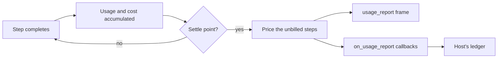

# Billing a run

Every provider call is priced when it completes, at the rate then in effect, and is not re-priced later. The library never charges anyone: it hands the host a **settlement**, a priced record of the steps not yet billed, and the host's ledger does the rest. A step is settled at most once.

## Pricing a step

`pricing/calculator.py`, from the table `pricing/models.csv`.

- **Row lookup:** exact `model_id`, else the longest `model_id` contained in the model name. An unknown model logs a warning and costs nothing.
- **Rates** are per million tokens: input, cache write (5 minute and 1 hour), cache read, output; plus per-request rates for web search and web fetch.
- **Multipliers** stack: fast mode, long context (above the row's threshold), batch, and US data residency.
- The result is a `CostBreakdown`: `total_cost`, `currency` (USD) and a per-component `breakdown`.

`pricing_policy=` on the agent replaces this calculator for settlements. The default, `CsvPricingPolicy`, calls it.

## Settle points

A settle point prices the steps since the last one, advances a watermark, and delivers the settlement.

| Settle point | When |
|---|---|
| End of a run | Always, even when nothing is unbilled |
| Abort, in any phase | When there is unbilled spend |
| [Answer finalization](answer-finalization.md) | Priced when the answer is saved; delivered in its first stage |

Not settle points:

- **A [pause](pause-and-resume.md).** The spend so far is priced and stored on the pause record, and billed at the next settle point. If the process dies while parked, a cold resume restores it from the record.
- **The start of a run,** which only resets the watermark.

The stretch between two settle points is a **leg**. A run that is aborted, steered or resumed can have more than one, and so more than one settlement.

## The settlement

`TurnSettlement` (`core/cost.py`):

| Field | Meaning |
|---|---|
| `agent_id`, `parent_agent_id` | The agent that spent, and its parent when it is a sub-agent |
| `run_id` | The run |
| `step_count` | `current_step` when it settled |
| `model` | The model billed |
| `turn_usage` | Tokens of this leg only |
| `turn_cost` | Cost of this leg only |
| `principal` | The session's owner. Serialized as `tenant` and `subject` only; claims never leave the process |

Delivered two ways, from the same object:

- **`on_usage_report(callback)`**: the host's hook for its ledger. Callbacks run in registration order; one that raises is logged and skipped.
- **`usage_report` frame**: `{kind, usage, cost}` for the client. See [Streaming](../subsystems/streaming.md).

Order at the end of a run: persist, settle, `usage_report`, callbacks, `files_updated`, `run_completed`.

`(run_id, agent_id, step_count)` identifies a settlement. A host that makes its ledger idempotent on that key can receive one twice safely.

> **Why `current_step` only grows within a run:** resume, re-arm and steer never reset it, because consumers key idempotent billing on `(run_id, agent_id, step_count)`. A reset makes two legs indistinguishable and silently drops charges.

## Two totals for the same run

> **Why two:** the settlement is the billing truth. `Conversation.cost` is a record of spend for display and analytics.

| | Settlement | `Conversation.cost` and `usage` |
|---|---|---|
| Covers | One leg of one agent | The whole run, including its sub-agents |
| Priced by | `pricing_policy` | The built-in calculator, directly |
| For | Billing | Display, analytics |

`run_completed.cost` is the final leg's settlement cost; `run_completed.cumulative_usage` is the run's total usage.

## Sub-agents

- Each [sub-agent](../subsystems/sub-agents.md) settles its own steps and fires the usage callbacks itself, with its own `agent_id` and its parent's id in `parent_agent_id`. The parent's callbacks are copied onto it when it is built.
- The root's settlement covers the root's own steps only.
- A child's usage is also forwarded up the tree as it accrues, so the root's `Conversation.cost` and `usage` include its children.

## Runs that end badly

| Ending | Billed? |
|---|---|
| Aborted | Yes, for the steps that completed. The response cut off mid-stream is not a step |
| Errored | No |

> **Why an errored run is persisted and never billed:** the settlement watermark passes its steps. Only the root agent's own spend is written off; a sub-agent that finished before the error stays billed.

## Contracts

- `on_usage_report(callback)`, `TurnSettlement`, `CostBreakdown`, `Usage`, `PricingPolicy`, `CsvPricingPolicy`.
- `AgentResult.settlement`, for callers that await `run()`.
- The `usage_report` frame and `run_completed.cost`.
- `agent_totals` and the other [analytics](../subsystems/storage.md#analytics) readers total `Conversation.cost`, not settlements.
