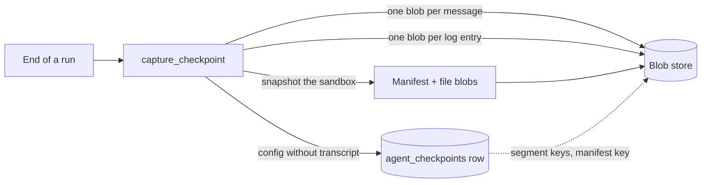

# Fork and reset

Two ways to go back in a session's history. **Fork** starts a new session from a past point of an existing one, leaving the original untouched. **Reset** rolls a session itself back to a past point. Both restore the agent's state and its sandbox files together, from a **checkpoint**.

The feature is opt-in: it is on when the agent is given a `checkpoint_adapter`. A `blob_store` makes checkpoints cheap and lets them include the sandbox.

## Checkpoints

A checkpoint is a restore point of one session at the end of one run.



| Field | Holds |
|---|---|
| `ref` | `agent_uuid`, `sequence_number` (the run's), `run_id`, `created_at`, `fidelity` |
| `config_base` | The serialized `AgentConfig`, minus what is in segments |
| `transcript_segments` | Ordered blob keys, one per message of `context_messages` |
| `log_segments` | Ordered blob keys, one per conversation log entry |
| `sandbox_manifest_ref` | Blob key of the sandbox snapshot's manifest. See [Sandbox](../subsystems/sandbox.md#snapshots) |
| `consumer_payload` | A dict the host owns, for state the library does not know about |
| `archived` | Set by a reset on checkpoints after the reset point |

`fidelity` is `full`, or `degraded` when the sandbox snapshot skipped files (over the size caps, or not regular files) or no blob store was available for it.

**When one is taken:** at the end of every run, completed or aborted, and after a [scripted run](run.md#scripted-runs). Repeated captures within a run overwrite the same row.

**When one is not:** while a pause is pending, at the moment a run errors, and on a resume.

So a checkpoint normally sits at a run boundary. Two cases put one elsewhere: a hook that makes the loop continue (`on_turn_end` answering `continue`, or an `end_turn_hook` retry) persists mid-run and captures, to be overwritten at the run's end; and an eviction after an errored run captures at that run's sequence number.

> **Why the transcript is stored as content-addressed segments:** a full serialized config per run is O(n²). With segments, an unchanged prefix costs nothing and a fork is a pointer copy.

> **Why a checkpoint captures the config and the sandbox together:** the sandbox filesystem is the only runtime state that cannot be rebuilt from `AgentConfig`.

> **Why blob keys are scoped by tenant:** a bare content hash would let two tenants share a blob. Keys are `<tenant>/<blake3 of the bytes>`.

> **Why transcript segments keep each message's own key order and log segments are sorted:** the transcript is replayed to the model, so re-sorting it misses the prompt cache. The log is never replayed.

> **Why `consumer_payload` is never overwritten by a re-save:** the library saves the same checkpoint on many paths, and a mutable upsert kept clobbering what the consumer had reconciled into it. The host changes it only through `update_consumer_payload`.

Without a blob store, the transcript and log stay inline in the row and the sandbox is not captured.

## Fork

```python
new_uuid = await fork_session(handles, source_uuid=..., at_sequence=..., new_uuid=..., principal=...)
```

Works on storage alone; no session needs to be in memory.

1. Load the source's checkpoint at `at_sequence`. None: `CheckpointNotFound`.
2. Rebuild its config and save it under `new_uuid`, owned by `principal`, with no pending pause, no sandbox, and `extras["forked_from"]` and `extras["forked_at_seq"]` recording its origin.
3. Copy the source's run rows up to `at_sequence` under the new id (when `copy_history`), with their usage and cost zeroed and `extras["forked_from_run_id"]` set.
4. Save a seed checkpoint for the new session pointing at the same segment and manifest blobs.

No blob is written and no sandbox is created. The fork's sandbox is provisioned when the fork is first loaded. A newly created remote sandbox is filled from the seed checkpoint's snapshot; a local sandbox starts empty.

## Reset

```python
ref = await reset_session(handles, agent_uuid=..., to_sequence=..., principal=..., sessions=manager)
```

1. If the session is resident, evict it. A session that cannot be evicted (a run in flight, or parked on a pause) raises `SessionBusy`.
2. Load the checkpoint at `to_sequence`. None: `CheckpointNotFound`.
3. Rebuild its config, with no pending pause, keeping the session's current sandbox binding.
4. Restore the sandbox's files from the checkpoint's snapshot.
5. Save the config.
6. Archive every run row and every checkpoint after `to_sequence`.

> **Why reset archives the tail instead of deleting it:** undoing a reset is a re-point, not a recovery.

Archived runs are left out of history reads and `load_latest`; `load(agent_uuid, sequence_number)` still returns an archived checkpoint.

## With a sandbox coordinator

When the host coordinates sandboxes across processes, both verbs take the coordinator's exclusive lock (`reason="fork"` or `"reset"`), and a reset of a remote sandbox is handed to `coordinator.reset(...)` and `finish_reset(...)` rather than restored in place. See [Sandbox](../subsystems/sandbox.md#the-coordinator).

`destroy_session_sandbox(...)` tears down a session's sandbox and clears its binding, evicting the session first.

## What a relay resume has to do with it

A resume from a [pause](pause-and-resume.md) saves the session without taking a checkpoint; the reason is told there.

## Contracts

- `fork_session`, `reset_session`, `destroy_session_sandbox`; errors `ForkResetError`, `CheckpointNotFound`, `SessionBusy`.
- `Checkpoint`, `CheckpointRef`, and `CheckpointAdapter`: `save`, `load`, `load_latest`, `list_refs`, `archive_after`, `update_consumer_payload`.
- `StorageHandles(config, conversation, run, checkpoint, blobs)`, the bundle the verbs take.
- The `agent_checkpoints` table, in [Storage](../subsystems/storage.md).
- Constructor arguments `checkpoint_adapter`, `blob_store`, `snapshot_policy`.
