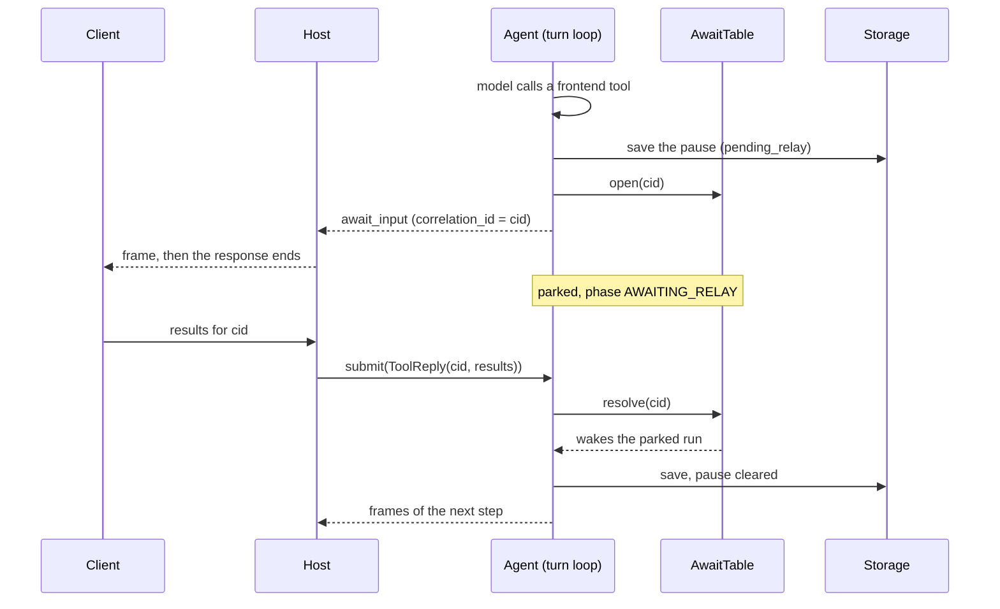

# Pause and resume

A run stops in the middle of a step when the model calls a tool that only the client can run, waits for the client's results, and carries on from the same step. The feature is called **relay**. The mechanism underneath is an **await**: a record in the await table keyed by a `cid`, which a `ToolReply` resolves.

A paused run is not finished. It holds its place in memory, and its pause is also saved, so the reply still lands after the process has lost that memory.



## What pauses a run

| Cause | Declared as | `reason` on the await |
|---|---|---|
| A frontend tool | `@tool(executor="frontend")`, or a schema passed in `frontend_tools=` | `frontend_tool` |
| A tool that needs approval | `@tool(needs_user_confirmation=True)` | `confirmation` |
| A scripted pause | Code calls `ctx.call_frontend_tool(name, input)` | `scripted` |

- The registry sorts each step's tool calls into backend, frontend and confirmation. Any frontend or confirmation call makes the step a relay step.
- A confirmation call travels exactly like a frontend call: it is sent to the client, and the client's reply is its result. The loop does not run the tool's own function afterwards.

> **Why relay is an execution mode, not a hook family:** a tool with `executor="frontend"` goes through the same `before_tool`, `after_tool` and `on_tool_error` as a backend tool.

## The pause, step by step

Anchor: `AnthropicAgent._run_relay_pause`, then `AgentRuntime.await_external`.

1. **Backend calls of the same step run first,** with their full [hook](../subsystems/hooks-and-profiles.md) lifecycle. Their results are held on the pause, not yet added to the context.
2. **`before_tool` fires for each frontend and confirmation call.** An `update` changes the input the client receives. A `block` answers that call with an error result instead of sending it.
3. **If every pending call was blocked,** the results are added to the context and the loop continues. There is no pause.
4. **The phase becomes `AWAITING_RELAY`** and the cid is minted: `relay_{run_id}_{current_step}`.
5. **The pause is saved** before parking: the config, with `agent_config.pending_relay` set, and the run's row.
6. **The await opens** in the [await table](../subsystems/session-actor.md#the-await-table), stamped with the session's principal and generation.
7. **`await_input` is emitted** and the run parks.

`pending_relay` (`PendingToolRelay`):

| Field | Holds |
|---|---|
| `cid`, `run_id` | The reply key and the run it belongs to |
| `frontend_calls`, `confirmation_calls` | The calls waiting on the client, with any hook-updated input |
| `completed_results` | The backend results of the same step |
| `pre_pause_settlement`, `pre_pause_run_usage`, `pre_pause_run_cost` | What the run has spent so far, priced at the pause. See [Billing a run](billing-a-run.md) |

Nothing is billed at a pause. The spend is only recorded, so that a process death while parked cannot erase it.

## The frame and the reply

The pause frame is a [meta envelope](../subsystems/streaming.md):

```json
{
  "type": "meta",
  "kind": "await_input",
  "correlation_id": "relay_<run_id>_<step>",
  "expects_reply": true,
  "payload": {
    "tools": [{ "tool_use_id": "toolu_…", "tool_name": "…", "input": { } }]
  }
}
```

The reply is one command for the whole pause:

```python
ToolReply(cid="relay_<run_id>_<step>", results=[ToolResultContent(tool_id="toolu_…", ...), ...])
```

- The cid is an echo token. The client sends back the one it received and never builds or interprets it.
- Each result names its call by `tool_id`. One reply answers every call of the pause.
- No frame closes the pause on the stream. The host's response for that request ends at `await_input`; the reply arrives as a new request, and the host reads the continuation from a fresh `attach_stream()`.

The reply is untrusted. Before it reaches the context, `_reconcile_relay_reply`:

- drops results for calls the pause did not ask for;
- drops results that repeat, or that the context already has;
- drops results for server tools (`srvtoolu_*`);
- adds an error result, "No result returned for this tool call.", for every call the reply left out.

So the model's tool calls are always answered, and delivering the same reply twice changes nothing.

## Resume

**Hot path: the session is still in memory.** `submit(ToolReply)` resolves the await and returns `RESOLVED`; the parked run wakes in place.

1. Warm the sandbox, if it was paused meanwhile.
2. Reconcile the reply.
3. Fire `after_tool` for each result, with `executor="frontend"`.
4. Splice: the backend results of the step and the reply go into the context as **one** user message. `pending_relay` is cleared.
5. Save.
6. The loop continues with the next provider call, in the same run. No `run_started` is emitted again, and the client's results are not echoed back as frames.

**Cold path: the process lost the session.** A parked session is never evicted, so this happens only after a restart or when another process takes the reply.

1. `SessionManager.submit` loads the session from storage.
2. The await table has no record for the cid, and the cid matches the saved `pending_relay.cid`, so the manager re-arms the pause: it reopens the record. No second `await_input` is sent, because the reply is already in hand.
3. `submit` resolves it. A background task then restores the run id, usage, cost and unbilled spend from the pause record, and runs steps 1 to 6 above.

The cold path covers the root agent's own pause: the manager checks the root's `pending_relay` only.

> **Why the runtime resolves a reply as the owner:** it presents its own principal as the claimant. Without that, a runtime with a named principal was an anonymous claimant against its own record: every reply was rejected and the pause parked forever.

The caller's own right to the session was checked earlier, when it attached.

> **Why a resume takes no fork/reset checkpoint:** each one re-encoded the transcript, snapshotted the sandbox and wrote the checkpoint row, only for the end of the run to rewrite it.

A resume saves the config and the run's row. [Checkpoints](fork-and-reset.md) are taken at the end of a run.

A resume never resets `current_step`; billing depends on that. See [Billing a run](billing-a-run.md#the-settlement).

## Replies that do not resume

| Reply | Disposition | Effect |
|---|---|---|
| Arrives twice | `IGNORED_DUP` | None |
| Names an unknown cid | `IGNORED_STALE` | None |
| Arrives after an abort or steer | `IGNORED_STALE` | None. The pause was already closed |
| Comes from another owner | `REJECTED` | None. The await stays open for the real owner |

The session's generation is what makes a late reply harmless. See [the await table](../subsystems/session-actor.md#the-await-table).

## Abort while paused

`submit(Abort())` on a parked session closes the await and wakes the run as aborted:

1. The context gets one user message: the backend results of the step, plus an error result, "Tool execution was aborted by the user.", for each call that was waiting.
2. `pending_relay` is cleared and the run is closed with `stop_reason="aborted"`.
3. Its steps so far are billed: the usage callbacks run and `usage_report` is emitted.
4. No `aborted` frame is sent for a parked run.

A saved pause counts as in flight even when nothing is in memory, so an `Abort` after a restart still repairs the chain. See [Abort and steer](abort-and-steer.md).

## Scripted pauses

`ctx.call_frontend_tool(name, input)` lets code ask the client for something without the model calling a tool. It is available to a tool body through its [`ToolContext`](../subsystems/tools.md) and to a host through `agent.scripted_ctx()`.

- It mints its own tool-use id and a cid of `relay_{run_id}_{name}`, fires `before_tool`, parks on the same await table, and returns the reply's results to the caller. It returns `[]` if the pause is aborted.
- The results are **not** spliced into the context and nothing is saved. A scripted pause lives in memory only and cannot be resumed after a restart.
- `after_tool` does not fire for it.

> **Why scripted pauses queue behind one lock per runtime:** the client holds one pending relay slot per agent, and the host's response ends at the first `await_input`. Concurrent callers queue instead of racing for that slot.

## Sub-agents

A [sub-agent](../subsystems/sub-agents.md) pauses the same way, on the same table. Its await is filed under the root session id with `child_agent_id` set, so one `ToolReply` to the session wakes it and one abort of the root closes it. The parent stays in `EXECUTING_TOOLS`, inside its `spawn_subagent` call, until the child finishes.
