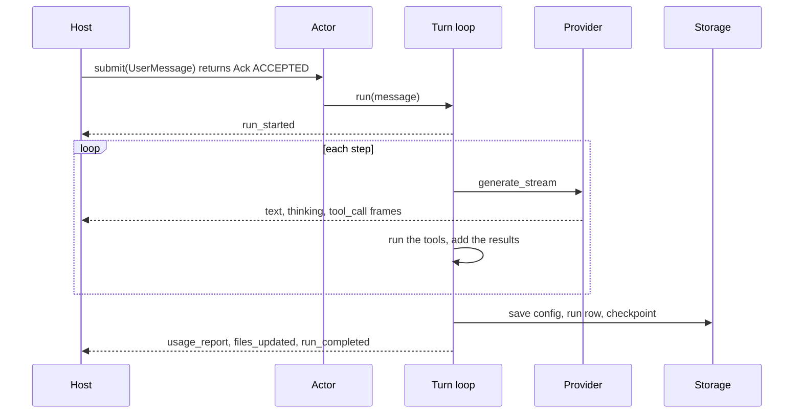

# A run

A **run** is the agent's work on one user message: from the moment the actor takes the message off the mailbox to the frame that ends it. It has a `run_id`, a row of its own (the `Conversation` class), and a cost. A session is a sequence of runs.

Inside a run the model is called once per **step**. This file follows a run end to end; the loop that drives the steps is in [Turn loop](../subsystems/turn-loop.md).



## Start

Anchor: `AnthropicAgent.run`.

1. **Unfinished business first.** If an [answer finalization](answer-finalization.md) was interrupted, it is completed. A queued [MCP](../subsystems/mcp.md) surface change is applied.
2. **A `run_id` is minted.**
3. **`on_turn_start` fires.** A [hook](../subsystems/hooks-and-profiles.md) can block the run, replace the message, switch the profile, or add text around the message.
4. **The run's state is reset:** a new `Conversation` row in memory, `current_step = 0`, a fresh per-run log, usage and cost at zero. The context (`context_messages`, the transcript the model sees) carries over from earlier runs.
5. **Memory is retrieved,** if a memory store is set. A failure is logged and ignored.
6. **The message is added** to the context and to both logs. A message over 80,000 tokens is written to the sandbox and replaced in the context by a reference.
7. **`run_started` is emitted,** and the loop begins.

The sandbox is warmed by the actor before `run` is called. With `defer_sandbox_initialization`, its preparation overlaps the first provider call instead.

### What the model actually receives

The user message is stored as the user wrote it. On every step it is rendered into the form the model sees (`core/renderer.py`):

```text
<memory>…</memory>            contributions placed before
<user_query>
  <user_upload>…</user_upload>   one per attachment
  the user's text
</user_query>
<hook_context>…</hook_context> contributions placed after
Provide answer to the user's query.   the tail (or the active profile's tail)
```

- **Contributions** (memory, hook text, the MCP change notice) attach to the current run's message only and are never persisted.
- Only user messages with attachments or contributions are rendered; everything else is sent as stored.

## Steps

Each step is one provider call followed by whatever the response asks for. `current_step` counts provider calls that completed.

| The model's response | What happens next |
|---|---|
| Tool calls, all backend | The tools run; their results become one user message; next step |
| Tool calls including frontend or confirmation tools | The run [pauses](pause-and-resume.md) and resumes at the same step |
| A server tool is still working (`pause_turn`) | Next step |
| The context window is exceeded | The context is compacted and the step retried |
| A final answer | The run ends |

## How a run ends

| Cause | `stop_reason` on the row | Last frames on the stream |
|---|---|---|
| The model finished | `end_turn` | `run_completed` |
| Output limit reached | `max_tokens` | `run_completed` |
| `max_steps` reached (default 50) | `max_steps` | `run_completed` |
| The model refused | `refusal` | `custom` `refusal`, then `run_completed` |
| Context still too large after compaction | `context_window_exceeded` | `run_completed` |
| [Abort or forceful steer](abort-and-steer.md) | `aborted` | `usage_report`, then `custom` `aborted` or `steered` |
| An error | `error` | `error_report`, then `run_completed` with `stop_reason: "error"` |

- A completed or errored run always ends with `run_completed`. An aborted one ends with the `aborted` marker and has no `run_completed`.
- `on_turn_end` fires when the model finishes. A hook that answers `continue` appends a hidden user message and the loop carries on; only `max_steps` bounds this.
- A refusal's response is removed from the context, so it is not replayed to the model on the next run.

## Finalize

Every run that is not aborted or errored goes through `_finalize_run`, in this order:

1. **Exports.** Files the agent wrote to the sandbox's exports zone are flushed to the [media backend](../subsystems/blob-store-and-media.md), and provider-hosted files are collected.
2. **Memory update,** if a store is set. A failure emits `error_report` and is not fatal.
3. **The row is closed:** `final_response`, `stop_reason`, `total_steps`, `usage`, `cost`, `generated_files`, `completed_at`.
4. **Persist:** the config and the run's row (a failure raises), then a [checkpoint](fork-and-reset.md) (a failure is reported on the stream and the run still completes).
5. **Settle.** The steps not yet billed are priced into a settlement; `usage_report` is emitted and the usage callbacks run. See [Billing a run](billing-a-run.md).
6. **`files_updated`** if there are files, then **`run_completed`**.

The first run of a session also derives a title from the user message, up to 72 characters.

With `early_answer_completion`, a root agent ends its runs through [answer finalization](answer-finalization.md) instead, which tells the client the answer is ready before the slow steps.

## An errored run

An error the loop cannot recover from closes the run's row with `stop_reason="error"` and the error's code, and saves only that row. The config is not saved, no checkpoint is taken, and the run is never billed. The stream gets `error_report` and `run_completed`.

A caller that awaits `agent.run()` directly, without the actor, gets the exception and no frames.

## Scripted runs

`agent.record_turn(user_message, assistant_message)` records a run the model did not produce: a canned reply, or an exchange the host scripted with [`call_frontend_tool`](pause-and-resume.md#scripted-pauses).

- It emits `run_started` and `run_completed`, fires `on_turn_start` and `on_turn_end`, adds both messages to the context, saves a `Conversation` row and takes a checkpoint.
- It makes no provider call, costs nothing, and emits no `usage_report`.
