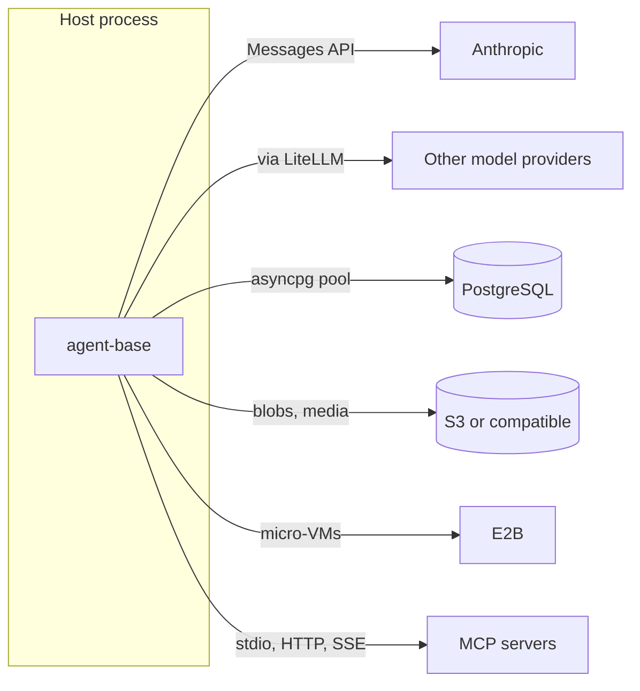

# External services

`agent-base` is a library. It runs inside the host's process and owns no deployment, no database and no secrets. What it does is talk to services the host has access to, through clients the host configures. This file lists them and says who supplies what.

## The services

| Service | Used by | Needed when | How the library reaches it |
|---|---|---|---|
| Anthropic Messages API | [Providers](../subsystems/providers.md) | Running `AnthropicAgent` | The `anthropic` SDK. The key is resolved by the SDK from `ANTHROPIC_API_KEY`, or the host injects a client; `fallback_api_keys` adds spares |
| Other model APIs | [Providers](../subsystems/providers.md) | Running `LiteLLMAgent` | `litellm`, which resolves each provider's key itself |
| PostgreSQL | [Storage](../subsystems/storage.md) | Using the Postgres adapters | The host creates an `asyncpg` pool and passes it in. The library reads no connection string from the environment |
| S3, or an S3-compatible store | [Blob store and media](../subsystems/blob-store-and-media.md) | Using the S3 implementations | `boto3` / `aioboto3`, with the default AWS credential chain. The host passes the bucket |
| E2B | [Sandbox](../subsystems/sandbox.md) | Using `E2BSandbox` (extra `e2b`) | The `e2b` SDK, which resolves its own API key |
| MCP servers | [MCP](../subsystems/mcp.md) | Passing `mcp_servers=` (extra `mcp`) | The `mcp` SDK; each server's URL or command and its auth come from the host |

Everything except a model API is optional. With no adapters, stores or sandbox given, an agent uses in-memory storage, a local media directory and a local sandbox directory, which is enough for development and tests.

## Environment variables

The library reads almost nothing from the environment itself.

| Variable | Read by |
|---|---|
| `S3_REGION`, then `AWS_REGION`, then `AWS_DEFAULT_REGION` | `S3Settings.from_env`. The built-in fallback is `us-east-1` |
| `S3_ENDPOINT_URL` | `S3Settings.from_env`, for S3-compatible stores |
| A bucket variable the host names | `S3Settings.from_env(bucket_var=...)` |
| `ANTHROPIC_API_KEY`, provider keys, AWS credentials, the E2B key | The respective SDKs, not the library |

`.env.example` at the repo root lists the conventional names.

A [local sandbox](../subsystems/sandbox.md#the-two-implementations) runs commands with the host process's whole environment. An E2B sandbox gets only a small base set plus the variables the host allow-lists, and refuses names that look like credentials.

## Failure behaviour

| Service down | What the session does |
|---|---|
| Model API | Retries with backoff, then the run ends as [errored](../features/run.md#an-errored-run) |
| PostgreSQL | A failed save of the config or run row fails the run. A failed checkpoint is reported on the stream and the run still completes |
| S3 (blob store) | The checkpoint cannot be captured; reported as above |
| E2B | A lost VM is replaced and restored from the latest checkpoint. See [Sandbox](../subsystems/sandbox.md#life-of-a-remote-sandbox-in-a-session) |
| An MCP server | The tool call returns an error to the model. The run carries on |

## What the host observes

- **Logging:** `agent_base.logging`, on `structlog`. `configure_logging(LogConfig(...))` picks JSON or console output; `correlation_scope(run_id=..., agent_id=..., principal=...)` stamps every line in a scope.
- **Observation events:** `agent_base.observability`. The host installs one sink with `install_sink(fn)` and receives timed events and spans (actor turns, tool executions, sandbox operations). With no sink installed it does nothing, and a sink that fails never fails a run.
- **Trace spans** inside the [conversation log](../subsystems/conversation-log.md#trace-spans), for per-run timing that is stored with the run.
