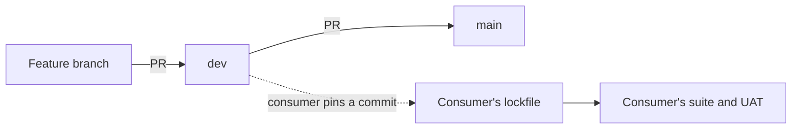

# Packaging and release

`agent-base` is a Python package, built from the `agent_base/` directory of this repo. It is not published to a package index and has no version tags: a consumer installs it straight from this repo and pins a commit. Nova's backend is the consumer.

The package, as a consumer may rely on it, is the **`agent-base` package** contract.

> **Cross-repo contract:** other repos depend on this. Before changing it, check the product map, then those repos' Depends on sections and code.

## What the contract is

Three things, and nothing else:

1. **The public Python surface that `tests/interface/` pins.** Every subsystem file in this model ends with a Contracts section naming its part.
2. **The four library tables** and their base columns: `agent_config`, `conversation_history`, `agent_runs`, `agent_checkpoints`. See [Storage](../subsystems/storage.md).
3. **`LIBRARY_SCHEMA_VERSION`** and the migrations that reach it.

A name that starts with an underscore is not contract, even where a consumer reads it today. Such a read marks a gap in the public surface, not a promise.

The [wire protocol](../subsystems/streaming.md) is a separate contract with a different consumer.

> **Why breaking changes are allowed and compatibility shims are deleted:** the library is preview and unreleased.

That freedom has a cost the consumer pays at its next pin: a breaking change here breaks the consumer's suite when it moves to the new commit. So a change to the contract is made together with the consumer's change, and both suites are run.

## The package

| | |
|---|---|
| Name, version | `agent-base`, `0.5.0` (`pyproject.toml`, `agent_base.__version__`) |
| Python | Declared as 3.10 or newer. Three modules import `typing.Self`, so it needs 3.11 in practice; the repo's `.python-version` is 3.12 |
| Build | `hatchling`; the wheel contains `agent_base/` only |
| Dependency manager | `uv`. `demos/fastapi_server` is a workspace member |
| Extras | `mcp` (the [MCP](../subsystems/mcp.md) client), `e2b` (the [remote sandbox](../subsystems/sandbox.md)) |
| Core dependencies | `anthropic`, `litellm`, `asyncpg`, `boto3` / `aioboto3`, `aiofiles`, `blake3`, `structlog`, `pillow`, `pymupdf`, `pyyaml`, `python-dotenv` |

Where each part of the package is told:

| Directory | Model file |
|---|---|
| `session/`, `await_table/`, `core/runtime.py`, `core/commands.py`, `core/ack.py` | [Session actor](../subsystems/session-actor.md) |
| `providers/anthropic/anthropic_agent.py`, `core/chain.py`, `core/renderer.py` | [Turn loop](../subsystems/turn-loop.md) |
| `core/provider.py`, `providers/` | [Providers](../subsystems/providers.md) |
| `core/hooks/`, `profiles.py` | [Hooks and profiles](../subsystems/hooks-and-profiles.md) |
| `core/identity.py` | [Identity](../subsystems/identity.md) |
| `streaming/` | [Streaming](../subsystems/streaming.md) |
| `core/conversation_log.py`, `core/trace_spans.py` | [Conversation log](../subsystems/conversation-log.md) |
| `tools/`, `common_tools/` | [Tools](../subsystems/tools.md), [Sub-agents](../subsystems/sub-agents.md) |
| `mcp/` | [MCP](../subsystems/mcp.md) |
| `storage/`, `core/config.py` | [Storage](../subsystems/storage.md) |
| `core/fork_reset.py`, `core/checkpoint.py`, `storage/checkpoint_codec.py` | [Fork and reset](../features/fork-and-reset.md) |
| `sandbox/` | [Sandbox](../subsystems/sandbox.md) |
| `blob_store/`, `media_backend/` | [Blob store and media](../subsystems/blob-store-and-media.md) |
| `pricing/`, `core/cost.py` | [Billing a run](../features/billing-a-run.md) |

## Tests

| Suite | Run with | What it is |
|---|---|---|
| `tests/unit/` | `pytest` | The default suite |
| `tests/integration/` | `pytest -m integration` | Needs live services; deselected by default |
| `tests/interface/` | `pytest tests/interface` | The contract in executable form: one package per subsystem. Not in the default test paths, so it must be targeted |

There is no CI workflow in this repo. The suites are run locally before a change is merged.

## How a change reaches the consumer

1. Work lands on `dev` by pull request; `dev` is merged to `main`.
2. The consumer moves its pin to the new commit. Nothing reaches it before that.
3. While developing, the consumer can point at a local checkout of this repo instead of a pin, which is how a change is tried before it is merged.

A change that alters what the model is sent, or how tools and results are delivered, can change quality, cost and latency with every test still passing. Such a change is measured in the consumer with real requests before it is pinned; the working practice is in the root `CLAUDE.md`.

A change to a library table follows the schema rule in [Storage](../subsystems/storage.md#schema-versioning): bump the version and ship the migration in the same change.
