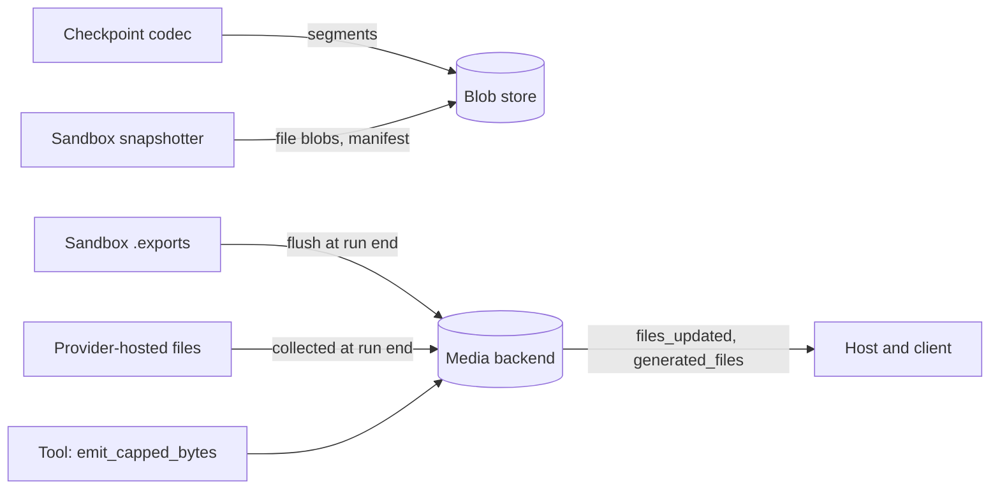

# Blob store and media

Two stores for bytes that do not belong in a database row.

- The **blob store** holds immutable content by key: checkpoint transcript segments and sandbox snapshot files. Nothing in it is meant to be seen by a user.
- The **media backend** holds files that are part of the conversation: what the user uploaded and what the agent produced. Each has an id, a filename and a URL.

Both have a local-directory implementation and an S3 one.

## Where they sit

## Blob store

Two surfaces on one store (`blob_store/base.py`).

| Surface | Addressed by | Used by |
|---|---|---|
| `KeyedBlobStore`: `put_at`, `get_by_key`, `exists_key`, `delete_key` | A key the caller chooses | Checkpoints and sandbox snapshots, with keys of the form `<tenant>/<content hash>` |
| `BlobStore`: `put`, `get`, `exists`, `delete` | Content hash within a namespace | `ToolContext.emit_capped_bytes`, through the media backend |

- Storing the same bytes twice costs nothing: `put` skips content that exists, and callers of `put_at` check `exists_key` first.
- `LocalBlobStore(base_path, prefix)` writes files; `S3BlobStore(bucket, prefix, region, endpoint_url)` writes objects.
- An agent gets one as `blob_store=`. Without it, checkpoints keep their transcript inline and capture no sandbox. See [Fork and reset](../features/fork-and-reset.md).

Tenant scoping of the keys is decided where checkpoints are; the reason is told there.

## Media backend

`MediaBackend` (`media_backend/media_types.py`) stores a file under an agent and returns its `MediaMetadata`:

| Field | Meaning |
|---|---|
| `media_id` | Identifier, unique per stored file |
| `media_filename`, `media_extension`, `media_mime_type`, `media_size` | What the file is |
| `storage_type`, `storage_location`, `url` | Where it is |
| `content_hash` | For change detection |
| `extras` | For exports: `export_path` and `blake3_hash` |

- `LocalMediaBackend(base_path)` keeps files at `<base_path>/<agent_uuid>/<media_id>_<filename>`. It is the default when an agent is given none.
- `S3MediaBackend(bucket, prefix)` keeps objects at `<prefix>/<agent_uuid>/<media_id>_<filename>`. `to_url` returns the object's plain URL, not a presigned one.
- `store_idempotent(..., key=...)` derives the id from the key, so a repeat returns the file already stored.

## Exports: files the agent produced

The agent hands a file to the user by writing it to the sandbox's exports zone. At the end of a run the backend flushes that zone.

1. List the exported files with their hashes.
2. Compare each with what was uploaded for that path before. Unchanged files are skipped.
3. Upload the new and changed ones, each stamped with its `export_path` and hash.
4. Add files the provider hosted during the run (collected from server tool results).
5. Record them in `agent_config.media_registry` and on the run's row as `generated_files`.
6. Emit `files_updated` with the list, before `run_completed`.

- The strategy is `IncrementalBlake3Flush`; a host can pass another `MediaFlushStrategy`.
- A file removed from the exports zone is reported as deleted and is not removed from the backend.
- The flush runs at a normal [finalize](../features/run.md#finalize) and within [answer finalization](../features/answer-finalization.md). It does not run for an aborted or errored run.

## Attachments: files the user sent

A user message carries `attachments`, each with a filename, media type and a source.

| `source_type` | The model receives |
|---|---|
| `base64`, `url`, `file_id` | An image, document or attachment block, plus a `<user_upload>` line carrying the attachment's `data` (the payload, URL or file id), or its filename when `data` is empty |
| `file` (a path in the sandbox) | Only the `<user_upload>` line, carrying the path. The agent reads the file with its tools |

The message is stored as sent; the blocks are built at [render time](../features/run.md#what-the-model-actually-receives), on every step.

## Images within a budget

`fit_image_to_budget` (`media_backend/projection.py`) downsizes and re-encodes an image to fit a size budget before it goes to the model. The `read_file` tool uses it through `image_block`.

## Contracts

- `BlobStore`, `KeyedBlobStore`, `BlobRef`, `LocalBlobStore`, `S3BlobStore`, `S3Settings`.
- `MediaBackend`, `MediaMetadata`, `LocalMediaBackend`, `S3MediaBackend`, `MediaFlushStrategy`, `IncrementalBlake3Flush`, `FlushResult`.
- Constructor arguments `blob_store` and `media_backend`.
- The `files_updated` frame and `Conversation.generated_files`, each a list of `MediaMetadata` dicts.

## Depends on

- **S3 or an S3-compatible store,** for the S3 implementations. Credentials come from the default AWS credential chain. See [External services](../infrastructure/external-services.md).
