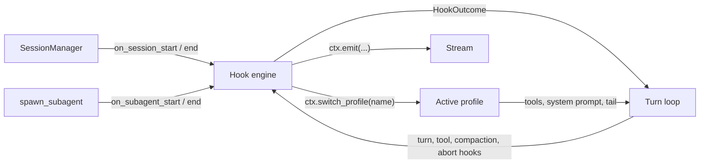

# Hooks and profiles

**Hooks** are how a host changes what the agent does without subclassing the loop: async functions the runtime calls at fixed points in a session, a run and a tool call, each able to observe, change or block what is about to happen.

A **profile** is a named set of tools, system prompt and tail instruction. One is active at a time, and a hook can switch it. It is how one agent serves several modes of work.

## Where it sits



## The catalog

| Hook | Fires | A hook can |
|---|---|---|
| `on_session_start` | A session is built into memory. `source` is `create` or `resume` | Block the session (`SessionBlocked`); set its profiles and default profile |
| `on_session_end` | A session is evicted | Observe |
| `on_turn_start` | Once per run, before anything else | Block the run; replace the message; add text before or after it; switch profile |
| `on_turn_end` | The model finished | Make the loop continue with a hidden prompt |
| `before_tool` | Before each tool call: backend, frontend, confirmation and scripted | Block the call; rewrite its input |
| `after_tool` | After each result, backend or relayed | Replace the result; switch profile |
| `on_tool_error` | A backend tool raised | Replace the error result |
| `on_subagent_start` | Before a sub-agent is built | Block the spawn; replace its spec |
| `on_subagent_end` | A sub-agent finished or failed | Observe |
| `before_compact` | Before compaction. `trigger` is `auto` or `overflow` | Veto an `auto` compaction; a veto on `overflow` fails the run |
| `after_compact` | After compaction | Observe |
| `on_abort` | An abort, a forceful steer or an eviction tears down a run | Observe |
| `on_profile_changed` | The active profile changed, or was first announced | Observe |

- `on_turn_start` fires once per run, not per step, and not when a run resumes from a pause.
- Tool hooks match on tool name, `on_subagent_*` on agent type, compaction hooks on trigger, session hooks on source or reason, `on_profile_changed` on the new profile's name. Patterns are globs; none means all. `on_turn_start`, `on_turn_end` and `on_abort` take no matcher.
- A relayed tool goes through `before_tool` and `after_tool` like a backend one. See [Pause and resume](../features/pause-and-resume.md#what-pauses-a-run).
- `before_tool` sees a copy of the input. See [the tool round](turn-loop.md#the-tool-round).

## What a hook receives and returns

**Receives** a context object (`core/hooks/context.py`). Every context has the run and agent ids, the principal, the sandbox, storage, media and memory handles, the agent's config and current `Conversation`, a logger, and `emit`. Each hook adds its own fields: `tool_name`, `tool_input` and `tool_use_id` for tool hooks, `message` for `on_turn_start`, and so on.

**Returns** nothing, or a `HookOutcome`:

| Field | Effect |
|---|---|
| `decision="block"`, `reason` | Stops the action. `reason` is the text surfaced |
| `update` | The replacement: a message, a tool input, a result, a spec |
| `additional_context` | Text shown to the model with the user message. `on_turn_start` only |
| `events` | Meta bodies to emit on the stream |

`TurnStartOutcome` adds `prompt_prefix` and `prompt_suffix`. `EndTurnOutcome` adds `action="continue"` and `continue_prompt`.

**What a block does:**

| Hook | Result |
|---|---|
| `on_session_start` | The agent is closed; `get_or_create` raises `SessionBlocked` |
| `on_turn_start` | The run fails before it starts, with `ErrorCode.ABORTED` |
| `before_tool`, backend | The call is not run. The model gets an error result with the reason |
| `before_tool`, frontend or confirmation | The call is not sent to the client. The model gets an error result |
| `before_tool`, scripted | `call_frontend_tool` raises |
| `on_subagent_start` | The spawn returns an error result |
| `before_compact` | `auto`: compaction is skipped. `overflow`: the run fails with `CONTEXT_OVERFLOW` |

`ctx.emit(body)` puts a meta frame on the [stream](streaming.md). It is synchronous and never raises; if no reader is attached the frame is dropped.

## Registering and composing

Three ways, which compose in this order:

1. **Subclass method:** a method on the agent subclass named after the hook.
2. **Constructor:** `hooks={"before_tool": [HookMatcher(matcher="bash*", hooks=[fn]), other_fn]}`. A bare function matches everything.
3. **Instance:** `agent.hooks.add(event, fn, matcher=None)`, or `agent.hooks.replace(event, *fns)`.

When several hooks match:

- **All of them run.** A block does not stop the rest; the first block's reason is kept.
- **`update`:** each update is written into the context the next hook sees; the last one wins.
- **`additional_context`** is joined; **`events`** are concatenated.
- **A hook that raises fails the run.** There is no isolation, except for `on_session_end`, whose errors are logged.

## Profiles

```python
Profile(name="analyst", tools=[...], frontend_tools=[...], system_prompt="…", tail="…")
```

- **Declared** with `profiles=` and `default_profile=` on the constructor, or by `on_session_start`.
- **Applied:** a profile with tools rebuilds the tool registry (MCP tools are re-added); one without keeps the current tools. Its `system_prompt` and `tail` replace the agent's defaults while it is active.
- **Switched** only by a hook: `ctx.switch_profile(name)` in `on_turn_start` or `after_tool`.

| Switched from | Takes effect |
|---|---|
| `on_turn_start` | For the first step of this run |
| `after_tool` | At the next step of the same run |

- **Persisted** as `agent_config.active_profile`, and restored when the session is loaded, if that profile is still declared.
- **Announced** with a `profile_changed` frame and the `on_profile_changed` hook, whose `source` is `session_default`, `restore` or `hook_switch`.

`agent.reconfigure(tools, frontend_tools)` changes the tools directly. It does not change the active profile and announces nothing.

"Mode" is a consumer's word for a profile; the library has only profiles.

## An older mechanism

The constructor argument `end_turn_hook=` predates the catalog and still works. It runs before `on_turn_end`, can reject the model's answer and make it try again, and is the only producer of `rollback` entries in the [conversation log](conversation-log.md). `on_turn_end` is the one to build on.

## Contracts

- The 13 hook names, their context classes and `HookOutcome`, `TurnStartOutcome`, `EndTurnOutcome`.
- `HookMatcher`, `agent.hooks.add` and `replace`, the `hooks=` constructor argument.
- `Profile`, `profiles=`, `default_profile=`, `ctx.switch_profile`, the `profile_changed` frame.
