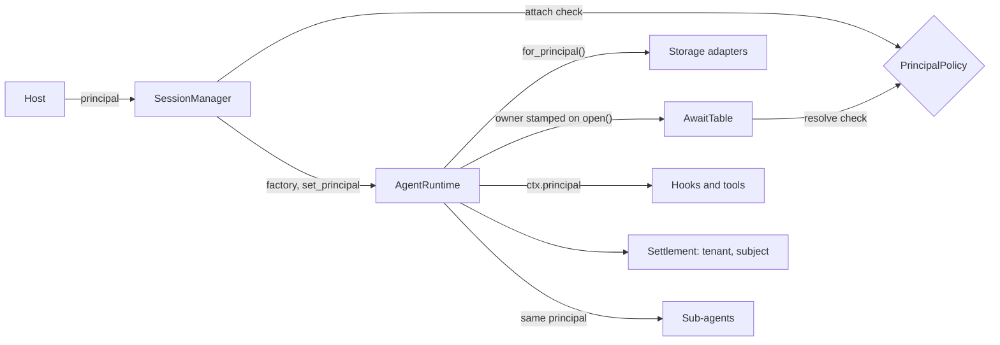

# Identity

Who a session belongs to. The host gives the library one value, a `SessionPrincipal`, and the library carries it to every place that must know the owner: who may attach to the session, who may answer its pauses, which rows storage may touch, and whose usage a settlement is.

The library does not authenticate anyone. The host verifies the caller and builds the principal.

## The principal

```python
SessionPrincipal(tenant="org_123", subject="member_456", claims={"role": "admin"})
```

| Field | Meaning |
|---|---|
| `tenant` | The owning organization |
| `subject` | The owning user |
| `claims` | Anything else the host knows about the caller. Kept in memory only |

- `(tenant, subject)` is the **scope key**. It alone decides ownership.
- A principal with neither is **anonymous**. A session built without a principal is anonymous, and an anonymous session has no owner to enforce.
- **Claims never leave the process.** They are not persisted, not used for scoping, and not serialized in a settlement, an audit record or a log line.

## Where it flows



| Place | What the principal does there |
|---|---|
| `SessionManager` | Passed to the host's factory, then bound with `set_principal`. Checked on every attach to a resident session |
| The runtime | `agent.principal`. Rebinds its storage adapters and stamps `owner_tenant` and `owner_subject` on the config |
| Storage adapters | `for_principal(p)` returns a copy bound to `p`. The Postgres adapters scope their queries by it once the host has added `principal_columns()`; the in-memory adapters do not filter. See [Storage](storage.md#tenant-scoping) |
| Await table | The owner is stamped on each record when a pause opens, and checked when a reply resolves it |
| Hooks and tools | `ctx.principal`, claims included |
| Settlement | `TurnSettlement.principal`; serialized as `tenant` and `subject` |
| Sub-agents | A child gets its parent's principal and the parent's bound adapters |
| Checkpoint and snapshot blobs | Keys are prefixed with the tenant. See [Fork and reset](../features/fork-and-reset.md) |

## The rule

`PrincipalPolicy` is a protocol with one method, `authorizes(owner, claimant)`: the owner is the principal a session or a pause was stamped with, the claimant is the principal of whoever is asking. The default is `StrictScopePolicy`:

| Owner | Claimant | Allowed |
|---|---|---|
| Anonymous or none | Anyone | Yes |
| Named | None or anonymous | No |
| Named | Same tenant and subject | Yes. Claims are ignored |
| Named | Anything else | No |

A host passes its own policy as `SessionManager(principal_policy=...)`.

> **Why a policy seam:** it is deliberate, for hosts that need a looser rule than same tenant and subject.

The manager's policy governs the attach check. The await table always applies `StrictScopePolicy` when a reply resolves a pause, whatever the manager was given.

Two decisions about these checks live with the code they guard:

- The attach check always runs, even with no claimant: see [Session actor](session-actor.md#the-attach-check).
- A reply is resolved with the runtime's own principal as the claimant: see [Pause and resume](../features/pause-and-resume.md#resume).

## Binding and conflicts

A session's owner is fixed once it is named.

| Runtime has | Given | Result |
|---|---|---|
| Anonymous | Named | Adopts it, rebinds storage, stamps the owner |
| Named | Same scope key | Replaces it (the new one may carry fresher claims) |
| Named | Different scope key | `PrincipalConflict` |
| Anything | None or anonymous | No change. A session never silently loses its owner |

On load, the same rule is applied to the owner on the loaded config: an anonymous runtime adopts it, and a named one that differs raises `PrincipalConflict`. That needs an adapter that keeps the owner on the config, as the in-memory ones do. With the Postgres adapters the owner lives in filter columns: a row owned by someone else is not returned by the load at all, and the session is built as new.

## What a mismatch looks like

| Gate | Result | HTTP |
|---|---|---|
| `get_or_create` on a resident session | `SessionNotFound` | The host maps it |
| `get_or_create` loading from storage | Postgres adapters: the row is not found. Adapters that keep the owner on the config: `PrincipalConflict` | The host maps it |
| `SessionManager.submit` | `Ack` with `NOT_FOUND` | 404 |
| A reply resolved by a runtime whose principal differs from the pause's owner | `Ack` with `REJECTED`; the pause stays open | 422 |

The fourth is not reachable through `SessionManager`, which stops a caller who does not own the session at the attach check and always resolves with the runtime's own principal.

## Contracts

- `SessionPrincipal`, `PrincipalPolicy`, `StrictScopePolicy`, `PrincipalConflict`.
- `principal=` on the agent constructor and on `SessionManager.get_or_create` and `submit`; `agent.set_principal()`.
- `principal_columns()` for [storage](storage.md#tenant-scoping).
- `namespaced_base_dir(root, principal)` builds a per-owner directory path (`root/<tenant>/<subject>`) for hosts that place local sandboxes or files per owner. The library does not call it itself.
