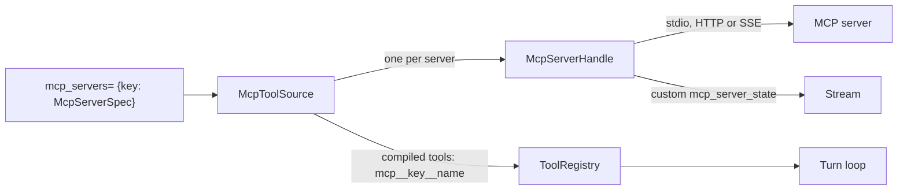
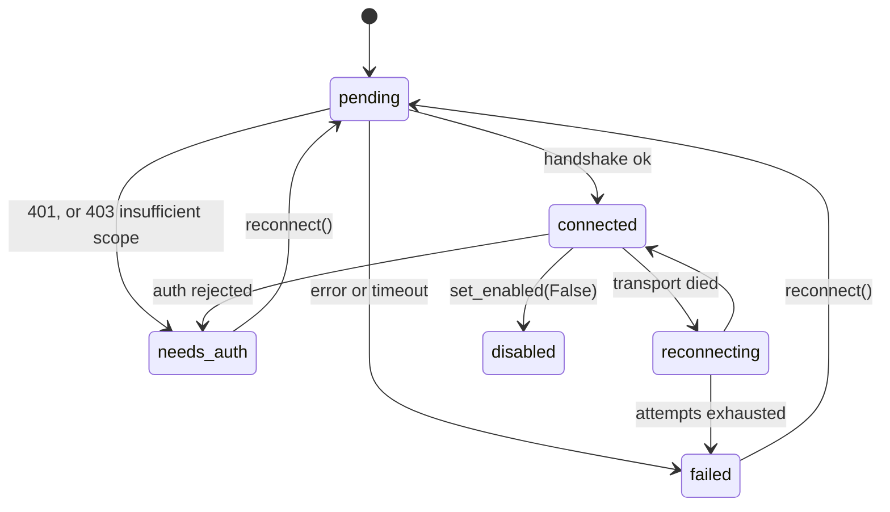

# MCP

Lets an agent use tools served by external Model Context Protocol servers. Each server's tools are discovered when the session starts and registered beside the agent's own [tools](tools.md), so the model and the [turn loop](turn-loop.md) treat them as ordinary backend tools.

It is an optional extra: `agent-base[mcp]`. Passing `mcp_servers=` without it raises `ImportError` when the agent is constructed.

## Where it sits



> **Why MCP servers get their own `mcp_servers=` argument, not a tool bundle:** bundles expand synchronously at registration, and MCP discovery is async.

## Declaring a server

```python
McpServerSpec(
    transport=McpHttpSpec(url="…", auth=BearerTokenAuth(token_cb)),
    include_tools=None, exclude_tools=[],
    confirm_destructive=False,
    tool_timeout_s=60.0,
    required=False,
)
```

| Field | Meaning |
|---|---|
| `transport` | `McpStdioSpec(command, args, env, cwd)`, `McpHttpSpec(url, headers, auth)` or `McpSseSpec(url, headers, auth)` |
| `include_tools`, `exclude_tools` | Filter by the server's own tool names |
| `confirm_destructive` | Tools the server marks destructive become confirmation tools, so a call [pauses](../features/pause-and-resume.md). As for any confirmation tool, the client's reply is the result; the loop does not call the server afterwards |
| `tool_timeout_s` | Per call |
| `required` | If the server is not connected after start-up, `initialize()` raises |
| `reconnect` | `McpReconnectPolicy(max_attempts=5, base_delay_s=0.5, max_delay_s=30.0)` |

Server keys are letters, digits, `_` and `-`, with no double underscore.

**Auth** is a provider object with `headers()` and `on_unauthorized()`: `StaticHeadersAuth`, `BearerTokenAuth`, `SessionHeadersAuth`, `ClientCredentialsOAuth`, and `OAuthTokenAuth`, which reads and writes tokens through a `TokenStore` the host implements.

## Discovery and naming

- Servers connect concurrently in `agent.initialize()`: handshake, then `tools/list`. Connecting times out after 30 seconds.
- Each tool is registered as `mcp__{server key}__{tool name}`, cut to 64 characters, with other characters replaced by `_`.
- The server's description and input schema are passed through unchanged.
- A status tool, `mcp_status`, is registered with them. It reports each server's state, tools and last error.

## A server's life



- Reconnects back off exponentially with jitter, up to `max_attempts`.
- A 401 during a call triggers one `on_unauthorized()`, a reconnect and one retry.
- Each change into `connected`, `failed` or `needs_auth` emits `custom` `mcp_server_state` with `server`, `state`, `error` and `server_info`; a removed server emits `state: "removed"`.

A dead server fails the tool call, never the run. A call to a server that is disabled or needs auth returns an error result at once; for other states the handle first tries to connect within the tool's timeout.

## Results

`result_to_envelope` (`mcp/convert.py`) turns an MCP result into a [tool result](tools.md#results).

| MCP content | Becomes |
|---|---|
| Text | Text |
| Image | An inline image block |
| Audio | A one-line note; the audio is not passed on |
| Resource link, embedded text resource | A text description |
| `structuredContent` | Appended as JSON, unless it repeats the text |
| `isError` | An error result |

Output over 25,000 characters is capped. Over-long JSON is saved whole to the sandbox; the model gets the compact JSON if that fits, otherwise an outline of its structure, an abridged copy and the path. Other text goes through `ctx.emit_capped`.

## Changing servers on a live session

| Call | Effect |
|---|---|
| `add_mcp_server`, `remove_mcp_server` | Add or remove one server |
| `reconcile_mcp_servers(desired)` | Add the missing, remove the absent. A server whose spec changed is left as it is |
| `mcp_refresh` | Re-list a server's tools |
| `mcp_reconnect`, `mcp_set_enabled` | Reconnect; enable or disable |
| `mcp_statuses` | Current state of each |

- A change takes effect at once when no run is active, otherwise at the start of the next run. The registry is rebuilt, not edited: see [Tools](tools.md#the-registry).
- The model is told. The next run's user message carries a note, "MCP servers changed since your last turn:", with one line per server that connected, disconnected or changed, and its tool count. The note is not persisted.

`probe(transport, auth)` connects once to a server without registering anything and returns its state, its tools and any auth challenge.

## Sub-agents

A [sub-agent](sub-agents.md) whose spec carries the parent's MCP source uses the same live connections, and sees servers added later. The parent keeps ownership: a child never closes the source.

## Contracts

- `mcp_servers=`, `McpServerSpec`, the three transport specs, `McpReconnectPolicy`, the auth providers, `TokenStore`.
- The tool name format `mcp__{key}__{name}`, the `mcp_status` tool, and the `mcp_server_state` frame.
- The agent verbs in the table above, `McpToolDiff`, `probe` and `McpProbeResult`.

## Depends on

- The `mcp` Python SDK (the optional extra).
- Whatever servers the host configures. See [External services](../infrastructure/external-services.md).
