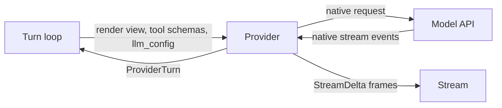

# Providers

A provider is the one model-specific piece of the library: it builds the request, calls the model, translates the native stream into the library's frames, and classifies failures. Everything else (the [turn loop](turn-loop.md), hooks, tools, persistence) is written against the `Provider` protocol.

Anthropic is the provider Nova runs on. LiteLLM is partial.

## Where it sits

> **Why a provider is a value, not a base class:** it is injected into the runtime. A shared mixin would have fixed the duplication between the two agents but not the shape of the problem, provider-as-subclass.

Today the value is injected into `AnthropicAgent`, which still holds the loop; see [Turn loop](turn-loop.md).

## The protocol

`core/provider.py`. This module imports no provider SDK.

| Member | What it does |
|---|---|
| `name`, `default_model()` | Identity and the model used when the agent names none |
| `make_llm_config(loaded)` | Builds the provider's own `LLMConfig` from a saved one |
| `generate(...)` | One non-streaming call |
| `generate_stream(..., sink, cancellation_event)` | One streaming call. Emits frames to `sink` and stops at the next event once cancelled |
| `classify_error(exc)` | Maps a native exception to a `ProviderError` |
| `sanitize_chain(messages)` | [Chain repair](turn-loop.md#chain-repair) for this provider |
| `plan_stream_abort(turn)` | What to keep of a cancelled response |
| `extract_tool_calls(message)` | The client tool calls in a response. Server tool calls are excluded |
| `collect_api_files(runtime)` | Files the provider hosted during the run. Default: none |
| `token_estimator`, `retry_policy` | Token estimation and the retry budget |

Values that cross the seam:

- **`ProviderTurn`**: `message` (the assistant response), `was_cancelled`, `partial_error`, `stream_bookkeeping`, `timing`.
- **`ProviderError`**: `code` (an `ErrorCode`), `native_code`, `message`, `retriable`, `raw`.
- **`RetryPolicy`**: `max_retries=3` (total attempts), `base_delay=1.0` seconds.

## The Anthropic request

`AnthropicProvider` (`providers/anthropic/provider.py`), configured by `AnthropicLLMConfig`. It calls the beta Messages API.

| Request field | Source |
|---|---|
| `model` | The agent's `model`, else `claude-sonnet-5` |
| `max_tokens` | `llm_config.max_tokens`, else 16,384 |
| `system` | The system prompt, or the active [profile](hooks-and-profiles.md)'s |
| `thinking` | `effort` set: adaptive thinking, with `output_config.effort`. Else `thinking_tokens` set: enabled, with that budget. Neither: none |
| `tools` | The registry's schemas, then `server_tools` |
| `betas`, `container` | `beta_headers`; `container_id` and `skills` |
| `context_management`, `inference_geo`, `speed`, `service_tier` | Passed through when set |
| anything else | `api_kwargs`, applied last, so it overrides the rest |

> **Why thinking is chosen by field, not by model name:** which config field the caller set picks the paradigm, which keeps the provider model-agnostic.

When both fields are set, `effort` wins.

**Prompt caching** is always on. Up to four cache breakpoints are placed, in this order of preference: the system prompt (when long enough to cache), document and image blocks, the largest text blocks, the most recent blocks. None is placed on tools. Several decisions elsewhere keep the cached prefix byte-stable: see [chain repair](turn-loop.md#chain-repair), [the tool round](turn-loop.md#the-tool-round) and [Storage](storage.md).

**Stream translation** (`providers/anthropic/retry.py`):

| Native event | Frame |
|---|---|
| Text and thinking deltas | `text`, `thinking` frames as they arrive, then one closing frame per block |
| Tool call input | Buffered; one `tool_call` frame with the full arguments when the block ends |
| Server tool results | `server_tool_result` frames, when `stream_meta_history_and_tool_results` is on |
| Citations | `citation` frames when the block ends |
| A stream `error` event | A non-terminal `error` frame |

Frame shapes are in [Streaming](streaming.md).

## Errors and retries

| Native failure | `ErrorCode` |
|---|---|
| Rate limit | `RATE_LIMITED` |
| Timeout, connection error | `PROVIDER_TIMEOUT` |
| Server error, overloaded | `PROVIDER_OVERLOADED` |
| HTTP 413, request too large, context window | `CONTEXT_OVERFLOW` |
| Other status errors | `PROVIDER_STATUS` |
| Anything else | `INTERNAL` |

- **Retried inside the provider:** rate limits, connection errors, timeouts, 5xx and overloaded, with exponential backoff from `base_delay` (plus jitter when streaming).
- **Fallback keys:** with `fallback_api_keys`, a request rejected for exhausted credit moves to the next key, and that key stays in use.
- **Overflow** is not retried by the provider. The loop compacts and retries the step.

## LiteLLM

`LiteLLMAgent` subclasses `AnthropicAgent` and swaps in `LiteLLMProvider`, which calls `litellm.acompletion`. It is partial:

| Area | Gap |
|---|---|
| Retries | The provider stores a `RetryPolicy` and makes one attempt |
| Constructor | No `principal`, `mcp_servers`, `checkpoint_adapter`, `sandbox_coordinator`, `blob_store`, `pricing_policy`, `fallback_api_keys`, `early_answer_completion` or deferred sandbox arguments |
| Pricing | The pricing table has only `claude-*` rows, so other models cost zero |
| Frames | `text`, `thinking` and `tool_call` only. No closing frame per block, no citations, no server tool results |
| Caching | No cache breakpoints |
| Chain repair | Merges consecutive user messages |

Stop reasons are mapped to the loop's vocabulary: `stop` to `stop`, `tool_calls` to `tool_use`, `length` to `max_tokens`.

## Contracts

Part of the [`agent-base` package contract](../infrastructure/packaging-and-release.md): `AnthropicAgent` and its constructor, `AnthropicLLMConfig`, `LiteLLMAgent`, `LiteLLMConfig`, and the `Provider`, `ProviderTurn`, `ProviderError` and `RetryPolicy` types.

## Depends on

- **Anthropic Messages API** (beta surface) through the `anthropic` SDK. Adaptive thinking needs an SDK version that accepts `output_config`.
- **LiteLLM** for every other model.

See [External services](../infrastructure/external-services.md).
