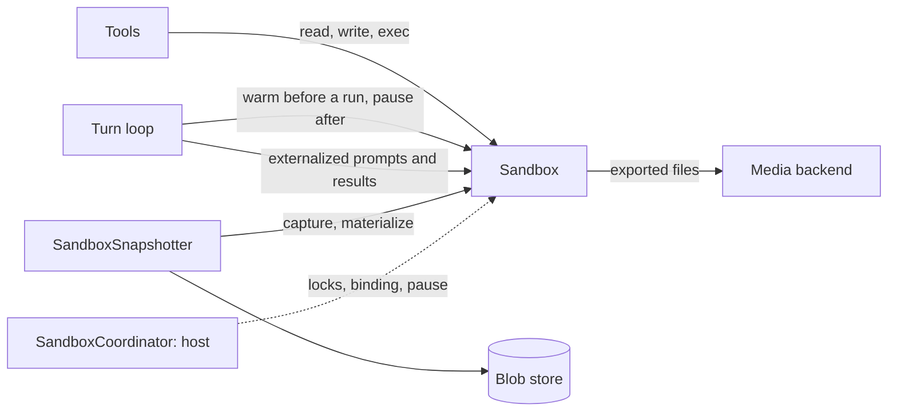
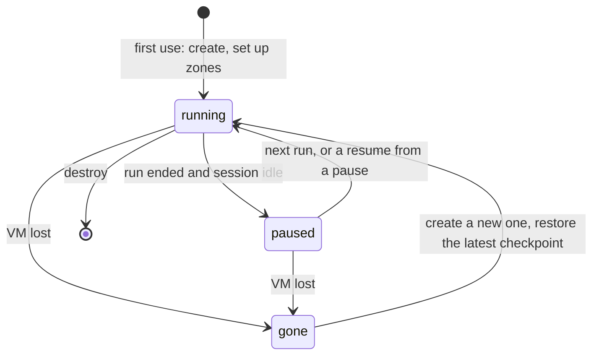

# Sandbox

The agent's working directory and command line: a filesystem its tools read and write, and a shell they run commands in. Every agent has one. It is the only part of a session's state that lives outside the database, so the library also snapshots it, restores it, and brings it back when it disappears.

Two implementations ship: `LocalSandbox`, a directory on the host, and `E2BSandbox`, a remote micro-VM (optional extra `e2b`). A host can register its own.

## Where it sits

## The interface

`Sandbox` (`sandbox/sandbox_types.py`) is an abstract class.

| Group | Methods |
|---|---|
| Lifecycle | `setup`, `teardown` |
| Files | `read_file` (text, paged), `read_file_bytes`, `write_file`, `write_file_bytes`, `list_dir`, `walk`, `file_exists`, `delete` |
| Bulk | `import_tree`, `extract_archive` |
| Commands | `exec` (buffered), `exec_stream` (lines as they come), `run_streaming` (callback per chunk, capped tail kept) |
| Exports | `import_file`, `list_exported_files`, `get_exported_file`, `get_exported_file_metadata` |
| Remote only | `ensure_running`, `pause`, `forget_remote`, `is_remote` |
| Snapshot | `manifest` (a fast listing of files and hashes, when the sandbox can produce one) |

`ExecResult` has `exit_code`, `stdout`, `stderr`, `timed_out`, `duration_ms` and truncation facts. A timeout returns `exit_code=-1` with `timed_out=True`; it does not raise.

A sandbox is described by a `SandboxConfig`, saved on the session as `agent_config.sandbox_config` and used to rebind the same sandbox when the session is loaded. A host adds a kind of sandbox with `@register_sandbox("key")` on a `Sandbox` subclass and its config class.

## Zones and paths

The default layout (`ZoneLayout`) gives every sandbox these directories:

| Zone | For |
|---|---|
| `workspace/` | The agent's working directory. A bare path means a path in here |
| `workspace/.imported/` | Files the host imports |
| `.exports/` | Files meant for the user. Flushed to the [media backend](blob-store-and-media.md) at the end of a run |
| `.plans/` | Plan artifacts |
| `.context/` | Prompts and tool results [externalized](turn-loop.md#keeping-the-context-in-the-window) from the context |
| `.tool_results/` | Output a [tool capped](tools.md#large-results) |

- **Path grammar:** a path whose first segment is a zone name is taken as written; anything else is placed under `workspace/`. Leading `../` segments are stripped, not rejected.
- **Escape check:** each implementation resolves the final path and raises `SandboxPathEscapeError` if it lands outside the sandbox.
- **Absolute trees (E2B):** `open_roots` are absolute directories in the VM, outside the sandbox root, that file calls may also reach. `capture_roots` are absolute trees that snapshots capture in place of the zones.

The zone layout is the default and the [common tools](tools.md#the-common-tools) are written for it. Absolute trees are an addition for hosts whose VM image has its own layout.

## The two implementations

| | `LocalSandbox` | `E2BSandbox` |
|---|---|---|
| Where | `<base_dir>/<agent_uuid>` on the host | A micro-VM, files under `root_path` |
| Isolation | None beyond the path checks. Commands run as the host process's user | The VM |
| Commands | A subprocess in its own session | A background command in the VM |
| Environment | The host's environment plus the call's | A small base set, the host variables on an allow-list, and the call's. The call's variables are refused if their names look like secrets; the allow-list is not checked |
| Pause and resume | Not applicable | Paused when idle, resumed on demand |
| `manifest()` | None; snapshots read every file | A helper script in the VM hashes files |
| `teardown` | Deletes the directory | Kills the VM |

> **Why each E2B command runs under `setsid` with a process tag:** E2B starts every command inside its own daemon's process group, so the pid it reports cannot be group-killed.

The scripts `E2BSandbox` runs inside the VM ship with the library, in `sandbox/remote_scripts/`:

- **The manifest helper** is written into the VM by `setup()`: when the VM is created, and once for each new connection to an existing one. A change to it in the library therefore reaches VMs that are already running.
- An absolute `helper_dir` marks the helper as managed outside the sandbox. `setup()` then neither creates that directory nor writes the script.
- **The export helper** is never installed. Its source is sent inline with each export command.

A kill signals the command's own process group, then sweeps for any process still carrying the tag.

Cancelling a tool call kills its command: the kill completes even though the caller is being cancelled, then the cancellation continues. A streaming command whose connection drops is re-attached to by pid, up to three times, without restarting it.

## Life of a remote sandbox in a session

| Moment | What the runtime does |
|---|---|
| Session create or load | Binds the sandbox: the constructor's instance, else the saved `sandbox_config`, else `sandbox_factory(agent_uuid)`, else a `LocalSandbox`. Then `setup()` |
| With `defer_sandbox_initialization` | Only binds. In each run, `setup()` and then an optional `before_sandbox_use` callback run concurrently with the first provider call, in place of the warm at the start of the run |
| Start of each run | Warms it: resumes a paused VM, or recovers a lost one |
| Resume from a [pause](../features/pause-and-resume.md) | A resume after a restart warms it. A resume in memory warms it only for a root agent with a coordinator |
| After the last queued run | Schedules a pause, if the session is idle and nothing is parked. It is not awaited, so `run_completed` is never held up |
| Eviction | Checkpoint, then pause. Never a teardown |
| `destroy_sandbox()`, `destroy_session_sandbox(...)` | The only paths that tear it down |

- **A stale pause cannot stop a busy sandbox.** Each `ensure_running()` (at setup, at the warm that starts a run, before each command) bumps a pause epoch; a pause carries the epoch it was scheduled at and is ignored if the epoch has moved since.
- **A lost sandbox** (`SandboxGone`) is replaced: a new one is created and its files are restored from the session's latest [checkpoint](../features/fork-and-reset.md). Changes made since that checkpoint, and any running processes, are gone.
- **A [sub-agent](sub-agents.md)** works in its parent's sandbox. Its own start-up calls `setup()` on it; it never pauses, coordinates or checkpoints it.
- Each warm of a root agent's sandbox is timed as a `sandbox_ready` [trace span](conversation-log.md#trace-spans).

## The coordinator

`SandboxCoordinator` (`sandbox/coordinator.py`) is a protocol the host implements when several processes may serve the same session. With none, the runtime manages the sandbox itself.

| Method | The runtime calls it |
|---|---|
| `ensure_ready(agent)` | To get a ready sandbox, instead of provisioning one itself |
| `turn(agent)` | Around every run, resume and finalization recovery |
| `exclusive(agent, reason=...)` | Around a persist while idle, a checkpoint, a fork and a reset |
| `validate_resident(agent)` | Before persisting, to confirm this process still owns the session |
| `pause(agent, epoch=...)`, `destroy(agent)` | In place of the sandbox's own |
| `record_checkpoint(agent, manifest)` | After a snapshot |
| `reset(agent, manifest_ref=...)`, `finish_reset(agent)` | During a [reset](../features/fork-and-reset.md) of a remote sandbox |

`report_readiness(**detail)` lets `ensure_ready` describe how a warm went; the detail lands on the `sandbox_ready` span.

> **Why the coordinator is a protocol the host implements:** the library has no database there. The host owns binding changes, fencing and locks.

## Snapshots

`SandboxSnapshotter` (`sandbox/snapshot.py`) captures the sandbox's files into the [blob store](blob-store-and-media.md) and puts them back.

- **What is captured:** the zones (or the `capture_roots`), within `SnapshotPolicy`: 50 MiB per file, 500 MiB in total.
- **The manifest** maps each path to a content hash, a size and a status (`stored` or `skipped`). The manifest is itself a blob; its key is what a checkpoint records.
- **Capture** uploads only blobs the store does not already have. With a `manifest()` from the sandbox, unchanged files are not even read.
- **Skipped:** files over the caps. When the sandbox supplies the manifest (E2B), symlinks and other non-regular files are skipped too; the read-every-file path used for a local sandbox follows symlinks. Any skip makes the snapshot's fidelity `degraded`.
- **Materialize** clears the captured directories and writes the stored files back in batches.

> **Why a content manifest, not a git-like repo per session:** a repo adds a binary dependency and leaks `.git` into the agent's own workspace.

## Contracts

- `Sandbox`, `SandboxConfig`, `ExecResult`, `ZoneLayout`, `LocalSandbox`, `E2BSandbox` and its config, `register_sandbox`, `sandbox_from_config`.
- `SandboxCoordinator`, `report_readiness`; `SandboxSnapshotter`, `SnapshotPolicy`, `SandboxManifest`.
- Errors: `SandboxPathEscapeError`, `SandboxAccessDeniedError`, `SandboxNotATextFileError`, `SandboxGone`, `SandboxOutputLimitExceeded`.
- Constructor arguments `sandbox`, `sandbox_factory`, `sandbox_coordinator`, `defer_sandbox_initialization`, `before_sandbox_use`, `snapshot_policy`.

## Depends on

- **E2B**, for `E2BSandbox`: its SDK, an API key in the host's environment, and a VM template that has Python (for the manifest helper). See [External services](../infrastructure/external-services.md).
