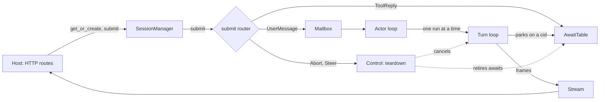
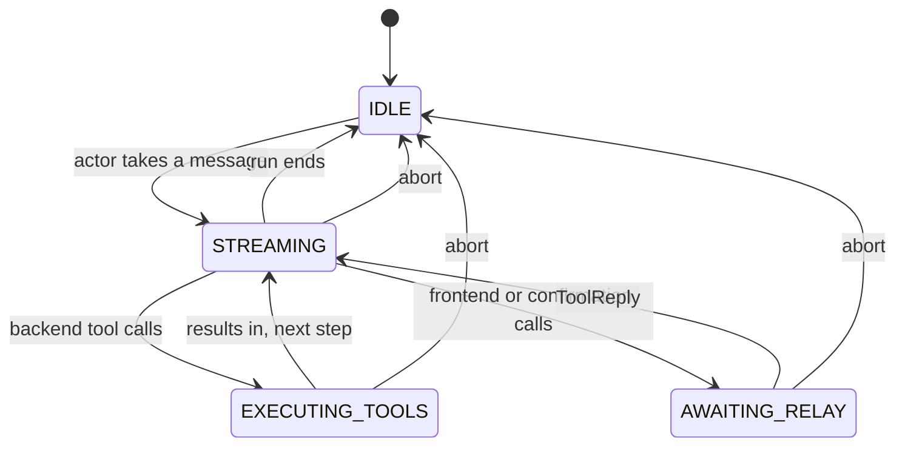

# Session actor

One live agent per session, kept in process memory between requests, with one writer at a time. Everything a caller wants from a session goes in through one method, `submit`, which sorts the command into one of three planes and returns an `Ack` at once. Everything the session produces comes out on its [stream](streaming.md).

It is three pieces: `SessionManager` (which sessions are in memory), the submit router and actor loop on `AgentRuntime`, and the `AwaitTable` (who is parked waiting for a reply).

## Where it sits



- The host is the consumer's web layer. It calls the manager and reads the stream; it never touches the agent's state.
- The [turn loop](turn-loop.md) does the work of a run. This file covers how a run gets started, interrupted and resumed.
- The pause side of the await table is told in [Pause and resume](../features/pause-and-resume.md).

> **Why one writer per session:** before the June 2026 redesign, abort, steer, tool results and new messages arrived as racing method calls on shared state with no per-session lock, and the live agent was rebuilt from storage on every request.

> **Why these seams:** each one traces to a place where the Nova backend had to rebuild or reach inside the library.

## Residency

`SessionManager(build_agent, max_resident=128, idle_ttl_s=900, principal_policy=StrictScopePolicy())` holds a map of resident sessions keyed by root session id (the main agent's `agent_uuid`). `build_agent` is the host's factory.

`get_or_create(root_session_id, principal)`:

1. **Resident:** run the attach check (below) and return the live agent.
2. **Not resident:** under a per-id build lock, call the factory, probe storage for saved state, `initialize()` the agent, bind the principal. A new session's config row is saved here; a loaded one is not written.
3. Fire `on_session_start` with `source="create"` (nothing saved) or `"resume"` (saved state loaded). A hook that blocks closes the agent and raises `SessionBlocked`.
4. Announce the initial [profile](hooks-and-profiles.md), publish the session, then enforce capacity.

Leaving memory:

| Path | When | What it does |
|---|---|---|
| Capacity eviction | More than `max_resident` sessions | Evicts least recently used sessions that are evictable. If none is, the manager stays over budget |
| `evict_idle()` | The host calls it; nothing in the library does | Evicts evictable sessions idle longer than `idle_ttl_s` |
| `evict(id)` | The host asks | Abort, stop the actor, `on_session_end`, checkpoint, pause the sandbox, close, drop the session's awaits |
| `invalidate_idle(id)` | The host knows its copy is out of date | Stops the actor, closes the agent and drops its awaits. Nothing else |
| `shutdown()` | Process exit | Evicts every resident session |

- **Evictable** means: no actor running, phase `IDLE`, and no open await for the session. A session parked on a pause is never evicted.
- `detach()` is a no-op. A client disconnecting does not cancel a run.
- `status(id)` reports `resident`, `phase`, `has_open_await`, `open_awaits`, `actor_running` and the owner, without building anything.

> **Why `invalidate_idle` writes nothing:** it discards a resident session without aborting, running end hooks, checkpointing or pausing the sandbox, because those writes could overwrite newer state owned by another backend process.

### The attach check

Attaching to a resident session runs `principal_policy.authorizes(owner, claimant)`. A failure raises `SessionNotFound`, which `SessionManager.submit` turns into `NOT_FOUND`: a caller who may not address a session cannot tell it from one that does not exist. The rule itself is in [Identity](identity.md).

> **Why the check always runs:** a missing claimant is treated as anonymous. Skipping the check when no principal is given is an auth bypass by omission.

## `submit` and the three planes

```python
ack = await manager.submit(root_session_id, command, principal)   # host
ack = await agent.submit(command)                                # in process
```

| Command | Plane | Takes effect | What `submit` does |
|---|---|---|---|
| `UserMessage(message)` | 1. Mailbox | At the next run boundary | Offers it to the mailbox and starts the actor if it is not running |
| `ToolReply(cid, results)` | 2. Joins | Now | Resolves the await parked on `cid` |
| `Abort()` | 3. Control | Now | Tears down the run in flight and waits for the teardown |
| `Steer(instruction, mode)` | 3. Control | Now | `FORCEFUL` (default): the same teardown, then the instruction is queued as a `UserMessage`. `COOPERATIVE`: only queues it |

- The mailbox is a FIFO of 32. When it is full, or frozen during a teardown, a new message is refused with `REJECTED`; it is never accepted and then lost to overflow. An abort is the one thing that discards messages already queued.
- Control commands address the root only. A sub-agent's runtime answers `REJECTED` with detail `not_root`.
- `SessionManager.submit` answers `Abort` and `Steer` for a session that is not resident without loading it: `NOT_FOUND` if nothing is saved, `NOT_RUNNING` for an `Abort` on a saved session. A `Steer` on a saved session loads it and proceeds.
- What the teardown does in each phase is in [Abort and steer](../features/abort-and-steer.md).

### `Ack`

`submit` never waits for the run. It returns `Ack(seq, disposition, detail)`.

| Disposition | Meaning | HTTP (`ack_to_http`) |
|---|---|---|
| `ACCEPTED` | Message queued | 202 |
| `RESOLVED` | Reply woke a parked run | 200 |
| `CANCELLING` | Abort done | 202 |
| `STEERING` | Steer accepted | 202 |
| `IGNORED_STALE` | Reply for an unknown cid or a retired generation | 200 |
| `IGNORED_DUP` | Reply for an await already resolved | 200 |
| `NOT_RUNNING` | Nothing in flight to abort | 409 |
| `NOT_FOUND` | No such session for this caller | 404 |
| `REJECTED` | Mailbox full, wrong owner on a reply, or not the root | 422 |
| `MISDIRECTED` | Nothing produces it | unmapped (500) |

- `seq` is the order commands were submitted in, for audit. It is not the order they take effect: a reply at seq 5 acts before a message at seq 3 that is still queued.
- Every command and its disposition is recorded in an in-memory audit log, stamped with the session's principal.
- A late or duplicate reply is a harmless no-op, so a client can retry one safely.

> **Why `Ack` carries no completion future:** `wait_idle()` is the one way to wait for a run to finish. One pattern, not two.

> **Why `MISDIRECTED` exists with nothing producing it:** adding a member to a public enum later would be a breaking change.

## The actor

One task per session (`agent:{root}:actor`) drains the mailbox. `ensure_actor()` starts it and is idempotent; `submit` calls it for every accepted message.

For each message, in order:

1. If an [answer finalization](../features/answer-finalization.md) was interrupted, finish it first.
2. Enter the [sandbox coordinator](sandbox.md#the-coordinator)'s `turn` guard, when one is set, and warm the sandbox.
3. Run one [run](../features/run.md) on the message.
4. Persist once more. The run's own finalize has already saved; the actor saves again at the boundary.
5. When the mailbox is empty, schedule the sandbox pause and exit.

A failure inside a run never escapes the task: the stream gets `ErrorReport` then `RunCompleted(stop_reason="error")`, the task exits, and the messages still queued wait until the actor is next started.



`wait_idle()` returns when the phase is `IDLE`, the mailbox is empty and neither the actor task nor a cold-resume task is alive. A run parked on a pause is in flight, so `wait_idle()` keeps waiting through it. It never raises for a failed run; failures surface on the stream.

## The await table

One process-wide `AwaitTable` records every parked wait, keyed by `cid` (correlation id).

| Field | Meaning |
|---|---|
| `cid` | The reply key. The client echoes it back |
| `root_session_id` | The session the wait belongs to, including waits opened by sub-agents |
| `owner_agent_id`, `child_agent_id` | Which agent in the tree parked |
| `tool_use_ids` | The tool calls the reply must answer |
| `principal` | The owner, checked against the claimant on resolve |
| `await_generation` | The session's generation when the wait opened |
| `reason` | `frontend_tool`, `confirmation` or `scripted` |
| `state` | `OPEN`, `RESOLVED` or `CLOSED` |

`resolve(cid, results, principal)` checks in this order and stops at the first that fails:

1. **Lookup.** Unknown cid: `IGNORED_STALE`.
2. **Owner.** Claimant not authorized: `REJECTED`. The record stays open for the real owner.
3. **Generation.** Record from a retired generation: `IGNORED_STALE`.
4. **State.** Already resolved: `IGNORED_DUP`. Otherwise `RESOLVED`, and the parked run wakes.

`interrupt(root)` is what an abort calls: it bumps the session's generation and closes every open await under it in one step.

> **Why a generation:** it decides whether a reply still counts. Once an abort or steer retires a generation, a late reply for it returns `IGNORED_STALE` and never wakes the run.

## Kept for a later rung

The session lives in one process (Rung 1). Cross-process tiers (a shared session store, stream replay) are Rungs 2 to 4. These exist today with no effect:

- `CommandMeta` (`command_id`, `client_seq`) on every command: recorded in the audit log, not used to dedupe or order.
- `Disposition.MISDIRECTED`, `Target` (one member, `ROOT`), `Abort.grace_ms`.
- `set_await_table()`, which swaps the process-wide table.
- On [`ToolContext`](tools.md#toolcontext): `idempotency_key`, `attempt`, `replay_reason` and `once()`. Nothing replays a tool call.

> **Why they stay:** the command and cid protocol is final at Rung 1, so that a cross-process tier changes no consumer call. Rungs 2 to 4 are gated, not scheduled: climbed only when a metric forces it.

## Contracts

Part of the [`agent-base` package contract](../infrastructure/packaging-and-release.md).

- **`SessionManager`**: `get_or_create`, `submit`, `status`, `detach`, `evict`, `evict_idle`, `invalidate_idle`, `shutdown`; errors `SessionNotFound`, `SessionBlocked`.
- **Commands**: `UserMessage`, `ToolReply`, `Abort`, `Steer`, `SteerMode`, `CommandMeta`, `Target`.
- **`Ack`, `Disposition`**, and `ack_to_http(ack)` returning `(status, {"seq", "disposition", "detail"})`.
- **On the agent**: `submit`, `ensure_actor`, `wait_idle`, `attach_stream`, `detach_stream`; and `say(text)` and `reply(cid, results)`, thin wrappers that submit a `UserMessage` and a `ToolReply`.

What the host must do, because the library does not:

- Call `evict_idle()` on a timer. No background task does it.
- Call `shutdown()` on exit, so resident sessions are checkpointed and their sandboxes paused.
- Map `SessionNotFound`, `SessionBlocked` and `PrincipalConflict` from `get_or_create` to HTTP itself. `ack_to_http` covers only an `Ack`.
- Run one process per session at a time, or call `invalidate_idle` when another process may hold newer state.
