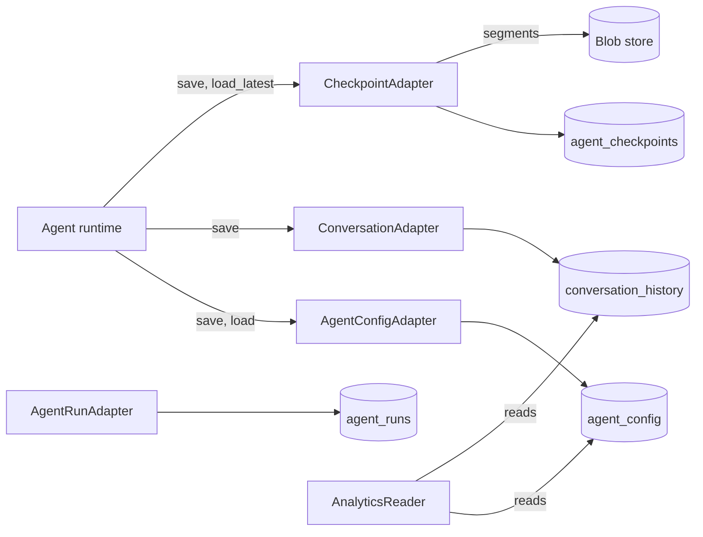

# Storage

Where a session lives between requests and across restarts. The library defines four adapter interfaces and four Postgres tables behind them; the host supplies the database and the connection pool. With no adapters given, an agent keeps everything in memory (`storage/adapters/memory.py`).

The tables and their schema version are part of the [`agent-base` package contract](../infrastructure/packaging-and-release.md): the host's database holds them, and the host's own code reads them.

## Where it sits



## The four tables

| Table | One row is | Key | Written |
|---|---|---|---|
| `agent_config` | A session: its `AgentConfig` | `agent_uuid` | At session create, each pause and resume, each run end, eviction |
| `conversation_history` | A run: the `Conversation` class | `(agent_uuid, run_id)`, with a `sequence_number` assigned on first save | With the config, and alone when a run errors |
| `agent_checkpoints` | A restore point of a session at a run boundary | `(agent_uuid, sequence_number)` | At each run end, when a checkpoint adapter is set. See [Fork and reset](../features/fork-and-reset.md) |
| `agent_runs` | One `LogEntry`: a line of a run's step log | none; indexed on `(agent_uuid, run_id)` | Not written by the turn loop today. Despite the name, runs are rows of `conversation_history` |

Nothing is written at the start of a run or per step. A run's progress reaches the database at a pause, at its end, or when it is aborted. Two things write mid-run: a hook that makes the loop continue, and a remote sandbox being created or replaced (the config is saved with the new binding).

### What `agent_config` holds

`AgentConfig` (`core/config.py`) is everything needed to rebuild a session:

| Group | Fields |
|---|---|
| Identity | `agent_uuid`, `title`, `description`, `parent_agent_uuid`, `owner_tenant`, `owner_subject` |
| Model | `provider`, `model`, `system_prompt`, `llm_config`, `max_steps` |
| Context | `context_messages` (what is replayed to the model), `conversation_log` (the current run's), `compaction_config`, last known token counts |
| Tools | `tool_schemas`, `tool_names`, `subagent_schemas`, `active_profile` |
| Run state | `current_step`, `total_runs`, `last_run_at`, `pending_relay` |
| Environment | `sandbox_config`, `media_registry` |
| `extras` | `session_cumulative_usage`, `pending_finalization`, `export_registry`, `forked_from`, `forked_at_seq`, and the host's own keys |

### JSON and JSONB

| Stored as `JSON` (text kept byte for byte) | Stored as `JSONB` |
|---|---|
| `context_messages`, `tool_schemas`, `llm_config`, `pending_relay` | Everything else: logs, usage, cost, extras, sandbox config, media registry |

> **Why replayed columns are `JSON`, not `JSONB`:** JSONB re-sorts keys and rewrites some numbers, so a reloaded session would send different bytes: a prompt-cache miss, and invalidated thinking blocks.

## The Postgres adapters

`agent_base/storage/pg/`: `PgConfigAdapterBase`, `PgConversationAdapterBase`, `PgRunAdapterBase` and `PgCheckpointAdapterBase`. The host passes its `asyncpg` pool; the adapters borrow it and never close it.

Each adapter declares its columns as a list of `ColumnSpec`, and every statement (insert, upsert, select, where) is generated from that list.

```python
ColumnSpec(name, sql_type, get, set=None, scope="row", indexed=False, upsert=True, immutable_on_conflict=False)
```

A host adds its own columns by subclassing an adapter and overriding `extra_columns()`. They join the generated SQL and the generated DDL.

> **Why SQL is composed from declared columns:** every scoped column lands in every WHERE, so a missed tenant predicate is structurally impossible.

Some columns are never overwritten by an upsert: `created_at`, the keys, `archived`, and a checkpoint's `consumer_payload`.

### Tenant scoping

- A column with `scope="filter"` is added to the WHERE of every read, update and delete.
- `principal_columns()` returns two such columns, `owner_tenant` and `owner_subject`, whose values come from the principal the adapter is bound to. They are not base columns: a host gets them by returning them from `extra_columns()`.
- `adapter.for_principal(principal)` returns a copy bound to that principal, sharing the pool. The runtime calls it whenever its [principal](identity.md) is set.
- An adapter bound to no principal adds no owner predicate.

## Schema versioning

`LIBRARY_SCHEMA_VERSION` (currently 6) is recorded in a one-row table, `_agent_base_schema_version`.

`ensure_all_schemas(pool, *adapters)`, called by the host at start-up:

| Database state | What happens |
|---|---|
| Never stamped | Creates each given adapter's table from its declared columns, host extras included, then stamps the current version |
| Stamped below the current version | Runs the migrations from that version up, in order, then stamps |
| At the current version | Nothing |

- All four adapters go in one call. On an unstamped database a call with only some of them creates only their tables and stamps the version, after which the others are never created.
- Migrations are forward-only and idempotent (`ADD COLUMN IF NOT EXISTS`). They cover the library's base columns only; a host's extra columns on an existing database are the host's migration.

> **Why a new column must bump `LIBRARY_SCHEMA_VERSION` and ship a migration:** `CREATE TABLE IF NOT EXISTS` does nothing on a database already stamped, and a column once went silently missing on a staging database.

There are three independent version numbers; do not confuse them:

| Version | Guards |
|---|---|
| `LIBRARY_SCHEMA_VERSION` | Table DDL |
| `CORE_SCHEMA_VERSION` (`_v`, currently 1) | The JSON shape of stored entities and log entries |
| `WIRE_PROTOCOL_VERSION` | The [stream](streaming.md) |

## Loading a session

`agent.initialize()` on a session with a saved config:

1. Load the config row. No row means a new session.
2. Reconcile the [principal](identity.md#binding-and-conflicts) with the owner on the loaded config.
3. Restore session usage, the compaction settings and the [active profile](hooks-and-profiles.md#profiles).
4. If the config has a `pending_relay`, load that run's row so the run can [resume](../features/pause-and-resume.md#resume).
5. Bind the [sandbox](sandbox.md) from the saved `sandbox_config`.
6. Connect [MCP](mcp.md) servers. Their specs come from the constructor, not from storage.

Loading writes nothing, unless it had to create or replace a remote sandbox.

Readers are tolerant of older rows: unknown `llm_config` keys are dropped, a pre-typed conversation log is accepted as a list of messages, and old media metadata key names are mapped.

## Analytics

`PgAnalyticsReader(pool, filter_columns=())` answers questions over `conversation_history` joined to `agent_config`, without loading sessions:

| Method | Returns |
|---|---|
| `list_runs`, `runs_matching` | Run summaries, paged or streamed |
| `usage_totals`, `agent_totals` | Token and cost totals, overall or per session |
| `volume_timeseries` | Runs per hour or day |
| `latency` | p50, p95, p99 and mean run duration |
| `tool_usage` | Calls, errors and p95 duration per tool, read from the logs |
| `subagent_fanout` | Children per parent |
| `distinct_principals` | Owners present |

It counts a run as an error when its `stop_reason` is set and is neither `end_turn` nor `stop_sequence`. Its costs are `Conversation.cost`, not settlements: see [Billing a run](../features/billing-a-run.md#two-totals-for-the-same-run).

## Contracts

- **Tables:** `agent_config`, `conversation_history`, `agent_runs`, `agent_checkpoints`, `_agent_base_schema_version`; their base columns; `LIBRARY_SCHEMA_VERSION`.
- **Interfaces:** `AgentConfigAdapter`, `ConversationAdapter`, `AgentRunAdapter`, `CheckpointAdapter`, `StorageHandles`.
- **Postgres:** the `Pg*AdapterBase` classes, `ColumnSpec`, `principal_columns`, `create_adapters_from_pool`, `ensure_all_schemas`, `PgAnalyticsReader`.
- **Entities:** `AgentConfig`, `Conversation`, `PendingToolRelay`, and their stored forms (`serialize_config`, `Conversation.to_dict`).

## Depends on

- **PostgreSQL** through `asyncpg`, when the Postgres adapters are used. See [External services](../infrastructure/external-services.md).
- The host owns the pool, the database, and the migration of any column it added.
