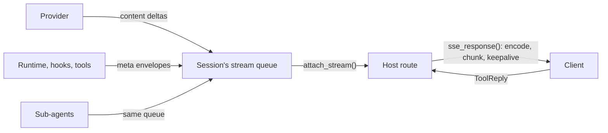

# Streaming

Everything a session produces while it runs leaves as a stream of typed JSON frames: the model's output as **content frames**, and everything about the run (it started, it paused, it cost this much, it ended) as **meta frames**. Over HTTP the frames travel as Server-Sent Events.

The frames, their framing and the reply to a pause are the **wire protocol**. The Nova add-in reads it through the Nova backend.

> **Cross-repo contract:** other repos depend on this. Before changing it, check the product map, then those repos' Depends on sections and code.

## Where it sits



## The read path

One queue per session, one live reader.

| Call | Effect |
|---|---|
| `attach_stream()` | Becomes the reader. A previous reader's iterator ends cleanly, and frames it had not yet read move to the new reader |
| `detach_stream()` | Ends the reader. Frames produced from then on are dropped |
| `stream()` | First attach; raises if a reader already claimed the stream |

- Nothing is replayed. Frames a previous reader consumed are gone.
- The queue is not closed when a run ends. A reader stops when it sees a terminal frame: `run_completed`, `await_input`, or `custom` `aborted`.
- Whether the provider is called in streaming mode is decided when the run starts: with no queue yet, the call is non-streaming and no content frames exist.

> **Why one live reader and no replay:** the run is the record. It carries on to its end whether or not anyone is reading, and the [conversation log](conversation-log.md) is persisted. The stream is a live view of it; replay waits for Rung 2.

## Content frames

The model's own output. Every frame has this header:

```json
{ "type": "text", "agent": "<agent uuid>", "final": false, "seq": 0 }
```

| `type` | Extra keys | Emitted |
|---|---|---|
| `text` | `delta` | As text arrives; one empty frame with `final: true` closes each block |
| `thinking` | `delta` | Same |
| `tool_call`, `server_tool_call` | `id`, `name`, `delta` (the arguments as a JSON string) | Once per call, complete, `final: true` |
| `tool_result`, `server_tool_result` | `id`, `name`, `delta` (result text), `envelope_log` when set | Once per result, `final: true`. Only with `stream_meta_history_and_tool_results` |
| `citation` | `delta` (a JSON string) | When the cited block ends |
| `error` | `code`, `message`, `retriable`, `terminal`, `details` | A provider stream error, or a failed sandbox preparation |

- `agent` is the emitting agent's uuid, which is how a client tells a [sub-agent](sub-agents.md)'s output from the root's.
- `seq` on content frames is always `0`. Order is the order of arrival.

## Meta frames

Everything else is a `MetaEnvelope`: one header, one typed body in `payload`.

```json
{
  "type": "meta",
  "kind": "run_completed",
  "event_id": "<uuid>",
  "run_id": "<run id>",
  "agent_id": "<agent uuid>",
  "parent_agent_id": null,
  "seq": 12,
  "ts": "<ISO time>",
  "correlation_id": null,
  "expects_reply": false,
  "payload": { }
}
```

| `kind` | `payload` | When |
|---|---|---|
| `run_started` | `user_query`, `model`, `conversation_log` | Start of a run |
| `run_completed` | `stop_reason`, `total_steps`, `generated_files`, `cost`, `cumulative_usage`, `conversation_log` | End of a completed or errored run |
| `await_input` | `tools: [{tool_use_id, tool_name, input}]` | A [pause](../features/pause-and-resume.md). The only kind with `correlation_id` and `expects_reply: true` |
| `usage_report` | `kind`, `usage`, `cost` | Each settlement. See [Billing a run](../features/billing-a-run.md) |
| `files_updated` | `files` | Files the run produced, before `run_completed` |
| `error_report` | `code`, `message`, `retriable`, `details` | A failure that did not arrive as a content frame |
| `profile_changed` | `profile` | A [profile](hooks-and-profiles.md) became active |
| `rollback` | `message`, `collapse_previous_assistant` | The previous answer was rejected and the model is trying again |
| `answer_completed`, `finalization_updated` | `finalization` (and `answer_completed_at`) | [Answer finalization](../features/answer-finalization.md) only |
| `custom` | `name`, `data` | Anything else |

- `seq` counts the envelopes one agent has emitted; it is not reset per run. A sub-agent has its own counter.
- `conversation_log` is included only with `stream_meta_history_and_tool_results`, with binary data replaced by a size label.

**`custom` names the library itself emits:**

| `name` | `data` |
|---|---|
| `aborted`, `steered` | `phase`, `forced` when hard-cancelled |
| `refusal` | `category`, `partial` |
| `compaction_start`, `compaction_end` | `reason`, plus counts on end |
| `mcp_server_state` | `server`, `state`, `error`, `server_info` |
| `meta_todo` | `operation`, `todo` or `todo_id` |

Hooks and tools emit their own with `ctx.emit(Custom(name=..., data=...))`.

> **Why `custom` is open:** the library knows nothing of consumer events, and they are still correlated like every other envelope.

> **Why `rollback` is a meta frame, not a content frame:** the content channel stays exactly "the model's own output".

## Order within a run

| Ending | Frames, in order |
|---|---|
| Completed | `usage_report`, `files_updated` (if any), `run_completed` |
| With answer finalization | `answer_completed`, `usage_report`, `finalization_updated`…, `files_updated`, `finalization_updated`, `run_completed` |
| Aborted | `usage_report`, `custom` `aborted` |
| Errored | `error_report`, `run_completed` with `stop_reason: "error"` |
| Paused | `await_input` |

`run_started` follows any frames from `on_turn_start` hooks and any `profile_changed`, and precedes the first provider call.

A sub-agent emits its own `run_started`, `usage_report` and `run_completed` into the same stream, with its own `agent_id` and its parent's id in `parent_agent_id`. The root's frames are the ones whose `parent_agent_id` is null.

## Framing

`sse_response(item_iter)` turns the reader's iterator into a `text/event-stream` response.

- **One frame:** `data: {json}` followed by a blank line.
- **End:** exactly one `data: [DONE]`, last. If the source raises, there is no `[DONE]`.
- **Keepalive:** `data: [PING]` whenever nothing was sent for 15 seconds.
- **Chunking:** frames are kept to 2,048 bytes (`MAX_FRAME_BYTES`): the payload slice a frame may carry is that minus the size of its header.
  - A long content frame is split into several frames that repeat the header and carry a slice of `delta`; only the last has the original `final`.
  - A meta envelope whose payload does not fit is sent as frames carrying the header, a slice of the payload JSON in `delta`, and `final: true` on the last. An envelope that fits has `payload` as an object and no `delta`.
  - A split never cuts a multi-byte character.
- **Reassembly key:** `(type, agent, id)` for content, `event_id` for meta.

`SseStreamDecoder` is the reader's half: it strips `data:`, drops `[PING]` and `[DONE]`, reassembles chunks, and returns typed deltas and envelopes. `DecodedRun` folds a whole stream into its parts for tests and offline tools.

> **Why the encoder and decoder ship from one module:** the protocol cannot drift between the two ends.

> **Why the keepalive is a `data:` frame, not an SSE comment:** comments never fire the client's `onmessage`, so app-level idle watchdogs would still abort.

## The reply

The one thing a client sends back on this protocol is the answer to an `await_input`: its `correlation_id`, and one result per `tool_use_id`. The host turns it into `ToolReply(cid, results)` and submits it. See [Pause and resume](../features/pause-and-resume.md#the-frame-and-the-reply).

## Contracts

- **Wire protocol:** the content frame types, the meta envelope and its kinds, the `custom` names above, the SSE framing (`[DONE]`, `[PING]`, chunking), and the reply shape.
- **Python surface:** `StreamDelta` and its subclasses, `MetaEnvelope`, the `MetaBody` classes, `sse_response`, `SseCodec`, `SseStreamDecoder`, `DecodedRun`.
- `WIRE_PROTOCOL_VERSION` is `"1"`. It is an attribute of the codec and is not sent on the wire.
- The same log shape travels in `run_completed.conversation_log` and in storage: see [Conversation log](conversation-log.md).
