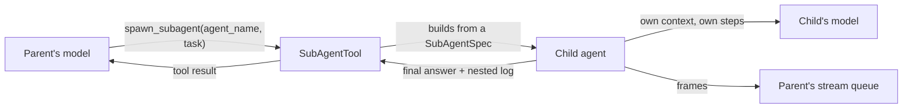

# Sub-agents

A sub-agent is another agent the model can hand a task to. To the parent it is one tool call, `spawn_subagent`, that returns a final answer. Inside, it is a full agent with its own context, prompt, model and tools, running its own [turn loop](turn-loop.md) while the parent waits.

## Where it sits



## Declaring sub-agents

```python
agent = AnthropicAgent(..., subagents={"researcher": SubAgentSpec(description="…", system_prompt="…", tools=[...])})
```

- `subagents=` maps a name to a `SubAgentSpec`, or to a template agent from which a spec is derived.
- Each needs a `description`: the tool's own description lists every sub-agent as `name (model): description`, and that is what the parent's model chooses from.
- The tool has three arguments: `agent_name`, `task`, and `resume_agent_uuid` to continue an earlier child's session.

`SubAgentSpec` fields: `name`, `description`, `system_prompt`, `model`, `config`, `max_steps`, `tools`, `frontend_tools`, `subagents` (nested specs), `compaction_config`, `externalization_config`, `retry_policy`, `max_parallel_tool_calls`, `max_tool_result_tokens`, `memory_store`, `mcp_source`.

> **Why a spec copies data fields and keeps runtime resources by reference:** deep-copying a pool-backed object raises, and a connection pool is a singleton, not a value. `tools`, `frontend_tools`, `memory_store` and `mcp_source` are the reference fields.

## What a child shares, and what is its own

| Shared with the parent | The child's own |
|---|---|
| The sandbox | `agent_uuid` (new, or the one being resumed) |
| Storage adapters, media backend | Its config, context and `Conversation` rows |
| The stream queue, as the parent held it when the child was spawned | Its tool registry, built from the spec |
| The cancellation event | Its provider and model |
| The principal and the root session id | An empty hook engine: the parent's hooks and profiles do not apply inside it |
| The usage callbacks | |
| The MCP source, when the spec carries one | |

## A child's run

1. `on_subagent_start` fires on the parent. A hook can block the spawn or replace the spec.
2. The child is built and initialized. With `resume_agent_uuid` it loads that session's saved state; otherwise it starts empty.
3. The child runs the task as an ordinary [run](../features/run.md), inline inside the parent's tool call. The parent stays in `EXECUTING_TOOLS`.
4. `on_subagent_end` fires on the parent, on success and on failure.
5. The parent's model receives the child's final answer as the tool result.

What each side sees:

| | |
|---|---|
| The parent's model | The child's final answer text only |
| The [stream](streaming.md) | The child's frames, interleaved, carrying the child's `agent` id; its meta frames carry `parent_agent_id` |
| The [conversation log](conversation-log.md) | The tool result's `nested_conversation` holds the child's whole log; `details` has the child's uuid, model, stop reason and step count |
| Storage | The child saves its own config and run rows, with `parent_agent_uuid` set |

A child that raises becomes an error tool result, `Subagent '<name>' error: …`. It does not fail the parent's run.

## How the rest of the system treats a child

- **Parallelism:** several `spawn_subagent` calls in one step run concurrently, within the parent's `max_parallel_tool_calls`.
- **Depth:** a spec can carry nested specs. The library sets no depth limit.
- **Pauses:** a child's frontend tool call [pauses](../features/pause-and-resume.md#sub-agents) on the session's await table. The reply goes to the session and wakes the child in place.
- **Abort:** one [abort](../features/abort-and-steer.md#sub-agents) of the root stops every child. Control commands cannot be addressed to a child.
- **Billing:** a child settles its own steps and reports them through the parent's usage callbacks. See [Billing a run](../features/billing-a-run.md#sub-agents).
- **Sandbox:** a child works in the parent's sandbox. Its own start-up calls `setup()` on it; it never pauses, coordinates or checkpoints it.
- **Stream end:** a child sends its own `run_completed`, never an abort marker.

## Contracts

- `SubAgentSpec`, `SubAgentTool`, the `subagents=` constructor argument, the tool name `spawn_subagent` and its three arguments.
- `on_subagent_start` and `on_subagent_end` in [Hooks and profiles](hooks-and-profiles.md).
- Frame attribution: `agent` on content frames; `agent_id` and `parent_agent_id` on meta frames.
