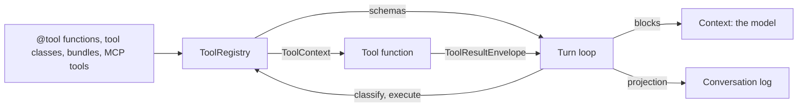

# Tools

A tool is a function the model can call. The host writes it as plain Python; the library turns its signature and docstring into the schema the model sees, runs it when called, and delivers the result twice: once to the model, once to the [conversation log](conversation-log.md).

## Where it sits



## Defining a tool

```python
@tool
async def search_orders(customer_id: str, limit: int = 10, *, ctx: ToolContext) -> str:
    """Find a customer's recent orders.

    Args:
        customer_id: The customer to look up.
        limit: How many orders to return.
    """
```

- **Name:** the function's name. **Description:** the docstring up to `Args:`. **Parameter descriptions:** the `Args:` block. **Required:** parameters without a default.
- Every parameter needs a type hint. `int`, `float`, `str`, `bool`, `list[T]`, `dict[K, V]`, fixed tuples, unions, optionals and `Literal` are mapped to JSON Schema.
- A parameter named `ctx` is injected at call time and left out of the schema. Injection is by name, not by type.
- A sync function runs in a thread; an async one is awaited.

| Form | When to use it |
|---|---|
| `@tool` function | The usual case |
| `ConfigurableToolBase` subclass | A tool with configuration or state: write `run(...)`, optionally a docstring template; `as_tool()` yields the callable |
| `ToolBundle` | A named group of tools registered together; bundles add with `+` |

`@tool` takes two options, and they decide where a call runs:

| Option | Meaning |
|---|---|
| `executor="backend"` (default) | The registry runs the function |
| `executor="frontend"` | The function body is never called. The call is [relayed](../features/pause-and-resume.md) to the client |
| `needs_user_confirmation=True` | Also relayed to the client, whose reply is the result |

Server tools (the provider's own web search, code execution and the like) are not tools in this sense. They are listed in `llm_config.server_tools`, sent with the request, and never enter the registry.

## The registry

`ToolRegistry` holds the tools of one agent.

- `register_tools(...)` takes decorated functions, tool objects and bundles. Registering a name twice replaces the first silently.
- `get_schemas()` returns every tool's schema, backend and frontend alike.
- `classify_tool_calls(calls)` sorts a step's calls into backend, frontend and confirmation. An unknown name counts as backend and then fails as `Unknown tool`.
- `execute_tools(calls, max_parallel)` runs backend calls concurrently, five at a time by default, and returns results in call order.
- A tool that raises does not fail the run: the exception becomes an error result the model reads, and `on_tool_error` fires.

Before the hooks run, an argument the model sent as a JSON string where the schema wants an object or array is decoded (`decode_json_encoded_arguments`). The model's own `tool_use` block is left as it was.

To change an agent's tool set, `agent.reconfigure(...)` builds a new registry; a [profile](hooks-and-profiles.md#profiles) switch does the same.

> **Why there is no in-place `unregister_tools()`:** it would put mutation semantics (unknown names, in-flight calls, partial failure) into the most-consumed subsystem's contract for good.

## `ToolContext`

What a tool gets when it declares `ctx`:

| Member | Use |
|---|---|
| `run_id`, `tool_call_id` | The run, and this call's `tool_use` id |
| `sandbox`, `principal`, `media` | The agent's [sandbox](sandbox.md), [owner](identity.md) and [media backend](blob-store-and-media.md) |
| `emit(body)` | Put a meta frame on the stream, such as a `Custom` progress event |
| `emit_text(text)` | Show text to the user as it is produced. It never enters the model's context |
| `emit_capped(text)`, `spill(text)`, `emit_capped_bytes(data)` | Cap or save a large result (below) |
| `call_frontend_tool(name, input)` | Ask the client for something mid-tool: a [scripted pause](../features/pause-and-resume.md#scripted-pauses) |
| `idempotency_key`, `attempt`, `replay_reason`, `once(key, fn)` | Replay identity (below) |

`once(key, fn)` runs `fn` at most once per call and key, within the session's memory. `idempotency_key` is a stable hash of the run id and the call id.

Nothing replays a tool call today. The replay fields are part of the plumbing kept for a later rung: see [Session actor](session-actor.md#kept-for-a-later-rung).

## Results

A tool returns a string, or a `ToolResultEnvelope` when the model and the log should see different things.

| Constructor | Model sees | Log gets |
|---|---|---|
| `from_text(summary, details=...)` | The text | The first 200 characters as summary, plus `details` |
| `from_blocks(context_blocks, log_summary, log_blocks, details, ...)` | `context_blocks` | `log_summary`, `log_blocks`, `details` |
| `error(tool_name, tool_id, message)` | `Error: <message>` | The same, with `is_error` |

- Images go to the model as `ImageContent` blocks; `image_block(bytes)` builds one within a size budget.
- The envelope also carries timing (`started_at`, `ended_at`, `duration_ms`, `queued_ms`), which lands on the log's projection.

### Large results

Two layers keep a big result from flooding the context.

| Layer | Who decides | What happens |
|---|---|---|
| The tool caps its own output | The tool author, with `ctx.emit_capped(text, max_chars=25_000)` | The full text is written under `.tool_results/` in the sandbox; the model gets the first `max_chars` and the path, with the name of a tool that can read it |
| The loop externalizes | Automatic, after the hooks | Any result still over 25,000 tokens is written under `.context/` and replaced by a reference. See [Turn loop](turn-loop.md#keeping-the-context-in-the-window) |

`ctx.spill(text)` only saves and returns the path, for tools that want to write their own notice.

> **Why two layers:** the first is the tool author's budget; the second is the automatic backstop for tools that set none.

## The common tools

A starter set that works on any [sandbox](sandbox.md) with the default zone layout (`agent_base/common_tools/`).

| Tool | Does |
|---|---|
| `read_file` | Reads text in pages (250 lines), or an image |
| `glob_file_search`, `grep_search`, `list_dir_tree` | Find files by pattern, search contents, show a tree |
| `apply_patch` | Adds, updates, deletes or moves a file |
| `todo_write`, `read_todos` | A todo list in the sandbox; each change emits `custom` `meta_todo` |
| `spawn_subagent` | Delegates to a [sub-agent](sub-agents.md) |

`file_ops_bundle(allowed_dirs=...)` is the first five as one bundle.

`code_execution` (`code_exec_bundle`) also ships. It runs model-written Python inside the host's own process, through the `python_executors` interpreter, and is legacy: model code belongs in the sandbox.

## Contracts

- `@tool`, `ConfigurableToolBase`, `ToolBundle`, `ToolRegistry`, `ToolSchema`, `ToolContext`, `ToolResultEnvelope`, `image_block`.
- The common tools and their bundles.
- The hook order around a call: `before_tool`, the call, `on_tool_error` if it raised, `after_tool`. See [Hooks and profiles](hooks-and-profiles.md).
