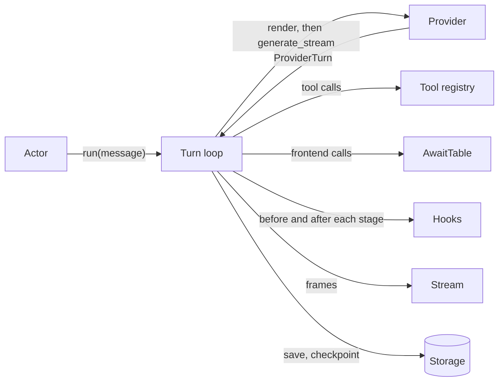

# Turn loop

The loop that drives a [run](../features/run.md): call the model, do what the response asks, repeat until the model is finished or something stops it. Each pass is a **step**. The loop owns the context sent to the model, and keeps it valid and within the context window.

## Where it sits

The loop is `AnthropicAgent._resume_loop`. `AgentRuntime` holds everything around it (submit, the actor, awaits, hooks, the stream) and its own `run()` raises `NotImplementedError`. `LiteLLMAgent` subclasses `AnthropicAgent` and reuses the loop with a different [provider](providers.md).

> **Why the loop is still in `AnthropicAgent`:** moving it into `AgentRuntime` was sequenced last, so that everything else could be written against "the runtime" and the move is a relocation, not a rewrite. The direction is a provider-agnostic loop in the runtime with the provider injected as a value; that move is unfinished.

## One step

1. **Guard.** Stop if `current_step` has reached `max_steps` (default 50; `None` is unlimited).
2. **Compact if needed.** If the estimated context is over the threshold, compact it (below).
3. **Repair the chain,** so the request sent is a valid one (below).
4. **Render** each message into the form the model sees. See [A run](../features/run.md#what-the-model-actually-receives).
5. **Call the provider.** Streaming if a stream reader exists, non-streaming otherwise.
6. **Record the response:** `current_step += 1`, usage and cost accumulated, the response added to the context and the logs.
7. **Branch on the stop reason.**

| `stop_reason` | What the loop does |
|---|---|
| `tool_use` | Runs the tool round. With no tool calls found, ends the run as `end_turn` |
| `end_turn`, `stop`, none | With client tool calls present, treated as `tool_use`. Otherwise fires the end-of-run hooks and ends the run |
| `pause_turn` | Next step. A server tool is still working |
| `model_context_window_exceeded` | Compacts and retries. If compaction changed nothing, ends the run as `context_window_exceeded` |
| `refusal` | Removes the response from the context, emits `custom` `refusal`, ends the run |
| `max_tokens` | Ends the run |

A response cancelled by an abort is not recorded as a step. See [Abort and steer](../features/abort-and-steer.md).

## The tool round

The [tool registry](tools.md) sorts the step's calls: `executor="frontend"` is frontend, `needs_user_confirmation` is confirmation, everything else (unknown names included) is backend.

**All backend:**

1. `before_tool` for each call, in order. A block answers the call with an error result; an update rewrites its input.
2. The calls run concurrently, at most `max_parallel_tool_calls` (default 5) at a time. Results come back in call order.
3. `on_tool_error` for calls that raised, then `after_tool` for every result.
4. Results over the size limit are externalized (below).
5. One user message with one result per call is added to the context.

**Any frontend or confirmation call:** the backend calls run the same way, then the run [pauses](../features/pause-and-resume.md).

Server tools (web search, code execution on the provider's side) never reach the registry. The provider runs them and their results arrive inside the response.

> **Why hooks see a copy of the tool input:** `before_tool` hooks work on a deep copy. The model's `tool_use` block in the history keeps exactly what it sent, because editing history breaks the prompt cache and preserved thinking.

## Chain repair

The provider rejects a transcript whose tool calls and results do not pair up. Aborts, pauses and client replies can all leave one that way, so the chain is repaired rather than trusted (`core/chain.py`).

`sanitize_chain` runs before every provider call and:

- adds an error result for a tool call that has none;
- drops results that answer no call, and repeats of a result;
- strips server-tool blocks that leaked into client messages;
- moves tool results to the front of their message.

The same module plans the patches an abort appends: what to keep of a half-streamed response, and which calls to answer with an error. A reply to a pause is reconciled separately, before it is spliced in.

> **Why consecutive user messages are not merged for Anthropic:** the API combines them itself, and a merged message is a history edit that invalidates the prompt cache and every later thinking block.

The LiteLLM provider still merges them.

## Keeping the context in the window

Two mechanisms.

**Compaction** replaces the older part of the context with a summary. It exists only when a `CompactionConfig` is given.

| | |
|---|---|
| Triggers | `auto`: the estimate passes `threshold_tokens` (default 160,000). `overflow`: the provider says the request is too large |
| What it does | Keeps roughly the most recent `preserve_recent_tokens` (default 40,000; half that on `overflow`), cut at a user message. Summarizes the rest with a direct provider call. The context becomes the summary plus the recent part |
| Hooks | `before_compact` can veto an `auto` compaction. A veto on `overflow` fails the run with `CONTEXT_OVERFLOW`. `after_compact` gets the message counts |
| Frames | `custom` `compaction_start` and `compaction_end` |

The summarizing call's usage is not billed and is not a step.

**Externalization** moves an oversized block out of the context into a sandbox file, leaving a reference. It is always on: every agent has a sandbox, a local one by default.

| What | Limit | Goes to |
|---|---|---|
| The user message | 80,000 tokens | `.context/prompt_<id>.txt` |
| One tool result | `max_tool_result_tokens` (25,000) | `.context/tool_result_<tool_id>.txt` |
| All results of a step together | The per-result limit times `max_parallel_tool_calls` (so 125,000 by default) | The remaining results are externalized too |

The logs keep the original; only the context gets the reference. Tools can also cap their own output before this backstop: see [Tools](tools.md#large-results).

## Errors

- **Provider errors** are classified and retried by the [provider](providers.md#errors-and-retries). What survives the retries reaches the loop.
- **A request that is too large** triggers an `overflow` compaction and a retry of the step, when compaction is configured. If compaction changes nothing, the error stands and the run ends as errored.
- **Anything else** ends the run as [errored](../features/run.md#an-errored-run). That includes an exception from a hook.
- **A tool that raises** is not a loop error. Its exception becomes an error result the model sees.

## Contracts

- `AgentResult` (`core/result.py`), returned by `run()`: `final_message`, `final_answer`, the run's `conversation_log`, `stop_reason`, `total_steps`, `generated_files`, `was_aborted`, and `settlement` (the run's cost; absent on an aborted run).
- `agent_config.context_messages` is what is replayed to the model on every step and across runs. Its bytes are kept stable: see [Storage](storage.md).
